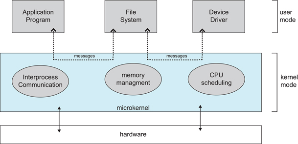
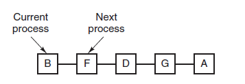
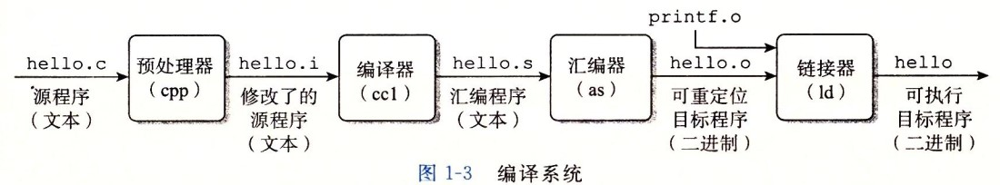

* [點擊閱讀面試進階指南 ](https://github.com/CyC2018/Backend-Interview-Guide)
<!-- GFM-TOC -->
* [一、概述](#一概述)
    * [基本特征](#基本特征)
    * [基本功能](#基本功能)
    * [系統調用](#系統調用)
    * [大內核和微內核](#大內核和微內核)
    * [中斷分類](#中斷分類)
* [二、進程管理](#二進程管理)
    * [進程與線程](#進程與線程)
    * [進程狀態的切換](#進程狀態的切換)
    * [進程調度算法](#進程調度算法)
    * [進程同步](#進程同步)
    * [經典同步問題](#經典同步問題)
    * [進程通信](#進程通信)
* [三、死鎖](#三死鎖)
    * [必要條件](#必要條件)
    * [處理方法](#處理方法)
    * [鴕鳥策略](#鴕鳥策略)
    * [死鎖檢測與死鎖恢復](#死鎖檢測與死鎖恢復)
    * [死鎖預防](#死鎖預防)
    * [死鎖避免](#死鎖避免)
* [四、內存管理](#四內存管理)
    * [虛擬內存](#虛擬內存)
    * [分頁系統地址映射](#分頁系統地址映射)
    * [頁面置換算法](#頁面置換算法)
    * [分段](#分段)
    * [段頁式](#段頁式)
    * [分頁與分段的比較](#分頁與分段的比較)
* [五、設備管理](#五設備管理)
    * [磁盤結構](#磁盤結構)
    * [磁盤調度算法](#磁盤調度算法)
* [六、鏈接](#六鏈接)
    * [編譯系統](#編譯系統)
    * [靜態鏈接](#靜態鏈接)
    * [目標文件](#目標文件)
    * [動態鏈接](#動態鏈接)
* [參考資料](#參考資料)
<!-- GFM-TOC -->


# 一、概述

## 基本特征

### 1. 並發

並發是指宏觀上在一段時間內能同時運行多個程序，而並行則指同一時刻能運行多個指令。

並行需要硬件支持，如多流水線、多核處理器或者分布式計算系統。

操作系統通過引入進程和線程，使得程序能夠並發運行。

### 2. 共享

共享是指系統中的資源可以被多個並發進程共同使用。

有兩種共享方式：互斥共享和同時共享。

互斥共享的資源稱為臨界資源，例如打印機等，在同一時間只允許一個進程訪問，需要用同步機制來實現對臨界資源的訪問。

### 3. 虛擬

虛擬技術把一個物理實體轉換為多個邏輯實體。

主要有兩種虛擬技術：時分復用技術和空分復用技術。

多個進程能在同一個處理器上並發執行使用了時分復用技術，讓每個進程輪流占有處理器，每次只執行一小個時間片並快速切換。

虛擬內存使用了空分復用技術，它將物理內存抽像為地址空間，每個進程都有各自的地址空間。地址空間的頁被映射到物理內存，地址空間的頁並不需要全部在物理內存中，當使用到一個沒有在物理內存的頁時，執行頁面置換算法，將該頁置換到內存中。

### 4. 異步

異步指進程不是一次性執行完畢，而是走走停停，以不可知的速度向前推進。

## 基本功能

### 1. 進程管理

進程控制、進程同步、進程通信、死鎖處理、處理機調度等。

### 2. 內存管理

內存分配、地址映射、內存保護與共享、虛擬內存等。

### 3. 文件管理

文件存儲空間的管理、目錄管理、文件讀寫管理和保護等。

### 4. 設備管理

完成用戶的 I/O 請求，方便用戶使用各種設備，並提高設備的利用率。

主要包括緩衝管理、設備分配、設備處理、虛擬設備等。

## 系統調用

如果一個進程在用戶態需要使用內核態的功能，就進行系統調用從而陷入內核，由操作系統代為完成。

<div align="center">  </div><br>

Linux 的系統調用主要有以下這些：

| Task | Commands |
| :---: | --- |
| 進程控制 | fork(); exit(); wait(); |
| 進程通信 | pipe(); shmget(); mmap(); |
| 文件操作 | open(); read(); write(); |
| 設備操作 | ioctl(); read(); write(); |
| 信息維護 | getpid(); alarm(); sleep(); |
| 安全 | chmod(); umask(); chown(); |

## 大內核和微內核

### 1. 大內核

大內核是將操作系統功能作為一個緊密結合的整體放到內核。

由於各模塊共享信息，因此有很高的性能。

### 2. 微內核

由於操作系統不斷復雜，因此將一部分操作系統功能移出內核，從而降低內核的復雜性。移出的部分根據分層的原則劃分成若干服務，相互獨立。

在微內核結構下，操作系統被劃分成小的、定義良好的模塊，只有微內核這一個模塊運行在內核態，其余模塊運行在用戶態。

因為需要頻繁地在用戶態和核心態之間進行切換，所以會有一定的性能損失。

<div align="center">  </div><br>

## 中斷分類

### 1. 外中斷

由 CPU 執行指令以外的事件引起，如 I/O 完成中斷，表示設備輸入/輸出處理已經完成，處理器能夠發送下一個輸入/輸出請求。此外還有時鐘中斷、控制台中斷等。

### 2. 異常

由 CPU 執行指令的內部事件引起，如非法操作碼、地址越界、算術溢出等。

### 3. 陷入

在用戶程序中使用系統調用。

# 二、進程管理

## 進程與線程

### 1. 進程

進程是資源分配的基本單位。

進程控制塊 (Process Control Block, PCB) 描述進程的基本信息和運行狀態，所謂的創建進程和撤銷進程，都是指對 PCB 的操作。

下圖顯示了 4 個程序創建了 4 個進程，這 4 個進程可以並發地執行。

<div align="center">  </div><br>

### 2. 線程

線程是獨立調度的基本單位。

一個進程中可以有多個線程，它們共享進程資源。

QQ 和瀏覽器是兩個進程，瀏覽器進程裡面有很多線程，例如 HTTP 請求線程、事件響應線程、渲染線程等等，線程的並發執行使得在瀏覽器中點擊一個新鏈接從而發起 HTTP 請求時，瀏覽器還可以響應用戶的其它事件。

<div align="center">  </div><br>

### 3. 區別

Ⅰ 擁有資源

進程是資源分配的基本單位，但是線程不擁有資源，線程可以訪問隸屬進程的資源。

Ⅱ 調度

線程是獨立調度的基本單位，在同一進程中，線程的切換不會引起進程切換，從一個進程中的線程切換到另一個進程中的線程時，會引起進程切換。

Ⅲ 系統開銷

由於創建或撤銷進程時，系統都要為之分配或回收資源，如內存空間、I/O 設備等，所付出的開銷遠大於創建或撤銷線程時的開銷。類似地，在進行進程切換時，涉及當前執行進程 CPU 環境的保存及新調度進程 CPU 環境的設置，而線程切換時只需保存和設置少量寄存器內容，開銷很小。

Ⅳ 通信方面

線程間可以通過直接讀寫同一進程中的數據進行通信，但是進程通信需要借助 IPC。

## 進程狀態的切換

<div align="center">  </div><br>

- 就緒狀態（ready）：等待被調度
- 運行狀態（running）
- 阻塞狀態（waiting）：等待資源

應該注意以下內容：

- 只有就緒態和運行態可以相互轉換，其它的都是單向轉換。就緒狀態的進程通過調度算法從而獲得 CPU 時間，轉為運行狀態；而運行狀態的進程，在分配給它的 CPU 時間片用完之後就會轉為就緒狀態，等待下一次調度。
- 阻塞狀態是缺少需要的資源從而由運行狀態轉換而來，但是該資源不包括 CPU 時間，缺少 CPU 時間會從運行態轉換為就緒態。

## 進程調度算法

不同環境的調度算法目標不同，因此需要針對不同環境來討論調度算法。

### 1. 批處理系統

批處理系統沒有太多的用戶操作，在該系統中，調度算法目標是保證吞吐量和周轉時間（從提交到終止的時間）。

**1.1 先來先服務 first-come first-serverd（FCFS）** 

按照請求的順序進行調度。

有利於長作業，但不利於短作業，因為短作業必須一直等待前面的長作業執行完畢才能執行，而長作業又需要執行很長時間，造成了短作業等待時間過長。

**1.2 短作業優先 shortest job first（SJF）** 

按估計運行時間最短的順序進行調度。

長作業有可能會餓死，處於一直等待短作業執行完畢的狀態。因為如果一直有短作業到來，那麼長作業永遠得不到調度。

**1.3 最短剩余時間優先 shortest remaining time next（SRTN）** 

按估計剩余時間最短的順序進行調度。

### 2. 交互式系統

交互式系統有大量的用戶交互操作，在該系統中調度算法的目標是快速地進行響應。

**2.1 時間片輪轉** 

將所有就緒進程按 FCFS 的原則排成一個隊列，每次調度時，把 CPU 時間分配給隊首進程，該進程可以執行一個時間片。當時間片用完時，由計時器發出時鐘中斷，調度程序便停止該進程的執行，並將它送往就緒隊列的末尾，同時繼續把 CPU 時間分配給隊首的進程。

時間片輪轉算法的效率和時間片的大小有很大關系：

- 因為進程切換都要保存進程的信息並且載入新進程的信息，如果時間片太小，會導致進程切換得太頻繁，在進程切換上就會花過多時間。
- 而如果時間片過長，那麼實時性就不能得到保證。

<div align="center">  </div><br>

**2.2 優先級調度** 

為每個進程分配一個優先級，按優先級進行調度。

為了防止低優先級的進程永遠等不到調度，可以隨著時間的推移增加等待進程的優先級。

**2.3 多級反饋隊列** 

一個進程需要執行 100 個時間片，如果采用時間片輪轉調度算法，那麼需要交換 100 次。

多級隊列是為這種需要連續執行多個時間片的進程考慮，它設置了多個隊列，每個隊列時間片大小都不同，例如 1,2,4,8,..。進程在第一個隊列沒執行完，就會被移到下一個隊列。這種方式下，之前的進程只需要交換 7 次。

每個隊列優先權也不同，最上面的優先權最高。因此只有上一個隊列沒有進程在排隊，才能調度當前隊列上的進程。

可以將這種調度算法看成是時間片輪轉調度算法和優先級調度算法的結合。

<div align="center">  </div><br>

### 3. 實時系統

實時系統要求一個請求在一個確定時間內得到響應。

分為硬實時和軟實時，前者必須滿足絕對的截止時間，後者可以容忍一定的超時。

## 進程同步

### 1. 臨界區

對臨界資源進行訪問的那段代碼稱為臨界區。

為了互斥訪問臨界資源，每個進程在進入臨界區之前，需要先進行檢查。

```html
// entry section
// critical section;
// exit section
```

### 2. 同步與互斥

- 同步：多個進程按一定順序執行；
- 互斥：多個進程在同一時刻只有一個進程能進入臨界區。

### 3. 信號量

信號量（Semaphore）是一個整型變量，可以對其執行 down 和 up 操作，也就是常見的 P 和 V 操作。

-  **down**  : 如果信號量大於 0 ，執行 -1 操作；如果信號量等於 0，進程睡眠，等待信號量大於 0；
-  **up** ：對信號量執行 +1 操作，喚醒睡眠的進程讓其完成 down 操作。

down 和 up 操作需要被設計成原語，不可分割，通常的做法是在執行這些操作的時候屏蔽中斷。

如果信號量的取值只能為 0 或者 1，那麼就成為了  **互斥量（Mutex）** ，0 表示臨界區已經加鎖，1 表示臨界區解鎖。

```c
typedef int semaphore;
semaphore mutex = 1;
void P1() {
    down(&mutex);
    // 臨界區
    up(&mutex);
}

void P2() {
    down(&mutex);
    // 臨界區
    up(&mutex);
}
```

<font size=3>  **使用信號量實現生產者-消費者問題**  </font> </br>

問題描述：使用一個緩衝區來保存物品，只有緩衝區沒有滿，生產者才可以放入物品；只有緩衝區不為空，消費者才可以拿走物品。

因為緩衝區屬於臨界資源，因此需要使用一個互斥量 mutex 來控制對緩衝區的互斥訪問。

為了同步生產者和消費者的行為，需要記錄緩衝區中物品的數量。數量可以使用信號量來進行統計，這裡需要使用兩個信號量：empty 記錄空緩衝區的數量，full 記錄滿緩衝區的數量。其中，empty 信號量是在生產者進程中使用，當 empty 不為 0 時，生產者才可以放入物品；full 信號量是在消費者進程中使用，當 full 信號量不為 0 時，消費者才可以取走物品。

注意，不能先對緩衝區進行加鎖，再測試信號量。也就是說，不能先執行 down(mutex) 再執行 down(empty)。如果這麼做了，那麼可能會出現這種情況：生產者對緩衝區加鎖後，執行 down(empty) 操作，發現 empty = 0，此時生產者睡眠。消費者不能進入臨界區，因為生產者對緩衝區加鎖了，消費者就無法執行 up(empty) 操作，empty 永遠都為 0，導致生產者永遠等待下，不會釋放鎖，消費者因此也會永遠等待下去。

```c
#define N 100
typedef int semaphore;
semaphore mutex = 1;
semaphore empty = N;
semaphore full = 0;

void producer() {
    while(TRUE) {
        int item = produce_item();
        down(&empty);
        down(&mutex);
        insert_item(item);
        up(&mutex);
        up(&full);
    }
}

void consumer() {
    while(TRUE) {
        down(&full);
        down(&mutex);
        int item = remove_item();
        consume_item(item);
        up(&mutex);
        up(&empty);
    }
}
```

### 4. 管程

使用信號量機制實現的生產者消費者問題需要客戶端代碼做很多控制，而管程把控制的代碼獨立出來，不僅不容易出錯，也使得客戶端代碼調用更容易。

c 語言不支持管程，下面的示例代碼使用了類 Pascal 語言來描述管程。示例代碼的管程提供了 insert() 和 remove() 方法，客戶端代碼通過調用這兩個方法來解決生產者-消費者問題。

```pascal
monitor ProducerConsumer
    integer i;
    condition c;

    procedure insert();
    begin
        // ...
    end;

    procedure remove();
    begin
        // ...
    end;
end monitor;
```

管程有一個重要特性：在一個時刻只能有一個進程使用管程。進程在無法繼續執行的時候不能一直占用管程，否者其它進程永遠不能使用管程。

管程引入了  **條件變量**  以及相關的操作：**wait()** 和 **signal()** 來實現同步操作。對條件變量執行 wait() 操作會導致調用進程阻塞，把管程讓出來給另一個進程持有。signal() 操作用於喚醒被阻塞的進程。

<font size=3> **使用管程實現生產者-消費者問題** </font><br>

```pascal
// 管程
monitor ProducerConsumer
    condition full, empty;
    integer count := 0;
    condition c;

    procedure insert(item: integer);
    begin
        if count = N then wait(full);
        insert_item(item);
        count := count + 1;
        if count = 1 then signal(empty);
    end;

    function remove: integer;
    begin
        if count = 0 then wait(empty);
        remove = remove_item;
        count := count - 1;
        if count = N -1 then signal(full);
    end;
end monitor;

// 生產者客戶端
procedure producer
begin
    while true do
    begin
        item = produce_item;
        ProducerConsumer.insert(item);
    end
end;

// 消費者客戶端
procedure consumer
begin
    while true do
    begin
        item = ProducerConsumer.remove;
        consume_item(item);
    end
end;
```

## 經典同步問題

生產者和消費者問題前面已經討論過了。

### 1. 讀者-寫者問題

允許多個進程同時對數據進行讀操作，但是不允許讀和寫以及寫和寫操作同時發生。

一個整型變量 count 記錄在對數據進行讀操作的進程數量，一個互斥量 count_mutex 用於對 count 加鎖，一個互斥量 data_mutex 用於對讀寫的數據加鎖。

```c
typedef int semaphore;
semaphore count_mutex = 1;
semaphore data_mutex = 1;
int count = 0;

void reader() {
    while(TRUE) {
        down(&count_mutex);
        count++;
        if(count == 1) down(&data_mutex); // 第一個讀者需要對數據進行加鎖，防止寫進程訪問
        up(&count_mutex);
        read();
        down(&count_mutex);
        count--;
        if(count == 0) up(&data_mutex);
        up(&count_mutex);
    }
}

void writer() {
    while(TRUE) {
        down(&data_mutex);
        write();
        up(&data_mutex);
    }
}
```

以下內容由 [@Bandi Yugandhar](https://github.com/yugandharbandi) 提供。

The first case may result Writer to starve. This case favous Writers i.e no writer, once added to the queue, shall be kept waiting longer than absolutely necessary(only when there are readers that entered the queue before the writer).

```source-c
int readcount, writecount;                   //(initial value = 0)
semaphore rmutex, wmutex, readLock, resource; //(initial value = 1)

//READER
void reader() {
<ENTRY Section>
 down(&readLock);                 //  reader is trying to enter
 down(&rmutex);                  //   lock to increase readcount
  readcount++;                 
  if (readcount == 1)          
   down(&resource);              //if you are the first reader then lock  the resource
 up(&rmutex);                  //release  for other readers
 up(&readLock);                 //Done with trying to access the resource

<CRITICAL Section>
//reading is performed

<EXIT Section>
 down(&rmutex);                  //reserve exit section - avoids race condition with readers
 readcount--;                       //indicate you're leaving
  if (readcount == 0)          //checks if you are last reader leaving
   up(&resource);              //if last, you must release the locked resource
 up(&rmutex);                  //release exit section for other readers
}

//WRITER
void writer() {
  <ENTRY Section>
  down(&wmutex);                  //reserve entry section for writers - avoids race conditions
  writecount++;                //report yourself as a writer entering
  if (writecount == 1)         //checks if you're first writer
   down(&readLock);               //if you're first, then you must lock the readers out. Prevent them from trying to enter CS
  up(&wmutex);                  //release entry section

<CRITICAL Section>
 down(&resource);                //reserve the resource for yourself - prevents other writers from simultaneously editing the shared resource
  //writing is performed
 up(&resource);                //release file

<EXIT Section>
  down(&wmutex);                  //reserve exit section
  writecount--;                //indicate you're leaving
  if (writecount == 0)         //checks if you're the last writer
   up(&readLock);               //if you're last writer, you must unlock the readers. Allows them to try enter CS for reading
  up(&wmutex);                  //release exit section
}
```

We can observe that every reader is forced to acquire ReadLock. On the otherhand, writers doesn’t need to lock individually. Once the first writer locks the ReadLock, it will be released only when there is no writer left in the queue.

From the both cases we observed that either reader or writer has to starve. Below solutionadds the constraint that no thread shall be allowed to starve; that is, the operation of obtaining a lock on the shared data will always terminate in a bounded amount of time.

```source-c
int readCount;                  // init to 0; number of readers currently accessing resource

// all semaphores initialised to 1
Semaphore resourceAccess;       // controls access (read/write) to the resource
Semaphore readCountAccess;      // for syncing changes to shared variable readCount
Semaphore serviceQueue;         // FAIRNESS: preserves ordering of requests (signaling must be FIFO)

void writer()
{ 
    down(&serviceQueue);           // wait in line to be servicexs
    // <ENTER>
    down(&resourceAccess);         // request exclusive access to resource
    // </ENTER>
    up(&serviceQueue);           // let next in line be serviced

    // <WRITE>
    writeResource();            // writing is performed
    // </WRITE>

    // <EXIT>
    up(&resourceAccess);         // release resource access for next reader/writer
    // </EXIT>
}

void reader()
{ 
    down(&serviceQueue);           // wait in line to be serviced
    down(&readCountAccess);        // request exclusive access to readCount
    // <ENTER>
    if (readCount == 0)         // if there are no readers already reading:
        down(&resourceAccess);     // request resource access for readers (writers blocked)
    readCount++;                // update count of active readers
    // </ENTER>
    up(&serviceQueue);           // let next in line be serviced
    up(&readCountAccess);        // release access to readCount

    // <READ>
    readResource();             // reading is performed
    // </READ>

    down(&readCountAccess);        // request exclusive access to readCount
    // <EXIT>
    readCount--;                // update count of active readers
    if (readCount == 0)         // if there are no readers left:
        up(&resourceAccess);     // release resource access for all
    // </EXIT>
    up(&readCountAccess);        // release access to readCount
}

```


### 2. 哲學家進餐問題

<div align="center">  </div><br>

五個哲學家圍著一張圓桌，每個哲學家面前放著食物。哲學家的生活有兩種交替活動：吃飯以及思考。當一個哲學家吃飯時，需要先拿起自己左右兩邊的兩根筷子，並且一次只能拿起一根筷子。

下面是一種錯誤的解法，考慮到如果所有哲學家同時拿起左手邊的筷子，那麼就無法拿起右手邊的筷子，造成死鎖。

```c
#define N 5

void philosopher(int i) {
    while(TRUE) {
        think();
        take(i);       // 拿起左邊的筷子
        take((i+1)%N); // 拿起右邊的筷子
        eat();
        put(i);
        put((i+1)%N);
    }
}
```

為了防止死鎖的發生，可以設置兩個條件：

- 必須同時拿起左右兩根筷子；
- 只有在兩個鄰居都沒有進餐的情況下才允許進餐。

```c
#define N 5
#define LEFT (i + N - 1) % N // 左鄰居
#define RIGHT (i + 1) % N    // 右鄰居
#define THINKING 0
#define HUNGRY   1
#define EATING   2
typedef int semaphore;
int state[N];                // 跟蹤每個哲學家的狀態
semaphore mutex = 1;         // 臨界區的互斥
semaphore s[N];              // 每個哲學家一個信號量

void philosopher(int i) {
    while(TRUE) {
        think();
        take_two(i);
        eat();
        put_two(i);
    }
}

void take_two(int i) {
    down(&mutex);
    state[i] = HUNGRY;
    test(i);
    up(&mutex);
    down(&s[i]);
}

void put_two(i) {
    down(&mutex);
    state[i] = THINKING;
    test(LEFT);
    test(RIGHT);
    up(&mutex);
}

void test(i) {         // 嘗試拿起兩把筷子
    if(state[i] == HUNGRY && state[LEFT] != EATING && state[RIGHT] !=EATING) {
        state[i] = EATING;
        up(&s[i]);
    }
}
```

## 進程通信

進程同步與進程通信很容易混淆，它們的區別在於：

- 進程同步：控制多個進程按一定順序執行；
- 進程通信：進程間傳輸信息。

進程通信是一種手段，而進程同步是一種目的。也可以說，為了能夠達到進程同步的目的，需要讓進程進行通信，傳輸一些進程同步所需要的信息。

### 1. 管道

管道是通過調用 pipe 函數創建的，fd[0] 用於讀，fd[1] 用於寫。

```c
#include <unistd.h>
int pipe(int fd[2]);
```

它具有以下限制：

- 只支持半雙工通信（單向交替傳輸）；
- 只能在父子進程中使用。

<div align="center">  </div><br>

### 2. FIFO

也稱為命名管道，去除了管道只能在父子進程中使用的限制。

```c
#include <sys/stat.h>
int mkfifo(const char *path, mode_t mode);
int mkfifoat(int fd, const char *path, mode_t mode);
```

FIFO 常用於客戶-服務器應用程序中，FIFO 用作彙聚點，在客戶進程和服務器進程之間傳遞數據。

<div align="center">  </div><br>

### 3. 消息隊列

相比於 FIFO，消息隊列具有以下優點：

- 消息隊列可以獨立於讀寫進程存在，從而避免了 FIFO 中同步管道的打開和關閉時可能產生的困難；
- 避免了 FIFO 的同步阻塞問題，不需要進程自己提供同步方法；
- 讀進程可以根據消息類型有選擇地接收消息，而不像 FIFO 那樣只能默認地接收。

### 4. 信號量

它是一個計數器，用於為多個進程提供對共享數據對像的訪問。

### 5. 共享存儲

允許多個進程共享一個給定的存儲區。因為數據不需要在進程之間復制，所以這是最快的一種 IPC。

需要使用信號量用來同步對共享存儲的訪問。

多個進程可以將同一個文件映射到它們的地址空間從而實現共享內存。另外 XSI 共享內存不是使用文件，而是使用使用內存的匿名段。

### 6. 套接字

與其它通信機制不同的是，它可用於不同機器間的進程通信。

# 三、死鎖

## 必要條件

<div align="center">  </div><br>

- 互斥：每個資源要麼已經分配給了一個進程，要麼就是可用的。
- 占有和等待：已經得到了某個資源的進程可以再請求新的資源。
- 不可搶占：已經分配給一個進程的資源不能強制性地被搶占，它只能被占有它的進程顯式地釋放。
- 環路等待：有兩個或者兩個以上的進程組成一條環路，該環路中的每個進程都在等待下一個進程所占有的資源。

## 處理方法

主要有以下四種方法：

- 鴕鳥策略
- 死鎖檢測與死鎖恢復
- 死鎖預防
- 死鎖避免

## 鴕鳥策略

把頭埋在沙子裡，假裝根本沒發生問題。

因為解決死鎖問題的代價很高，因此鴕鳥策略這種不采取任務措施的方案會獲得更高的性能。

當發生死鎖時不會對用戶造成多大影響，或發生死鎖的概率很低，可以采用鴕鳥策略。

大多數操作系統，包括 Unix，Linux 和 Windows，處理死鎖問題的辦法僅僅是忽略它。

## 死鎖檢測與死鎖恢復

不試圖阻止死鎖，而是當檢測到死鎖發生時，采取措施進行恢復。

### 1. 每種類型一個資源的死鎖檢測

<div align="center">  </div><br>

上圖為資源分配圖，其中方框表示資源，圓圈表示進程。資源指向進程表示該資源已經分配給該進程，進程指向資源表示進程請求獲取該資源。

圖 a 可以抽取出環，如圖 b，它滿足了環路等待條件，因此會發生死鎖。

每種類型一個資源的死鎖檢測算法是通過檢測有向圖是否存在環來實現，從一個節點出發進行深度優先搜索，對訪問過的節點進行標記，如果訪問了已經標記的節點，就表示有向圖存在環，也就是檢測到死鎖的發生。

### 2. 每種類型多個資源的死鎖檢測

<div align="center">  </div><br>

上圖中，有三個進程四個資源，每個數據代表的含義如下：

- E 向量：資源總量
- A 向量：資源剩余量
- C 矩陣：每個進程所擁有的資源數量，每一行都代表一個進程擁有資源的數量
- R 矩陣：每個進程請求的資源數量

進程 P<sub>1</sub> 和 P<sub>2</sub> 所請求的資源都得不到滿足，只有進程 P<sub>3</sub> 可以，讓 P<sub>3</sub> 執行，之後釋放 P<sub>3</sub> 擁有的資源，此時 A = (2 2 2 0)。P<sub>2</sub> 可以執行，執行後釋放 P<sub>2</sub> 擁有的資源，A = (4 2 2 1) 。P<sub>1</sub> 也可以執行。所有進程都可以順利執行，沒有死鎖。

算法總結如下：

每個進程最開始時都不被標記，執行過程有可能被標記。當算法結束時，任何沒有被標記的進程都是死鎖進程。

1. 尋找一個沒有標記的進程 P<sub>i</sub>，它所請求的資源小於等於 A。
2. 如果找到了這樣一個進程，那麼將 C 矩陣的第 i 行向量加到 A 中，標記該進程，並轉回 1。
3. 如果沒有這樣一個進程，算法終止。

### 3. 死鎖恢復

- 利用搶占恢復
- 利用回滾恢復
- 通過殺死進程恢復

## 死鎖預防

在程序運行之前預防發生死鎖。

### 1. 破壞互斥條件

例如假脫機打印機技術允許若干個進程同時輸出，唯一真正請求物理打印機的進程是打印機守護進程。

### 2. 破壞占有和等待條件

一種實現方式是規定所有進程在開始執行前請求所需要的全部資源。

### 3. 破壞不可搶占條件

### 4. 破壞環路等待

給資源統一編號，進程只能按編號順序來請求資源。

## 死鎖避免

在程序運行時避免發生死鎖。

### 1. 安全狀態

<div align="center">  </div><br>

圖 a 的第二列 Has 表示已擁有的資源數，第三列 Max 表示總共需要的資源數，Free 表示還有可以使用的資源數。從圖 a 開始出發，先讓 B 擁有所需的所有資源（圖 b），運行結束後釋放 B，此時 Free 變為 5（圖 c）；接著以同樣的方式運行 C 和 A，使得所有進程都能成功運行，因此可以稱圖 a 所示的狀態時安全的。

定義：如果沒有死鎖發生，並且即使所有進程突然請求對資源的最大需求，也仍然存在某種調度次序能夠使得每一個進程運行完畢，則稱該狀態是安全的。

安全狀態的檢測與死鎖的檢測類似，因為安全狀態必須要求不能發生死鎖。下面的銀行家算法與死鎖檢測算法非常類似，可以結合著做參考對比。

### 2. 單個資源的銀行家算法

一個小城鎮的銀行家，他向一群客戶分別承諾了一定的貸款額度，算法要做的是判斷對請求的滿足是否會進入不安全狀態，如果是，就拒絕請求；否則予以分配。

<div align="center">  </div><br>

上圖 c 為不安全狀態，因此算法會拒絕之前的請求，從而避免進入圖 c 中的狀態。

### 3. 多個資源的銀行家算法

<div align="center">  </div><br>

上圖中有五個進程，四個資源。左邊的圖表示已經分配的資源，右邊的圖表示還需要分配的資源。最右邊的 E、P 以及 A 分別表示：總資源、已分配資源以及可用資源，注意這三個為向量，而不是具體數值，例如 A=(1020)，表示 4 個資源分別還剩下 1/0/2/0。

檢查一個狀態是否安全的算法如下：

- 查找右邊的矩陣是否存在一行小於等於向量 A。如果不存在這樣的行，那麼系統將會發生死鎖，狀態是不安全的。
- 假若找到這樣一行，將該進程標記為終止，並將其已分配資源加到 A 中。
- 重復以上兩步，直到所有進程都標記為終止，則狀態時安全的。

如果一個狀態不是安全的，需要拒絕進入這個狀態。

# 四、內存管理

## 虛擬內存

虛擬內存的目的是為了讓物理內存擴充成更大的邏輯內存，從而讓程序獲得更多的可用內存。

為了更好的管理內存，操作系統將內存抽像成地址空間。每個程序擁有自己的地址空間，這個地址空間被分割成多個塊，每一塊稱為一頁。這些頁被映射到物理內存，但不需要映射到連續的物理內存，也不需要所有頁都必須在物理內存中。當程序引用到不在物理內存中的頁時，由硬件執行必要的映射，將缺失的部分裝入物理內存並重新執行失敗的指令。

從上面的描述中可以看出，虛擬內存允許程序不用將地址空間中的每一頁都映射到物理內存，也就是說一個程序不需要全部調入內存就可以運行，這使得有限的內存運行大程序成為可能。例如有一台計算機可以產生 16 位地址，那麼一個程序的地址空間範圍是 0\~64K。該計算機只有 32KB 的物理內存，虛擬內存技術允許該計算機運行一個 64K 大小的程序。

<div align="center">  </div><br>

## 分頁系統地址映射

內存管理單元（MMU）管理著地址空間和物理內存的轉換，其中的頁表（Page table）存儲著頁（程序地址空間）和頁框（物理內存空間）的映射表。

一個虛擬地址分成兩個部分，一部分存儲頁面號，一部分存儲偏移量。

下圖的頁表存放著 16 個頁，這 16 個頁需要用 4 個比特位來進行索引定位。例如對於虛擬地址（0010 000000000100），前 4 位是存儲頁面號 2，讀取表項內容為（110 1），頁表項最後一位表示是否存在於內存中，1 表示存在。後 12 位存儲偏移量。這個頁對應的頁框的地址為 （110 000000000100）。

<div align="center">  </div><br>

## 頁面置換算法

在程序運行過程中，如果要訪問的頁面不在內存中，就發生缺頁中斷從而將該頁調入內存中。此時如果內存已無空閑空間，系統必須從內存中調出一個頁面到磁盤對換區中來騰出空間。

頁面置換算法和緩存淘汰策略類似，可以將內存看成磁盤的緩存。在緩存系統中，緩存的大小有限，當有新的緩存到達時，需要淘汰一部分已經存在的緩存，這樣才有空間存放新的緩存數據。

頁面置換算法的主要目標是使頁面置換頻率最低（也可以說缺頁率最低）。

### 1. 最佳

> OPT, Optimal replacement algorithm

所選擇的被換出的頁面將是最長時間內不再被訪問，通常可以保證獲得最低的缺頁率。

是一種理論上的算法，因為無法知道一個頁面多長時間不再被訪問。

舉例：一個系統為某進程分配了三個物理塊，並有如下頁面引用序列：

<div align="center"></div> <br>

開始運行時，先將 7, 0, 1 三個頁面裝入內存。當進程要訪問頁面 2 時，產生缺頁中斷，會將頁面 7 換出，因為頁面 7 再次被訪問的時間最長。

### 2. 最近最久未使用

> LRU, Least Recently Used

雖然無法知道將來要使用的頁面情況，但是可以知道過去使用頁面的情況。LRU 將最近最久未使用的頁面換出。

為了實現 LRU，需要在內存中維護一個所有頁面的鏈表。當一個頁面被訪問時，將這個頁面移到鏈表表頭。這樣就能保證鏈表表尾的頁面是最近最久未訪問的。

因為每次訪問都需要更新鏈表，因此這種方式實現的 LRU 代價很高。

<div align="center"></div> <br>

<div align="center">  </div><br>

### 3. 最近未使用

> NRU, Not Recently Used

每個頁面都有兩個狀態位：R 與 M，當頁面被訪問時設置頁面的 R=1，當頁面被修改時設置 M=1。其中 R 位會定時被清零。可以將頁面分成以下四類：

- R=0，M=0
- R=0，M=1
- R=1，M=0
- R=1，M=1

當發生缺頁中斷時，NRU 算法隨機地從類編號最小的非空類中挑選一個頁面將它換出。

NRU 優先換出已經被修改的髒頁面（R=0，M=1），而不是被頻繁使用的干淨頁面（R=1，M=0）。

### 4. 先進先出

> FIFO, First In First Out

選擇換出的頁面是最先進入的頁面。

該算法會將那些經常被訪問的頁面也被換出，從而使缺頁率升高。

### 5. 第二次機會算法

FIFO 算法可能會把經常使用的頁面置換出去，為了避免這一問題，對該算法做一個簡單的修改：

當頁面被訪問 (讀或寫) 時設置該頁面的 R 位為 1。需要替換的時候，檢查最老頁面的 R 位。如果 R 位是 0，那麼這個頁面既老又沒有被使用，可以立刻置換掉；如果是 1，就將 R 位清 0，並把該頁面放到鏈表的尾端，修改它的裝入時間使它就像剛裝入的一樣，然後繼續從鏈表的頭部開始搜索。

<div align="center">  </div><br>

### 6. 時鐘

> Clock

第二次機會算法需要在鏈表中移動頁面，降低了效率。時鐘算法使用環形鏈表將頁面連接起來，再使用一個指針指向最老的頁面。

<div align="center">  </div><br>

## 分段

虛擬內存采用的是分頁技術，也就是將地址空間劃分成固定大小的頁，每一頁再與內存進行映射。

下圖為一個編譯器在編譯過程中建立的多個表，有 4 個表是動態增長的，如果使用分頁系統的一維地址空間，動態增長的特點會導致覆蓋問題的出現。

<div align="center">  </div><br>

分段的做法是把每個表分成段，一個段構成一個獨立的地址空間。每個段的長度可以不同，並且可以動態增長。

<div align="center">  </div><br>

## 段頁式

程序的地址空間劃分成多個擁有獨立地址空間的段，每個段上的地址空間劃分成大小相同的頁。這樣既擁有分段系統的共享和保護，又擁有分頁系統的虛擬內存功能。

## 分頁與分段的比較

- 對程序員的透明性：分頁透明，但是分段需要程序員顯示劃分每個段。

- 地址空間的維度：分頁是一維地址空間，分段是二維的。

- 大小是否可以改變：頁的大小不可變，段的大小可以動態改變。

- 出現的原因：分頁主要用於實現虛擬內存，從而獲得更大的地址空間；分段主要是為了使程序和數據可以被劃分為邏輯上獨立的地址空間並且有助於共享和保護。

# 五、設備管理

## 磁盤結構

- 盤面（Platter）：一個磁盤有多個盤面；
- 磁道（Track）：盤面上的圓形帶狀區域，一個盤面可以有多個磁道；
- 扇區（Track Sector）：磁道上的一個弧段，一個磁道可以有多個扇區，它是最小的物理儲存單位，目前主要有 512 bytes 與 4 K 兩種大小；
- 磁頭（Head）：與盤面非常接近，能夠將盤面上的磁場轉換為電信號（讀），或者將電信號轉換為盤面的磁場（寫）；
- 制動手臂（Actuator arm）：用於在磁道之間移動磁頭；
- 主軸（Spindle）：使整個盤面轉動。

<div align="center">  </div><br>

## 磁盤調度算法

讀寫一個磁盤塊的時間的影響因素有：

- 旋轉時間（主軸轉動盤面，使得磁頭移動到適當的扇區上）
- 尋道時間（制動手臂移動，使得磁頭移動到適當的磁道上）
- 實際的數據傳輸時間

其中，尋道時間最長，因此磁盤調度的主要目標是使磁盤的平均尋道時間最短。

### 1. 先來先服務

> FCFS, First Come First Served

按照磁盤請求的順序進行調度。

優點是公平和簡單。缺點也很明顯，因為未對尋道做任何優化，使平均尋道時間可能較長。

### 2. 最短尋道時間優先

> SSTF, Shortest Seek Time First

優先調度與當前磁頭所在磁道距離最近的磁道。

雖然平均尋道時間比較低，但是不夠公平。如果新到達的磁道請求總是比一個在等待的磁道請求近，那麼在等待的磁道請求會一直等待下去，也就是出現飢餓現像。具體來說，兩端的磁道請求更容易出現飢餓現像。

<div align="center">  </div><br>

### 3. 電梯算法

> SCAN

電梯總是保持一個方向運行，直到該方向沒有請求為止，然後改變運行方向。

電梯算法（掃描算法）和電梯的運行過程類似，總是按一個方向來進行磁盤調度，直到該方向上沒有未完成的磁盤請求，然後改變方向。

因為考慮了移動方向，因此所有的磁盤請求都會被滿足，解決了 SSTF 的飢餓問題。

<div align="center">  </div><br>

# 六、鏈接

## 編譯系統

以下是一個 hello.c 程序：

```c
#include <stdio.h>

int main()
{
    printf("hello, world\n");
    return 0;
}
```

在 Unix 系統上，由編譯器把源文件轉換為目標文件。

```bash
gcc -o hello hello.c
```

這個過程大致如下：

<div align="center">  </div><br>

- 預處理階段：處理以 # 開頭的預處理命令；
- 編譯階段：翻譯成彙編文件；
- 彙編階段：將彙編文件翻譯成可重定向目標文件；
- 鏈接階段：將可重定向目標文件和 printf.o 等單獨預編譯好的目標文件進行合並，得到最終的可執行目標文件。

## 靜態鏈接

靜態鏈接器以一組可重定向目標文件為輸入，生成一個完全鏈接的可執行目標文件作為輸出。鏈接器主要完成以下兩個任務：

- 符號解析：每個符號對應於一個函數、一個全局變量或一個靜態變量，符號解析的目的是將每個符號引用與一個符號定義關聯起來。
- 重定位：鏈接器通過把每個符號定義與一個內存位置關聯起來，然後修改所有對這些符號的引用，使得它們指向這個內存位置。

<div align="center">  </div><br>

## 目標文件

- 可執行目標文件：可以直接在內存中執行；
- 可重定向目標文件：可與其它可重定向目標文件在鏈接階段合並，創建一個可執行目標文件；
- 共享目標文件：這是一種特殊的可重定向目標文件，可以在運行時被動態加載進內存並鏈接；

## 動態鏈接

靜態庫有以下兩個問題：

- 當靜態庫更新時那麼整個程序都要重新進行鏈接；
- 對於 printf 這種標准函數庫，如果每個程序都要有代碼，這會極大浪費資源。

共享庫是為了解決靜態庫的這兩個問題而設計的，在 Linux 系統中通常用 .so 後綴來表示，Windows 系統上它們被稱為 DLL。它具有以下特點：

- 在給定的文件系統中一個庫只有一個文件，所有引用該庫的可執行目標文件都共享這個文件，它不會被復制到引用它的可執行文件中；
- 在內存中，一個共享庫的 .text 節（已編譯程序的機器代碼）的一個副本可以被不同的正在運行的進程共享。

<div align="center">  </div><br>

# 參考資料

- Tanenbaum A S, Bos H. Modern operating systems[M]. Prentice Hall Press, 2014.
- 湯子瀛, 哲鳳屏, 湯小丹. 計算機操作系統[M]. 西安電子科技大學出版社, 2001.
- Bryant, R. E., & O’Hallaron, D. R. (2004). 深入理解計算機系統.
- 史蒂文斯. UNIX 環境高級編程 [M]. 人民郵電出版社, 2014.
- [Operating System Notes](https://applied-programming.github.io/Operating-Systems-Notes/)
- [Operating-System Structures](https://www.cs.uic.edu/\~jbell/CourseNotes/OperatingSystems/2_Structures.html)
- [Processes](http://cse.csusb.edu/tongyu/courses/cs460/notes/process.php)
- [Inter Process Communication Presentation[1]](https://www.slideshare.net/rkolahalam/inter-process-communication-presentation1)
- [Decoding UCS Invicta – Part 1](https://blogs.cisco.com/datacenter/decoding-ucs-invicta-part-1)
