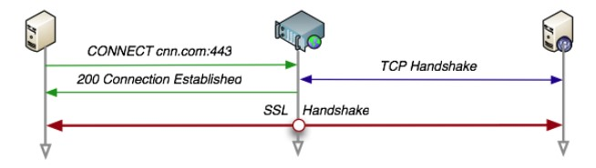

<<<<<<< HEAD
[🍉 點擊訂閱面試進階專欄 ](https://xiaozhuanlan.com/CyC2018)
<!-- GFM-TOC -->
* [一 、基礎概念](#一-基礎概念)
    * [URI](#uri)
    * [請求和響應報文](#請求和響應報文)
=======
* [点击阅读面试进阶指南 ](https://github.com/CyC2018/Backend-Interview-Guide)
<!-- GFM-TOC -->
* [一 、基础概念](#一-基础概念)
    * [URI](#uri)
    * [请求和响应报文](#请求和响应报文)
>>>>>>> 9f1571a1b578332969a00a0bda4029dfad9995a3
* [二、HTTP 方法](#二http-方法)
    * [GET](#get)
    * [HEAD](#head)
    * [POST](#post)
    * [PUT](#put)
    * [PATCH](#patch)
    * [DELETE](#delete)
    * [OPTIONS](#options)
    * [CONNECT](#connect)
    * [TRACE](#trace)
<<<<<<< HEAD
* [三、HTTP 狀態碼](#三http-狀態碼)
    * [1XX 信息](#1xx-信息)
    * [2XX 成功](#2xx-成功)
    * [3XX 重定向](#3xx-重定向)
    * [4XX 客戶端錯誤](#4xx-客戶端錯誤)
    * [5XX 服務器錯誤](#5xx-服務器錯誤)
* [四、HTTP 首部](#四http-首部)
    * [通用首部字段](#通用首部字段)
    * [請求首部字段](#請求首部字段)
    * [響應首部字段](#響應首部字段)
    * [實體首部字段](#實體首部字段)
* [五、具體應用](#五具體應用)
    * [連接管理](#連接管理)
    * [Cookie](#cookie)
    * [緩存](#緩存)
    * [內容協商](#內容協商)
    * [內容編碼](#內容編碼)
    * [範圍請求](#範圍請求)
    * [分塊傳輸編碼](#分塊傳輸編碼)
    * [多部分對象集合](#多部分對象集合)
    * [虛擬主機](#虛擬主機)
    * [通信數據轉發](#通信數據轉發)
* [六、HTTPs](#六https)
    * [加密](#加密)
    * [認證](#認證)
    * [完整性保護](#完整性保護)
    * [HTTPs 的缺點](#https-的缺點)
* [七、HTTP/2.0](#七http20)
    * [HTTP/1.x 缺陷](#http1x-缺陷)
    * [二進制分幀層](#二進制分幀層)
    * [服務端推送](#服務端推送)
    * [首部壓縮](#首部壓縮)
* [八、HTTP/1.1 新特性](#八http11-新特性)
* [九、GET 和 POST 比較](#九get-和-post-比較)
    * [作用](#作用)
    * [參數](#參數)
    * [安全](#安全)
    * [冪等性](#冪等性)
    * [可緩存](#可緩存)
    * [XMLHttpRequest](#xmlhttprequest)
* [參考資料](#參考資料)
<!-- GFM-TOC -->


# 一 、基礎概念
=======
* [三、HTTP 状态码](#三http-状态码)
    * [1XX 信息](#1xx-信息)
    * [2XX 成功](#2xx-成功)
    * [3XX 重定向](#3xx-重定向)
    * [4XX 客户端错误](#4xx-客户端错误)
    * [5XX 服务器错误](#5xx-服务器错误)
* [四、HTTP 首部](#四http-首部)
    * [通用首部字段](#通用首部字段)
    * [请求首部字段](#请求首部字段)
    * [响应首部字段](#响应首部字段)
    * [实体首部字段](#实体首部字段)
* [五、具体应用](#五具体应用)
    * [连接管理](#连接管理)
    * [Cookie](#cookie)
    * [缓存](#缓存)
    * [内容协商](#内容协商)
    * [内容编码](#内容编码)
    * [范围请求](#范围请求)
    * [分块传输编码](#分块传输编码)
    * [多部分对象集合](#多部分对象集合)
    * [虚拟主机](#虚拟主机)
    * [通信数据转发](#通信数据转发)
* [六、HTTPS](#六https)
    * [加密](#加密)
    * [认证](#认证)
    * [完整性保护](#完整性保护)
    * [HTTPS 的缺点](#https-的缺点)
* [七、HTTP/2.0](#七http20)
    * [HTTP/1.x 缺陷](#http1x-缺陷)
    * [二进制分帧层](#二进制分帧层)
    * [服务端推送](#服务端推送)
    * [首部压缩](#首部压缩)
* [八、HTTP/1.1 新特性](#八http11-新特性)
* [九、GET 和 POST 比较](#九get-和-post-比较)
    * [作用](#作用)
    * [参数](#参数)
    * [安全](#安全)
    * [幂等性](#幂等性)
    * [可缓存](#可缓存)
    * [XMLHttpRequest](#xmlhttprequest)
* [参考资料](#参考资料)
<!-- GFM-TOC -->


# 一 、基础概念
>>>>>>> 9f1571a1b578332969a00a0bda4029dfad9995a3

## URI

URI 包含 URL 和 URN。

<<<<<<< HEAD
- URI（Uniform Resource Identifier，統一資源標識符）
- URL（Uniform Resource Locator，統一資源定位符）
- URN（Uniform Resource Name，統一資源名稱）

<div align="center">  </div><br>

## 請求和響應報文

### 1. 請求報文

<div align="center">  </div><br>

### 2. 響應報文
=======
- URI（Uniform Resource Identifier，统一资源标识符）
- URL（Uniform Resource Locator，统一资源定位符）
- URN（Uniform Resource Name，统一资源名称）

<div align="center">  </div><br>

## 请求和响应报文

### 1. 请求报文

<div align="center">  </div><br>

### 2. 响应报文
>>>>>>> 9f1571a1b578332969a00a0bda4029dfad9995a3

<div align="center">  </div><br>

# 二、HTTP 方法

<<<<<<< HEAD
客戶端發送的  **請求報文**  第一行為請求行，包含了方法字段。

## GET

> 獲取資源

當前網絡請求中，絕大部分使用的是 GET 方法。

## HEAD

> 獲取報文首部

和 GET 方法類似，但是不返回報文實體主體部分。

主要用於確認 URL 的有效性以及資源更新的日期時間等。

## POST

> 傳輸實體主體

POST 主要用來傳輸數據，而 GET 主要用來獲取資源。

更多 POST 與 GET 的比較請見第九章。

## PUT

> 上傳文件

由於自身不帶驗證機制，任何人都可以上傳文件，因此存在安全性問題，一般不使用該方法。
=======
客户端发送的  **请求报文**  第一行为请求行，包含了方法字段。

## GET

> 获取资源

当前网络请求中，绝大部分使用的是 GET 方法。

## HEAD

> 获取报文首部

和 GET 方法类似，但是不返回报文实体主体部分。

主要用于确认 URL 的有效性以及资源更新的日期时间等。

## POST

> 传输实体主体

POST 主要用来传输数据，而 GET 主要用来获取资源。

更多 POST 与 GET 的比较请见第九章。

## PUT

> 上传文件

由于自身不带验证机制，任何人都可以上传文件，因此存在安全性问题，一般不使用该方法。
>>>>>>> 9f1571a1b578332969a00a0bda4029dfad9995a3

```html
PUT /new.html HTTP/1.1
Host: example.com
Content-type: text/html
Content-length: 16

<p>New File</p>
```

## PATCH

<<<<<<< HEAD
> 對資源進行部分修改

PUT 也可以用於修改資源，但是只能完全替代原始資源，PATCH 允許部分修改。
=======
> 对资源进行部分修改

PUT 也可以用于修改资源，但是只能完全替代原始资源，PATCH 允许部分修改。
>>>>>>> 9f1571a1b578332969a00a0bda4029dfad9995a3

```html
PATCH /file.txt HTTP/1.1
Host: www.example.com
Content-Type: application/example
If-Match: "e0023aa4e"
Content-Length: 100

[description of changes]
```

## DELETE

<<<<<<< HEAD
> 刪除文件

與 PUT 功能相反，並且同樣不帶驗證機制。
=======
> 删除文件

与 PUT 功能相反，并且同样不带验证机制。
>>>>>>> 9f1571a1b578332969a00a0bda4029dfad9995a3

```html
DELETE /file.html HTTP/1.1
```

## OPTIONS

<<<<<<< HEAD
> 查詢支持的方法

查詢指定的 URL 能夠支持的方法。

會返回 `Allow: GET, POST, HEAD, OPTIONS` 這樣的內容。

## CONNECT

> 要求在與代理服務器通信時建立隧道

使用 SSL（Secure Sockets Layer，安全套接層）和 TLS（Transport Layer Security，傳輸層安全）協議把通信內容加密後經網絡隧道傳輸。
=======
> 查询支持的方法

查询指定的 URL 能够支持的方法。

会返回 `Allow: GET, POST, HEAD, OPTIONS` 这样的内容。

## CONNECT

> 要求在与代理服务器通信时建立隧道

使用 SSL（Secure Sockets Layer，安全套接层）和 TLS（Transport Layer Security，传输层安全）协议把通信内容加密后经网络隧道传输。
>>>>>>> 9f1571a1b578332969a00a0bda4029dfad9995a3

```html
CONNECT www.example.com:443 HTTP/1.1
```

<div align="center">  </div><br>

## TRACE

<<<<<<< HEAD
> 追蹤路徑

服務器會將通信路徑返回給客戶端。

發送請求時，在 Max-Forwards 首部字段中填入數值，每經過一個服務器就會減 1，當數值為 0 時就停止傳輸。

通常不會使用 TRACE，並且它容易受到 XST 攻擊（Cross-Site Tracing，跨站追蹤）。

# 三、HTTP 狀態碼

服務器返回的  **響應報文**  中第一行為狀態行，包含了狀態碼以及原因短語，用來告知客戶端請求的結果。

| 狀態碼 | 類別 | 含義 |
| :---: | :---: | :---: |
| 1XX | Informational（信息性狀態碼） | 接收的請求正在處理 |
| 2XX | Success（成功狀態碼） | 請求正常處理完畢 |
| 3XX | Redirection（重定向狀態碼） | 需要進行附加操作以完成請求 |
| 4XX | Client Error（客戶端錯誤狀態碼） | 服務器無法處理請求 |
| 5XX | Server Error（服務器錯誤狀態碼） | 服務器處理請求出錯 |

## 1XX 信息

-  **100 Continue** ：表明到目前為止都很正常，客戶端可以繼續發送請求或者忽略這個響應。
=======
> 追踪路径

服务器会将通信路径返回给客户端。

发送请求时，在 Max-Forwards 首部字段中填入数值，每经过一个服务器就会减 1，当数值为 0 时就停止传输。

通常不会使用 TRACE，并且它容易受到 XST 攻击（Cross-Site Tracing，跨站追踪）。

# 三、HTTP 状态码

服务器返回的  **响应报文**  中第一行为状态行，包含了状态码以及原因短语，用来告知客户端请求的结果。

| 状态码 | 类别 | 含义 |
| :---: | :---: | :---: |
| 1XX | Informational（信息性状态码） | 接收的请求正在处理 |
| 2XX | Success（成功状态码） | 请求正常处理完毕 |
| 3XX | Redirection（重定向状态码） | 需要进行附加操作以完成请求 |
| 4XX | Client Error（客户端错误状态码） | 服务器无法处理请求 |
| 5XX | Server Error（服务器错误状态码） | 服务器处理请求出错 |

## 1XX 信息

-  **100 Continue** ：表明到目前为止都很正常，客户端可以继续发送请求或者忽略这个响应。
>>>>>>> 9f1571a1b578332969a00a0bda4029dfad9995a3

## 2XX 成功

-  **200 OK** 

<<<<<<< HEAD
-  **204 No Content** ：請求已經成功處理，但是返回的響應報文不包含實體的主體部分。一般在只需要從客戶端往服務器發送信息，而不需要返回數據時使用。

-  **206 Partial Content** ：表示客戶端進行了範圍請求，響應報文包含由 Content-Range 指定範圍的實體內容。
=======
-  **204 No Content** ：请求已经成功处理，但是返回的响应报文不包含实体的主体部分。一般在只需要从客户端往服务器发送信息，而不需要返回数据时使用。

-  **206 Partial Content** ：表示客户端进行了范围请求，响应报文包含由 Content-Range 指定范围的实体内容。
>>>>>>> 9f1571a1b578332969a00a0bda4029dfad9995a3

## 3XX 重定向

-  **301 Moved Permanently** ：永久性重定向

<<<<<<< HEAD
-  **302 Found** ：臨時性重定向

-  **303 See Other** ：和 302 有著相同的功能，但是 303 明確要求客戶端應該采用 GET 方法獲取資源。

- 註：雖然 HTTP 協議規定 301、302 狀態下重定向時不允許把 POST 方法改成 GET 方法，但是大多數瀏覽器都會在 301、302 和 303 狀態下的重定向把 POST 方法改成 GET 方法。

-  **304 Not Modified** ：如果請求報文首部包含一些條件，例如：If-Match，If-Modified-Since，If-None-Match，If-Range，If-Unmodified-Since，如果不滿足條件，則服務器會返回 304 狀態碼。

-  **307 Temporary Redirect** ：臨時重定向，與 302 的含義類似，但是 307 要求瀏覽器不會把重定向請求的 POST 方法改成 GET 方法。

## 4XX 客戶端錯誤

-  **400 Bad Request** ：請求報文中存在語法錯誤。

-  **401 Unauthorized** ：該狀態碼表示發送的請求需要有認證信息（BASIC 認證、DIGEST 認證）。如果之前已進行過一次請求，則表示用戶認證失敗。

-  **403 Forbidden** ：請求被拒絕。

-  **404 Not Found** 

## 5XX 服務器錯誤

-  **500 Internal Server Error** ：服務器正在執行請求時發生錯誤。

-  **503 Service Unavailable** ：服務器暫時處於超負載或正在進行停機維護，現在無法處理請求。

# 四、HTTP 首部

有 4 種類型的首部字段：通用首部字段、請求首部字段、響應首部字段和實體首部字段。

各種首部字段及其含義如下（不需要全記，僅供查閱）：

## 通用首部字段

| 首部字段名 | 說明 |
| :--: | :--: |
| Cache-Control | 控制緩存的行為 |
| Connection | 控制不再轉發給代理的首部字段、管理持久連接|
| Date | 創建報文的日期時間 |
| Pragma | 報文指令 |
| Trailer | 報文末端的首部一覽 |
| Transfer-Encoding | 指定報文主體的傳輸編碼方式 |
| Upgrade | 升級為其他協議 |
| Via | 代理服務器的相關信息 |
| Warning | 錯誤通知 |

## 請求首部字段

| 首部字段名 | 說明 |
| :--: | :--: |
| Accept | 用戶代理可處理的媒體類型 |
| Accept-Charset | 優先的字符集 |
| Accept-Encoding | 優先的內容編碼 |
| Accept-Language | 優先的語言（自然語言） |
| Authorization | Web 認證信息 |
| Expect | 期待服務器的特定行為 |
| From | 用戶的電子郵箱地址 |
| Host | 請求資源所在服務器 |
| If-Match | 比較實體標記（ETag） |
| If-Modified-Since | 比較資源的更新時間 |
| If-None-Match | 比較實體標記（與 If-Match 相反） |
| If-Range | 資源未更新時發送實體 Byte 的範圍請求 |
| If-Unmodified-Since | 比較資源的更新時間（與 If-Modified-Since 相反） |
| Max-Forwards | 最大傳輸逐跳數 |
| Proxy-Authorization | 代理服務器要求客戶端的認證信息 |
| Range | 實體的字節範圍請求 |
| Referer | 對請求中 URI 的原始獲取方 |
| TE | 傳輸編碼的優先級 |
| User-Agent | HTTP 客戶端程序的信息 |

## 響應首部字段

| 首部字段名 | 說明 |
| :--: | :--: |
| Accept-Ranges | 是否接受字節範圍請求 |
| Age | 推算資源創建經過時間 |
| ETag | 資源的匹配信息 |
| Location | 令客戶端重定向至指定 URI |
| Proxy-Authenticate | 代理服務器對客戶端的認證信息 |
| Retry-After | 對再次發起請求的時機要求 |
| Server | HTTP 服務器的安裝信息 |
| Vary | 代理服務器緩存的管理信息 |
| WWW-Authenticate | 服務器對客戶端的認證信息 |

## 實體首部字段

| 首部字段名 | 說明 |
| :--: | :--: |
| Allow | 資源可支持的 HTTP 方法 |
| Content-Encoding | 實體主體適用的編碼方式 |
| Content-Language | 實體主體的自然語言 |
| Content-Length | 實體主體的大小 |
| Content-Location | 替代對應資源的 URI |
| Content-MD5 | 實體主體的報文摘要 |
| Content-Range | 實體主體的位置範圍 |
| Content-Type | 實體主體的媒體類型 |
| Expires | 實體主體過期的日期時間 |
| Last-Modified | 資源的最後修改日期時間 |

# 五、具體應用

## 連接管理

<div align="center">  </div><br>

### 1. 短連接與長連接

當瀏覽器訪問一個包含多張圖片的 HTML 頁面時，除了請求訪問 HTML 頁面資源，還會請求圖片資源。如果每進行一次 HTTP 通信就要新建一個 TCP 連接，那麽開銷會很大。

長連接只需要建立一次 TCP 連接就能進行多次 HTTP 通信。

- 從 HTTP/1.1 開始默認是長連接的，如果要斷開連接，需要由客戶端或者服務器端提出斷開，使用 `Connection : close`；
- 在 HTTP/1.1 之前默認是短連接的，如果需要使用長連接，則使用 `Connection : Keep-Alive`。

### 2. 流水線

默認情況下，HTTP 請求是按順序發出的，下一個請求只有在當前請求收到響應之後才會被發出。由於會受到網絡延遲和帶寬的限制，在下一個請求被發送到服務器之前，可能需要等待很長時間。

流水線是在同一條長連接上發出連續的請求，而不用等待響應返回，這樣可以避免連接延遲。

## Cookie

HTTP 協議是無狀態的，主要是為了讓 HTTP 協議盡可能簡單，使得它能夠處理大量事務。HTTP/1.1 引入 Cookie 來保存狀態信息。

Cookie 是服務器發送到用戶瀏覽器並保存在本地的一小塊數據，它會在瀏覽器之後向同一服務器再次發起請求時被攜帶上，用於告知服務端兩個請求是否來自同一瀏覽器。由於之後每次請求都會需要攜帶 Cookie 數據，因此會帶來額外的性能開銷（尤其是在移動環境下）。

Cookie 曾一度用於客戶端數據的存儲，因為當時並沒有其它合適的存儲辦法而作為唯一的存儲手段，但現在隨著現代瀏覽器開始支持各種各樣的存儲方式，Cookie 漸漸被淘汰。新的瀏覽器 API 已經允許開發者直接將數據存儲到本地，如使用 Web storage API（本地存儲和會話存儲）或 IndexedDB。

### 1. 用途

- 會話狀態管理（如用戶登錄狀態、購物車、遊戲分數或其它需要記錄的信息）
- 個性化設置（如用戶自定義設置、主題等）
- 瀏覽器行為跟蹤（如跟蹤分析用戶行為等）

### 2. 創建過程

服務器發送的響應報文包含 Set-Cookie 首部字段，客戶端得到響應報文後把 Cookie 內容保存到瀏覽器中。
=======
-  **302 Found** ：临时性重定向

-  **303 See Other** ：和 302 有着相同的功能，但是 303 明确要求客户端应该采用 GET 方法获取资源。

- 注：虽然 HTTP 协议规定 301、302 状态下重定向时不允许把 POST 方法改成 GET 方法，但是大多数浏览器都会在 301、302 和 303 状态下的重定向把 POST 方法改成 GET 方法。

-  **304 Not Modified** ：如果请求报文首部包含一些条件，例如：If-Match，If-Modified-Since，If-None-Match，If-Range，If-Unmodified-Since，如果不满足条件，则服务器会返回 304 状态码。

-  **307 Temporary Redirect** ：临时重定向，与 302 的含义类似，但是 307 要求浏览器不会把重定向请求的 POST 方法改成 GET 方法。

## 4XX 客户端错误

-  **400 Bad Request** ：请求报文中存在语法错误。

-  **401 Unauthorized** ：该状态码表示发送的请求需要有认证信息（BASIC 认证、DIGEST 认证）。如果之前已进行过一次请求，则表示用户认证失败。

-  **403 Forbidden** ：请求被拒绝。

-  **404 Not Found** 

## 5XX 服务器错误

-  **500 Internal Server Error** ：服务器正在执行请求时发生错误。

-  **503 Service Unavailable** ：服务器暂时处于超负载或正在进行停机维护，现在无法处理请求。

# 四、HTTP 首部

有 4 种类型的首部字段：通用首部字段、请求首部字段、响应首部字段和实体首部字段。

各种首部字段及其含义如下（不需要全记，仅供查阅）：

## 通用首部字段

| 首部字段名 | 说明 |
| :--: | :--: |
| Cache-Control | 控制缓存的行为 |
| Connection | 控制不再转发给代理的首部字段、管理持久连接|
| Date | 创建报文的日期时间 |
| Pragma | 报文指令 |
| Trailer | 报文末端的首部一览 |
| Transfer-Encoding | 指定报文主体的传输编码方式 |
| Upgrade | 升级为其他协议 |
| Via | 代理服务器的相关信息 |
| Warning | 错误通知 |

## 请求首部字段

| 首部字段名 | 说明 |
| :--: | :--: |
| Accept | 用户代理可处理的媒体类型 |
| Accept-Charset | 优先的字符集 |
| Accept-Encoding | 优先的内容编码 |
| Accept-Language | 优先的语言（自然语言） |
| Authorization | Web 认证信息 |
| Expect | 期待服务器的特定行为 |
| From | 用户的电子邮箱地址 |
| Host | 请求资源所在服务器 |
| If-Match | 比较实体标记（ETag） |
| If-Modified-Since | 比较资源的更新时间 |
| If-None-Match | 比较实体标记（与 If-Match 相反） |
| If-Range | 资源未更新时发送实体 Byte 的范围请求 |
| If-Unmodified-Since | 比较资源的更新时间（与 If-Modified-Since 相反） |
| Max-Forwards | 最大传输逐跳数 |
| Proxy-Authorization | 代理服务器要求客户端的认证信息 |
| Range | 实体的字节范围请求 |
| Referer | 对请求中 URI 的原始获取方 |
| TE | 传输编码的优先级 |
| User-Agent | HTTP 客户端程序的信息 |

## 响应首部字段

| 首部字段名 | 说明 |
| :--: | :--: |
| Accept-Ranges | 是否接受字节范围请求 |
| Age | 推算资源创建经过时间 |
| ETag | 资源的匹配信息 |
| Location | 令客户端重定向至指定 URI |
| Proxy-Authenticate | 代理服务器对客户端的认证信息 |
| Retry-After | 对再次发起请求的时机要求 |
| Server | HTTP 服务器的安装信息 |
| Vary | 代理服务器缓存的管理信息 |
| WWW-Authenticate | 服务器对客户端的认证信息 |

## 实体首部字段

| 首部字段名 | 说明 |
| :--: | :--: |
| Allow | 资源可支持的 HTTP 方法 |
| Content-Encoding | 实体主体适用的编码方式 |
| Content-Language | 实体主体的自然语言 |
| Content-Length | 实体主体的大小 |
| Content-Location | 替代对应资源的 URI |
| Content-MD5 | 实体主体的报文摘要 |
| Content-Range | 实体主体的位置范围 |
| Content-Type | 实体主体的媒体类型 |
| Expires | 实体主体过期的日期时间 |
| Last-Modified | 资源的最后修改日期时间 |

# 五、具体应用

## 连接管理

<div align="center">  </div><br>

### 1. 短连接与长连接

当浏览器访问一个包含多张图片的 HTML 页面时，除了请求访问 HTML 页面资源，还会请求图片资源。如果每进行一次 HTTP 通信就要新建一个 TCP 连接，那么开销会很大。

长连接只需要建立一次 TCP 连接就能进行多次 HTTP 通信。

- 从 HTTP/1.1 开始默认是长连接的，如果要断开连接，需要由客户端或者服务器端提出断开，使用 `Connection : close`；
- 在 HTTP/1.1 之前默认是短连接的，如果需要使用长连接，则使用 `Connection : Keep-Alive`。

### 2. 流水线

默认情况下，HTTP 请求是按顺序发出的，下一个请求只有在当前请求收到响应之后才会被发出。由于会受到网络延迟和带宽的限制，在下一个请求被发送到服务器之前，可能需要等待很长时间。

流水线是在同一条长连接上发出连续的请求，而不用等待响应返回，这样可以避免连接延迟。

## Cookie

HTTP 协议是无状态的，主要是为了让 HTTP 协议尽可能简单，使得它能够处理大量事务。HTTP/1.1 引入 Cookie 来保存状态信息。

Cookie 是服务器发送到用户浏览器并保存在本地的一小块数据，它会在浏览器之后向同一服务器再次发起请求时被携带上，用于告知服务端两个请求是否来自同一浏览器。由于之后每次请求都会需要携带 Cookie 数据，因此会带来额外的性能开销（尤其是在移动环境下）。

Cookie 曾一度用于客户端数据的存储，因为当时并没有其它合适的存储办法而作为唯一的存储手段，但现在随着现代浏览器开始支持各种各样的存储方式，Cookie 渐渐被淘汰。新的浏览器 API 已经允许开发者直接将数据存储到本地，如使用 Web storage API（本地存储和会话存储）或 IndexedDB。

### 1. 用途

- 会话状态管理（如用户登录状态、购物车、游戏分数或其它需要记录的信息）
- 个性化设置（如用户自定义设置、主题等）
- 浏览器行为跟踪（如跟踪分析用户行为等）

### 2. 创建过程

服务器发送的响应报文包含 Set-Cookie 首部字段，客户端得到响应报文后把 Cookie 内容保存到浏览器中。
>>>>>>> 9f1571a1b578332969a00a0bda4029dfad9995a3

```html
HTTP/1.0 200 OK
Content-type: text/html
Set-Cookie: yummy_cookie=choco
Set-Cookie: tasty_cookie=strawberry

[page content]
```

<<<<<<< HEAD
客戶端之後對同一個服務器發送請求時，會從瀏覽器中取出 Cookie 信息並通過 Cookie 請求首部字段發送給服務器。
=======
客户端之后对同一个服务器发送请求时，会从浏览器中取出 Cookie 信息并通过 Cookie 请求首部字段发送给服务器。
>>>>>>> 9f1571a1b578332969a00a0bda4029dfad9995a3

```html
GET /sample_page.html HTTP/1.1
Host: www.example.org
Cookie: yummy_cookie=choco; tasty_cookie=strawberry
```

<<<<<<< HEAD
### 3. 分類

- 會話期 Cookie：瀏覽器關閉之後它會被自動刪除，也就是說它僅在會話期內有效。
- 持久性 Cookie：指定一個特定的過期時間（Expires）或有效期（max-age）之後就成為了持久性的 Cookie。
=======
### 3. 分类

- 会话期 Cookie：浏览器关闭之后它会被自动删除，也就是说它仅在会话期内有效。
- 持久性 Cookie：指定一个特定的过期时间（Expires）或有效期（max-age）之后就成为了持久性的 Cookie。
>>>>>>> 9f1571a1b578332969a00a0bda4029dfad9995a3

```html
Set-Cookie: id=a3fWa; Expires=Wed, 21 Oct 2015 07:28:00 GMT;
```

### 4. 作用域

<<<<<<< HEAD
Domain 標識指定了哪些主機可以接受 Cookie。如果不指定，默認為當前文檔的主機（不包含子域名）。如果指定了 Domain，則一般包含子域名。例如，如果設置 Domain=mozilla.org，則 Cookie 也包含在子域名中（如 developer.mozilla.org）。

Path 標識指定了主機下的哪些路徑可以接受 Cookie（該 URL 路徑必須存在於請求 URL 中）。以字符 %x2F ("/") 作為路徑分隔符，子路徑也會被匹配。例如，設置 Path=/docs，則以下地址都會匹配：
=======
Domain 标识指定了哪些主机可以接受 Cookie。如果不指定，默认为当前文档的主机（不包含子域名）。如果指定了 Domain，则一般包含子域名。例如，如果设置 Domain=mozilla.org，则 Cookie 也包含在子域名中（如 developer.mozilla.org）。

Path 标识指定了主机下的哪些路径可以接受 Cookie（该 URL 路径必须存在于请求 URL 中）。以字符 %x2F ("/") 作为路径分隔符，子路径也会被匹配。例如，设置 Path=/docs，则以下地址都会匹配：
>>>>>>> 9f1571a1b578332969a00a0bda4029dfad9995a3

- /docs
- /docs/Web/
- /docs/Web/HTTP

### 5. JavaScript

<<<<<<< HEAD
通過 `document.cookie` 屬性可創建新的 Cookie，也可通過該屬性訪問非 HttpOnly 標記的 Cookie。
=======
通过 `document.cookie` 属性可创建新的 Cookie，也可通过该属性访问非 HttpOnly 标记的 Cookie。
>>>>>>> 9f1571a1b578332969a00a0bda4029dfad9995a3

```html
document.cookie = "yummy_cookie=choco";
document.cookie = "tasty_cookie=strawberry";
console.log(document.cookie);
```

### 6. HttpOnly

<<<<<<< HEAD
標記為 HttpOnly 的 Cookie 不能被 JavaScript 腳本調用。跨站腳本攻擊 (XSS) 常常使用 JavaScript 的 `document.cookie` API 竊取用戶的 Cookie 信息，因此使用 HttpOnly 標記可以在一定程度上避免 XSS 攻擊。
=======
标记为 HttpOnly 的 Cookie 不能被 JavaScript 脚本调用。跨站脚本攻击 (XSS) 常常使用 JavaScript 的 `document.cookie` API 窃取用户的 Cookie 信息，因此使用 HttpOnly 标记可以在一定程度上避免 XSS 攻击。
>>>>>>> 9f1571a1b578332969a00a0bda4029dfad9995a3

```html
Set-Cookie: id=a3fWa; Expires=Wed, 21 Oct 2015 07:28:00 GMT; Secure; HttpOnly
```

### 7. Secure

<<<<<<< HEAD
標記為 Secure 的 Cookie 只能通過被 HTTPS 協議加密過的請求發送給服務端。但即便設置了 Secure 標記，敏感信息也不應該通過 Cookie 傳輸，因為 Cookie 有其固有的不安全性，Secure 標記也無法提供確實的安全保障。

### 8. Session

除了可以將用戶信息通過 Cookie 存儲在用戶瀏覽器中，也可以利用 Session 存儲在服務器端，存儲在服務器端的信息更加安全。

Session 可以存儲在服務器上的文件、數據庫或者內存中。也可以將 Session 存儲在 Redis 這種內存型數據庫中，效率會更高。

使用 Session 維護用戶登錄狀態的過程如下：

- 用戶進行登錄時，用戶提交包含用戶名和密碼的表單，放入 HTTP 請求報文中；
- 服務器驗證該用戶名和密碼，如果正確則把用戶信息存儲到 Redis 中，它在 Redis 中的 Key 稱為 Session ID；
- 服務器返回的響應報文的 Set-Cookie 首部字段包含了這個 Session ID，客戶端收到響應報文之後將該 Cookie 值存入瀏覽器中；
- 客戶端之後對同一個服務器進行請求時會包含該 Cookie 值，服務器收到之後提取出 Session ID，從 Redis 中取出用戶信息，繼續之前的業務操作。

應該註意 Session ID 的安全性問題，不能讓它被惡意攻擊者輕易獲取，那麽就不能產生一個容易被猜到的 Session ID 值。此外，還需要經常重新生成 Session ID。在對安全性要求極高的場景下，例如轉賬等操作，除了使用 Session 管理用戶狀態之外，還需要對用戶進行重新驗證，比如重新輸入密碼，或者使用短信驗證碼等方式。

### 9. 瀏覽器禁用 Cookie

此時無法使用 Cookie 來保存用戶信息，只能使用 Session。除此之外，不能再將 Session ID 存放到 Cookie 中，而是使用 URL 重寫技術，將 Session ID 作為 URL 的參數進行傳遞。

### 10. Cookie 與 Session 選擇

- Cookie 只能存儲 ASCII 碼字符串，而 Session 則可以存取任何類型的數據，因此在考慮數據覆雜性時首選 Session；
- Cookie 存儲在瀏覽器中，容易被惡意查看。如果非要將一些隱私數據存在 Cookie 中，可以將 Cookie 值進行加密，然後在服務器進行解密；
- 對於大型網站，如果用戶所有的信息都存儲在 Session 中，那麽開銷是非常大的，因此不建議將所有的用戶信息都存儲到 Session 中。

## 緩存

### 1. 優點

- 緩解服務器壓力；
- 降低客戶端獲取資源的延遲：緩存通常位於內存中，讀取緩存的速度更快。並且緩存在地理位置上也有可能比源服務器來得近，例如瀏覽器緩存。

### 2. 實現方法

- 讓代理服務器進行緩存；
- 讓客戶端瀏覽器進行緩存。

### 3. Cache-Control

HTTP/1.1 通過 Cache-Control 首部字段來控制緩存。

**3.1 禁止進行緩存** 

no-store 指令規定不能對請求或響應的任何一部分進行緩存。
=======
标记为 Secure 的 Cookie 只能通过被 HTTPS 协议加密过的请求发送给服务端。但即便设置了 Secure 标记，敏感信息也不应该通过 Cookie 传输，因为 Cookie 有其固有的不安全性，Secure 标记也无法提供确实的安全保障。

### 8. Session

除了可以将用户信息通过 Cookie 存储在用户浏览器中，也可以利用 Session 存储在服务器端，存储在服务器端的信息更加安全。

Session 可以存储在服务器上的文件、数据库或者内存中。也可以将 Session 存储在 Redis 这种内存型数据库中，效率会更高。

使用 Session 维护用户登录状态的过程如下：

- 用户进行登录时，用户提交包含用户名和密码的表单，放入 HTTP 请求报文中；
- 服务器验证该用户名和密码，如果正确则把用户信息存储到 Redis 中，它在 Redis 中的 Key 称为 Session ID；
- 服务器返回的响应报文的 Set-Cookie 首部字段包含了这个 Session ID，客户端收到响应报文之后将该 Cookie 值存入浏览器中；
- 客户端之后对同一个服务器进行请求时会包含该 Cookie 值，服务器收到之后提取出 Session ID，从 Redis 中取出用户信息，继续之前的业务操作。

应该注意 Session ID 的安全性问题，不能让它被恶意攻击者轻易获取，那么就不能产生一个容易被猜到的 Session ID 值。此外，还需要经常重新生成 Session ID。在对安全性要求极高的场景下，例如转账等操作，除了使用 Session 管理用户状态之外，还需要对用户进行重新验证，比如重新输入密码，或者使用短信验证码等方式。

### 9. 浏览器禁用 Cookie

此时无法使用 Cookie 来保存用户信息，只能使用 Session。除此之外，不能再将 Session ID 存放到 Cookie 中，而是使用 URL 重写技术，将 Session ID 作为 URL 的参数进行传递。

### 10. Cookie 与 Session 选择

- Cookie 只能存储 ASCII 码字符串，而 Session 则可以存取任何类型的数据，因此在考虑数据复杂性时首选 Session；
- Cookie 存储在浏览器中，容易被恶意查看。如果非要将一些隐私数据存在 Cookie 中，可以将 Cookie 值进行加密，然后在服务器进行解密；
- 对于大型网站，如果用户所有的信息都存储在 Session 中，那么开销是非常大的，因此不建议将所有的用户信息都存储到 Session 中。

## 缓存

### 1. 优点

- 缓解服务器压力；
- 降低客户端获取资源的延迟：缓存通常位于内存中，读取缓存的速度更快。并且缓存在地理位置上也有可能比源服务器来得近，例如浏览器缓存。

### 2. 实现方法

- 让代理服务器进行缓存；
- 让客户端浏览器进行缓存。

### 3. Cache-Control

HTTP/1.1 通过 Cache-Control 首部字段来控制缓存。

**3.1 禁止进行缓存** 

no-store 指令规定不能对请求或响应的任何一部分进行缓存。
>>>>>>> 9f1571a1b578332969a00a0bda4029dfad9995a3

```html
Cache-Control: no-store
```

<<<<<<< HEAD
**3.2 強制確認緩存** 

no-cache 指令規定緩存服務器需要先向源服務器驗證緩存資源的有效性，只有當緩存資源有效才將能使用該緩存對客戶端的請求進行響應。
=======
**3.2 强制确认缓存** 

no-cache 指令规定缓存服务器需要先向源服务器验证缓存资源的有效性，只有当缓存资源有效才将能使用该缓存对客户端的请求进行响应。
>>>>>>> 9f1571a1b578332969a00a0bda4029dfad9995a3

```html
Cache-Control: no-cache
```

<<<<<<< HEAD
**3.3 私有緩存和公共緩存** 

private 指令規定了將資源作為私有緩存，只能被單獨用戶所使用，一般存儲在用戶瀏覽器中。
=======
**3.3 私有缓存和公共缓存** 

private 指令规定了将资源作为私有缓存，只能被单独用户所使用，一般存储在用户浏览器中。
>>>>>>> 9f1571a1b578332969a00a0bda4029dfad9995a3

```html
Cache-Control: private
```

<<<<<<< HEAD
public 指令規定了將資源作為公共緩存，可以被多個用戶所使用，一般存儲在代理服務器中。
=======
public 指令规定了将资源作为公共缓存，可以被多个用户所使用，一般存储在代理服务器中。
>>>>>>> 9f1571a1b578332969a00a0bda4029dfad9995a3

```html
Cache-Control: public
```

<<<<<<< HEAD
**3.4 緩存過期機制** 

max-age 指令出現在請求報文中，並且緩存資源的緩存時間小於該指令指定的時間，那麽就能接受該緩存。

max-age 指令出現在響應報文中，表示緩存資源在緩存服務器中保存的時間。
=======
**3.4 缓存过期机制** 

max-age 指令出现在请求报文中，并且缓存资源的缓存时间小于该指令指定的时间，那么就能接受该缓存。

max-age 指令出现在响应报文中，表示缓存资源在缓存服务器中保存的时间。
>>>>>>> 9f1571a1b578332969a00a0bda4029dfad9995a3

```html
Cache-Control: max-age=31536000
```

<<<<<<< HEAD
Expires 首部字段也可以用於告知緩存服務器該資源什麽時候會過期。
=======
Expires 首部字段也可以用于告知缓存服务器该资源什么时候会过期。
>>>>>>> 9f1571a1b578332969a00a0bda4029dfad9995a3

```html
Expires: Wed, 04 Jul 2012 08:26:05 GMT
```

<<<<<<< HEAD
- 在 HTTP/1.1 中，會優先處理 max-age 指令；
- 在 HTTP/1.0 中，max-age 指令會被忽略掉。

### 4. 緩存驗證

需要先了解 ETag 首部字段的含義，它是資源的唯一標識。URL 不能唯一表示資源，例如 `http://www.google.com/` 有中文和英文兩個資源，只有 ETag 才能對這兩個資源進行唯一標識。
=======
- 在 HTTP/1.1 中，会优先处理 max-age 指令；
- 在 HTTP/1.0 中，max-age 指令会被忽略掉。

### 4. 缓存验证

需要先了解 ETag 首部字段的含义，它是资源的唯一标识。URL 不能唯一表示资源，例如 `http://www.google.com/` 有中文和英文两个资源，只有 ETag 才能对这两个资源进行唯一标识。
>>>>>>> 9f1571a1b578332969a00a0bda4029dfad9995a3

```html
ETag: "82e22293907ce725faf67773957acd12"
```

<<<<<<< HEAD
可以將緩存資源的 ETag 值放入 If-None-Match 首部，服務器收到該請求後，判斷緩存資源的 ETag 值和資源的最新 ETag 值是否一致，如果一致則表示緩存資源有效，返回 304 Not Modified。
=======
可以将缓存资源的 ETag 值放入 If-None-Match 首部，服务器收到该请求后，判断缓存资源的 ETag 值和资源的最新 ETag 值是否一致，如果一致则表示缓存资源有效，返回 304 Not Modified。
>>>>>>> 9f1571a1b578332969a00a0bda4029dfad9995a3

```html
If-None-Match: "82e22293907ce725faf67773957acd12"
```

<<<<<<< HEAD
Last-Modified 首部字段也可以用於緩存驗證，它包含在源服務器發送的響應報文中，指示源服務器對資源的最後修改時間。但是它是一種弱校驗器，因為只能精確到一秒，所以它通常作為 ETag 的備用方案。如果響應首部字段裏含有這個信息，客戶端可以在後續的請求中帶上 If-Modified-Since 來驗證緩存。服務器只在所請求的資源在給定的日期時間之後對內容進行過修改的情況下才會將資源返回，狀態碼為 200 OK。如果請求的資源從那時起未經修改，那麽返回一個不帶有消息主體的 304 Not Modified 響應。
=======
Last-Modified 首部字段也可以用于缓存验证，它包含在源服务器发送的响应报文中，指示源服务器对资源的最后修改时间。但是它是一种弱校验器，因为只能精确到一秒，所以它通常作为 ETag 的备用方案。如果响应首部字段里含有这个信息，客户端可以在后续的请求中带上 If-Modified-Since 来验证缓存。服务器只在所请求的资源在给定的日期时间之后对内容进行过修改的情况下才会将资源返回，状态码为 200 OK。如果请求的资源从那时起未经修改，那么返回一个不带有消息主体的 304 Not Modified 响应。
>>>>>>> 9f1571a1b578332969a00a0bda4029dfad9995a3

```html
Last-Modified: Wed, 21 Oct 2015 07:28:00 GMT
```

```html
If-Modified-Since: Wed, 21 Oct 2015 07:28:00 GMT
```

<<<<<<< HEAD
## 內容協商

通過內容協商返回最合適的內容，例如根據瀏覽器的默認語言選擇返回中文界面還是英文界面。

### 1. 類型

**1.1 服務端驅動型** 

客戶端設置特定的 HTTP 首部字段，例如 Accept、Accept-Charset、Accept-Encoding、Accept-Language，服務器根據這些字段返回特定的資源。

它存在以下問題：

- 服務器很難知道客戶端瀏覽器的全部信息；
- 客戶端提供的信息相當冗長（HTTP/2 協議的首部壓縮機制緩解了這個問題），並且存在隱私風險（HTTP 指紋識別技術）；
- 給定的資源需要返回不同的展現形式，共享緩存的效率會降低，而服務器端的實現會越來越覆雜。

**1.2 代理驅動型** 

服務器返回 300 Multiple Choices 或者 406 Not Acceptable，客戶端從中選出最合適的那個資源。
=======
## 内容协商

通过内容协商返回最合适的内容，例如根据浏览器的默认语言选择返回中文界面还是英文界面。

### 1. 类型

**1.1 服务端驱动型** 

客户端设置特定的 HTTP 首部字段，例如 Accept、Accept-Charset、Accept-Encoding、Accept-Language，服务器根据这些字段返回特定的资源。

它存在以下问题：

- 服务器很难知道客户端浏览器的全部信息；
- 客户端提供的信息相当冗长（HTTP/2 协议的首部压缩机制缓解了这个问题），并且存在隐私风险（HTTP 指纹识别技术）；
- 给定的资源需要返回不同的展现形式，共享缓存的效率会降低，而服务器端的实现会越来越复杂。

**1.2 代理驱动型** 

服务器返回 300 Multiple Choices 或者 406 Not Acceptable，客户端从中选出最合适的那个资源。
>>>>>>> 9f1571a1b578332969a00a0bda4029dfad9995a3

### 2. Vary

```html
Vary: Accept-Language
```

<<<<<<< HEAD
在使用內容協商的情況下，只有當緩存服務器中的緩存滿足內容協商條件時，才能使用該緩存，否則應該向源服務器請求該資源。

例如，一個客戶端發送了一個包含 Accept-Language 首部字段的請求之後，源服務器返回的響應包含 `Vary: Accept-Language` 內容，緩存服務器對這個響應進行緩存之後，在客戶端下一次訪問同一個 URL 資源，並且 Accept-Language 與緩存中的對應的值相同時才會返回該緩存。

## 內容編碼

內容編碼將實體主體進行壓縮，從而減少傳輸的數據量。

常用的內容編碼有：gzip、compress、deflate、identity。

瀏覽器發送 Accept-Encoding 首部，其中包含有它所支持的壓縮算法，以及各自的優先級。服務器則從中選擇一種，使用該算法對響應的消息主體進行壓縮，並且發送 Content-Encoding 首部來告知瀏覽器它選擇了哪一種算法。由於該內容協商過程是基於編碼類型來選擇資源的展現形式的，在響應的 Vary 首部至少要包含 Content-Encoding。

## 範圍請求

如果網絡出現中斷，服務器只發送了一部分數據，範圍請求可以使得客戶端只請求服務器未發送的那部分數據，從而避免服務器重新發送所有數據。

### 1. Range

在請求報文中添加 Range 首部字段指定請求的範圍。
=======
在使用内容协商的情况下，只有当缓存服务器中的缓存满足内容协商条件时，才能使用该缓存，否则应该向源服务器请求该资源。

例如，一个客户端发送了一个包含 Accept-Language 首部字段的请求之后，源服务器返回的响应包含 `Vary: Accept-Language` 内容，缓存服务器对这个响应进行缓存之后，在客户端下一次访问同一个 URL 资源，并且 Accept-Language 与缓存中的对应的值相同时才会返回该缓存。

## 内容编码

内容编码将实体主体进行压缩，从而减少传输的数据量。

常用的内容编码有：gzip、compress、deflate、identity。

浏览器发送 Accept-Encoding 首部，其中包含有它所支持的压缩算法，以及各自的优先级。服务器则从中选择一种，使用该算法对响应的消息主体进行压缩，并且发送 Content-Encoding 首部来告知浏览器它选择了哪一种算法。由于该内容协商过程是基于编码类型来选择资源的展现形式的，在响应的 Vary 首部至少要包含 Content-Encoding。

## 范围请求

如果网络出现中断，服务器只发送了一部分数据，范围请求可以使得客户端只请求服务器未发送的那部分数据，从而避免服务器重新发送所有数据。

### 1. Range

在请求报文中添加 Range 首部字段指定请求的范围。
>>>>>>> 9f1571a1b578332969a00a0bda4029dfad9995a3

```html
GET /z4d4kWk.jpg HTTP/1.1
Host: i.imgur.com
Range: bytes=0-1023
```

<<<<<<< HEAD
請求成功的話服務器返回的響應包含 206 Partial Content 狀態碼。
=======
请求成功的话服务器返回的响应包含 206 Partial Content 状态码。
>>>>>>> 9f1571a1b578332969a00a0bda4029dfad9995a3

```html
HTTP/1.1 206 Partial Content
Content-Range: bytes 0-1023/146515
Content-Length: 1024
...
(binary content)
```

### 2. Accept-Ranges

<<<<<<< HEAD
響應首部字段 Accept-Ranges 用於告知客戶端是否能處理範圍請求，可以處理使用 bytes，否則使用 none。
=======
响应首部字段 Accept-Ranges 用于告知客户端是否能处理范围请求，可以处理使用 bytes，否则使用 none。
>>>>>>> 9f1571a1b578332969a00a0bda4029dfad9995a3

```html
Accept-Ranges: bytes
```

<<<<<<< HEAD
### 3. 響應狀態碼

- 在請求成功的情況下，服務器會返回 206 Partial Content 狀態碼。
- 在請求的範圍越界的情況下，服務器會返回 416 Requested Range Not Satisfiable 狀態碼。
- 在不支持範圍請求的情況下，服務器會返回 200 OK 狀態碼。

## 分塊傳輸編碼

Chunked Transfer Coding，可以把數據分割成多塊，讓瀏覽器逐步顯示頁面。

## 多部分對象集合

一份報文主體內可含有多種類型的實體同時發送，每個部分之間用 boundary 字段定義的分隔符進行分隔，每個部分都可以有首部字段。

例如，上傳多個表單時可以使用如下方式：
=======
### 3. 响应状态码

- 在请求成功的情况下，服务器会返回 206 Partial Content 状态码。
- 在请求的范围越界的情况下，服务器会返回 416 Requested Range Not Satisfiable 状态码。
- 在不支持范围请求的情况下，服务器会返回 200 OK 状态码。

## 分块传输编码

Chunked Transfer Coding，可以把数据分割成多块，让浏览器逐步显示页面。

## 多部分对象集合

一份报文主体内可含有多种类型的实体同时发送，每个部分之间用 boundary 字段定义的分隔符进行分隔，每个部分都可以有首部字段。

例如，上传多个表单时可以使用如下方式：
>>>>>>> 9f1571a1b578332969a00a0bda4029dfad9995a3

```html
Content-Type: multipart/form-data; boundary=AaB03x

--AaB03x
Content-Disposition: form-data; name="submit-name"

Larry
--AaB03x
Content-Disposition: form-data; name="files"; filename="file1.txt"
Content-Type: text/plain

... contents of file1.txt ...
--AaB03x--
```

<<<<<<< HEAD
## 虛擬主機

HTTP/1.1 使用虛擬主機技術，使得一台服務器擁有多個域名，並且在邏輯上可以看成多個服務器。

## 通信數據轉發

### 1. 代理

代理服務器接受客戶端的請求，並且轉發給其它服務器。

使用代理的主要目的是：

- 緩存
- 負載均衡
- 網絡訪問控制
- 訪問日志記錄

代理服務器分為正向代理和反向代理兩種：

- 用戶察覺得到正向代理的存在。

<div align="center">  </div><br>

- 而反向代理一般位於內部網絡中，用戶察覺不到。

<div align="center">  </div><br>

### 2. 網關

與代理服務器不同的是，網關服務器會將 HTTP 轉化為其它協議進行通信，從而請求其它非 HTTP 服務器的服務。

### 3. 隧道

使用 SSL 等加密手段，在客戶端和服務器之間建立一條安全的通信線路。

# 六、HTTPs

HTTP 有以下安全性問題：

- 使用明文進行通信，內容可能會被竊聽；
- 不驗證通信方的身份，通信方的身份有可能遭遇偽裝；
- 無法證明報文的完整性，報文有可能遭篡改。

HTTPs 並不是新協議，而是讓 HTTP 先和 SSL（Secure Sockets Layer）通信，再由 SSL 和 TCP 通信，也就是說 HTTPs 使用了隧道進行通信。

通過使用 SSL，HTTPs 具有了加密（防竊聽）、認證（防偽裝）和完整性保護（防篡改）。
=======
## 虚拟主机

HTTP/1.1 使用虚拟主机技术，使得一台服务器拥有多个域名，并且在逻辑上可以看成多个服务器。

## 通信数据转发

### 1. 代理

代理服务器接受客户端的请求，并且转发给其它服务器。

使用代理的主要目的是：

- 缓存
- 负载均衡
- 网络访问控制
- 访问日志记录

代理服务器分为正向代理和反向代理两种：

- 用户察觉得到正向代理的存在。

<div align="center">  </div><br>

- 而反向代理一般位于内部网络中，用户察觉不到。

<div align="center">  </div><br>

### 2. 网关

与代理服务器不同的是，网关服务器会将 HTTP 转化为其它协议进行通信，从而请求其它非 HTTP 服务器的服务。

### 3. 隧道

使用 SSL 等加密手段，在客户端和服务器之间建立一条安全的通信线路。

# 六、HTTPS

HTTP 有以下安全性问题：

- 使用明文进行通信，内容可能会被窃听；
- 不验证通信方的身份，通信方的身份有可能遭遇伪装；
- 无法证明报文的完整性，报文有可能遭篡改。

HTTPS 并不是新协议，而是让 HTTP 先和 SSL（Secure Sockets Layer）通信，再由 SSL 和 TCP 通信，也就是说 HTTPS 使用了隧道进行通信。

通过使用 SSL，HTTPS 具有了加密（防窃听）、认证（防伪装）和完整性保护（防篡改）。
>>>>>>> 9f1571a1b578332969a00a0bda4029dfad9995a3

<div align="center">  </div><br>

## 加密

<<<<<<< HEAD
### 1. 對稱密鑰加密

對稱密鑰加密（Symmetric-Key Encryption），加密和解密使用同一密鑰。

- 優點：運算速度快；
- 缺點：無法安全地將密鑰傳輸給通信方。

<div align="center">  </div><br>

### 2.非對稱密鑰加密

非對稱密鑰加密，又稱公開密鑰加密（Public-Key Encryption），加密和解密使用不同的密鑰。

公開密鑰所有人都可以獲得，通信發送方獲得接收方的公開密鑰之後，就可以使用公開密鑰進行加密，接收方收到通信內容後使用私有密鑰解密。

非對稱密鑰除了用來加密，還可以用來進行簽名。因為私有密鑰無法被其他人獲取，因此通信發送方使用其私有密鑰進行簽名，通信接收方使用發送方的公開密鑰對簽名進行解密，就能判斷這個簽名是否正確。

- 優點：可以更安全地將公開密鑰傳輸給通信發送方；
- 缺點：運算速度慢。

<div align="center">  </div><br>

### 3. HTTPs 采用的加密方式

HTTPs 采用混合的加密機制，使用非對稱密鑰加密用於傳輸對稱密鑰來保證傳輸過程的安全性，之後使用對稱密鑰加密進行通信來保證通信過程的效率。（下圖中的 Session Key 就是對稱密鑰）

<div align="center">  </div><br>

## 認證

通過使用  **證書**  來對通信方進行認證。

數字證書認證機構（CA，Certificate Authority）是客戶端與服務器雙方都可信賴的第三方機構。

服務器的運營人員向 CA 提出公開密鑰的申請，CA 在判明提出申請者的身份之後，會對已申請的公開密鑰做數字簽名，然後分配這個已簽名的公開密鑰，並將該公開密鑰放入公開密鑰證書後綁定在一起。

進行 HTTPs 通信時，服務器會把證書發送給客戶端。客戶端取得其中的公開密鑰之後，先使用數字簽名進行驗證，如果驗證通過，就可以開始通信了。

<div align="center">  </div><br>

## 完整性保護

SSL 提供報文摘要功能來進行完整性保護。

HTTP 也提供了 MD5 報文摘要功能，但不是安全的。例如報文內容被篡改之後，同時重新計算 MD5 的值，通信接收方是無法意識到發生了篡改。

HTTPs 的報文摘要功能之所以安全，是因為它結合了加密和認證這兩個操作。試想一下，加密之後的報文，遭到篡改之後，也很難重新計算報文摘要，因為無法輕易獲取明文。

## HTTPs 的缺點

- 因為需要進行加密解密等過程，因此速度會更慢；
- 需要支付證書授權的高額費用。
=======
### 1. 对称密钥加密

对称密钥加密（Symmetric-Key Encryption），加密和解密使用同一密钥。

- 优点：运算速度快；
- 缺点：无法安全地将密钥传输给通信方。

<div align="center">  </div><br>

### 2.非对称密钥加密

非对称密钥加密，又称公开密钥加密（Public-Key Encryption），加密和解密使用不同的密钥。

公开密钥所有人都可以获得，通信发送方获得接收方的公开密钥之后，就可以使用公开密钥进行加密，接收方收到通信内容后使用私有密钥解密。

非对称密钥除了用来加密，还可以用来进行签名。因为私有密钥无法被其他人获取，因此通信发送方使用其私有密钥进行签名，通信接收方使用发送方的公开密钥对签名进行解密，就能判断这个签名是否正确。

- 优点：可以更安全地将公开密钥传输给通信发送方；
- 缺点：运算速度慢。

<div align="center">  </div><br>

### 3. HTTPS 采用的加密方式

HTTPS 采用混合的加密机制，使用非对称密钥加密用于传输对称密钥来保证传输过程的安全性，之后使用对称密钥加密进行通信来保证通信过程的效率。（下图中的 Session Key 就是对称密钥）

<div align="center">  </div><br>

## 认证

通过使用  **证书**  来对通信方进行认证。

数字证书认证机构（CA，Certificate Authority）是客户端与服务器双方都可信赖的第三方机构。

服务器的运营人员向 CA 提出公开密钥的申请，CA 在判明提出申请者的身份之后，会对已申请的公开密钥做数字签名，然后分配这个已签名的公开密钥，并将该公开密钥放入公开密钥证书后绑定在一起。

进行 HTTPS 通信时，服务器会把证书发送给客户端。客户端取得其中的公开密钥之后，先使用数字签名进行验证，如果验证通过，就可以开始通信了。

<div align="center">  </div><br>

## 完整性保护

SSL 提供报文摘要功能来进行完整性保护。

HTTP 也提供了 MD5 报文摘要功能，但不是安全的。例如报文内容被篡改之后，同时重新计算 MD5 的值，通信接收方是无法意识到发生了篡改。

HTTPS 的报文摘要功能之所以安全，是因为它结合了加密和认证这两个操作。试想一下，加密之后的报文，遭到篡改之后，也很难重新计算报文摘要，因为无法轻易获取明文。

## HTTPS 的缺点

- 因为需要进行加密解密等过程，因此速度会更慢；
- 需要支付证书授权的高额费用。
>>>>>>> 9f1571a1b578332969a00a0bda4029dfad9995a3

# 七、HTTP/2.0

## HTTP/1.x 缺陷

<<<<<<< HEAD
HTTP/1.x 實現簡單是以犧牲性能為代價的：

- 客戶端需要使用多個連接才能實現並發和縮短延遲；
- 不會壓縮請求和響應首部，從而導致不必要的網絡流量；
- 不支持有效的資源優先級，致使底層 TCP 連接的利用率低下。

## 二進制分幀層

HTTP/2.0 將報文分成 HEADERS 幀和 DATA 幀，它們都是二進制格式的。

<div align="center">  </div><br>

在通信過程中，只會有一個 TCP 連接存在，它承載了任意數量的雙向數據流（Stream）。

- 一個數據流（Stream）都有一個唯一標識符和可選的優先級信息，用於承載雙向信息。
- 消息（Message）是與邏輯請求或響應對應的完整的一系列幀。
- 幀（Frame）是最小的通信單位，來自不同數據流的幀可以交錯發送，然後再根據每個幀頭的數據流標識符重新組裝。

<div align="center">  </div><br>

## 服務端推送

HTTP/2.0 在客戶端請求一個資源時，會把相關的資源一起發送給客戶端，客戶端就不需要再次發起請求了。例如客戶端請求 page.html 頁面，服務端就把 script.js 和 style.css 等與之相關的資源一起發給客戶端。

<div align="center">  </div><br>

## 首部壓縮

HTTP/1.1 的首部帶有大量信息，而且每次都要重覆發送。

HTTP/2.0 要求客戶端和服務器同時維護和更新一個包含之前見過的首部字段表，從而避免了重覆傳輸。

不僅如此，HTTP/2.0 也使用 Huffman 編碼對首部字段進行壓縮。
=======
HTTP/1.x 实现简单是以牺牲性能为代价的：

- 客户端需要使用多个连接才能实现并发和缩短延迟；
- 不会压缩请求和响应首部，从而导致不必要的网络流量；
- 不支持有效的资源优先级，致使底层 TCP 连接的利用率低下。

## 二进制分帧层

HTTP/2.0 将报文分成 HEADERS 帧和 DATA 帧，它们都是二进制格式的。

<div align="center">  </div><br>

在通信过程中，只会有一个 TCP 连接存在，它承载了任意数量的双向数据流（Stream）。

- 一个数据流（Stream）都有一个唯一标识符和可选的优先级信息，用于承载双向信息。
- 消息（Message）是与逻辑请求或响应对应的完整的一系列帧。
- 帧（Frame）是最小的通信单位，来自不同数据流的帧可以交错发送，然后再根据每个帧头的数据流标识符重新组装。

<div align="center">  </div><br>

## 服务端推送

HTTP/2.0 在客户端请求一个资源时，会把相关的资源一起发送给客户端，客户端就不需要再次发起请求了。例如客户端请求 page.html 页面，服务端就把 script.js 和 style.css 等与之相关的资源一起发给客户端。

<div align="center">  </div><br>

## 首部压缩

HTTP/1.1 的首部带有大量信息，而且每次都要重复发送。

HTTP/2.0 要求客户端和服务器同时维护和更新一个包含之前见过的首部字段表，从而避免了重复传输。

不仅如此，HTTP/2.0 也使用 Huffman 编码对首部字段进行压缩。
>>>>>>> 9f1571a1b578332969a00a0bda4029dfad9995a3

<div align="center">  </div><br>

# 八、HTTP/1.1 新特性

<<<<<<< HEAD
詳細內容請見上文

- 默認是長連接
- 支持流水線
- 支持同時打開多個 TCP 連接
- 支持虛擬主機
- 新增狀態碼 100
- 支持分塊傳輸編碼
- 新增緩存處理指令 max-age

# 九、GET 和 POST 比較

## 作用

GET 用於獲取資源，而 POST 用於傳輸實體主體。

## 參數

GET 和 POST 的請求都能使用額外的參數，但是 GET 的參數是以查詢字符串出現在 URL 中，而 POST 的參數存儲在實體主體中。不能因為 POST 參數存儲在實體主體中就認為它的安全性更高，因為照樣可以通過一些抓包工具（Fiddler）查看。

因為 URL 只支持 ASCII 碼，因此 GET 的參數中如果存在中文等字符就需要先進行編碼。例如 `中文` 會轉換為 `%E4%B8%AD%E6%96%87`，而空格會轉換為 `%20`。POST 參考支持標準字符集。
=======
详细内容请见上文

- 默认是长连接
- 支持流水线
- 支持同时打开多个 TCP 连接
- 支持虚拟主机
- 新增状态码 100
- 支持分块传输编码
- 新增缓存处理指令 max-age

# 九、GET 和 POST 比较

## 作用

GET 用于获取资源，而 POST 用于传输实体主体。

## 参数

GET 和 POST 的请求都能使用额外的参数，但是 GET 的参数是以查询字符串出现在 URL 中，而 POST 的参数存储在实体主体中。不能因为 POST 参数存储在实体主体中就认为它的安全性更高，因为照样可以通过一些抓包工具（Fiddler）查看。

因为 URL 只支持 ASCII 码，因此 GET 的参数中如果存在中文等字符就需要先进行编码。例如 `中文` 会转换为 `%E4%B8%AD%E6%96%87`，而空格会转换为 `%20`。POST 参考支持标准字符集。
>>>>>>> 9f1571a1b578332969a00a0bda4029dfad9995a3

```
GET /test/demo_form.asp?name1=value1&name2=value2 HTTP/1.1
```

```
POST /test/demo_form.asp HTTP/1.1
Host: w3schools.com
name1=value1&name2=value2
```

## 安全

<<<<<<< HEAD
安全的 HTTP 方法不會改變服務器狀態，也就是說它只是可讀的。

GET 方法是安全的，而 POST 卻不是，因為 POST 的目的是傳送實體主體內容，這個內容可能是用戶上傳的表單數據，上傳成功之後，服務器可能把這個數據存儲到數據庫中，因此狀態也就發生了改變。

安全的方法除了 GET 之外還有：HEAD、OPTIONS。

不安全的方法除了 POST 之外還有 PUT、DELETE。

## 冪等性

冪等的 HTTP 方法，同樣的請求被執行一次與連續執行多次的效果是一樣的，服務器的狀態也是一樣的。換句話說就是，冪等方法不應該具有副作用（統計用途除外）。

所有的安全方法也都是冪等的。

在正確實現的條件下，GET，HEAD，PUT 和 DELETE 等方法都是冪等的，而 POST 方法不是。

GET /pageX HTTP/1.1 是冪等的，連續調用多次，客戶端接收到的結果都是一樣的：
=======
安全的 HTTP 方法不会改变服务器状态，也就是说它只是可读的。

GET 方法是安全的，而 POST 却不是，因为 POST 的目的是传送实体主体内容，这个内容可能是用户上传的表单数据，上传成功之后，服务器可能把这个数据存储到数据库中，因此状态也就发生了改变。

安全的方法除了 GET 之外还有：HEAD、OPTIONS。

不安全的方法除了 POST 之外还有 PUT、DELETE。

## 幂等性

幂等的 HTTP 方法，同样的请求被执行一次与连续执行多次的效果是一样的，服务器的状态也是一样的。换句话说就是，幂等方法不应该具有副作用（统计用途除外）。

所有的安全方法也都是幂等的。

在正确实现的条件下，GET，HEAD，PUT 和 DELETE 等方法都是幂等的，而 POST 方法不是。

GET /pageX HTTP/1.1 是幂等的，连续调用多次，客户端接收到的结果都是一样的：
>>>>>>> 9f1571a1b578332969a00a0bda4029dfad9995a3

```
GET /pageX HTTP/1.1
GET /pageX HTTP/1.1
GET /pageX HTTP/1.1
GET /pageX HTTP/1.1
```

<<<<<<< HEAD
POST /add_row HTTP/1.1 不是冪等的，如果調用多次，就會增加多行記錄：
=======
POST /add_row HTTP/1.1 不是幂等的，如果调用多次，就会增加多行记录：
>>>>>>> 9f1571a1b578332969a00a0bda4029dfad9995a3

```
POST /add_row HTTP/1.1   -> Adds a 1nd row
POST /add_row HTTP/1.1   -> Adds a 2nd row
POST /add_row HTTP/1.1   -> Adds a 3rd row
```

<<<<<<< HEAD
DELETE /idX/delete HTTP/1.1 是冪等的，即便不同的請求接收到的狀態碼不一樣：
=======
DELETE /idX/delete HTTP/1.1 是幂等的，即便不同的请求接收到的状态码不一样：
>>>>>>> 9f1571a1b578332969a00a0bda4029dfad9995a3

```
DELETE /idX/delete HTTP/1.1   -> Returns 200 if idX exists
DELETE /idX/delete HTTP/1.1   -> Returns 404 as it just got deleted
DELETE /idX/delete HTTP/1.1   -> Returns 404
```

<<<<<<< HEAD
## 可緩存

如果要對響應進行緩存，需要滿足以下條件：

- 請求報文的 HTTP 方法本身是可緩存的，包括 GET 和 HEAD，但是 PUT 和 DELETE 不可緩存，POST 在多數情況下不可緩存的。
- 響應報文的狀態碼是可緩存的，包括：200, 203, 204, 206, 300, 301, 404, 405, 410, 414, and 501。
- 響應報文的 Cache-Control 首部字段沒有指定不進行緩存。

## XMLHttpRequest

為了闡述 POST 和 GET 的另一個區別，需要先了解 XMLHttpRequest：

> XMLHttpRequest 是一個 API，它為客戶端提供了在客戶端和服務器之間傳輸數據的功能。它提供了一個通過 URL 來獲取數據的簡單方式，並且不會使整個頁面刷新。這使得網頁只更新一部分頁面而不會打擾到用戶。XMLHttpRequest 在 AJAX 中被大量使用。

- 在使用 XMLHttpRequest 的 POST 方法時，瀏覽器會先發送 Header 再發送 Data。但並不是所有瀏覽器會這麽做，例如火狐就不會。
- 而 GET 方法 Header 和 Data 會一起發送。

# 參考資料

- 上野宣. 圖解 HTTP[M]. 人民郵電出版社, 2014.
- [MDN : HTTP](https://developer.mozilla.org/en-US/docs/Web/HTTP)
- [HTTP/2 簡介](https://developers.google.com/web/fundamentals/performance/http2/?hl=zh-cn)
- [htmlspecialchars](http://php.net/manual/zh/function.htmlspecialchars.php)
- [Difference between file URI and URL in java](http://java2db.com/java-io/how-to-get-and-the-difference-between-file-uri-and-url-in-java)
- [How to Fix SQL Injection Using Java PreparedStatement & CallableStatement](https://software-security.sans.org/developer-how-to/fix-sql-injection-in-java-using-prepared-callable-statement)
- [淺談 HTTP 中 Get 與 Post 的區別](https://www.cnblogs.com/hyddd/archive/2009/03/31/1426026.html)
=======
## 可缓存

如果要对响应进行缓存，需要满足以下条件：

- 请求报文的 HTTP 方法本身是可缓存的，包括 GET 和 HEAD，但是 PUT 和 DELETE 不可缓存，POST 在多数情况下不可缓存的。
- 响应报文的状态码是可缓存的，包括：200, 203, 204, 206, 300, 301, 404, 405, 410, 414, and 501。
- 响应报文的 Cache-Control 首部字段没有指定不进行缓存。

## XMLHttpRequest

为了阐述 POST 和 GET 的另一个区别，需要先了解 XMLHttpRequest：

> XMLHttpRequest 是一个 API，它为客户端提供了在客户端和服务器之间传输数据的功能。它提供了一个通过 URL 来获取数据的简单方式，并且不会使整个页面刷新。这使得网页只更新一部分页面而不会打扰到用户。XMLHttpRequest 在 AJAX 中被大量使用。

- 在使用 XMLHttpRequest 的 POST 方法时，浏览器会先发送 Header 再发送 Data。但并不是所有浏览器会这么做，例如火狐就不会。
- 而 GET 方法 Header 和 Data 会一起发送。

# 参考资料

- 上野宣. 图解 HTTP[M]. 人民邮电出版社, 2014.
- [MDN : HTTP](https://developer.mozilla.org/en-US/docs/Web/HTTP)
- [HTTP/2 简介](https://developers.google.com/web/fundamentals/performance/http2/?hl=zh-cn)
- [htmlspecialchars](http://php.net/manual/zh/function.htmlspecialchars.php)
- [Difference between file URI and URL in java](http://java2db.com/java-io/how-to-get-and-the-difference-between-file-uri-and-url-in-java)
- [How to Fix SQL Injection Using Java PreparedStatement & CallableStatement](https://software-security.sans.org/developer-how-to/fix-sql-injection-in-java-using-prepared-callable-statement)
- [浅谈 HTTP 中 Get 与 Post 的区别](https://www.cnblogs.com/hyddd/archive/2009/03/31/1426026.html)
>>>>>>> 9f1571a1b578332969a00a0bda4029dfad9995a3
- [Are http:// and www really necessary?](https://www.webdancers.com/are-http-and-www-necesary/)
- [HTTP (HyperText Transfer Protocol)](https://www.ntu.edu.sg/home/ehchua/programming/webprogramming/HTTP_Basics.html)
- [Web-VPN: Secure Proxies with SPDY & Chrome](https://www.igvita.com/2011/12/01/web-vpn-secure-proxies-with-spdy-chrome/)
- [File:HTTP persistent connection.svg](http://en.wikipedia.org/wiki/File:HTTP_persistent_connection.svg)
- [Proxy server](https://en.wikipedia.org/wiki/Proxy_server)
- [What Is This HTTPS/SSL Thing And Why Should You Care?](https://www.x-cart.com/blog/what-is-https-and-ssl.html)
- [What is SSL Offloading?](https://securebox.comodo.com/ssl-sniffing/ssl-offloading/)
- [Sun Directory Server Enterprise Edition 7.0 Reference - Key Encryption](https://docs.oracle.com/cd/E19424-01/820-4811/6ng8i26bn/index.html)
- [An Introduction to Mutual SSL Authentication](https://www.codeproject.com/Articles/326574/An-Introduction-to-Mutual-SSL-Authentication)
- [The Difference Between URLs and URIs](https://danielmiessler.com/study/url-uri/)
<<<<<<< HEAD
- [Cookie 與 Session 的區別](https://juejin.im/entry/5766c29d6be3ff006a31b84e#comment)
- [COOKIE 和 SESSION 有什麽區別](https://www.zhihu.com/question/19786827)
- [Cookie/Session 的機制與安全](https://harttle.land/2015/08/10/cookie-session.html)
- [HTTPS 證書原理](https://shijianan.com/2017/06/11/https/)
=======
- [Cookie 与 Session 的区别](https://juejin.im/entry/5766c29d6be3ff006a31b84e#comment)
- [COOKIE 和 SESSION 有什么区别](https://www.zhihu.com/question/19786827)
- [Cookie/Session 的机制与安全](https://harttle.land/2015/08/10/cookie-session.html)
- [HTTPS 证书原理](https://shijianan.com/2017/06/11/https/)
>>>>>>> 9f1571a1b578332969a00a0bda4029dfad9995a3
- [What is the difference between a URI, a URL and a URN?](https://stackoverflow.com/questions/176264/what-is-the-difference-between-a-uri-a-url-and-a-urn)
- [XMLHttpRequest](https://developer.mozilla.org/zh-CN/docs/Web/API/XMLHttpRequest)
- [XMLHttpRequest (XHR) Uses Multiple Packets for HTTP POST?](https://blog.josephscott.org/2009/08/27/xmlhttprequest-xhr-uses-multiple-packets-for-http-post/)
- [Symmetric vs. Asymmetric Encryption – What are differences?](https://www.ssl2buy.com/wiki/symmetric-vs-asymmetric-encryption-what-are-differences)
<<<<<<< HEAD
- [Web 性能優化與 HTTP/2](https://www.kancloud.cn/digest/web-performance-http2)
- [HTTP/2 簡介](https://developers.google.com/web/fundamentals/performance/http2/?hl=zh-cn)
=======
- [Web 性能优化与 HTTP/2](https://www.kancloud.cn/digest/web-performance-http2)
- [HTTP/2 简介](https://developers.google.com/web/fundamentals/performance/http2/?hl=zh-cn)
>>>>>>> 9f1571a1b578332969a00a0bda4029dfad9995a3
