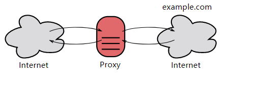
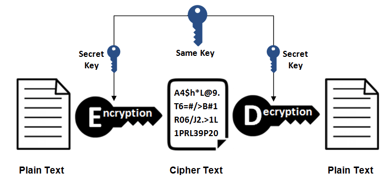
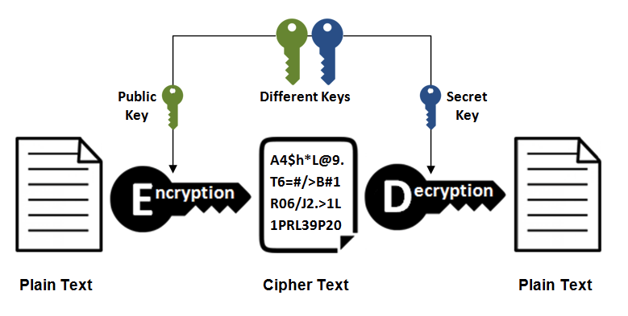
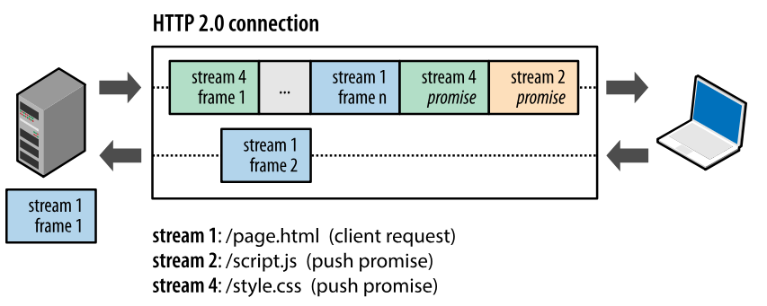

[🍉 點擊訂閱面試進階專欄 ](https://xiaozhuanlan.com/CyC2018)
<!-- GFM-TOC -->
* [一 、基礎概念](#一-基礎概念)
    * [URI](#uri)
    * [請求和響應報文](#請求和響應報文)
* [二、HTTP 方法](#二http-方法)
    * [GET](#get)
    * [HEAD](#head)
    * [POST](#post)
    * [PUT](#put)
    * [PATCH](#patch)
    * [DELETE](#delete)
    * [OPTIONS](#options)
    * [CONNECT](#connect)
    * [TRACE](#trace)
* [三、HTTP 狀態碼](#三http-狀態碼)
    * [1XX 信息](#1xx-信息)
    * [2XX 成功](#2xx-成功)
    * [3XX 重定向](#3xx-重定向)
    * [4XX 客戶端錯誤](#4xx-客戶端錯誤)
    * [5XX 服務器錯誤](#5xx-服務器錯誤)
* [四、HTTP 首部](#四http-首部)
    * [通用首部字段](#通用首部字段)
    * [請求首部字段](#請求首部字段)
    * [響應首部字段](#響應首部字段)
    * [實體首部字段](#實體首部字段)
* [五、具體應用](#五具體應用)
    * [連接管理](#連接管理)
    * [Cookie](#cookie)
    * [緩存](#緩存)
    * [內容協商](#內容協商)
    * [內容編碼](#內容編碼)
    * [範圍請求](#範圍請求)
    * [分塊傳輸編碼](#分塊傳輸編碼)
    * [多部分對象集合](#多部分對象集合)
    * [虛擬主機](#虛擬主機)
    * [通信數據轉發](#通信數據轉發)
* [六、HTTPs](#六https)
    * [加密](#加密)
    * [認證](#認證)
    * [完整性保護](#完整性保護)
    * [HTTPs 的缺點](#https-的缺點)
* [七、HTTP/2.0](#七http20)
    * [HTTP/1.x 缺陷](#http1x-缺陷)
    * [二進制分幀層](#二進制分幀層)
    * [服務端推送](#服務端推送)
    * [首部壓縮](#首部壓縮)
* [八、HTTP/1.1 新特性](#八http11-新特性)
* [九、GET 和 POST 比較](#九get-和-post-比較)
    * [作用](#作用)
    * [參數](#參數)
    * [安全](#安全)
    * [冪等性](#冪等性)
    * [可緩存](#可緩存)
    * [XMLHttpRequest](#xmlhttprequest)
* [參考資料](#參考資料)
<!-- GFM-TOC -->


# 一 、基礎概念

## URI

URI 包含 URL 和 URN。

- URI（Uniform Resource Identifier，統一資源標識符）
- URL（Uniform Resource Locator，統一資源定位符）
- URN（Uniform Resource Name，統一資源名稱）

<div align="center">  </div><br>

## 請求和響應報文

### 1. 請求報文

<div align="center">  </div><br>

### 2. 響應報文

<div align="center">  </div><br>

# 二、HTTP 方法

客戶端發送的  **請求報文**  第一行為請求行，包含了方法字段。

## GET

> 獲取資源

當前網絡請求中，絕大部分使用的是 GET 方法。

## HEAD

> 獲取報文首部

和 GET 方法類似，但是不返回報文實體主體部分。

主要用於確認 URL 的有效性以及資源更新的日期時間等。

## POST

> 傳輸實體主體

POST 主要用來傳輸數據，而 GET 主要用來獲取資源。

更多 POST 與 GET 的比較請見第九章。

## PUT

> 上傳文件

由於自身不帶驗證機制，任何人都可以上傳文件，因此存在安全性問題，一般不使用該方法。

```html
PUT /new.html HTTP/1.1
Host: example.com
Content-type: text/html
Content-length: 16

<p>New File</p>
```

## PATCH

> 對資源進行部分修改

PUT 也可以用於修改資源，但是只能完全替代原始資源，PATCH 允許部分修改。

```html
PATCH /file.txt HTTP/1.1
Host: www.example.com
Content-Type: application/example
If-Match: "e0023aa4e"
Content-Length: 100

[description of changes]
```

## DELETE

> 刪除文件

與 PUT 功能相反，並且同樣不帶驗證機制。

```html
DELETE /file.html HTTP/1.1
```

## OPTIONS

> 查詢支持的方法

查詢指定的 URL 能夠支持的方法。

會返回 `Allow: GET, POST, HEAD, OPTIONS` 這樣的內容。

## CONNECT

> 要求在與代理服務器通信時建立隧道

使用 SSL（Secure Sockets Layer，安全套接層）和 TLS（Transport Layer Security，傳輸層安全）協議把通信內容加密後經網絡隧道傳輸。

```html
CONNECT www.example.com:443 HTTP/1.1
```

<div align="center">  </div><br>

## TRACE

> 追蹤路徑

服務器會將通信路徑返回給客戶端。

發送請求時，在 Max-Forwards 首部字段中填入數值，每經過一個服務器就會減 1，當數值為 0 時就停止傳輸。

通常不會使用 TRACE，並且它容易受到 XST 攻擊（Cross-Site Tracing，跨站追蹤）。

# 三、HTTP 狀態碼

服務器返回的  **響應報文**  中第一行為狀態行，包含了狀態碼以及原因短語，用來告知客戶端請求的結果。

| 狀態碼 | 類別 | 含義 |
| :---: | :---: | :---: |
| 1XX | Informational（信息性狀態碼） | 接收的請求正在處理 |
| 2XX | Success（成功狀態碼） | 請求正常處理完畢 |
| 3XX | Redirection（重定向狀態碼） | 需要進行附加操作以完成請求 |
| 4XX | Client Error（客戶端錯誤狀態碼） | 服務器無法處理請求 |
| 5XX | Server Error（服務器錯誤狀態碼） | 服務器處理請求出錯 |

## 1XX 信息

-  **100 Continue** ：表明到目前為止都很正常，客戶端可以繼續發送請求或者忽略這個響應。

## 2XX 成功

-  **200 OK** 

-  **204 No Content** ：請求已經成功處理，但是返回的響應報文不包含實體的主體部分。一般在只需要從客戶端往服務器發送信息，而不需要返回數據時使用。

-  **206 Partial Content** ：表示客戶端進行了範圍請求，響應報文包含由 Content-Range 指定範圍的實體內容。

## 3XX 重定向

-  **301 Moved Permanently** ：永久性重定向

-  **302 Found** ：臨時性重定向

-  **303 See Other** ：和 302 有著相同的功能，但是 303 明確要求客戶端應該采用 GET 方法獲取資源。

- 註：雖然 HTTP 協議規定 301、302 狀態下重定向時不允許把 POST 方法改成 GET 方法，但是大多數瀏覽器都會在 301、302 和 303 狀態下的重定向把 POST 方法改成 GET 方法。

-  **304 Not Modified** ：如果請求報文首部包含一些條件，例如：If-Match，If-Modified-Since，If-None-Match，If-Range，If-Unmodified-Since，如果不滿足條件，則服務器會返回 304 狀態碼。

-  **307 Temporary Redirect** ：臨時重定向，與 302 的含義類似，但是 307 要求瀏覽器不會把重定向請求的 POST 方法改成 GET 方法。

## 4XX 客戶端錯誤

-  **400 Bad Request** ：請求報文中存在語法錯誤。

-  **401 Unauthorized** ：該狀態碼表示發送的請求需要有認證信息（BASIC 認證、DIGEST 認證）。如果之前已進行過一次請求，則表示用戶認證失敗。

-  **403 Forbidden** ：請求被拒絕。

-  **404 Not Found** 

## 5XX 服務器錯誤

-  **500 Internal Server Error** ：服務器正在執行請求時發生錯誤。

-  **503 Service Unavailable** ：服務器暫時處於超負載或正在進行停機維護，現在無法處理請求。

# 四、HTTP 首部

有 4 種類型的首部字段：通用首部字段、請求首部字段、響應首部字段和實體首部字段。

各種首部字段及其含義如下（不需要全記，僅供查閱）：

## 通用首部字段

| 首部字段名 | 說明 |
| :--: | :--: |
| Cache-Control | 控制緩存的行為 |
| Connection | 控制不再轉發給代理的首部字段、管理持久連接|
| Date | 創建報文的日期時間 |
| Pragma | 報文指令 |
| Trailer | 報文末端的首部一覽 |
| Transfer-Encoding | 指定報文主體的傳輸編碼方式 |
| Upgrade | 升級為其他協議 |
| Via | 代理服務器的相關信息 |
| Warning | 錯誤通知 |

## 請求首部字段

| 首部字段名 | 說明 |
| :--: | :--: |
| Accept | 用戶代理可處理的媒體類型 |
| Accept-Charset | 優先的字符集 |
| Accept-Encoding | 優先的內容編碼 |
| Accept-Language | 優先的語言（自然語言） |
| Authorization | Web 認證信息 |
| Expect | 期待服務器的特定行為 |
| From | 用戶的電子郵箱地址 |
| Host | 請求資源所在服務器 |
| If-Match | 比較實體標記（ETag） |
| If-Modified-Since | 比較資源的更新時間 |
| If-None-Match | 比較實體標記（與 If-Match 相反） |
| If-Range | 資源未更新時發送實體 Byte 的範圍請求 |
| If-Unmodified-Since | 比較資源的更新時間（與 If-Modified-Since 相反） |
| Max-Forwards | 最大傳輸逐跳數 |
| Proxy-Authorization | 代理服務器要求客戶端的認證信息 |
| Range | 實體的字節範圍請求 |
| Referer | 對請求中 URI 的原始獲取方 |
| TE | 傳輸編碼的優先級 |
| User-Agent | HTTP 客戶端程序的信息 |

## 響應首部字段

| 首部字段名 | 說明 |
| :--: | :--: |
| Accept-Ranges | 是否接受字節範圍請求 |
| Age | 推算資源創建經過時間 |
| ETag | 資源的匹配信息 |
| Location | 令客戶端重定向至指定 URI |
| Proxy-Authenticate | 代理服務器對客戶端的認證信息 |
| Retry-After | 對再次發起請求的時機要求 |
| Server | HTTP 服務器的安裝信息 |
| Vary | 代理服務器緩存的管理信息 |
| WWW-Authenticate | 服務器對客戶端的認證信息 |

## 實體首部字段

| 首部字段名 | 說明 |
| :--: | :--: |
| Allow | 資源可支持的 HTTP 方法 |
| Content-Encoding | 實體主體適用的編碼方式 |
| Content-Language | 實體主體的自然語言 |
| Content-Length | 實體主體的大小 |
| Content-Location | 替代對應資源的 URI |
| Content-MD5 | 實體主體的報文摘要 |
| Content-Range | 實體主體的位置範圍 |
| Content-Type | 實體主體的媒體類型 |
| Expires | 實體主體過期的日期時間 |
| Last-Modified | 資源的最後修改日期時間 |

# 五、具體應用

## 連接管理

<div align="center">  </div><br>

### 1. 短連接與長連接

當瀏覽器訪問一個包含多張圖片的 HTML 頁面時，除了請求訪問 HTML 頁面資源，還會請求圖片資源。如果每進行一次 HTTP 通信就要新建一個 TCP 連接，那麽開銷會很大。

長連接只需要建立一次 TCP 連接就能進行多次 HTTP 通信。

- 從 HTTP/1.1 開始默認是長連接的，如果要斷開連接，需要由客戶端或者服務器端提出斷開，使用 `Connection : close`；
- 在 HTTP/1.1 之前默認是短連接的，如果需要使用長連接，則使用 `Connection : Keep-Alive`。

### 2. 流水線

默認情況下，HTTP 請求是按順序發出的，下一個請求只有在當前請求收到響應之後才會被發出。由於會受到網絡延遲和帶寬的限制，在下一個請求被發送到服務器之前，可能需要等待很長時間。

流水線是在同一條長連接上發出連續的請求，而不用等待響應返回，這樣可以避免連接延遲。

## Cookie

HTTP 協議是無狀態的，主要是為了讓 HTTP 協議盡可能簡單，使得它能夠處理大量事務。HTTP/1.1 引入 Cookie 來保存狀態信息。

Cookie 是服務器發送到用戶瀏覽器並保存在本地的一小塊數據，它會在瀏覽器之後向同一服務器再次發起請求時被攜帶上，用於告知服務端兩個請求是否來自同一瀏覽器。由於之後每次請求都會需要攜帶 Cookie 數據，因此會帶來額外的性能開銷（尤其是在移動環境下）。

Cookie 曾一度用於客戶端數據的存儲，因為當時並沒有其它合適的存儲辦法而作為唯一的存儲手段，但現在隨著現代瀏覽器開始支持各種各樣的存儲方式，Cookie 漸漸被淘汰。新的瀏覽器 API 已經允許開發者直接將數據存儲到本地，如使用 Web storage API（本地存儲和會話存儲）或 IndexedDB。

### 1. 用途

- 會話狀態管理（如用戶登錄狀態、購物車、遊戲分數或其它需要記錄的信息）
- 個性化設置（如用戶自定義設置、主題等）
- 瀏覽器行為跟蹤（如跟蹤分析用戶行為等）

### 2. 創建過程

服務器發送的響應報文包含 Set-Cookie 首部字段，客戶端得到響應報文後把 Cookie 內容保存到瀏覽器中。

```html
HTTP/1.0 200 OK
Content-type: text/html
Set-Cookie: yummy_cookie=choco
Set-Cookie: tasty_cookie=strawberry

[page content]
```

客戶端之後對同一個服務器發送請求時，會從瀏覽器中取出 Cookie 信息並通過 Cookie 請求首部字段發送給服務器。

```html
GET /sample_page.html HTTP/1.1
Host: www.example.org
Cookie: yummy_cookie=choco; tasty_cookie=strawberry
```

### 3. 分類

- 會話期 Cookie：瀏覽器關閉之後它會被自動刪除，也就是說它僅在會話期內有效。
- 持久性 Cookie：指定一個特定的過期時間（Expires）或有效期（max-age）之後就成為了持久性的 Cookie。

```html
Set-Cookie: id=a3fWa; Expires=Wed, 21 Oct 2015 07:28:00 GMT;
```

### 4. 作用域

Domain 標識指定了哪些主機可以接受 Cookie。如果不指定，默認為當前文檔的主機（不包含子域名）。如果指定了 Domain，則一般包含子域名。例如，如果設置 Domain=mozilla.org，則 Cookie 也包含在子域名中（如 developer.mozilla.org）。

Path 標識指定了主機下的哪些路徑可以接受 Cookie（該 URL 路徑必須存在於請求 URL 中）。以字符 %x2F ("/") 作為路徑分隔符，子路徑也會被匹配。例如，設置 Path=/docs，則以下地址都會匹配：

- /docs
- /docs/Web/
- /docs/Web/HTTP

### 5. JavaScript

通過 `document.cookie` 屬性可創建新的 Cookie，也可通過該屬性訪問非 HttpOnly 標記的 Cookie。

```html
document.cookie = "yummy_cookie=choco";
document.cookie = "tasty_cookie=strawberry";
console.log(document.cookie);
```

### 6. HttpOnly

標記為 HttpOnly 的 Cookie 不能被 JavaScript 腳本調用。跨站腳本攻擊 (XSS) 常常使用 JavaScript 的 `document.cookie` API 竊取用戶的 Cookie 信息，因此使用 HttpOnly 標記可以在一定程度上避免 XSS 攻擊。

```html
Set-Cookie: id=a3fWa; Expires=Wed, 21 Oct 2015 07:28:00 GMT; Secure; HttpOnly
```

### 7. Secure

標記為 Secure 的 Cookie 只能通過被 HTTPS 協議加密過的請求發送給服務端。但即便設置了 Secure 標記，敏感信息也不應該通過 Cookie 傳輸，因為 Cookie 有其固有的不安全性，Secure 標記也無法提供確實的安全保障。

### 8. Session

除了可以將用戶信息通過 Cookie 存儲在用戶瀏覽器中，也可以利用 Session 存儲在服務器端，存儲在服務器端的信息更加安全。

Session 可以存儲在服務器上的文件、數據庫或者內存中。也可以將 Session 存儲在 Redis 這種內存型數據庫中，效率會更高。

使用 Session 維護用戶登錄狀態的過程如下：

- 用戶進行登錄時，用戶提交包含用戶名和密碼的表單，放入 HTTP 請求報文中；
- 服務器驗證該用戶名和密碼，如果正確則把用戶信息存儲到 Redis 中，它在 Redis 中的 Key 稱為 Session ID；
- 服務器返回的響應報文的 Set-Cookie 首部字段包含了這個 Session ID，客戶端收到響應報文之後將該 Cookie 值存入瀏覽器中；
- 客戶端之後對同一個服務器進行請求時會包含該 Cookie 值，服務器收到之後提取出 Session ID，從 Redis 中取出用戶信息，繼續之前的業務操作。

應該註意 Session ID 的安全性問題，不能讓它被惡意攻擊者輕易獲取，那麽就不能產生一個容易被猜到的 Session ID 值。此外，還需要經常重新生成 Session ID。在對安全性要求極高的場景下，例如轉賬等操作，除了使用 Session 管理用戶狀態之外，還需要對用戶進行重新驗證，比如重新輸入密碼，或者使用短信驗證碼等方式。

### 9. 瀏覽器禁用 Cookie

此時無法使用 Cookie 來保存用戶信息，只能使用 Session。除此之外，不能再將 Session ID 存放到 Cookie 中，而是使用 URL 重寫技術，將 Session ID 作為 URL 的參數進行傳遞。

### 10. Cookie 與 Session 選擇

- Cookie 只能存儲 ASCII 碼字符串，而 Session 則可以存取任何類型的數據，因此在考慮數據覆雜性時首選 Session；
- Cookie 存儲在瀏覽器中，容易被惡意查看。如果非要將一些隱私數據存在 Cookie 中，可以將 Cookie 值進行加密，然後在服務器進行解密；
- 對於大型網站，如果用戶所有的信息都存儲在 Session 中，那麽開銷是非常大的，因此不建議將所有的用戶信息都存儲到 Session 中。

## 緩存

### 1. 優點

- 緩解服務器壓力；
- 降低客戶端獲取資源的延遲：緩存通常位於內存中，讀取緩存的速度更快。並且緩存在地理位置上也有可能比源服務器來得近，例如瀏覽器緩存。

### 2. 實現方法

- 讓代理服務器進行緩存；
- 讓客戶端瀏覽器進行緩存。

### 3. Cache-Control

HTTP/1.1 通過 Cache-Control 首部字段來控制緩存。

**3.1 禁止進行緩存** 

no-store 指令規定不能對請求或響應的任何一部分進行緩存。

```html
Cache-Control: no-store
```

**3.2 強制確認緩存** 

no-cache 指令規定緩存服務器需要先向源服務器驗證緩存資源的有效性，只有當緩存資源有效才將能使用該緩存對客戶端的請求進行響應。

```html
Cache-Control: no-cache
```

**3.3 私有緩存和公共緩存** 

private 指令規定了將資源作為私有緩存，只能被單獨用戶所使用，一般存儲在用戶瀏覽器中。

```html
Cache-Control: private
```

public 指令規定了將資源作為公共緩存，可以被多個用戶所使用，一般存儲在代理服務器中。

```html
Cache-Control: public
```

**3.4 緩存過期機制** 

max-age 指令出現在請求報文中，並且緩存資源的緩存時間小於該指令指定的時間，那麽就能接受該緩存。

max-age 指令出現在響應報文中，表示緩存資源在緩存服務器中保存的時間。

```html
Cache-Control: max-age=31536000
```

Expires 首部字段也可以用於告知緩存服務器該資源什麽時候會過期。

```html
Expires: Wed, 04 Jul 2012 08:26:05 GMT
```

- 在 HTTP/1.1 中，會優先處理 max-age 指令；
- 在 HTTP/1.0 中，max-age 指令會被忽略掉。

### 4. 緩存驗證

需要先了解 ETag 首部字段的含義，它是資源的唯一標識。URL 不能唯一表示資源，例如 `http://www.google.com/` 有中文和英文兩個資源，只有 ETag 才能對這兩個資源進行唯一標識。

```html
ETag: "82e22293907ce725faf67773957acd12"
```

可以將緩存資源的 ETag 值放入 If-None-Match 首部，服務器收到該請求後，判斷緩存資源的 ETag 值和資源的最新 ETag 值是否一致，如果一致則表示緩存資源有效，返回 304 Not Modified。

```html
If-None-Match: "82e22293907ce725faf67773957acd12"
```

Last-Modified 首部字段也可以用於緩存驗證，它包含在源服務器發送的響應報文中，指示源服務器對資源的最後修改時間。但是它是一種弱校驗器，因為只能精確到一秒，所以它通常作為 ETag 的備用方案。如果響應首部字段裏含有這個信息，客戶端可以在後續的請求中帶上 If-Modified-Since 來驗證緩存。服務器只在所請求的資源在給定的日期時間之後對內容進行過修改的情況下才會將資源返回，狀態碼為 200 OK。如果請求的資源從那時起未經修改，那麽返回一個不帶有消息主體的 304 Not Modified 響應。

```html
Last-Modified: Wed, 21 Oct 2015 07:28:00 GMT
```

```html
If-Modified-Since: Wed, 21 Oct 2015 07:28:00 GMT
```

## 內容協商

通過內容協商返回最合適的內容，例如根據瀏覽器的默認語言選擇返回中文界面還是英文界面。

### 1. 類型

**1.1 服務端驅動型** 

客戶端設置特定的 HTTP 首部字段，例如 Accept、Accept-Charset、Accept-Encoding、Accept-Language，服務器根據這些字段返回特定的資源。

它存在以下問題：

- 服務器很難知道客戶端瀏覽器的全部信息；
- 客戶端提供的信息相當冗長（HTTP/2 協議的首部壓縮機制緩解了這個問題），並且存在隱私風險（HTTP 指紋識別技術）；
- 給定的資源需要返回不同的展現形式，共享緩存的效率會降低，而服務器端的實現會越來越覆雜。

**1.2 代理驅動型** 

服務器返回 300 Multiple Choices 或者 406 Not Acceptable，客戶端從中選出最合適的那個資源。

### 2. Vary

```html
Vary: Accept-Language
```

在使用內容協商的情況下，只有當緩存服務器中的緩存滿足內容協商條件時，才能使用該緩存，否則應該向源服務器請求該資源。

例如，一個客戶端發送了一個包含 Accept-Language 首部字段的請求之後，源服務器返回的響應包含 `Vary: Accept-Language` 內容，緩存服務器對這個響應進行緩存之後，在客戶端下一次訪問同一個 URL 資源，並且 Accept-Language 與緩存中的對應的值相同時才會返回該緩存。

## 內容編碼

內容編碼將實體主體進行壓縮，從而減少傳輸的數據量。

常用的內容編碼有：gzip、compress、deflate、identity。

瀏覽器發送 Accept-Encoding 首部，其中包含有它所支持的壓縮算法，以及各自的優先級。服務器則從中選擇一種，使用該算法對響應的消息主體進行壓縮，並且發送 Content-Encoding 首部來告知瀏覽器它選擇了哪一種算法。由於該內容協商過程是基於編碼類型來選擇資源的展現形式的，在響應的 Vary 首部至少要包含 Content-Encoding。

## 範圍請求

如果網絡出現中斷，服務器只發送了一部分數據，範圍請求可以使得客戶端只請求服務器未發送的那部分數據，從而避免服務器重新發送所有數據。

### 1. Range

在請求報文中添加 Range 首部字段指定請求的範圍。

```html
GET /z4d4kWk.jpg HTTP/1.1
Host: i.imgur.com
Range: bytes=0-1023
```

請求成功的話服務器返回的響應包含 206 Partial Content 狀態碼。

```html
HTTP/1.1 206 Partial Content
Content-Range: bytes 0-1023/146515
Content-Length: 1024
...
(binary content)
```

### 2. Accept-Ranges

響應首部字段 Accept-Ranges 用於告知客戶端是否能處理範圍請求，可以處理使用 bytes，否則使用 none。

```html
Accept-Ranges: bytes
```

### 3. 響應狀態碼

- 在請求成功的情況下，服務器會返回 206 Partial Content 狀態碼。
- 在請求的範圍越界的情況下，服務器會返回 416 Requested Range Not Satisfiable 狀態碼。
- 在不支持範圍請求的情況下，服務器會返回 200 OK 狀態碼。

## 分塊傳輸編碼

Chunked Transfer Coding，可以把數據分割成多塊，讓瀏覽器逐步顯示頁面。

## 多部分對象集合

一份報文主體內可含有多種類型的實體同時發送，每個部分之間用 boundary 字段定義的分隔符進行分隔，每個部分都可以有首部字段。

例如，上傳多個表單時可以使用如下方式：

```html
Content-Type: multipart/form-data; boundary=AaB03x

--AaB03x
Content-Disposition: form-data; name="submit-name"

Larry
--AaB03x
Content-Disposition: form-data; name="files"; filename="file1.txt"
Content-Type: text/plain

... contents of file1.txt ...
--AaB03x--
```

## 虛擬主機

HTTP/1.1 使用虛擬主機技術，使得一台服務器擁有多個域名，並且在邏輯上可以看成多個服務器。

## 通信數據轉發

### 1. 代理

代理服務器接受客戶端的請求，並且轉發給其它服務器。

使用代理的主要目的是：

- 緩存
- 負載均衡
- 網絡訪問控制
- 訪問日志記錄

代理服務器分為正向代理和反向代理兩種：

- 用戶察覺得到正向代理的存在。

<div align="center">  </div><br>

- 而反向代理一般位於內部網絡中，用戶察覺不到。

<div align="center">  </div><br>

### 2. 網關

與代理服務器不同的是，網關服務器會將 HTTP 轉化為其它協議進行通信，從而請求其它非 HTTP 服務器的服務。

### 3. 隧道

使用 SSL 等加密手段，在客戶端和服務器之間建立一條安全的通信線路。

# 六、HTTPs

HTTP 有以下安全性問題：

- 使用明文進行通信，內容可能會被竊聽；
- 不驗證通信方的身份，通信方的身份有可能遭遇偽裝；
- 無法證明報文的完整性，報文有可能遭篡改。

HTTPs 並不是新協議，而是讓 HTTP 先和 SSL（Secure Sockets Layer）通信，再由 SSL 和 TCP 通信，也就是說 HTTPs 使用了隧道進行通信。

通過使用 SSL，HTTPs 具有了加密（防竊聽）、認證（防偽裝）和完整性保護（防篡改）。

<div align="center">  </div><br>

## 加密

### 1. 對稱密鑰加密

對稱密鑰加密（Symmetric-Key Encryption），加密和解密使用同一密鑰。

- 優點：運算速度快；
- 缺點：無法安全地將密鑰傳輸給通信方。

<div align="center">  </div><br>

### 2.非對稱密鑰加密

非對稱密鑰加密，又稱公開密鑰加密（Public-Key Encryption），加密和解密使用不同的密鑰。

公開密鑰所有人都可以獲得，通信發送方獲得接收方的公開密鑰之後，就可以使用公開密鑰進行加密，接收方收到通信內容後使用私有密鑰解密。

非對稱密鑰除了用來加密，還可以用來進行簽名。因為私有密鑰無法被其他人獲取，因此通信發送方使用其私有密鑰進行簽名，通信接收方使用發送方的公開密鑰對簽名進行解密，就能判斷這個簽名是否正確。

- 優點：可以更安全地將公開密鑰傳輸給通信發送方；
- 缺點：運算速度慢。

<div align="center">  </div><br>

### 3. HTTPs 采用的加密方式

HTTPs 采用混合的加密機制，使用非對稱密鑰加密用於傳輸對稱密鑰來保證傳輸過程的安全性，之後使用對稱密鑰加密進行通信來保證通信過程的效率。（下圖中的 Session Key 就是對稱密鑰）

<div align="center">  </div><br>

## 認證

通過使用  **證書**  來對通信方進行認證。

數字證書認證機構（CA，Certificate Authority）是客戶端與服務器雙方都可信賴的第三方機構。

服務器的運營人員向 CA 提出公開密鑰的申請，CA 在判明提出申請者的身份之後，會對已申請的公開密鑰做數字簽名，然後分配這個已簽名的公開密鑰，並將該公開密鑰放入公開密鑰證書後綁定在一起。

進行 HTTPs 通信時，服務器會把證書發送給客戶端。客戶端取得其中的公開密鑰之後，先使用數字簽名進行驗證，如果驗證通過，就可以開始通信了。

<div align="center">  </div><br>

## 完整性保護

SSL 提供報文摘要功能來進行完整性保護。

HTTP 也提供了 MD5 報文摘要功能，但不是安全的。例如報文內容被篡改之後，同時重新計算 MD5 的值，通信接收方是無法意識到發生了篡改。

HTTPs 的報文摘要功能之所以安全，是因為它結合了加密和認證這兩個操作。試想一下，加密之後的報文，遭到篡改之後，也很難重新計算報文摘要，因為無法輕易獲取明文。

## HTTPs 的缺點

- 因為需要進行加密解密等過程，因此速度會更慢；
- 需要支付證書授權的高額費用。

# 七、HTTP/2.0

## HTTP/1.x 缺陷

HTTP/1.x 實現簡單是以犧牲性能為代價的：

- 客戶端需要使用多個連接才能實現並發和縮短延遲；
- 不會壓縮請求和響應首部，從而導致不必要的網絡流量；
- 不支持有效的資源優先級，致使底層 TCP 連接的利用率低下。

## 二進制分幀層

HTTP/2.0 將報文分成 HEADERS 幀和 DATA 幀，它們都是二進制格式的。

<div align="center">  </div><br>

在通信過程中，只會有一個 TCP 連接存在，它承載了任意數量的雙向數據流（Stream）。

- 一個數據流（Stream）都有一個唯一標識符和可選的優先級信息，用於承載雙向信息。
- 消息（Message）是與邏輯請求或響應對應的完整的一系列幀。
- 幀（Frame）是最小的通信單位，來自不同數據流的幀可以交錯發送，然後再根據每個幀頭的數據流標識符重新組裝。

<div align="center">  </div><br>

## 服務端推送

HTTP/2.0 在客戶端請求一個資源時，會把相關的資源一起發送給客戶端，客戶端就不需要再次發起請求了。例如客戶端請求 page.html 頁面，服務端就把 script.js 和 style.css 等與之相關的資源一起發給客戶端。

<div align="center">  </div><br>

## 首部壓縮

HTTP/1.1 的首部帶有大量信息，而且每次都要重覆發送。

HTTP/2.0 要求客戶端和服務器同時維護和更新一個包含之前見過的首部字段表，從而避免了重覆傳輸。

不僅如此，HTTP/2.0 也使用 Huffman 編碼對首部字段進行壓縮。

<div align="center">  </div><br>

# 八、HTTP/1.1 新特性

詳細內容請見上文

- 默認是長連接
- 支持流水線
- 支持同時打開多個 TCP 連接
- 支持虛擬主機
- 新增狀態碼 100
- 支持分塊傳輸編碼
- 新增緩存處理指令 max-age

# 九、GET 和 POST 比較

## 作用

GET 用於獲取資源，而 POST 用於傳輸實體主體。

## 參數

GET 和 POST 的請求都能使用額外的參數，但是 GET 的參數是以查詢字符串出現在 URL 中，而 POST 的參數存儲在實體主體中。不能因為 POST 參數存儲在實體主體中就認為它的安全性更高，因為照樣可以通過一些抓包工具（Fiddler）查看。

因為 URL 只支持 ASCII 碼，因此 GET 的參數中如果存在中文等字符就需要先進行編碼。例如 `中文` 會轉換為 `%E4%B8%AD%E6%96%87`，而空格會轉換為 `%20`。POST 參考支持標準字符集。

```
GET /test/demo_form.asp?name1=value1&name2=value2 HTTP/1.1
```

```
POST /test/demo_form.asp HTTP/1.1
Host: w3schools.com
name1=value1&name2=value2
```

## 安全

安全的 HTTP 方法不會改變服務器狀態，也就是說它只是可讀的。

GET 方法是安全的，而 POST 卻不是，因為 POST 的目的是傳送實體主體內容，這個內容可能是用戶上傳的表單數據，上傳成功之後，服務器可能把這個數據存儲到數據庫中，因此狀態也就發生了改變。

安全的方法除了 GET 之外還有：HEAD、OPTIONS。

不安全的方法除了 POST 之外還有 PUT、DELETE。

## 冪等性

冪等的 HTTP 方法，同樣的請求被執行一次與連續執行多次的效果是一樣的，服務器的狀態也是一樣的。換句話說就是，冪等方法不應該具有副作用（統計用途除外）。

所有的安全方法也都是冪等的。

在正確實現的條件下，GET，HEAD，PUT 和 DELETE 等方法都是冪等的，而 POST 方法不是。

GET /pageX HTTP/1.1 是冪等的，連續調用多次，客戶端接收到的結果都是一樣的：

```
GET /pageX HTTP/1.1
GET /pageX HTTP/1.1
GET /pageX HTTP/1.1
GET /pageX HTTP/1.1
```

POST /add_row HTTP/1.1 不是冪等的，如果調用多次，就會增加多行記錄：

```
POST /add_row HTTP/1.1   -> Adds a 1nd row
POST /add_row HTTP/1.1   -> Adds a 2nd row
POST /add_row HTTP/1.1   -> Adds a 3rd row
```

DELETE /idX/delete HTTP/1.1 是冪等的，即便不同的請求接收到的狀態碼不一樣：

```
DELETE /idX/delete HTTP/1.1   -> Returns 200 if idX exists
DELETE /idX/delete HTTP/1.1   -> Returns 404 as it just got deleted
DELETE /idX/delete HTTP/1.1   -> Returns 404
```

## 可緩存

如果要對響應進行緩存，需要滿足以下條件：

- 請求報文的 HTTP 方法本身是可緩存的，包括 GET 和 HEAD，但是 PUT 和 DELETE 不可緩存，POST 在多數情況下不可緩存的。
- 響應報文的狀態碼是可緩存的，包括：200, 203, 204, 206, 300, 301, 404, 405, 410, 414, and 501。
- 響應報文的 Cache-Control 首部字段沒有指定不進行緩存。

## XMLHttpRequest

為了闡述 POST 和 GET 的另一個區別，需要先了解 XMLHttpRequest：

> XMLHttpRequest 是一個 API，它為客戶端提供了在客戶端和服務器之間傳輸數據的功能。它提供了一個通過 URL 來獲取數據的簡單方式，並且不會使整個頁面刷新。這使得網頁只更新一部分頁面而不會打擾到用戶。XMLHttpRequest 在 AJAX 中被大量使用。

- 在使用 XMLHttpRequest 的 POST 方法時，瀏覽器會先發送 Header 再發送 Data。但並不是所有瀏覽器會這麽做，例如火狐就不會。
- 而 GET 方法 Header 和 Data 會一起發送。

# 參考資料

- 上野宣. 圖解 HTTP[M]. 人民郵電出版社, 2014.
- [MDN : HTTP](https://developer.mozilla.org/en-US/docs/Web/HTTP)
- [HTTP/2 簡介](https://developers.google.com/web/fundamentals/performance/http2/?hl=zh-cn)
- [htmlspecialchars](http://php.net/manual/zh/function.htmlspecialchars.php)
- [Difference between file URI and URL in java](http://java2db.com/java-io/how-to-get-and-the-difference-between-file-uri-and-url-in-java)
- [How to Fix SQL Injection Using Java PreparedStatement & CallableStatement](https://software-security.sans.org/developer-how-to/fix-sql-injection-in-java-using-prepared-callable-statement)
- [淺談 HTTP 中 Get 與 Post 的區別](https://www.cnblogs.com/hyddd/archive/2009/03/31/1426026.html)
- [Are http:// and www really necessary?](https://www.webdancers.com/are-http-and-www-necesary/)
- [HTTP (HyperText Transfer Protocol)](https://www.ntu.edu.sg/home/ehchua/programming/webprogramming/HTTP_Basics.html)
- [Web-VPN: Secure Proxies with SPDY & Chrome](https://www.igvita.com/2011/12/01/web-vpn-secure-proxies-with-spdy-chrome/)
- [File:HTTP persistent connection.svg](http://en.wikipedia.org/wiki/File:HTTP_persistent_connection.svg)
- [Proxy server](https://en.wikipedia.org/wiki/Proxy_server)
- [What Is This HTTPS/SSL Thing And Why Should You Care?](https://www.x-cart.com/blog/what-is-https-and-ssl.html)
- [What is SSL Offloading?](https://securebox.comodo.com/ssl-sniffing/ssl-offloading/)
- [Sun Directory Server Enterprise Edition 7.0 Reference - Key Encryption](https://docs.oracle.com/cd/E19424-01/820-4811/6ng8i26bn/index.html)
- [An Introduction to Mutual SSL Authentication](https://www.codeproject.com/Articles/326574/An-Introduction-to-Mutual-SSL-Authentication)
- [The Difference Between URLs and URIs](https://danielmiessler.com/study/url-uri/)
- [Cookie 與 Session 的區別](https://juejin.im/entry/5766c29d6be3ff006a31b84e#comment)
- [COOKIE 和 SESSION 有什麽區別](https://www.zhihu.com/question/19786827)
- [Cookie/Session 的機制與安全](https://harttle.land/2015/08/10/cookie-session.html)
- [HTTPS 證書原理](https://shijianan.com/2017/06/11/https/)
- [What is the difference between a URI, a URL and a URN?](https://stackoverflow.com/questions/176264/what-is-the-difference-between-a-uri-a-url-and-a-urn)
- [XMLHttpRequest](https://developer.mozilla.org/zh-CN/docs/Web/API/XMLHttpRequest)
- [XMLHttpRequest (XHR) Uses Multiple Packets for HTTP POST?](https://blog.josephscott.org/2009/08/27/xmlhttprequest-xhr-uses-multiple-packets-for-http-post/)
- [Symmetric vs. Asymmetric Encryption – What are differences?](https://www.ssl2buy.com/wiki/symmetric-vs-asymmetric-encryption-what-are-differences)
- [Web 性能優化與 HTTP/2](https://www.kancloud.cn/digest/web-performance-http2)
- [HTTP/2 簡介](https://developers.google.com/web/fundamentals/performance/http2/?hl=zh-cn)
