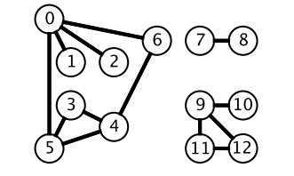
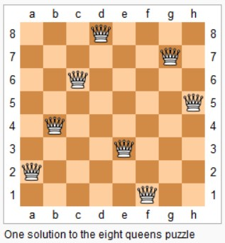
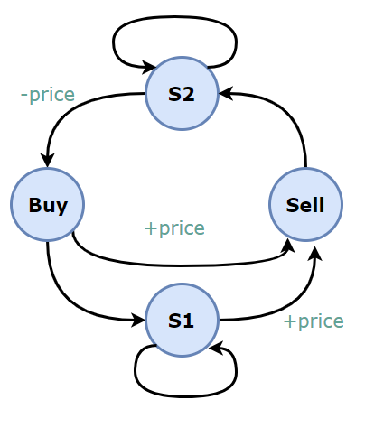

* [點擊閱讀面試進階指南 ](https://github.com/CyC2018/Backend-Interview-Guide)
<!-- GFM-TOC -->
* [算法思想](#算法思想)
    * [雙指針](#雙指針)
    * [排序](#排序)
        * [快速選擇](#快速選擇)
        * [堆排序](#堆排序)
        * [桶排序](#桶排序)
        * [荷蘭國旗問題](#荷蘭國旗問題)
    * [貪心思想](#貪心思想)
    * [二分查找](#二分查找)
    * [分治](#分治)
    * [搜索](#搜索)
        * [BFS](#bfs)
        * [DFS](#dfs)
        * [Backtracking](#backtracking)
    * [動態規劃](#動態規劃)
        * [斐波那契數列](#斐波那契數列)
        * [矩陣路徑](#矩陣路徑)
        * [數組區間](#數組區間)
        * [分割整數](#分割整數)
        * [最長遞增子序列](#最長遞增子序列)
        * [最長公共子序列](#最長公共子序列)
        * [0-1 背包](#0-1-背包)
        * [股票交易](#股票交易)
        * [字符串編輯](#字符串編輯)
    * [數學](#數學)
        * [素數](#素數)
        * [最大公約數](#最大公約數)
        * [進制轉換](#進制轉換)
        * [階乘](#階乘)
        * [字符串加法減法](#字符串加法減法)
        * [相遇問題](#相遇問題)
        * [多數投票問題](#多數投票問題)
        * [其它](#其它)
* [數據結構相關](#數據結構相關)
    * [鏈表](#鏈表)
    * [樹](#樹)
        * [遞歸](#遞歸)
        * [層次遍歷](#層次遍歷)
        * [前中後序遍歷](#前中後序遍歷)
        * [BST](#bst)
        * [Trie](#trie)
    * [棧和隊列](#棧和隊列)
    * [哈希表](#哈希表)
    * [字符串](#字符串)
    * [數組與矩陣](#數組與矩陣)
    * [圖](#圖)
        * [二分圖](#二分圖)
        * [拓撲排序](#拓撲排序)
        * [並查集](#並查集)
    * [位運算](#位運算)
* [參考資料](#參考資料)
<!-- GFM-TOC -->


# 算法思想

## 雙指針

雙指針主要用於遍歷數組，兩個指針指向不同的元素，從而協同完成任務。

**有序數組的 Two Sum** 

[Leetcode ：167. Two Sum II - Input array is sorted (Easy)](https://leetcode.com/problems/two-sum-ii-input-array-is-sorted/description/)

```html
Input: numbers={2, 7, 11, 15}, target=9
Output: index1=1, index2=2
```

題目描述：在有序數組中找出兩個數，使它們的和為 target。

使用雙指針，一個指針指向值較小的元素，一個指針指向值較大的元素。指向較小元素的指針從頭向尾遍歷，指向較大元素的指針從尾向頭遍歷。

- 如果兩個指針指向元素的和 sum == target，那麼得到要求的結果；
- 如果 sum > target，移動較大的元素，使 sum 變小一些；
- 如果 sum < target，移動較小的元素，使 sum 變大一些。

```java
public int[] twoSum(int[] numbers, int target) {
    int i = 0, j = numbers.length - 1;
    while (i < j) {
        int sum = numbers[i] + numbers[j];
        if (sum == target) {
            return new int[]{i + 1, j + 1};
        } else if (sum < target) {
            i++;
        } else {
            j--;
        }
    }
    return null;
}
```

**兩數平方和** 

[633. Sum of Square Numbers (Easy)](https://leetcode.com/problems/sum-of-square-numbers/description/)

```html
Input: 5
Output: True
Explanation: 1 * 1 + 2 * 2 = 5
```

題目描述：判斷一個數是否為兩個數的平方和。

```java
public boolean judgeSquareSum(int c) {
    int i = 0, j = (int) Math.sqrt(c);
    while (i <= j) {
        int powSum = i * i + j * j;
        if (powSum == c) {
            return true;
        } else if (powSum > c) {
            j--;
        } else {
            i++;
        }
    }
    return false;
}
```

**反轉字符串中的元音字符** 

[345. Reverse Vowels of a String (Easy)](https://leetcode.com/problems/reverse-vowels-of-a-string/description/)

```html
Given s = "leetcode", return "leotcede".
```

使用雙指針指向待反轉的兩個元音字符，一個指針從頭向尾遍歷，一個指針從尾到頭遍歷。

```java
private final static HashSet<Character> vowels = new HashSet<>(Arrays.asList('a', 'e', 'i', 'o', 'u', 'A', 'E', 'I', 'O', 'U'));

public String reverseVowels(String s) {
    int i = 0, j = s.length() - 1;
    char[] result = new char[s.length()];
    while (i <= j) {
        char ci = s.charAt(i);
        char cj = s.charAt(j);
        if (!vowels.contains(ci)) {
            result[i++] = ci;
        } else if (!vowels.contains(cj)) {
            result[j--] = cj;
        } else {
            result[i++] = cj;
            result[j--] = ci;
        }
    }
    return new String(result);
}
```

**回文字符串** 

[680. Valid Palindrome II (Easy)](https://leetcode.com/problems/valid-palindrome-ii/description/)

```html
Input: "abca"
Output: True
Explanation: You could delete the character 'c'.
```

題目描述：可以刪除一個字符，判斷是否能構成回文字符串。

```java
public boolean validPalindrome(String s) {
    int i = -1, j = s.length();
    while (++i < --j) {
        if (s.charAt(i) != s.charAt(j)) {
            return isPalindrome(s, i, j - 1) || isPalindrome(s, i + 1, j);
        }
    }
    return true;
}

private boolean isPalindrome(String s, int i, int j) {
    while (i < j) {
        if (s.charAt(i++) != s.charAt(j--)) {
            return false;
        }
    }
    return true;
}
```

**歸並兩個有序數組** 

[88. Merge Sorted Array (Easy)](https://leetcode.com/problems/merge-sorted-array/description/)

```html
Input:
nums1 = [1,2,3,0,0,0], m = 3
nums2 = [2,5,6],       n = 3

Output: [1,2,2,3,5,6]
```

題目描述：把歸並結果存到第一個數組上。

需要從尾開始遍歷，否則在 nums1 上歸並得到的值會覆蓋還未進行歸並比較的值。

```java
public void merge(int[] nums1, int m, int[] nums2, int n) {
    int index1 = m - 1, index2 = n - 1;
    int indexMerge = m + n - 1;
    while (index1 >= 0 || index2 >= 0) {
        if (index1 < 0) {
            nums1[indexMerge--] = nums2[index2--];
        } else if (index2 < 0) {
            nums1[indexMerge--] = nums1[index1--];
        } else if (nums1[index1] > nums2[index2]) {
            nums1[indexMerge--] = nums1[index1--];
        } else {
            nums1[indexMerge--] = nums2[index2--];
        }
    }
}
```

**判斷鏈表是否存在環** 

[141. Linked List Cycle (Easy)](https://leetcode.com/problems/linked-list-cycle/description/)

使用雙指針，一個指針每次移動一個節點，一個指針每次移動兩個節點，如果存在環，那麼這兩個指針一定會相遇。

```java
public boolean hasCycle(ListNode head) {
    if (head == null) {
        return false;
    }
    ListNode l1 = head, l2 = head.next;
    while (l1 != null && l2 != null && l2.next != null) {
        if (l1 == l2) {
            return true;
        }
        l1 = l1.next;
        l2 = l2.next.next;
    }
    return false;
}
```

**最長子序列** 

[524. Longest Word in Dictionary through Deleting (Medium)](https://leetcode.com/problems/longest-word-in-dictionary-through-deleting/description/)

```
Input:
s = "abpcplea", d = ["ale","apple","monkey","plea"]

Output:
"apple"
```

題目描述：刪除 s 中的一些字符，使得它構成字符串列表 d 中的一個字符串，找出能構成的最長字符串。如果有多個相同長度的結果，返回字典序的最小字符串。

```java
public String findLongestWord(String s, List<String> d) {
    String longestWord = "";
    for (String target : d) {
        int l1 = longestWord.length(), l2 = target.length();
        if (l1 > l2 || (l1 == l2 && longestWord.compareTo(target) < 0)) {
            continue;
        }
        if (isValid(s, target)) {
            longestWord = target;
        }
    }
    return longestWord;
}

private boolean isValid(String s, String target) {
    int i = 0, j = 0;
    while (i < s.length() && j < target.length()) {
        if (s.charAt(i) == target.charAt(j)) {
            j++;
        }
        i++;
    }
    return j == target.length();
}
```

## 排序

### 快速選擇

用於求解  **Kth Element**  問題，使用快速排序的 partition() 進行實現。

需要先打亂數組，否則最壞情況下時間復雜度為 O(N<sup>2</sup>)。

### 堆排序

用於求解  **TopK Elements**  問題，通過維護一個大小為 K 的堆，堆中的元素就是 TopK Elements。

堆排序也可以用於求解 Kth Element 問題，堆頂元素就是 Kth Element。

快速選擇也可以求解 TopK Elements 問題，因為找到 Kth Element 之後，再遍歷一次數組，所有小於等於 Kth Element 的元素都是 TopK Elements。

可以看到，快速選擇和堆排序都可以求解 Kth Element 和 TopK Elements 問題。

**Kth Element** 

[215. Kth Largest Element in an Array (Medium)](https://leetcode.com/problems/kth-largest-element-in-an-array/description/)

題目描述：找到第 k 大的元素。

**排序** ：時間復雜度 O(NlogN)，空間復雜度 O(1)

```java
public int findKthLargest(int[] nums, int k) {
    Arrays.sort(nums);
    return nums[nums.length - k];
}
```

**堆排序** ：時間復雜度 O(NlogK)，空間復雜度 O(K)。

```java
public int findKthLargest(int[] nums, int k) {
    PriorityQueue<Integer> pq = new PriorityQueue<>(); // 小頂堆
    for (int val : nums) {
        pq.add(val);
        if (pq.size() > k)  // 維護堆的大小為 K
            pq.poll();
    }
    return pq.peek();
}
```

**快速選擇** ：時間復雜度 O(N)，空間復雜度 O(1)

```java
public int findKthLargest(int[] nums, int k) {
    k = nums.length - k;
    int l = 0, h = nums.length - 1;
    while (l < h) {
        int j = partition(nums, l, h);
        if (j == k) {
            break;
        } else if (j < k) {
            l = j + 1;
        } else {
            h = j - 1;
        }
    }
    return nums[k];
}

private int partition(int[] a, int l, int h) {
    int i = l, j = h + 1;
    while (true) {
        while (a[++i] < a[l] && i < h) ;
        while (a[--j] > a[l] && j > l) ;
        if (i >= j) {
            break;
        }
        swap(a, i, j);
    }
    swap(a, l, j);
    return j;
}

private void swap(int[] a, int i, int j) {
    int t = a[i];
    a[i] = a[j];
    a[j] = t;
}
```

### 桶排序

**出現頻率最多的 k 個數** 

[347. Top K Frequent Elements (Medium)](https://leetcode.com/problems/top-k-frequent-elements/description/)

```html
Given [1,1,1,2,2,3] and k = 2, return [1,2].
```

設置若干個桶，每個桶存儲出現頻率相同的數，並且桶的下標代表桶中數出現的頻率，即第 i 個桶中存儲的數出現的頻率為 i。

把數都放到桶之後，從後向前遍歷桶，最先得到的 k 個數就是出現頻率最多的的 k 個數。

```java
public List<Integer> topKFrequent(int[] nums, int k) {
    Map<Integer, Integer> frequencyForNum = new HashMap<>();
    for (int num : nums) {
        frequencyForNum.put(num, frequencyForNum.getOrDefault(num, 0) + 1);
    }
    List<Integer>[] buckets = new ArrayList[nums.length + 1];
    for (int key : frequencyForNum.keySet()) {
        int frequency = frequencyForNum.get(key);
        if (buckets[frequency] == null) {
            buckets[frequency] = new ArrayList<>();
        }
        buckets[frequency].add(key);
    }
    List<Integer> topK = new ArrayList<>();
    for (int i = buckets.length - 1; i >= 0 && topK.size() < k; i--) {
        if (buckets[i].size() <= (k - topK.size())) {
            topK.addAll(buckets[i]);
        } else {
            topK.addAll(buckets[i].subList(0, k - topK.size()));
        }
    }
    return topK;
}
```

**按照字符出現次數對字符串排序** 

[451. Sort Characters By Frequency (Medium)](https://leetcode.com/problems/sort-characters-by-frequency/description/)

```html
Input:
"tree"

Output:
"eert"

Explanation:
'e' appears twice while 'r' and 't' both appear once.
So 'e' must appear before both 'r' and 't'. Therefore "eetr" is also a valid answer.
```

```java
public String frequencySort(String s) {
    Map<Character, Integer> frequencyForNum = new HashMap<>();
    for (char c : s.toCharArray())
        frequencyForNum.put(c, frequencyForNum.getOrDefault(c, 0) + 1);

    List<Character>[] frequencyBucket = new ArrayList[s.length() + 1];
    for (char c : frequencyForNum.keySet()) {
        int f = frequencyForNum.get(c);
        if (frequencyBucket[f] == null) {
            frequencyBucket[f] = new ArrayList<>();
        }
        frequencyBucket[f].add(c);
    }
    StringBuilder str = new StringBuilder();
    for (int i = frequencyBucket.length - 1; i >= 0; i--) {
        if (frequencyBucket[i] == null) {
            continue;
        }
        for (char c : frequencyBucket[i]) {
            for (int j = 0; j < i; j++) {
                str.append(c);
            }
        }
    }
    return str.toString();
}
```

### 荷蘭國旗問題

荷蘭國旗包含三種顏色：紅、白、藍。

有三種顏色的球，算法的目標是將這三種球按顏色順序正確地排列。

它其實是三向切分快速排序的一種變種，在三向切分快速排序中，每次切分都將數組分成三個區間：小於切分元素、等於切分元素、大於切分元素，而該算法是將數組分成三個區間：等於紅色、等於白色、等於藍色。

<div align="center">  </div><br>

**按顏色進行排序** 

[75. Sort Colors (Medium)](https://leetcode.com/problems/sort-colors/description/)

```html
Input: [2,0,2,1,1,0]
Output: [0,0,1,1,2,2]
```

題目描述：只有 0/1/2 三種顏色。

```java
public void sortColors(int[] nums) {
    int zero = -1, one = 0, two = nums.length;
    while (one < two) {
        if (nums[one] == 0) {
            swap(nums, ++zero, one++);
        } else if (nums[one] == 2) {
            swap(nums, --two, one);
        } else {
            ++one;
        }
    }
}

private void swap(int[] nums, int i, int j) {
    int t = nums[i];
    nums[i] = nums[j];
    nums[j] = t;
}
```

## 貪心思想

保證每次操作都是局部最優的，並且最後得到的結果是全局最優的。

**分配餅干** 

[455. Assign Cookies (Easy)](https://leetcode.com/problems/assign-cookies/description/)

```html
Input: [1,2], [1,2,3]
Output: 2

Explanation: You have 2 children and 3 cookies. The greed factors of 2 children are 1, 2.
You have 3 cookies and their sizes are big enough to gratify all of the children,
You need to output 2.
```

題目描述：每個孩子都有一個滿足度，每個餅干都有一個大小，只有餅干的大小大於等於一個孩子的滿足度，該孩子才會獲得滿足。求解最多可以獲得滿足的孩子數量。

給一個孩子的餅干應當盡量小又能滿足該孩子，這樣大餅干就能拿來給滿足度比較大的孩子。因為最小的孩子最容易得到滿足，所以先滿足最小的孩子。

證明：假設在某次選擇中，貪心策略選擇給當前滿足度最小的孩子分配第 m 個餅干，第 m 個餅干為可以滿足該孩子的最小餅干。假設存在一種最優策略，給該孩子分配第 n 個餅干，並且 m < n。我們可以發現，經過這一輪分配，貪心策略分配後剩下的餅干一定有一個比最優策略來得大。因此在後續的分配中，貪心策略一定能滿足更多的孩子。也就是說不存在比貪心策略更優的策略，即貪心策略就是最優策略。

```java
public int findContentChildren(int[] g, int[] s) {
    Arrays.sort(g);
    Arrays.sort(s);
    int gi = 0, si = 0;
    while (gi < g.length && si < s.length) {
        if (g[gi] <= s[si]) {
            gi++;
        }
        si++;
    }
    return gi;
}
```

**不重疊的區間個數** 

[435. Non-overlapping Intervals (Medium)](https://leetcode.com/problems/non-overlapping-intervals/description/)

```html
Input: [ [1,2], [1,2], [1,2] ]

Output: 2

Explanation: You need to remove two [1,2] to make the rest of intervals non-overlapping.
```

```html
Input: [ [1,2], [2,3] ]

Output: 0

Explanation: You don't need to remove any of the intervals since they're already non-overlapping.
```

題目描述：計算讓一組區間不重疊所需要移除的區間個數。

先計算最多能組成的不重疊區間個數，然後用區間總個數減去不重疊區間的個數。

在每次選擇中，區間的結尾最為重要，選擇的區間結尾越小，留給後面的區間的空間越大，那麼後面能夠選擇的區間個數也就越大。

按區間的結尾進行排序，每次選擇結尾最小，並且和前一個區間不重疊的區間。

```java
public int eraseOverlapIntervals(Interval[] intervals) {
    if (intervals.length == 0) {
        return 0;
    }
    Arrays.sort(intervals, Comparator.comparingInt(o -> o.end));
    int cnt = 1;
    int end = intervals[0].end;
    for (int i = 1; i < intervals.length; i++) {
        if (intervals[i].start < end) {
            continue;
        }
        end = intervals[i].end;
        cnt++;
    }
    return intervals.length - cnt;
}
```

使用 lambda 表示式創建 Comparator 會導致算法運行時間過長，如果注重運行時間，可以修改為普通創建 Comparator 語句：

```java
Arrays.sort(intervals, new Comparator<Interval>() {
    @Override
    public int compare(Interval o1, Interval o2) {
        return o1.end - o2.end;
    }
});
```

**投飛鏢刺破氣球** 

[452. Minimum Number of Arrows to Burst Balloons (Medium)](https://leetcode.com/problems/minimum-number-of-arrows-to-burst-balloons/description/)

```
Input:
[[10,16], [2,8], [1,6], [7,12]]

Output:
2
```

題目描述：氣球在一個水平數軸上擺放，可以重疊，飛鏢垂直投向坐標軸，使得路徑上的氣球都會刺破。求解最小的投飛鏢次數使所有氣球都被刺破。

也是計算不重疊的區間個數，不過和 Non-overlapping Intervals 的區別在於，[1, 2] 和 [2, 3] 在本題中算是重疊區間。

```java
public int findMinArrowShots(int[][] points) {
    if (points.length == 0) {
        return 0;
    }
    Arrays.sort(points, Comparator.comparingInt(o -> o[1]));
    int cnt = 1, end = points[0][1];
    for (int i = 1; i < points.length; i++) {
        if (points[i][0] <= end) {
            continue;
        }
        cnt++;
        end = points[i][1];
    }
    return cnt;
}
```

**根據身高和序號重組隊列** 

[406. Queue Reconstruction by Height(Medium)](https://leetcode.com/problems/queue-reconstruction-by-height/description/)

```html
Input:
[[7,0], [4,4], [7,1], [5,0], [6,1], [5,2]]

Output:
[[5,0], [7,0], [5,2], [6,1], [4,4], [7,1]]
```

題目描述：一個學生用兩個分量 (h, k) 描述，h 表示身高，k 表示排在前面的有 k 個學生的身高比他高或者和他一樣高。

為了使插入操作不影響後續的操作，身高較高的學生應該先做插入操作，否則身高較小的學生原先正確插入的第 k 個位置可能會變成第 k+1 個位置。

身高降序、k 值升序，然後按排好序的順序插入隊列的第 k 個位置中。

```java
public int[][] reconstructQueue(int[][] people) {
    if (people == null || people.length == 0 || people[0].length == 0) {
        return new int[0][0];
    }
    Arrays.sort(people, (a, b) -> (a[0] == b[0] ? a[1] - b[1] : b[0] - a[0]));
    List<int[]> queue = new ArrayList<>();
    for (int[] p : people) {
        queue.add(p[1], p);
    }
    return queue.toArray(new int[queue.size()][]);
}
```

**分隔字符串使同種字符出現在一起** 

[763. Partition Labels (Medium)](https://leetcode.com/problems/partition-labels/description/)

```html
Input: S = "ababcbacadefegdehijhklij"
Output: [9,7,8]
Explanation:
The partition is "ababcbaca", "defegde", "hijhklij".
This is a partition so that each letter appears in at most one part.
A partition like "ababcbacadefegde", "hijhklij" is incorrect, because it splits S into less parts.
```

```java
public List<Integer> partitionLabels(String S) {
    int[] lastIndexsOfChar = new int[26];
    for (int i = 0; i < S.length(); i++) {
        lastIndexsOfChar[char2Index(S.charAt(i))] = i;
    }
    List<Integer> partitions = new ArrayList<>();
    int firstIndex = 0;
    while (firstIndex < S.length()) {
        int lastIndex = firstIndex;
        for (int i = firstIndex; i < S.length() && i <= lastIndex; i++) {
            int index = lastIndexsOfChar[char2Index(S.charAt(i))];
            if (index > lastIndex) {
                lastIndex = index;
            }
        }
        partitions.add(lastIndex - firstIndex + 1);
        firstIndex = lastIndex + 1;
    }
    return partitions;
}

private int char2Index(char c) {
    return c - 'a';
}
```


**種植花朵** 

[605. Can Place Flowers (Easy)](https://leetcode.com/problems/can-place-flowers/description/)

```html
Input: flowerbed = [1,0,0,0,1], n = 1
Output: True
```

題目描述：花朵之間至少需要一個單位的間隔，求解是否能種下 n 朵花。

```java
public boolean canPlaceFlowers(int[] flowerbed, int n) {
    int len = flowerbed.length;
    int cnt = 0;
    for (int i = 0; i < len && cnt < n; i++) {
        if (flowerbed[i] == 1) {
            continue;
        }
        int pre = i == 0 ? 0 : flowerbed[i - 1];
        int next = i == len - 1 ? 0 : flowerbed[i + 1];
        if (pre == 0 && next == 0) {
            cnt++;
            flowerbed[i] = 1;
        }
    }
    return cnt >= n;
}
```

**判斷是否為子序列** 

[392. Is Subsequence (Medium)](https://leetcode.com/problems/is-subsequence/description/)

```html
s = "abc", t = "ahbgdc"
Return true.
```

```java
public boolean isSubsequence(String s, String t) {
    int index = -1;
    for (char c : s.toCharArray()) {
        index = t.indexOf(c, index + 1);
        if (index == -1) {
            return false;
        }
    }
    return true;
}
```

**修改一個數成為非遞減數組** 

[665. Non-decreasing Array (Easy)](https://leetcode.com/problems/non-decreasing-array/description/)

```html
Input: [4,2,3]
Output: True
Explanation: You could modify the first 4 to 1 to get a non-decreasing array.
```

題目描述：判斷一個數組能不能只修改一個數就成為非遞減數組。

在出現 nums[i] < nums[i - 1] 時，需要考慮的是應該修改數組的哪個數，使得本次修改能使 i 之前的數組成為非遞減數組，並且  **不影響後續的操作** 。優先考慮令 nums[i - 1] = nums[i]，因為如果修改 nums[i] = nums[i - 1] 的話，那麼 nums[i] 這個數會變大，就有可能比 nums[i + 1] 大，從而影響了後續操作。還有一個比較特別的情況就是 nums[i] < nums[i - 2]，只修改 nums[i - 1] = nums[i] 不能使數組成為非遞減數組，只能修改 nums[i] = nums[i - 1]。

```java
public boolean checkPossibility(int[] nums) {
    int cnt = 0;
    for (int i = 1; i < nums.length && cnt < 2; i++) {
        if (nums[i] >= nums[i - 1]) {
            continue;
        }
        cnt++;
        if (i - 2 >= 0 && nums[i - 2] > nums[i]) {
            nums[i] = nums[i - 1];
        } else {
            nums[i - 1] = nums[i];
        }
    }
    return cnt <= 1;
}
```

**股票的最大收益** 

[122. Best Time to Buy and Sell Stock II (Easy)](https://leetcode.com/problems/best-time-to-buy-and-sell-stock-ii/description/)

題目描述：一次股票交易包含買入和賣出，多個交易之間不能交叉進行。

對於 [a, b, c, d]，如果有 a <= b <= c <= d ，那麼最大收益為 d - a。而 d - a = (d - c) + (c - b) + (b - a) ，因此當訪問到一個 prices[i] 且 prices[i] - prices[i-1] > 0，那麼就把 prices[i] - prices[i-1] 添加到收益中，從而在局部最優的情況下也保證全局最優。

```java
public int maxProfit(int[] prices) {
    int profit = 0;
    for (int i = 1; i < prices.length; i++) {
        if (prices[i] > prices[i - 1]) {
            profit += (prices[i] - prices[i - 1]);
        }
    }
    return profit;
}
```

**子數組最大的和** 

[53. Maximum Subarray (Easy)](https://leetcode.com/problems/maximum-subarray/description/)

```html
For example, given the array [-2,1,-3,4,-1,2,1,-5,4],
the contiguous subarray [4,-1,2,1] has the largest sum = 6.
```

```java
public int maxSubArray(int[] nums) {
    if (nums == null || nums.length == 0) {
        return 0;
    }
    int preSum = nums[0];
    int maxSum = preSum;
    for (int i = 1; i < nums.length; i++) {
        preSum = preSum > 0 ? preSum + nums[i] : nums[i];
        maxSum = Math.max(maxSum, preSum);
    }
    return maxSum;
}
```

**買入和售出股票最大的收益** 

[121. Best Time to Buy and Sell Stock (Easy)](https://leetcode.com/problems/best-time-to-buy-and-sell-stock/description/)

題目描述：只進行一次交易。

只要記錄前面的最小價格，將這個最小價格作為買入價格，然後將當前的價格作為售出價格，查看當前收益是不是最大收益。

```java
public int maxProfit(int[] prices) {
    int n = prices.length;
    if (n == 0) return 0;
    int soFarMin = prices[0];
    int max = 0;
    for (int i = 1; i < n; i++) {
        if (soFarMin > prices[i]) soFarMin = prices[i];
        else max = Math.max(max, prices[i] - soFarMin);
    }
    return max;
}
```

## 二分查找

**正常實現** 

```java
public int binarySearch(int[] nums, int key) {
    int l = 0, h = nums.length - 1;
    while (l <= h) {
        int m = l + (h - l) / 2;
        if (nums[m] == key) {
            return m;
        } else if (nums[m] > key) {
            h = m - 1;
        } else {
            l = m + 1;
        }
    }
    return -1;
}
```

**時間復雜度** 

二分查找也稱為折半查找，每次都能將查找區間減半，這種折半特性的算法時間復雜度為 O(logN)。

**m 計算** 

有兩種計算中值 m 的方式：

- m = (l + h) / 2
- m = l + (h - l) / 2

l + h 可能出現加法溢出，最好使用第二種方式。

**返回值** 

循環退出時如果仍然沒有查找到 key，那麼表示查找失敗。可以有兩種返回值：

- -1：以一個錯誤碼表示沒有查找到 key
- l：將 key 插入到 nums 中的正確位置

**變種** 

二分查找可以有很多變種，變種實現要注意邊界值的判斷。例如在一個有重復元素的數組中查找 key 的最左位置的實現如下：

```java
public int binarySearch(int[] nums, int key) {
    int l = 0, h = nums.length - 1;
    while (l < h) {
        int m = l + (h - l) / 2;
        if (nums[m] >= key) {
            h = m;
        } else {
            l = m + 1;
        }
    }
    return l;
}
```

該實現和正常實現有以下不同：

- 循環條件為 l < h
- h 的賦值表達式為 h = m
- 最後返回 l 而不是 -1

在 nums[m] >= key 的情況下，可以推導出最左 key 位於 [l, m] 區間中，這是一個閉區間。h 的賦值表達式為 h = m，因為 m 位置也可能是解。

在 h 的賦值表達式為 h = mid 的情況下，如果循環條件為 l <= h，那麼會出現循環無法退出的情況，因此循環條件只能是 l < h。以下演示了循環條件為 l <= h 時循環無法退出的情況：

```text
nums = {0, 1, 2}, key = 1
l   m   h
0   1   2  nums[m] >= key
0   0   1  nums[m] < key
1   1   1  nums[m] >= key
1   1   1  nums[m] >= key
...
```

當循環體退出時，不表示沒有查找到 key，因此最後返回的結果不應該為 -1。為了驗證有沒有查找到，需要在調用端判斷一下返回位置上的值和 key 是否相等。

**求開方** 

[69. Sqrt(x) (Easy)](https://leetcode.com/problems/sqrtx/description/)

```html
Input: 4
Output: 2

Input: 8
Output: 2
Explanation: The square root of 8 is 2.82842..., and since we want to return an integer, the decimal part will be truncated.
```

一個數 x 的開方 sqrt 一定在 0 \~ x 之間，並且滿足 sqrt == x / sqrt。可以利用二分查找在 0 \~ x 之間查找 sqrt。

對於 x = 8，它的開方是 2.82842...，最後應該返回 2 而不是 3。在循環條件為 l <= h 並且循環退出時，h 總是比 l 小 1，也就是說 h = 2，l = 3，因此最後的返回值應該為 h 而不是 l。

```java
public int mySqrt(int x) {
    if (x <= 1) {
        return x;
    }
    int l = 1, h = x;
    while (l <= h) {
        int mid = l + (h - l) / 2;
        int sqrt = x / mid;
        if (sqrt == mid) {
            return mid;
        } else if (mid > sqrt) {
            h = mid - 1;
        } else {
            l = mid + 1;
        }
    }
    return h;
}
```

**大於給定元素的最小元素** 

[744. Find Smallest Letter Greater Than Target (Easy)](https://leetcode.com/problems/find-smallest-letter-greater-than-target/description/)

```html
Input:
letters = ["c", "f", "j"]
target = "d"
Output: "f"

Input:
letters = ["c", "f", "j"]
target = "k"
Output: "c"
```

題目描述：給定一個有序的字符數組 letters 和一個字符 target，要求找出 letters 中大於 target 的最小字符，如果找不到就返回第 1 個字符。

```java
public char nextGreatestLetter(char[] letters, char target) {
    int n = letters.length;
    int l = 0, h = n - 1;
    while (l <= h) {
        int m = l + (h - l) / 2;
        if (letters[m] <= target) {
            l = m + 1;
        } else {
            h = m - 1;
        }
    }
    return l < n ? letters[l] : letters[0];
}
```

**有序數組的 Single Element** 

[540. Single Element in a Sorted Array (Medium)](https://leetcode.com/problems/single-element-in-a-sorted-array/description/)

```html
Input: [1, 1, 2, 3, 3, 4, 4, 8, 8]
Output: 2
```

題目描述：一個有序數組只有一個數不出現兩次，找出這個數。要求以 O(logN) 時間復雜度進行求解。

令 index 為 Single Element 在數組中的位置。如果 m 為偶數，並且 m + 1 < index，那麼 nums[m] == nums[m + 1]；m + 1 >= index，那麼 nums[m] != nums[m + 1]。

從上面的規律可以知道，如果 nums[m] == nums[m + 1]，那麼 index 所在的數組位置為 [m + 2, h]，此時令 l = m + 2；如果 nums[m] != nums[m + 1]，那麼 index 所在的數組位置為 [l, m]，此時令 h = m。

因為 h 的賦值表達式為 h = m，那麼循環條件也就只能使用 l < h 這種形式。

```java
public int singleNonDuplicate(int[] nums) {
    int l = 0, h = nums.length - 1;
    while (l < h) {
        int m = l + (h - l) / 2;
        if (m % 2 == 1) {
            m--;   // 保證 l/h/m 都在偶數位，使得查找區間大小一直都是奇數
        }
        if (nums[m] == nums[m + 1]) {
            l = m + 2;
        } else {
            h = m;
        }
    }
    return nums[l];
}
```

**第一個錯誤的版本** 

[278. First Bad Version (Easy)](https://leetcode.com/problems/first-bad-version/description/)

題目描述：給定一個元素 n 代表有 [1, 2, ..., n] 版本，可以調用 isBadVersion(int x) 知道某個版本是否錯誤，要求找到第一個錯誤的版本。

如果第 m 個版本出錯，則表示第一個錯誤的版本在 [l, m] 之間，令 h = m；否則第一個錯誤的版本在 [m + 1, h] 之間，令 l = m + 1。

因為 h 的賦值表達式為 h = m，因此循環條件為 l < h。

```java
public int firstBadVersion(int n) {
    int l = 1, h = n;
    while (l < h) {
        int mid = l + (h - l) / 2;
        if (isBadVersion(mid)) {
            h = mid;
        } else {
            l = mid + 1;
        }
    }
    return l;
}
```

**旋轉數組的最小數字** 

[153. Find Minimum in Rotated Sorted Array (Medium)](https://leetcode.com/problems/find-minimum-in-rotated-sorted-array/description/)

```html
Input: [3,4,5,1,2],
Output: 1
```

```java
public int findMin(int[] nums) {
    int l = 0, h = nums.length - 1;
    while (l < h) {
        int m = l + (h - l) / 2;
        if (nums[m] <= nums[h]) {
            h = m;
        } else {
            l = m + 1;
        }
    }
    return nums[l];
}
```

**查找區間** 

[34. Search for a Range (Medium)](https://leetcode.com/problems/search-for-a-range/description/)

```html
Input: nums = [5,7,7,8,8,10], target = 8
Output: [3,4]

Input: nums = [5,7,7,8,8,10], target = 6
Output: [-1,-1]
```

```java
public int[] searchRange(int[] nums, int target) {
    int first = binarySearch(nums, target);
    int last = binarySearch(nums, target + 1) - 1;
    if (first == nums.length || nums[first] != target) {
        return new int[]{-1, -1};
    } else {
        return new int[]{first, Math.max(first, last)};
    }
}

private int binarySearch(int[] nums, int target) {
    int l = 0, h = nums.length; // 注意 h 的初始值
    while (l < h) {
        int m = l + (h - l) / 2;
        if (nums[m] >= target) {
            h = m;
        } else {
            l = m + 1;
        }
    }
    return l;
}
```

## 分治

**給表達式加括號** 

[241. Different Ways to Add Parentheses (Medium)](https://leetcode.com/problems/different-ways-to-add-parentheses/description/)

```html
Input: "2-1-1".

((2-1)-1) = 0
(2-(1-1)) = 2

Output : [0, 2]
```

```java
public List<Integer> diffWaysToCompute(String input) {
    List<Integer> ways = new ArrayList<>();
    for (int i = 0; i < input.length(); i++) {
        char c = input.charAt(i);
        if (c == '+' || c == '-' || c == '*') {
            List<Integer> left = diffWaysToCompute(input.substring(0, i));
            List<Integer> right = diffWaysToCompute(input.substring(i + 1));
            for (int l : left) {
                for (int r : right) {
                    switch (c) {
                        case '+':
                            ways.add(l + r);
                            break;
                        case '-':
                            ways.add(l - r);
                            break;
                        case '*':
                            ways.add(l * r);
                            break;
                    }
                }
            }
        }
    }
    if (ways.size() == 0) {
        ways.add(Integer.valueOf(input));
    }
    return ways;
}
```

## 搜索

深度優先搜索和廣度優先搜索廣泛運用於樹和圖中，但是它們的應用遠遠不止如此。

### BFS

<div align="center">  </div><br>

廣度優先搜索一層一層地進行遍歷，每層遍歷都以上一層遍歷的結果作為起點，遍歷一個距離能訪問到的所有節點。需要注意的是，遍歷過的節點不能再次被遍歷。

第一層：

- 0 -> {6,2,1,5}

第二層：

- 6 -> {4}
- 2 -> {}
- 1 -> {}
- 5 -> {3}

第三層：

- 4 -> {}
- 3 -> {}

每一層遍歷的節點都與根節點距離相同。設 d<sub>i</sub> 表示第 i 個節點與根節點的距離，推導出一個結論：對於先遍歷的節點 i 與後遍歷的節點 j，有 d<sub>i</sub> <= d<sub>j</sub>。利用這個結論，可以求解最短路徑等  **最優解**  問題：第一次遍歷到目的節點，其所經過的路徑為最短路徑。應該注意的是，使用 BFS 只能求解無權圖的最短路徑。

在程序實現 BFS 時需要考慮以下問題：

- 隊列：用來存儲每一輪遍歷得到的節點；
- 標記：對於遍歷過的節點，應該將它標記，防止重復遍歷。

**計算在網格中從原點到特定點的最短路徑長度** 

```html
[[1,1,0,1],
 [1,0,1,0],
 [1,1,1,1],
 [1,0,1,1]]
```

1 表示可以經過某個位置，求解從 (0, 0) 位置到 (tr, tc) 位置的最短路徑長度。

```java
public int minPathLength(int[][] grids, int tr, int tc) {
    final int[][] direction = {{1, 0}, {-1, 0}, {0, 1}, {0, -1}};
    final int m = grids.length, n = grids[0].length;
    Queue<Pair<Integer, Integer>> queue = new LinkedList<>();
    queue.add(new Pair<>(0, 0));
    int pathLength = 0;
    while (!queue.isEmpty()) {
        int size = queue.size();
        pathLength++;
        while (size-- > 0) {
            Pair<Integer, Integer> cur = queue.poll();
            int cr = cur.getKey(), cc = cur.getValue();
            grids[cr][cc] = 0; // 標記
            for (int[] d : direction) {
                int nr = cr + d[0], nc = cc + d[1];
                if (nr < 0 || nr >= m || nc < 0 || nc >= n || grids[nr][nc] == 0) {
                    continue;
                }
                if (nr == tr && nc == tc) {
                    return pathLength;
                }
                queue.add(new Pair<>(nr, nc));
            }
        }
    }
    return -1;
}
```

**組成整數的最小平方數數量** 

[279. Perfect Squares (Medium)](https://leetcode.com/problems/perfect-squares/description/)

```html
For example, given n = 12, return 3 because 12 = 4 + 4 + 4; given n = 13, return 2 because 13 = 4 + 9.
```

可以將每個整數看成圖中的一個節點，如果兩個整數之差為一個平方數，那麼這兩個整數所在的節點就有一條邊。

要求解最小的平方數數量，就是求解從節點 n 到節點 0 的最短路徑。

本題也可以用動態規劃求解，在之後動態規劃部分中會再次出現。

```java
public int numSquares(int n) {
    List<Integer> squares = generateSquares(n);
    Queue<Integer> queue = new LinkedList<>();
    boolean[] marked = new boolean[n + 1];
    queue.add(n);
    marked[n] = true;
    int level = 0;
    while (!queue.isEmpty()) {
        int size = queue.size();
        level++;
        while (size-- > 0) {
            int cur = queue.poll();
            for (int s : squares) {
                int next = cur - s;
                if (next < 0) {
                    break;
                }
                if (next == 0) {
                    return level;
                }
                if (marked[next]) {
                    continue;
                }
                marked[next] = true;
                queue.add(next);
            }
        }
    }
    return n;
}

/**
 * 生成小於 n 的平方數序列
 * @return 1,4,9,...
 */
private List<Integer> generateSquares(int n) {
    List<Integer> squares = new ArrayList<>();
    int square = 1;
    int diff = 3;
    while (square <= n) {
        squares.add(square);
        square += diff;
        diff += 2;
    }
    return squares;
}
```

**最短單詞路徑** 

[127. Word Ladder (Medium)](https://leetcode.com/problems/word-ladder/description/)

```html
Input:
beginWord = "hit",
endWord = "cog",
wordList = ["hot","dot","dog","lot","log","cog"]

Output: 5

Explanation: As one shortest transformation is "hit" -> "hot" -> "dot" -> "dog" -> "cog",
return its length 5.
```

```html
Input:
beginWord = "hit"
endWord = "cog"
wordList = ["hot","dot","dog","lot","log"]

Output: 0

Explanation: The endWord "cog" is not in wordList, therefore no possible transformation.
```

題目描述：找出一條從 beginWord 到 endWord 的最短路徑，每次移動規定為改變一個字符，並且改變之後的字符串必須在 wordList 中。

```java
public int ladderLength(String beginWord, String endWord, List<String> wordList) {
    wordList.add(beginWord);
    int N = wordList.size();
    int start = N - 1;
    int end = 0;
    while (end < N && !wordList.get(end).equals(endWord)) {
        end++;
    }
    if (end == N) {
        return 0;
    }
    List<Integer>[] graphic = buildGraphic(wordList);
    return getShortestPath(graphic, start, end);
}

private List<Integer>[] buildGraphic(List<String> wordList) {
    int N = wordList.size();
    List<Integer>[] graphic = new List[N];
    for (int i = 0; i < N; i++) {
        graphic[i] = new ArrayList<>();
        for (int j = 0; j < N; j++) {
            if (isConnect(wordList.get(i), wordList.get(j))) {
                graphic[i].add(j);
            }
        }
    }
    return graphic;
}

private boolean isConnect(String s1, String s2) {
    int diffCnt = 0;
    for (int i = 0; i < s1.length() && diffCnt <= 1; i++) {
        if (s1.charAt(i) != s2.charAt(i)) {
            diffCnt++;
        }
    }
    return diffCnt == 1;
}

private int getShortestPath(List<Integer>[] graphic, int start, int end) {
    Queue<Integer> queue = new LinkedList<>();
    boolean[] marked = new boolean[graphic.length];
    queue.add(start);
    marked[start] = true;
    int path = 1;
    while (!queue.isEmpty()) {
        int size = queue.size();
        path++;
        while (size-- > 0) {
            int cur = queue.poll();
            for (int next : graphic[cur]) {
                if (next == end) {
                    return path;
                }
                if (marked[next]) {
                    continue;
                }
                marked[next] = true;
                queue.add(next);
            }
        }
    }
    return 0;
}
```

### DFS

<div align="center">  </div><br>

廣度優先搜索一層一層遍歷，每一層得到的所有新節點，要用隊列存儲起來以備下一層遍歷的時候再遍歷。

而深度優先搜索在得到一個新節點時立即對新節點進行遍歷：從節點 0 出發開始遍歷，得到到新節點 6 時，立馬對新節點 6 進行遍歷，得到新節點 4；如此反復以這種方式遍歷新節點，直到沒有新節點了，此時返回。返回到根節點 0 的情況是，繼續對根節點 0 進行遍歷，得到新節點 2，然後繼續以上步驟。

從一個節點出發，使用 DFS 對一個圖進行遍歷時，能夠遍歷到的節點都是從初始節點可達的，DFS 常用來求解這種  **可達性**  問題。

在程序實現 DFS 時需要考慮以下問題：

- 棧：用棧來保存當前節點信息，當遍歷新節點返回時能夠繼續遍歷當前節點。可以使用遞歸棧。
- 標記：和 BFS 一樣同樣需要對已經遍歷過的節點進行標記。

**查找最大的連通面積** 

[695. Max Area of Island (Easy)](https://leetcode.com/problems/max-area-of-island/description/)

```html
[[0,0,1,0,0,0,0,1,0,0,0,0,0],
 [0,0,0,0,0,0,0,1,1,1,0,0,0],
 [0,1,1,0,1,0,0,0,0,0,0,0,0],
 [0,1,0,0,1,1,0,0,1,0,1,0,0],
 [0,1,0,0,1,1,0,0,1,1,1,0,0],
 [0,0,0,0,0,0,0,0,0,0,1,0,0],
 [0,0,0,0,0,0,0,1,1,1,0,0,0],
 [0,0,0,0,0,0,0,1,1,0,0,0,0]]
```

```java
private int m, n;
private int[][] direction = {{0, 1}, {0, -1}, {1, 0}, {-1, 0}};

public int maxAreaOfIsland(int[][] grid) {
    if (grid == null || grid.length == 0) {
        return 0;
    }
    m = grid.length;
    n = grid[0].length;
    int maxArea = 0;
    for (int i = 0; i < m; i++) {
        for (int j = 0; j < n; j++) {
            maxArea = Math.max(maxArea, dfs(grid, i, j));
        }
    }
    return maxArea;
}

private int dfs(int[][] grid, int r, int c) {
    if (r < 0 || r >= m || c < 0 || c >= n || grid[r][c] == 0) {
        return 0;
    }
    grid[r][c] = 0;
    int area = 1;
    for (int[] d : direction) {
        area += dfs(grid, r + d[0], c + d[1]);
    }
    return area;
}
```

**矩陣中的連通分量數目** 

[200. Number of Islands (Medium)](https://leetcode.com/problems/number-of-islands/description/)

```html
Input:
11000
11000
00100
00011

Output: 3
```

可以將矩陣表示看成一張有向圖。

```java
private int m, n;
private int[][] direction = {{0, 1}, {0, -1}, {1, 0}, {-1, 0}};

public int numIslands(char[][] grid) {
    if (grid == null || grid.length == 0) {
        return 0;
    }
    m = grid.length;
    n = grid[0].length;
    int islandsNum = 0;
    for (int i = 0; i < m; i++) {
        for (int j = 0; j < n; j++) {
            if (grid[i][j] != '0') {
                dfs(grid, i, j);
                islandsNum++;
            }
        }
    }
    return islandsNum;
}

private void dfs(char[][] grid, int i, int j) {
    if (i < 0 || i >= m || j < 0 || j >= n || grid[i][j] == '0') {
        return;
    }
    grid[i][j] = '0';
    for (int[] d : direction) {
        dfs(grid, i + d[0], j + d[1]);
    }
}
```

**好友關系的連通分量數目** 

[547. Friend Circles (Medium)](https://leetcode.com/problems/friend-circles/description/)

```html
Input:
[[1,1,0],
 [1,1,0],
 [0,0,1]]

Output: 2

Explanation:The 0th and 1st students are direct friends, so they are in a friend circle.
The 2nd student himself is in a friend circle. So return 2.
```

題目描述：好友關系可以看成是一個無向圖，例如第 0 個人與第 1 個人是好友，那麼 M[0][1] 和 M[1][0] 的值都為 1。

```java
private int n;

public int findCircleNum(int[][] M) {
    n = M.length;
    int circleNum = 0;
    boolean[] hasVisited = new boolean[n];
    for (int i = 0; i < n; i++) {
        if (!hasVisited[i]) {
            dfs(M, i, hasVisited);
            circleNum++;
        }
    }
    return circleNum;
}

private void dfs(int[][] M, int i, boolean[] hasVisited) {
    hasVisited[i] = true;
    for (int k = 0; k < n; k++) {
        if (M[i][k] == 1 && !hasVisited[k]) {
            dfs(M, k, hasVisited);
        }
    }
}
```

**填充封閉區域** 

[130. Surrounded Regions (Medium)](https://leetcode.com/problems/surrounded-regions/description/)

```html
For example,
X X X X
X O O X
X X O X
X O X X

After running your function, the board should be:
X X X X
X X X X
X X X X
X O X X
```

題目描述：使被 'X' 包圍的 'O' 轉換為 'X'。

先填充最外側，剩下的就是裡側了。

```java
private int[][] direction = {{0, 1}, {0, -1}, {1, 0}, {-1, 0}};
private int m, n;

public void solve(char[][] board) {
    if (board == null || board.length == 0) {
        return;
    }

    m = board.length;
    n = board[0].length;

    for (int i = 0; i < m; i++) {
        dfs(board, i, 0);
        dfs(board, i, n - 1);
    }
    for (int i = 0; i < n; i++) {
        dfs(board, 0, i);
        dfs(board, m - 1, i);
    }

    for (int i = 0; i < m; i++) {
        for (int j = 0; j < n; j++) {
            if (board[i][j] == 'T') {
                board[i][j] = 'O';
            } else if (board[i][j] == 'O') {
                board[i][j] = 'X';
            }
        }
    }
}

private void dfs(char[][] board, int r, int c) {
    if (r < 0 || r >= m || c < 0 || c >= n || board[r][c] != 'O') {
        return;
    }
    board[r][c] = 'T';
    for (int[] d : direction) {
        dfs(board, r + d[0], c + d[1]);
    }
}
```

**能到達的太平洋和大西洋的區域** 

[417. Pacific Atlantic Water Flow (Medium)](https://leetcode.com/problems/pacific-atlantic-water-flow/description/)

```html
Given the following 5x5 matrix:

  Pacific ~   ~   ~   ~   ~
       ~  1   2   2   3  (5) *
       ~  3   2   3  (4) (4) *
       ~  2   4  (5)  3   1  *
       ~ (6) (7)  1   4   5  *
       ~ (5)  1   1   2   4  *
          *   *   *   *   * Atlantic

Return:
[[0, 4], [1, 3], [1, 4], [2, 2], [3, 0], [3, 1], [4, 0]] (positions with parentheses in above matrix).
```

左邊和上邊是太平洋，右邊和下邊是大西洋，內部的數字代表海拔，海拔高的地方的水能夠流到低的地方，求解水能夠流到太平洋和大西洋的所有位置。

```java

private int m, n;
private int[][] matrix;
private int[][] direction = {{0, 1}, {0, -1}, {1, 0}, {-1, 0}};

public List<int[]> pacificAtlantic(int[][] matrix) {
    List<int[]> ret = new ArrayList<>();
    if (matrix == null || matrix.length == 0) {
        return ret;
    }

    m = matrix.length;
    n = matrix[0].length;
    this.matrix = matrix;
    boolean[][] canReachP = new boolean[m][n];
    boolean[][] canReachA = new boolean[m][n];

    for (int i = 0; i < m; i++) {
        dfs(i, 0, canReachP);
        dfs(i, n - 1, canReachA);
    }
    for (int i = 0; i < n; i++) {
        dfs(0, i, canReachP);
        dfs(m - 1, i, canReachA);
    }

    for (int i = 0; i < m; i++) {
        for (int j = 0; j < n; j++) {
            if (canReachP[i][j] && canReachA[i][j]) {
                ret.add(new int[]{i, j});
            }
        }
    }

    return ret;
}

private void dfs(int r, int c, boolean[][] canReach) {
    if (canReach[r][c]) {
        return;
    }
    canReach[r][c] = true;
    for (int[] d : direction) {
        int nextR = d[0] + r;
        int nextC = d[1] + c;
        if (nextR < 0 || nextR >= m || nextC < 0 || nextC >= n
                || matrix[r][c] > matrix[nextR][nextC]) {

            continue;
        }
        dfs(nextR, nextC, canReach);
    }
}
```

### Backtracking

Backtracking（回溯）屬於 DFS。

- 普通 DFS 主要用在  **可達性問題** ，這種問題只需要執行到特點的位置然後返回即可。
- 而 Backtracking 主要用於求解  **排列組合**  問題，例如有 { 'a','b','c' } 三個字符，求解所有由這三個字符排列得到的字符串，這種問題在執行到特定的位置返回之後還會繼續執行求解過程。

因為 Backtracking 不是立即就返回，而要繼續求解，因此在程序實現時，需要注意對元素的標記問題：

- 在訪問一個新元素進入新的遞歸調用時，需要將新元素標記為已經訪問，這樣才能在繼續遞歸調用時不用重復訪問該元素；
- 但是在遞歸返回時，需要將元素標記為未訪問，因為只需要保證在一個遞歸鏈中不同時訪問一個元素，可以訪問已經訪問過但是不在當前遞歸鏈中的元素。

**數字鍵盤組合** 

[17. Letter Combinations of a Phone Number (Medium)](https://leetcode.com/problems/letter-combinations-of-a-phone-number/description/)

<div align="center">  </div><br>

```html
Input:Digit string "23"
Output: ["ad", "ae", "af", "bd", "be", "bf", "cd", "ce", "cf"].
```

```java
private static final String[] KEYS = {"", "", "abc", "def", "ghi", "jkl", "mno", "pqrs", "tuv", "wxyz"};

public List<String> letterCombinations(String digits) {
    List<String> combinations = new ArrayList<>();
    if (digits == null || digits.length() == 0) {
        return combinations;
    }
    doCombination(new StringBuilder(), combinations, digits);
    return combinations;
}

private void doCombination(StringBuilder prefix, List<String> combinations, final String digits) {
    if (prefix.length() == digits.length()) {
        combinations.add(prefix.toString());
        return;
    }
    int curDigits = digits.charAt(prefix.length()) - '0';
    String letters = KEYS[curDigits];
    for (char c : letters.toCharArray()) {
        prefix.append(c);                         // 添加
        doCombination(prefix, combinations, digits);
        prefix.deleteCharAt(prefix.length() - 1); // 刪除
    }
}
```

**IP 地址劃分** 

[93. Restore IP Addresses(Medium)](https://leetcode.com/problems/restore-ip-addresses/description/)

```html
Given "25525511135",
return ["255.255.11.135", "255.255.111.35"].
```

```java
public List<String> restoreIpAddresses(String s) {
    List<String> addresses = new ArrayList<>();
    StringBuilder tempAddress = new StringBuilder();
    doRestore(0, tempAddress, addresses, s);
    return addresses;
}

private void doRestore(int k, StringBuilder tempAddress, List<String> addresses, String s) {
    if (k == 4 || s.length() == 0) {
        if (k == 4 && s.length() == 0) {
            addresses.add(tempAddress.toString());
        }
        return;
    }
    for (int i = 0; i < s.length() && i <= 2; i++) {
        if (i != 0 && s.charAt(0) == '0') {
            break;
        }
        String part = s.substring(0, i + 1);
        if (Integer.valueOf(part) <= 255) {
            if (tempAddress.length() != 0) {
                part = "." + part;
            }
            tempAddress.append(part);
            doRestore(k + 1, tempAddress, addresses, s.substring(i + 1));
            tempAddress.delete(tempAddress.length() - part.length(), tempAddress.length());
        }
    }
}
```

**在矩陣中尋找字符串** 

[79. Word Search (Medium)](https://leetcode.com/problems/word-search/description/)

```html
For example,
Given board =
[
  ['A','B','C','E'],
  ['S','F','C','S'],
  ['A','D','E','E']
]
word = "ABCCED", -> returns true,
word = "SEE", -> returns true,
word = "ABCB", -> returns false.
```

```java
private final static int[][] direction = {{1, 0}, {-1, 0}, {0, 1}, {0, -1}};
private int m;
private int n;

public boolean exist(char[][] board, String word) {
    if (word == null || word.length() == 0) {
        return true;
    }
    if (board == null || board.length == 0 || board[0].length == 0) {
        return false;
    }

    m = board.length;
    n = board[0].length;
    boolean[][] hasVisited = new boolean[m][n];

    for (int r = 0; r < m; r++) {
        for (int c = 0; c < n; c++) {
            if (backtracking(0, r, c, hasVisited, board, word)) {
                return true;
            }
        }
    }

    return false;
}

private boolean backtracking(int curLen, int r, int c, boolean[][] visited, final char[][] board, final String word) {
    if (curLen == word.length()) {
        return true;
    }
    if (r < 0 || r >= m || c < 0 || c >= n
            || board[r][c] != word.charAt(curLen) || visited[r][c]) {

        return false;
    }

    visited[r][c] = true;

    for (int[] d : direction) {
        if (backtracking(curLen + 1, r + d[0], c + d[1], visited, board, word)) {
            return true;
        }
    }

    visited[r][c] = false;

    return false;
}
```

**輸出二叉樹中所有從根到葉子的路徑** 

[257. Binary Tree Paths (Easy)](https://leetcode.com/problems/binary-tree-paths/description/)

```html
  1
 /  \
2    3
 \
  5
```

```html
["1->2->5", "1->3"]
```

```java

public List<String> binaryTreePaths(TreeNode root) {
    List<String> paths = new ArrayList<>();
    if (root == null) {
        return paths;
    }
    List<Integer> values = new ArrayList<>();
    backtracking(root, values, paths);
    return paths;
}

private void backtracking(TreeNode node, List<Integer> values, List<String> paths) {
    if (node == null) {
        return;
    }
    values.add(node.val);
    if (isLeaf(node)) {
        paths.add(buildPath(values));
    } else {
        backtracking(node.left, values, paths);
        backtracking(node.right, values, paths);
    }
    values.remove(values.size() - 1);
}

private boolean isLeaf(TreeNode node) {
    return node.left == null && node.right == null;
}

private String buildPath(List<Integer> values) {
    StringBuilder str = new StringBuilder();
    for (int i = 0; i < values.size(); i++) {
        str.append(values.get(i));
        if (i != values.size() - 1) {
            str.append("->");
        }
    }
    return str.toString();
}
```

**排列** 

[46. Permutations (Medium)](https://leetcode.com/problems/permutations/description/)

```html
[1,2,3] have the following permutations:
[
  [1,2,3],
  [1,3,2],
  [2,1,3],
  [2,3,1],
  [3,1,2],
  [3,2,1]
]
```

```java
public List<List<Integer>> permute(int[] nums) {
    List<List<Integer>> permutes = new ArrayList<>();
    List<Integer> permuteList = new ArrayList<>();
    boolean[] hasVisited = new boolean[nums.length];
    backtracking(permuteList, permutes, hasVisited, nums);
    return permutes;
}

private void backtracking(List<Integer> permuteList, List<List<Integer>> permutes, boolean[] visited, final int[] nums) {
    if (permuteList.size() == nums.length) {
        permutes.add(new ArrayList<>(permuteList)); // 重新構造一個 List
        return;
    }
    for (int i = 0; i < visited.length; i++) {
        if (visited[i]) {
            continue;
        }
        visited[i] = true;
        permuteList.add(nums[i]);
        backtracking(permuteList, permutes, visited, nums);
        permuteList.remove(permuteList.size() - 1);
        visited[i] = false;
    }
}
```

**含有相同元素求排列** 

[47. Permutations II (Medium)](https://leetcode.com/problems/permutations-ii/description/)

```html
[1,1,2] have the following unique permutations:
[[1,1,2], [1,2,1], [2,1,1]]
```

數組元素可能含有相同的元素，進行排列時就有可能出現重復的排列，要求重復的排列只返回一個。

在實現上，和 Permutations 不同的是要先排序，然後在添加一個元素時，判斷這個元素是否等於前一個元素，如果等於，並且前一個元素還未訪問，那麼就跳過這個元素。

```java
public List<List<Integer>> permuteUnique(int[] nums) {
    List<List<Integer>> permutes = new ArrayList<>();
    List<Integer> permuteList = new ArrayList<>();
    Arrays.sort(nums);  // 排序
    boolean[] hasVisited = new boolean[nums.length];
    backtracking(permuteList, permutes, hasVisited, nums);
    return permutes;
}

private void backtracking(List<Integer> permuteList, List<List<Integer>> permutes, boolean[] visited, final int[] nums) {
    if (permuteList.size() == nums.length) {
        permutes.add(new ArrayList<>(permuteList));
        return;
    }

    for (int i = 0; i < visited.length; i++) {
        if (i != 0 && nums[i] == nums[i - 1] && !visited[i - 1]) {
            continue;  // 防止重復
        }
        if (visited[i]){
            continue;
        }
        visited[i] = true;
        permuteList.add(nums[i]);
        backtracking(permuteList, permutes, visited, nums);
        permuteList.remove(permuteList.size() - 1);
        visited[i] = false;
    }
}
```

**組合** 

[77. Combinations (Medium)](https://leetcode.com/problems/combinations/description/)

```html
If n = 4 and k = 2, a solution is:
[
  [2,4],
  [3,4],
  [2,3],
  [1,2],
  [1,3],
  [1,4],
]
```

```java
public List<List<Integer>> combine(int n, int k) {
    List<List<Integer>> combinations = new ArrayList<>();
    List<Integer> combineList = new ArrayList<>();
    backtracking(combineList, combinations, 1, k, n);
    return combinations;
}

private void backtracking(List<Integer> combineList, List<List<Integer>> combinations, int start, int k, final int n) {
    if (k == 0) {
        combinations.add(new ArrayList<>(combineList));
        return;
    }
    for (int i = start; i <= n - k + 1; i++) {  // 剪枝
        combineList.add(i);
        backtracking(combineList, combinations, i + 1, k - 1, n);
        combineList.remove(combineList.size() - 1);
    }
}
```

**組合求和** 

[39. Combination Sum (Medium)](https://leetcode.com/problems/combination-sum/description/)

```html
given candidate set [2, 3, 6, 7] and target 7,
A solution set is:
[[7],[2, 2, 3]]
```

```java
public List<List<Integer>> combinationSum(int[] candidates, int target) {
    List<List<Integer>> combinations = new ArrayList<>();
    backtracking(new ArrayList<>(), combinations, 0, target, candidates);
    return combinations;
}

private void backtracking(List<Integer> tempCombination, List<List<Integer>> combinations,
                          int start, int target, final int[] candidates) {

    if (target == 0) {
        combinations.add(new ArrayList<>(tempCombination));
        return;
    }
    for (int i = start; i < candidates.length; i++) {
        if (candidates[i] <= target) {
            tempCombination.add(candidates[i]);
            backtracking(tempCombination, combinations, i, target - candidates[i], candidates);
            tempCombination.remove(tempCombination.size() - 1);
        }
    }
}
```

**含有相同元素的求組合求和** 

[40. Combination Sum II (Medium)](https://leetcode.com/problems/combination-sum-ii/description/)

```html
For example, given candidate set [10, 1, 2, 7, 6, 1, 5] and target 8,
A solution set is:
[
  [1, 7],
  [1, 2, 5],
  [2, 6],
  [1, 1, 6]
]
```

```java
public List<List<Integer>> combinationSum2(int[] candidates, int target) {
    List<List<Integer>> combinations = new ArrayList<>();
    Arrays.sort(candidates);
    backtracking(new ArrayList<>(), combinations, new boolean[candidates.length], 0, target, candidates);
    return combinations;
}

private void backtracking(List<Integer> tempCombination, List<List<Integer>> combinations,
                          boolean[] hasVisited, int start, int target, final int[] candidates) {

    if (target == 0) {
        combinations.add(new ArrayList<>(tempCombination));
        return;
    }
    for (int i = start; i < candidates.length; i++) {
        if (i != 0 && candidates[i] == candidates[i - 1] && !hasVisited[i - 1]) {
            continue;
        }
        if (candidates[i] <= target) {
            tempCombination.add(candidates[i]);
            hasVisited[i] = true;
            backtracking(tempCombination, combinations, hasVisited, i + 1, target - candidates[i], candidates);
            hasVisited[i] = false;
            tempCombination.remove(tempCombination.size() - 1);
        }
    }
}
```

**1-9 數字的組合求和** 

[216. Combination Sum III (Medium)](https://leetcode.com/problems/combination-sum-iii/description/)

```html
Input: k = 3, n = 9

Output:

[[1,2,6], [1,3,5], [2,3,4]]
```

從 1-9 數字中選出 k 個數不重復的數，使得它們的和為 n。

```java
public List<List<Integer>> combinationSum3(int k, int n) {
    List<List<Integer>> combinations = new ArrayList<>();
    List<Integer> path = new ArrayList<>();
    backtracking(k, n, 1, path, combinations);
    return combinations;
}

private void backtracking(int k, int n, int start,
                          List<Integer> tempCombination, List<List<Integer>> combinations) {

    if (k == 0 && n == 0) {
        combinations.add(new ArrayList<>(tempCombination));
        return;
    }
    if (k == 0 || n == 0) {
        return;
    }
    for (int i = start; i <= 9; i++) {
        tempCombination.add(i);
        backtracking(k - 1, n - i, i + 1, tempCombination, combinations);
        tempCombination.remove(tempCombination.size() - 1);
    }
}
```

**子集** 

[78. Subsets (Medium)](https://leetcode.com/problems/subsets/description/)

找出集合的所有子集，子集不能重復，[1, 2] 和 [2, 1] 這種子集算重復

```java
public List<List<Integer>> subsets(int[] nums) {
    List<List<Integer>> subsets = new ArrayList<>();
    List<Integer> tempSubset = new ArrayList<>();
    for (int size = 0; size <= nums.length; size++) {
        backtracking(0, tempSubset, subsets, size, nums); // 不同的子集大小
    }
    return subsets;
}

private void backtracking(int start, List<Integer> tempSubset, List<List<Integer>> subsets,
                          final int size, final int[] nums) {

    if (tempSubset.size() == size) {
        subsets.add(new ArrayList<>(tempSubset));
        return;
    }
    for (int i = start; i < nums.length; i++) {
        tempSubset.add(nums[i]);
        backtracking(i + 1, tempSubset, subsets, size, nums);
        tempSubset.remove(tempSubset.size() - 1);
    }
}
```

**含有相同元素求子集** 

[90. Subsets II (Medium)](https://leetcode.com/problems/subsets-ii/description/)

```html
For example,
If nums = [1,2,2], a solution is:

[
  [2],
  [1],
  [1,2,2],
  [2,2],
  [1,2],
  []
]
```

```java
public List<List<Integer>> subsetsWithDup(int[] nums) {
    Arrays.sort(nums);
    List<List<Integer>> subsets = new ArrayList<>();
    List<Integer> tempSubset = new ArrayList<>();
    boolean[] hasVisited = new boolean[nums.length];
    for (int size = 0; size <= nums.length; size++) {
        backtracking(0, tempSubset, subsets, hasVisited, size, nums); // 不同的子集大小
    }
    return subsets;
}

private void backtracking(int start, List<Integer> tempSubset, List<List<Integer>> subsets, boolean[] hasVisited,
                          final int size, final int[] nums) {

    if (tempSubset.size() == size) {
        subsets.add(new ArrayList<>(tempSubset));
        return;
    }
    for (int i = start; i < nums.length; i++) {
        if (i != 0 && nums[i] == nums[i - 1] && !hasVisited[i - 1]) {
            continue;
        }
        tempSubset.add(nums[i]);
        hasVisited[i] = true;
        backtracking(i + 1, tempSubset, subsets, hasVisited, size, nums);
        hasVisited[i] = false;
        tempSubset.remove(tempSubset.size() - 1);
    }
}
```

**分割字符串使得每個部分都是回文數** 

[131. Palindrome Partitioning (Medium)](https://leetcode.com/problems/palindrome-partitioning/description/)

```html
For example, given s = "aab",
Return

[
  ["aa","b"],
  ["a","a","b"]
]
```

```java
public List<List<String>> partition(String s) {
    List<List<String>> partitions = new ArrayList<>();
    List<String> tempPartition = new ArrayList<>();
    doPartition(s, partitions, tempPartition);
    return partitions;
}

private void doPartition(String s, List<List<String>> partitions, List<String> tempPartition) {
    if (s.length() == 0) {
        partitions.add(new ArrayList<>(tempPartition));
        return;
    }
    for (int i = 0; i < s.length(); i++) {
        if (isPalindrome(s, 0, i)) {
            tempPartition.add(s.substring(0, i + 1));
            doPartition(s.substring(i + 1), partitions, tempPartition);
            tempPartition.remove(tempPartition.size() - 1);
        }
    }
}

private boolean isPalindrome(String s, int begin, int end) {
    while (begin < end) {
        if (s.charAt(begin++) != s.charAt(end--)) {
            return false;
        }
    }
    return true;
}
```

**數獨** 

[37. Sudoku Solver (Hard)](https://leetcode.com/problems/sudoku-solver/description/)

<div align="center">  </div><br>

```java
private boolean[][] rowsUsed = new boolean[9][10];
private boolean[][] colsUsed = new boolean[9][10];
private boolean[][] cubesUsed = new boolean[9][10];
private char[][] board;

public void solveSudoku(char[][] board) {
    this.board = board;
    for (int i = 0; i < 9; i++)
        for (int j = 0; j < 9; j++) {
            if (board[i][j] == '.') {
                continue;
            }
            int num = board[i][j] - '0';
            rowsUsed[i][num] = true;
            colsUsed[j][num] = true;
            cubesUsed[cubeNum(i, j)][num] = true;
        }
        backtracking(0, 0);
}

private boolean backtracking(int row, int col) {
    while (row < 9 && board[row][col] != '.') {
        row = col == 8 ? row + 1 : row;
        col = col == 8 ? 0 : col + 1;
    }
    if (row == 9) {
        return true;
    }
    for (int num = 1; num <= 9; num++) {
        if (rowsUsed[row][num] || colsUsed[col][num] || cubesUsed[cubeNum(row, col)][num]) {
            continue;
        }
        rowsUsed[row][num] = colsUsed[col][num] = cubesUsed[cubeNum(row, col)][num] = true;
        board[row][col] = (char) (num + '0');
        if (backtracking(row, col)) {
            return true;
        }
        board[row][col] = '.';
        rowsUsed[row][num] = colsUsed[col][num] = cubesUsed[cubeNum(row, col)][num] = false;
    }
    return false;
}

private int cubeNum(int i, int j) {
    int r = i / 3;
    int c = j / 3;
    return r * 3 + c;
}
```

**N 皇後** 

[51. N-Queens (Hard)](https://leetcode.com/problems/n-queens/description/)

<div align="center">  </div><br>

在 n\*n 的矩陣中擺放 n 個皇後，並且每個皇後不能在同一行，同一列，同一對角線上，求所有的 n 皇後的解。

一行一行地擺放，在確定一行中的那個皇後應該擺在哪一列時，需要用三個標記數組來確定某一列是否合法，這三個標記數組分別為：列標記數組、45 度對角線標記數組和 135 度對角線標記數組。

45 度對角線標記數組的長度為 2 \* n - 1，通過下圖可以明確 (r, c) 的位置所在的數組下標為 r + c。

<div align="center">  </div><br>

135 度對角線標記數組的長度也是 2 \* n - 1，(r, c) 的位置所在的數組下標為 n - 1 - (r - c)。

<div align="center">  </div><br>

```java
private List<List<String>> solutions;
private char[][] nQueens;
private boolean[] colUsed;
private boolean[] diagonals45Used;
private boolean[] diagonals135Used;
private int n;

public List<List<String>> solveNQueens(int n) {
    solutions = new ArrayList<>();
    nQueens = new char[n][n];
    for (int i = 0; i < n; i++) {
        Arrays.fill(nQueens[i], '.');
    }
    colUsed = new boolean[n];
    diagonals45Used = new boolean[2 * n - 1];
    diagonals135Used = new boolean[2 * n - 1];
    this.n = n;
    backtracking(0);
    return solutions;
}

private void backtracking(int row) {
    if (row == n) {
        List<String> list = new ArrayList<>();
        for (char[] chars : nQueens) {
            list.add(new String(chars));
        }
        solutions.add(list);
        return;
    }

    for (int col = 0; col < n; col++) {
        int diagonals45Idx = row + col;
        int diagonals135Idx = n - 1 - (row - col);
        if (colUsed[col] || diagonals45Used[diagonals45Idx] || diagonals135Used[diagonals135Idx]) {
            continue;
        }
        nQueens[row][col] = 'Q';
        colUsed[col] = diagonals45Used[diagonals45Idx] = diagonals135Used[diagonals135Idx] = true;
        backtracking(row + 1);
        colUsed[col] = diagonals45Used[diagonals45Idx] = diagonals135Used[diagonals135Idx] = false;
        nQueens[row][col] = '.';
    }
}
```

## 動態規劃

遞歸和動態規劃都是將原問題拆成多個子問題然後求解，他們之間最本質的區別是，動態規劃保存了子問題的解，避免重復計算。

### 斐波那契數列

**爬樓梯** 

[70. Climbing Stairs (Easy)](https://leetcode.com/problems/climbing-stairs/description/)

題目描述：有 N 階樓梯，每次可以上一階或者兩階，求有多少種上樓梯的方法。

定義一個數組 dp 存儲上樓梯的方法數（為了方便討論，數組下標從 1 開始），dp[i] 表示走到第 i 個樓梯的方法數目。

第 i 個樓梯可以從第 i-1 和 i-2 個樓梯再走一步到達，走到第 i 個樓梯的方法數為走到第 i-1 和第 i-2 個樓梯的方法數之和。

<div align="center"></div> <br>

考慮到 dp[i] 只與 dp[i - 1] 和 dp[i - 2] 有關，因此可以只用兩個變量來存儲 dp[i - 1] 和 dp[i - 2]，使得原來的 O(N) 空間復雜度優化為 O(1) 復雜度。

```java
public int climbStairs(int n) {
    if (n <= 2) {
        return n;
    }
    int pre2 = 1, pre1 = 2;
    for (int i = 2; i < n; i++) {
        int cur = pre1 + pre2;
        pre2 = pre1;
        pre1 = cur;
    }
    return pre1;
}
```

**強盜搶劫** 

[198. House Robber (Easy)](https://leetcode.com/problems/house-robber/description/)

題目描述：搶劫一排住戶，但是不能搶鄰近的住戶，求最大搶劫量。

定義 dp 數組用來存儲最大的搶劫量，其中 dp[i] 表示搶到第 i 個住戶時的最大搶劫量。

由於不能搶劫鄰近住戶，如果搶劫了第 i -1 個住戶，那麼就不能再搶劫第 i 個住戶，所以

<div align="center"></div> <br>

```java
public int rob(int[] nums) {
    int pre2 = 0, pre1 = 0;
    for (int i = 0; i < nums.length; i++) {
        int cur = Math.max(pre2 + nums[i], pre1);
        pre2 = pre1;
        pre1 = cur;
    }
    return pre1;
}
```

**強盜在環形街區搶劫** 

[213. House Robber II (Medium)](https://leetcode.com/problems/house-robber-ii/description/)

```java
public  int rob(int[] nums) {
    if (nums == null || nums.length == 0) {
        return 0;
    }
    int n = nums.length;
    if (n == 1) {
        return nums[0];
    }
    return Math.max(rob(nums, 0, n - 2), rob(nums, 1, n - 1));
}

private   int rob(int[] nums, int first, int last) {
    int pre2 = 0, pre1 = 0;
    for (int i = first; i <= last; i++) {
        int cur = Math.max(pre1, pre2 + nums[i]);
        pre2 = pre1;
        pre1 = cur;
    }
    return pre1;
}
```

**信件錯排** 

題目描述：有 N 個 信 和 信封，它們被打亂，求錯誤裝信方式的數量。

定義一個數組 dp 存儲錯誤方式數量，dp[i] 表示前 i 個信和信封的錯誤方式數量。假設第 i 個信裝到第 j 個信封裡面，而第 j 個信裝到第 k 個信封裡面。根據 i 和 k 是否相等，有兩種情況：

- i==k，交換 i 和 k 的信後，它們的信和信封在正確的位置，但是其余 i-2 封信有 dp[i-2] 種錯誤裝信的方式。由於 j 有 i-1 種取值，因此共有 (i-1)\*dp[i-2] 種錯誤裝信方式。
- i != k，交換 i 和 j 的信後，第 i 個信和信封在正確的位置，其余 i-1 封信有 dp[i-1] 種錯誤裝信方式。由於 j 有 i-1 種取值，因此共有 (i-1)\*dp[i-1] 種錯誤裝信方式。

綜上所述，錯誤裝信數量方式數量為：

<div align="center"></div> <br>

**母牛生產** 

[程序員代碼面試指南-P181](#)

題目描述：假設農場中成熟的母牛每年都會生 1 頭小母牛，並且永遠不會死。第一年有 1 只小母牛，從第二年開始，母牛開始生小母牛。每只小母牛 3 年之後成熟又可以生小母牛。給定整數 N，求 N 年後牛的數量。

第 i 年成熟的牛的數量為：

<div align="center"></div> <br>

### 矩陣路徑

**矩陣的最小路徑和** 

[64. Minimum Path Sum (Medium)](https://leetcode.com/problems/minimum-path-sum/description/)

```html
[[1,3,1],
 [1,5,1],
 [4,2,1]]
Given the above grid map, return 7. Because the path 1→3→1→1→1 minimizes the sum.
```

題目描述：求從矩陣的左上角到右下角的最小路徑和，每次只能向右和向下移動。

```java
public int minPathSum(int[][] grid) {
    if (grid.length == 0 || grid[0].length == 0) {
        return 0;
    }
    int m = grid.length, n = grid[0].length;
    int[] dp = new int[n];
    for (int i = 0; i < m; i++) {
        for (int j = 0; j < n; j++) {
            if (j == 0) {
                dp[j] = dp[j];        // 只能從上側走到該位置
            } else if (i == 0) {
                dp[j] = dp[j - 1];    // 只能從左側走到該位置
            } else {
                dp[j] = Math.min(dp[j - 1], dp[j]);
            }
            dp[j] += grid[i][j];
        }
    }
    return dp[n - 1];
}
```

**矩陣的總路徑數** 

[62. Unique Paths (Medium)](https://leetcode.com/problems/unique-paths/description/)

題目描述：統計從矩陣左上角到右下角的路徑總數，每次只能向右或者向下移動。

<div align="center">  </div><br>

```java
public int uniquePaths(int m, int n) {
    int[] dp = new int[n];
    Arrays.fill(dp, 1);
    for (int i = 1; i < m; i++) {
        for (int j = 1; j < n; j++) {
            dp[j] = dp[j] + dp[j - 1];
        }
    }
    return dp[n - 1];
}
```

也可以直接用數學公式求解，這是一個組合問題。機器人總共移動的次數 S=m+n-2，向下移動的次數 D=m-1，那麼問題可以看成從 S 中取出 D 個位置的組合數量，這個問題的解為 C(S, D)。

```java
public int uniquePaths(int m, int n) {
    int S = m + n - 2;  // 總共的移動次數
    int D = m - 1;      // 向下的移動次數
    long ret = 1;
    for (int i = 1; i <= D; i++) {
        ret = ret * (S - D + i) / i;
    }
    return (int) ret;
}
```

### 數組區間

**數組區間和** 

[303. Range Sum Query - Immutable (Easy)](https://leetcode.com/problems/range-sum-query-immutable/description/)

```html
Given nums = [-2, 0, 3, -5, 2, -1]

sumRange(0, 2) -> 1
sumRange(2, 5) -> -1
sumRange(0, 5) -> -3
```

求區間 i \~ j 的和，可以轉換為 sum[j + 1] - sum[i]，其中 sum[i] 為 0 \~ i - 1 的和。

```java
class NumArray {

    private int[] sums;

    public NumArray(int[] nums) {
        sums = new int[nums.length + 1];
        for (int i = 1; i <= nums.length; i++) {
            sums[i] = sums[i - 1] + nums[i - 1];
        }
    }

    public int sumRange(int i, int j) {
        return sums[j + 1] - sums[i];
    }
}
```

**數組中等差遞增子區間的個數** 

[413. Arithmetic Slices (Medium)](https://leetcode.com/problems/arithmetic-slices/description/)

```html
A = [1, 2, 3, 4]
return: 3, for 3 arithmetic slices in A: [1, 2, 3], [2, 3, 4] and [1, 2, 3, 4] itself.
```

dp[i] 表示以 A[i] 為結尾的等差遞增子區間的個數。

在 A[i] - A[i - 1] == A[i - 1] - A[i - 2] 的條件下，{A[i - 2], A[i - 1], A[i]} 是一個等差遞增子區間。如果 {A[i - 3], A[i - 2], A[i - 1]} 是一個等差遞增子區間，那麼 {A[i - 3], A[i - 2], A[i - 1], A[i]} 也是等差遞增子區間，dp[i] = dp[i-1] + 1。

```java
public int numberOfArithmeticSlices(int[] A) {
    if (A == null || A.length == 0) {
        return 0;
    }
    int n = A.length;
    int[] dp = new int[n];
    for (int i = 2; i < n; i++) {
        if (A[i] - A[i - 1] == A[i - 1] - A[i - 2]) {
            dp[i] = dp[i - 1] + 1;
        }
    }
    int total = 0;
    for (int cnt : dp) {
        total += cnt;
    }
    return total;
}
```

### 分割整數

**分割整數的最大乘積** 

[343. Integer Break (Medim)](https://leetcode.com/problems/integer-break/description/)

題目描述：For example, given n = 2, return 1 (2 = 1 + 1); given n = 10, return 36 (10 = 3 + 3 + 4).

```java
public int integerBreak(int n) {
    int[] dp = new int[n + 1];
    dp[1] = 1;
    for (int i = 2; i <= n; i++) {
        for (int j = 1; j <= i - 1; j++) {
            dp[i] = Math.max(dp[i], Math.max(j * dp[i - j], j * (i - j)));
        }
    }
    return dp[n];
}
```

**按平方數來分割整數** 

[279. Perfect Squares(Medium)](https://leetcode.com/problems/perfect-squares/description/)

題目描述：For example, given n = 12, return 3 because 12 = 4 + 4 + 4; given n = 13, return 2 because 13 = 4 + 9.

```java
public int numSquares(int n) {
    List<Integer> squareList = generateSquareList(n);
    int[] dp = new int[n + 1];
    for (int i = 1; i <= n; i++) {
        int min = Integer.MAX_VALUE;
        for (int square : squareList) {
            if (square > i) {
                break;
            }
            min = Math.min(min, dp[i - square] + 1);
        }
        dp[i] = min;
    }
    return dp[n];
}

private List<Integer> generateSquareList(int n) {
    List<Integer> squareList = new ArrayList<>();
    int diff = 3;
    int square = 1;
    while (square <= n) {
        squareList.add(square);
        square += diff;
        diff += 2;
    }
    return squareList;
}
```

**分割整數構成字母字符串** 

[91. Decode Ways (Medium)](https://leetcode.com/problems/decode-ways/description/)

題目描述：Given encoded message "12", it could be decoded as "AB" (1 2) or "L" (12).

```java
public int numDecodings(String s) {
    if (s == null || s.length() == 0) {
        return 0;
    }
    int n = s.length();
    int[] dp = new int[n + 1];
    dp[0] = 1;
    dp[1] = s.charAt(0) == '0' ? 0 : 1;
    for (int i = 2; i <= n; i++) {
        int one = Integer.valueOf(s.substring(i - 1, i));
        if (one != 0) {
            dp[i] += dp[i - 1];
        }
        if (s.charAt(i - 2) == '0') {
            continue;
        }
        int two = Integer.valueOf(s.substring(i - 2, i));
        if (two <= 26) {
            dp[i] += dp[i - 2];
        }
    }
    return dp[n];
}
```

### 最長遞增子序列

已知一個序列 {S<sub>1</sub>, S<sub>2</sub>,...,S<sub>n</sub>}，取出若干數組成新的序列 {S<sub>i1</sub>, S<sub>i2</sub>,..., S<sub>im</sub>}，其中 i1、i2 ... im 保持遞增，即新序列中各個數仍然保持原數列中的先後順序，稱新序列為原序列的一個 **子序列** 。

如果在子序列中，當下標 ix > iy 時，S<sub>ix</sub> > S<sub>iy</sub>，稱子序列為原序列的一個 **遞增子序列** 。

定義一個數組 dp 存儲最長遞增子序列的長度，dp[n] 表示以 S<sub>n</sub> 結尾的序列的最長遞增子序列長度。對於一個遞增子序列 {S<sub>i1</sub>, S<sub>i2</sub>,...,S<sub>im</sub>}，如果 im < n 並且 S<sub>im</sub> < S<sub>n</sub>，此時 {S<sub>i1</sub>, S<sub>i2</sub>,..., S<sub>im</sub>, S<sub>n</sub>} 為一個遞增子序列，遞增子序列的長度增加 1。滿足上述條件的遞增子序列中，長度最長的那個遞增子序列就是要找的，在長度最長的遞增子序列上加上 S<sub>n</sub> 就構成了以 S<sub>n</sub> 為結尾的最長遞增子序列。因此 dp[n] = max{ dp[i]+1 | S<sub>i</sub> < S<sub>n</sub> && i < n} 。

因為在求 dp[n] 時可能無法找到一個滿足條件的遞增子序列，此時 {S<sub>n</sub>} 就構成了遞增子序列，需要對前面的求解方程做修改，令 dp[n] 最小為 1，即：

<div align="center"></div> <br>

對於一個長度為 N 的序列，最長遞增子序列並不一定會以 S<sub>N</sub> 為結尾，因此 dp[N] 不是序列的最長遞增子序列的長度，需要遍歷 dp 數組找出最大值才是所要的結果，max{ dp[i] | 1 <= i <= N} 即為所求。

**最長遞增子序列** 

[300. Longest Increasing Subsequence (Medium)](https://leetcode.com/problems/longest-increasing-subsequence/description/)

```java
public int lengthOfLIS(int[] nums) {
    int n = nums.length;
    int[] dp = new int[n];
    for (int i = 0; i < n; i++) {
        int max = 1;
        for (int j = 0; j < i; j++) {
            if (nums[i] > nums[j]) {
                max = Math.max(max, dp[j] + 1);
            }
        }
        dp[i] = max;
    }
    return Arrays.stream(dp).max().orElse(0);
}
```

使用 Stream 求最大值會導致運行時間過長，可以改成以下形式：

```java
int ret = 0;
for (int i = 0; i < n; i++) {
    ret = Math.max(ret, dp[i]);
}
return ret;
```

以上解法的時間復雜度為 O(N<sup>2</sup>)，可以使用二分查找將時間復雜度降低為 O(NlogN)。

定義一個 tails 數組，其中 tails[i] 存儲長度為 i + 1 的最長遞增子序列的最後一個元素。對於一個元素 x，

- 如果它大於 tails 數組所有的值，那麼把它添加到 tails 後面，表示最長遞增子序列長度加 1；
- 如果 tails[i-1] < x <= tails[i]，那麼更新 tails[i] = x。

例如對於數組 [4,3,6,5]，有：

```html
tails      len      num
[]         0        4
[4]        1        3
[3]        1        6
[3,6]      2        5
[3,5]      2        null
```

可以看出 tails 數組保持有序，因此在查找 S<sub>i</sub> 位於 tails 數組的位置時就可以使用二分查找。

```java
public int lengthOfLIS(int[] nums) {
    int n = nums.length;
    int[] tails = new int[n];
    int len = 0;
    for (int num : nums) {
        int index = binarySearch(tails, len, num);
        tails[index] = num;
        if (index == len) {
            len++;
        }
    }
    return len;
}

private int binarySearch(int[] tails, int len, int key) {
    int l = 0, h = len;
    while (l < h) {
        int mid = l + (h - l) / 2;
        if (tails[mid] == key) {
            return mid;
        } else if (tails[mid] > key) {
            h = mid;
        } else {
            l = mid + 1;
        }
    }
    return l;
}
```

**一組整數對能夠構成的最長鏈** 

[646. Maximum Length of Pair Chain (Medium)](https://leetcode.com/problems/maximum-length-of-pair-chain/description/)

```html
Input: [[1,2], [2,3], [3,4]]
Output: 2
Explanation: The longest chain is [1,2] -> [3,4]
```

題目描述：對於 (a, b) 和 (c, d) ，如果 b < c，則它們可以構成一條鏈。

```java
public int findLongestChain(int[][] pairs) {
    if (pairs == null || pairs.length == 0) {
        return 0;
    }
    Arrays.sort(pairs, (a, b) -> (a[0] - b[0]));
    int n = pairs.length;
    int[] dp = new int[n];
    Arrays.fill(dp, 1);
    for (int i = 1; i < n; i++) {
        for (int j = 0; j < i; j++) {
            if (pairs[j][1] < pairs[i][0]) {
                dp[i] = Math.max(dp[i], dp[j] + 1);
            }
        }
    }
    return Arrays.stream(dp).max().orElse(0);
}
```

**最長擺動子序列** 

[376. Wiggle Subsequence (Medium)](https://leetcode.com/problems/wiggle-subsequence/description/)

```html
Input: [1,7,4,9,2,5]
Output: 6
The entire sequence is a wiggle sequence.

Input: [1,17,5,10,13,15,10,5,16,8]
Output: 7
There are several subsequences that achieve this length. One is [1,17,10,13,10,16,8].

Input: [1,2,3,4,5,6,7,8,9]
Output: 2
```

要求：使用 O(N) 時間復雜度求解。

```java
public int wiggleMaxLength(int[] nums) {
    if (nums == null || nums.length == 0) {
        return 0;
    }
    int up = 1, down = 1;
    for (int i = 1; i < nums.length; i++) {
        if (nums[i] > nums[i - 1]) {
            up = down + 1;
        } else if (nums[i] < nums[i - 1]) {
            down = up + 1;
        }
    }
    return Math.max(up, down);
}
```

### 最長公共子序列

對於兩個子序列 S1 和 S2，找出它們最長的公共子序列。

定義一個二維數組 dp 用來存儲最長公共子序列的長度，其中 dp[i][j] 表示 S1 的前 i 個字符與 S2 的前 j 個字符最長公共子序列的長度。考慮 S1<sub>i</sub> 與 S2<sub>j</sub> 值是否相等，分為兩種情況：

- 當 S1<sub>i</sub>==S2<sub>j</sub> 時，那麼就能在 S1 的前 i-1 個字符與 S2 的前 j-1 個字符最長公共子序列的基礎上再加上 S1<sub>i</sub> 這個值，最長公共子序列長度加 1，即 dp[i][j] = dp[i-1][j-1] + 1。
- 當 S1<sub>i</sub> != S2<sub>j</sub> 時，此時最長公共子序列為 S1 的前 i-1 個字符和 S2 的前 j 個字符最長公共子序列，或者 S1 的前 i 個字符和 S2 的前 j-1 個字符最長公共子序列，取它們的最大者，即 dp[i][j] = max{ dp[i-1][j], dp[i][j-1] }。

綜上，最長公共子序列的狀態轉移方程為：

<div align="center">S2_j}\end{array}\right."/></div> <br>

對於長度為 N 的序列 S<sub>1</sub> 和長度為 M 的序列 S<sub>2</sub>，dp[N][M] 就是序列 S<sub>1</sub> 和序列 S<sub>2</sub> 的最長公共子序列長度。

與最長遞增子序列相比，最長公共子序列有以下不同點：

- 針對的是兩個序列，求它們的最長公共子序列。
- 在最長遞增子序列中，dp[i] 表示以 S<sub>i</sub> 為結尾的最長遞增子序列長度，子序列必須包含 S<sub>i</sub> ；在最長公共子序列中，dp[i][j] 表示 S1 中前 i 個字符與 S2 中前 j 個字符的最長公共子序列長度，不一定包含 S1<sub>i</sub> 和 S2<sub>j</sub>。
- 在求最終解時，最長公共子序列中 dp[N][M] 就是最終解，而最長遞增子序列中 dp[N] 不是最終解，因為以 S<sub>N</sub> 為結尾的最長遞增子序列不一定是整個序列最長遞增子序列，需要遍歷一遍 dp 數組找到最大者。

```java
public int lengthOfLCS(int[] nums1, int[] nums2) {
    int n1 = nums1.length, n2 = nums2.length;
    int[][] dp = new int[n1 + 1][n2 + 1];
    for (int i = 1; i <= n1; i++) {
        for (int j = 1; j <= n2; j++) {
            if (nums1[i - 1] == nums2[j - 1]) {
                dp[i][j] = dp[i - 1][j - 1] + 1;
            } else {
                dp[i][j] = Math.max(dp[i - 1][j], dp[i][j - 1]);
            }
        }
    }
    return dp[n1][n2];
}
```

### 0-1 背包

有一個容量為 N 的背包，要用這個背包裝下物品的價值最大，這些物品有兩個屬性：體積 w 和價值 v。

定義一個二維數組 dp 存儲最大價值，其中 dp[i][j] 表示前 i 件物品體積不超過 j 的情況下能達到的最大價值。設第 i 件物品體積為 w，價值為 v，根據第 i 件物品是否添加到背包中，可以分兩種情況討論：

- 第 i 件物品沒添加到背包，總體積不超過 j 的前 i 件物品的最大價值就是總體積不超過 j 的前 i-1 件物品的最大價值，dp[i][j] = dp[i-1][j]。
- 第 i 件物品添加到背包中，dp[i][j] = dp[i-1][j-w] + v。

第 i 件物品可添加也可以不添加，取決於哪種情況下最大價值更大。因此，0-1 背包的狀態轉移方程為：

<div align="center"></div> <br>

```java
public int knapsack(int W, int N, int[] weights, int[] values) {
    int[][] dp = new int[N + 1][W + 1];
    for (int i = 1; i <= N; i++) {
        int w = weights[i - 1], v = values[i - 1];
        for (int j = 1; j <= W; j++) {
            if (j >= w) {
                dp[i][j] = Math.max(dp[i - 1][j], dp[i - 1][j - w] + v);
            } else {
                dp[i][j] = dp[i - 1][j];
            }
        }
    }
    return dp[N][W];
}
```

**空間優化** 

在程序實現時可以對 0-1 背包做優化。觀察狀態轉移方程可以知道，前 i 件物品的狀態僅與前 i-1 件物品的狀態有關，因此可以將 dp 定義為一維數組，其中 dp[j] 既可以表示 dp[i-1][j] 也可以表示 dp[i][j]。此時，

<div align="center"></div> <br>

因為 dp[j-w] 表示 dp[i-1][j-w]，因此不能先求 dp[i][j-w]，以防將 dp[i-1][j-w] 覆蓋。也就是說要先計算 dp[i][j] 再計算 dp[i][j-w]，在程序實現時需要按倒序來循環求解。

```java
public int knapsack(int W, int N, int[] weights, int[] values) {
    int[] dp = new int[W + 1];
    for (int i = 1; i <= N; i++) {
        int w = weights[i - 1], v = values[i - 1];
        for (int j = W; j >= 1; j--) {
            if (j >= w) {
                dp[j] = Math.max(dp[j], dp[j - w] + v);
            }
        }
    }
    return dp[W];
}
```

**無法使用貪心算法的解釋** 

0-1 背包問題無法使用貪心算法來求解，也就是說不能按照先添加性價比最高的物品來達到最優，這是因為這種方式可能造成背包空間的浪費，從而無法達到最優。考慮下面的物品和一個容量為 5 的背包，如果先添加物品 0 再添加物品 1，那麼只能存放的價值為 16，浪費了大小為 2 的空間。最優的方式是存放物品 1 和物品 2，價值為 22.

| id | w | v | v/w |
| --- | --- | --- | --- |
| 0 | 1 | 6 | 6 |
| 1 | 2 | 10 | 5 |
| 2 | 3 | 12 | 4 |

**變種** 

- 完全背包：物品數量為無限個

- 多重背包：物品數量有限制

- 多維費用背包：物品不僅有重量，還有體積，同時考慮這兩種限制

- 其它：物品之間相互約束或者依賴

**劃分數組為和相等的兩部分** 

[416. Partition Equal Subset Sum (Medium)](https://leetcode.com/problems/partition-equal-subset-sum/description/)

```html
Input: [1, 5, 11, 5]

Output: true

Explanation: The array can be partitioned as [1, 5, 5] and [11].
```

可以看成一個背包大小為 sum/2 的 0-1 背包問題。

```java
public boolean canPartition(int[] nums) {
    int sum = computeArraySum(nums);
    if (sum % 2 != 0) {
        return false;
    }
    int W = sum / 2;
    boolean[] dp = new boolean[W + 1];
    dp[0] = true;
    for (int num : nums) {                 // 0-1 背包一個物品只能用一次
        for (int i = W; i >= num; i--) {   // 從後往前，先計算 dp[i] 再計算 dp[i-num]
            dp[i] = dp[i] || dp[i - num];
        }
    }
    return dp[W];
}

private int computeArraySum(int[] nums) {
    int sum = 0;
    for (int num : nums) {
        sum += num;
    }
    return sum;
}
```

**改變一組數的正負號使得它們的和為一給定數** 

[494. Target Sum (Medium)](https://leetcode.com/problems/target-sum/description/)

```html
Input: nums is [1, 1, 1, 1, 1], S is 3.
Output: 5
Explanation:

-1+1+1+1+1 = 3
+1-1+1+1+1 = 3
+1+1-1+1+1 = 3
+1+1+1-1+1 = 3
+1+1+1+1-1 = 3

There are 5 ways to assign symbols to make the sum of nums be target 3.
```

該問題可以轉換為 Subset Sum 問題，從而使用 0-1 背包的方法來求解。

可以將這組數看成兩部分，P 和 N，其中 P 使用正號，N 使用負號，有以下推導：

```html
                  sum(P) - sum(N) = target
sum(P) + sum(N) + sum(P) - sum(N) = target + sum(P) + sum(N)
                       2 * sum(P) = target + sum(nums)
```

因此只要找到一個子集，令它們都取正號，並且和等於 (target + sum(nums))/2，就證明存在解。

```java
public int findTargetSumWays(int[] nums, int S) {
    int sum = computeArraySum(nums);
    if (sum < S || (sum + S) % 2 == 1) {
        return 0;
    }
    int W = (sum + S) / 2;
    int[] dp = new int[W + 1];
    dp[0] = 1;
    for (int num : nums) {
        for (int i = W; i >= num; i--) {
            dp[i] = dp[i] + dp[i - num];
        }
    }
    return dp[W];
}

private int computeArraySum(int[] nums) {
    int sum = 0;
    for (int num : nums) {
        sum += num;
    }
    return sum;
}
```

DFS 解法：

```java
public int findTargetSumWays(int[] nums, int S) {
    return findTargetSumWays(nums, 0, S);
}

private int findTargetSumWays(int[] nums, int start, int S) {
    if (start == nums.length) {
        return S == 0 ? 1 : 0;
    }
    return findTargetSumWays(nums, start + 1, S + nums[start])
            + findTargetSumWays(nums, start + 1, S - nums[start]);
}
```

**字符串按單詞列表分割** 

[139. Word Break (Medium)](https://leetcode.com/problems/word-break/description/)

```html
s = "leetcode",
dict = ["leet", "code"].
Return true because "leetcode" can be segmented as "leet code".
```

dict 中的單詞沒有使用次數的限制，因此這是一個完全背包問題。

0-1 背包和完全背包在實現上的不同之處是，0-1 背包對物品的迭代是在最外層，而完全背包對物品的迭代是在最裡層。

```java
public boolean wordBreak(String s, List<String> wordDict) {
    int n = s.length();
    boolean[] dp = new boolean[n + 1];
    dp[0] = true;
    for (int i = 1; i <= n; i++) {
        for (String word : wordDict) {   // 完全一個物品可以使用多次
            int len = word.length();
            if (len <= i && word.equals(s.substring(i - len, i))) {
                dp[i] = dp[i] || dp[i - len];
            }
        }
    }
    return dp[n];
}
```

**01 字符構成最多的字符串** 

[474. Ones and Zeroes (Medium)](https://leetcode.com/problems/ones-and-zeroes/description/)

```html
Input: Array = {"10", "0001", "111001", "1", "0"}, m = 5, n = 3
Output: 4

Explanation: There are totally 4 strings can be formed by the using of 5 0s and 3 1s, which are "10","0001","1","0"
```

這是一個多維費用的 0-1 背包問題，有兩個背包大小，0 的數量和 1 的數量。

```java
public int findMaxForm(String[] strs, int m, int n) {
    if (strs == null || strs.length == 0) {
        return 0;
    }
    int[][] dp = new int[m + 1][n + 1];
    for (String s : strs) {    // 每個字符串只能用一次
        int ones = 0, zeros = 0;
        for (char c : s.toCharArray()) {
            if (c == '0') {
                zeros++;
            } else {
                ones++;
            }
        }
        for (int i = m; i >= zeros; i--) {
            for (int j = n; j >= ones; j--) {
                dp[i][j] = Math.max(dp[i][j], dp[i - zeros][j - ones] + 1);
            }
        }
    }
    return dp[m][n];
}
```

**找零錢的最少硬幣數** 

[322. Coin Change (Medium)](https://leetcode.com/problems/coin-change/description/)

```html
Example 1:
coins = [1, 2, 5], amount = 11
return 3 (11 = 5 + 5 + 1)

Example 2:
coins = [2], amount = 3
return -1.
```

題目描述：給一些面額的硬幣，要求用這些硬幣來組成給定面額的錢數，並且使得硬幣數量最少。硬幣可以重復使用。

- 物品：硬幣
- 物品大小：面額
- 物品價值：數量

因為硬幣可以重復使用，因此這是一個完全背包問題。

```java
public int coinChange(int[] coins, int amount) {
    if (coins == null || coins.length == 0) {
        return 0;
    }
    int[] minimum = new int[amount + 1];
    Arrays.fill(minimum, amount + 1);
    minimum[0] = 0;
    Arrays.sort(coins);
    for (int i = 1; i <= amount; i++) {
        for (int j = 0; j < coins.length && coins[j] <= i; j++) {
            minimum[i] = Math.min(minimum[i], minimum[i - coins[j]] + 1);
        }
    }
    return minimum[amount] > amount ? -1 : minimum[amount];
}
```

**組合總和** 

[377. Combination Sum IV (Medium)](https://leetcode.com/problems/combination-sum-iv/description/)

```html
nums = [1, 2, 3]
target = 4

The possible combination ways are:
(1, 1, 1, 1)
(1, 1, 2)
(1, 2, 1)
(1, 3)
(2, 1, 1)
(2, 2)
(3, 1)

Note that different sequences are counted as different combinations.

Therefore the output is 7.
```

完全背包。

```java
public int combinationSum4(int[] nums, int target) {
    if (nums == null || nums.length == 0) {
        return 0;
    }
    int[] maximum = new int[target + 1];
    maximum[0] = 1;
    Arrays.sort(nums);
    for (int i = 1; i <= target; i++) {
        for (int j = 0; j < nums.length && nums[j] <= i; j++) {
            maximum[i] += maximum[i - nums[j]];
        }
    }
    return maximum[target];
}
```

### 股票交易

**需要冷卻期的股票交易** 

[309. Best Time to Buy and Sell Stock with Cooldown(Medium)](https://leetcode.com/problems/best-time-to-buy-and-sell-stock-with-cooldown/description/)

題目描述：交易之後需要有一天的冷卻時間。

<div align="center">  </div><br>

```java
public int maxProfit(int[] prices) {
    if (prices == null || prices.length == 0) {
        return 0;
    }
    int N = prices.length;
    int[] buy = new int[N];
    int[] s1 = new int[N];
    int[] sell = new int[N];
    int[] s2 = new int[N];
    s1[0] = buy[0] = -prices[0];
    sell[0] = s2[0] = 0;
    for (int i = 1; i < N; i++) {
        buy[i] = s2[i - 1] - prices[i];
        s1[i] = Math.max(buy[i - 1], s1[i - 1]);
        sell[i] = Math.max(buy[i - 1], s1[i - 1]) + prices[i];
        s2[i] = Math.max(s2[i - 1], sell[i - 1]);
    }
    return Math.max(sell[N - 1], s2[N - 1]);
}
```

**需要交易費用的股票交易** 

[714. Best Time to Buy and Sell Stock with Transaction Fee (Medium)](https://leetcode.com/problems/best-time-to-buy-and-sell-stock-with-transaction-fee/description/)

```html
Input: prices = [1, 3, 2, 8, 4, 9], fee = 2
Output: 8
Explanation: The maximum profit can be achieved by:
Buying at prices[0] = 1
Selling at prices[3] = 8
Buying at prices[4] = 4
Selling at prices[5] = 9
The total profit is ((8 - 1) - 2) + ((9 - 4) - 2) = 8.
```

題目描述：每交易一次，都要支付一定的費用。

<div align="center">  </div><br>

```java
public int maxProfit(int[] prices, int fee) {
    int N = prices.length;
    int[] buy = new int[N];
    int[] s1 = new int[N];
    int[] sell = new int[N];
    int[] s2 = new int[N];
    s1[0] = buy[0] = -prices[0];
    sell[0] = s2[0] = 0;
    for (int i = 1; i < N; i++) {
        buy[i] = Math.max(sell[i - 1], s2[i - 1]) - prices[i];
        s1[i] = Math.max(buy[i - 1], s1[i - 1]);
        sell[i] = Math.max(buy[i - 1], s1[i - 1]) - fee + prices[i];
        s2[i] = Math.max(s2[i - 1], sell[i - 1]);
    }
    return Math.max(sell[N - 1], s2[N - 1]);
}
```


**只能進行兩次的股票交易** 

[123. Best Time to Buy and Sell Stock III (Hard)](https://leetcode.com/problems/best-time-to-buy-and-sell-stock-iii/description/)

```java
public int maxProfit(int[] prices) {
    int firstBuy = Integer.MIN_VALUE, firstSell = 0;
    int secondBuy = Integer.MIN_VALUE, secondSell = 0;
    for (int curPrice : prices) {
        if (firstBuy < -curPrice) {
            firstBuy = -curPrice;
        }
        if (firstSell < firstBuy + curPrice) {
            firstSell = firstBuy + curPrice;
        }
        if (secondBuy < firstSell - curPrice) {
            secondBuy = firstSell - curPrice;
        }
        if (secondSell < secondBuy + curPrice) {
            secondSell = secondBuy + curPrice;
        }
    }
    return secondSell;
}
```

**只能進行 k 次的股票交易** 

[188. Best Time to Buy and Sell Stock IV (Hard)](https://leetcode.com/problems/best-time-to-buy-and-sell-stock-iv/description/)

```java
public int maxProfit(int k, int[] prices) {
    int n = prices.length;
    if (k >= n / 2) {   // 這種情況下該問題退化為普通的股票交易問題
        int maxProfit = 0;
        for (int i = 1; i < n; i++) {
            if (prices[i] > prices[i - 1]) {
                maxProfit += prices[i] - prices[i - 1];
            }
        }
        return maxProfit;
    }
    int[][] maxProfit = new int[k + 1][n];
    for (int i = 1; i <= k; i++) {
        int localMax = maxProfit[i - 1][0] - prices[0];
        for (int j = 1; j < n; j++) {
            maxProfit[i][j] = Math.max(maxProfit[i][j - 1], prices[j] + localMax);
            localMax = Math.max(localMax, maxProfit[i - 1][j] - prices[j]);
        }
    }
    return maxProfit[k][n - 1];
}
```

### 字符串編輯

**刪除兩個字符串的字符使它們相等** 

[583. Delete Operation for Two Strings (Medium)](https://leetcode.com/problems/delete-operation-for-two-strings/description/)

```html
Input: "sea", "eat"
Output: 2
Explanation: You need one step to make "sea" to "ea" and another step to make "eat" to "ea".
```

可以轉換為求兩個字符串的最長公共子序列問題。

```java
public int minDistance(String word1, String word2) {
    int m = word1.length(), n = word2.length();
    int[][] dp = new int[m + 1][n + 1];
    for (int i = 1; i <= m; i++) {
        for (int j = 1; j <= n; j++) {
            if (word1.charAt(i - 1) == word2.charAt(j - 1)) {
                dp[i][j] = dp[i - 1][j - 1] + 1;
            } else {
                dp[i][j] = Math.max(dp[i][j - 1], dp[i - 1][j]);
            }
        }
    }
    return m + n - 2 * dp[m][n];
}
```

**編輯距離** 

[72. Edit Distance (Hard)](https://leetcode.com/problems/edit-distance/description/)

```html
Example 1:

Input: word1 = "horse", word2 = "ros"
Output: 3
Explanation:
horse -> rorse (replace 'h' with 'r')
rorse -> rose (remove 'r')
rose -> ros (remove 'e')
Example 2:

Input: word1 = "intention", word2 = "execution"
Output: 5
Explanation:
intention -> inention (remove 't')
inention -> enention (replace 'i' with 'e')
enention -> exention (replace 'n' with 'x')
exention -> exection (replace 'n' with 'c')
exection -> execution (insert 'u')
```

題目描述：修改一個字符串成為另一個字符串，使得修改次數最少。一次修改操作包括：插入一個字符、刪除一個字符、替換一個字符。

```java
public int minDistance(String word1, String word2) {
    if (word1 == null || word2 == null) {
        return 0;
    }
    int m = word1.length(), n = word2.length();
    int[][] dp = new int[m + 1][n + 1];
    for (int i = 1; i <= m; i++) {
        dp[i][0] = i;
    }
    for (int i = 1; i <= n; i++) {
        dp[0][i] = i;
    }
    for (int i = 1; i <= m; i++) {
        for (int j = 1; j <= n; j++) {
            if (word1.charAt(i - 1) == word2.charAt(j - 1)) {
                dp[i][j] = dp[i - 1][j - 1];
            } else {
                dp[i][j] = Math.min(dp[i - 1][j - 1], Math.min(dp[i][j - 1], dp[i - 1][j])) + 1;
            }
        }
    }
    return dp[m][n];
}
```

**復制粘貼字符** 

[650. 2 Keys Keyboard (Medium)](https://leetcode.com/problems/2-keys-keyboard/description/)

題目描述：最開始只有一個字符 A，問需要多少次操作能夠得到 n 個字符 A，每次操作可以復制當前所有的字符，或者粘貼。

```
Input: 3
Output: 3
Explanation:
Intitally, we have one character 'A'.
In step 1, we use Copy All operation.
In step 2, we use Paste operation to get 'AA'.
In step 3, we use Paste operation to get 'AAA'.
```

```java
public int minSteps(int n) {
    if (n == 1) return 0;
    for (int i = 2; i <= Math.sqrt(n); i++) {
        if (n % i == 0) return i + minSteps(n / i);
    }
    return n;
}
```

```java
public int minSteps(int n) {
    int[] dp = new int[n + 1];
    int h = (int) Math.sqrt(n);
    for (int i = 2; i <= n; i++) {
        dp[i] = i;
        for (int j = 2; j <= h; j++) {
            if (i % j == 0) {
                dp[i] = dp[j] + dp[i / j];
                break;
            }
        }
    }
    return dp[n];
}
```

## 數學

### 素數

**素數分解** 

每一個數都可以分解成素數的乘積，例如 84 = 2<sup>2</sup> \* 3<sup>1</sup> \* 5<sup>0</sup> \* 7<sup>1</sup> \* 11<sup>0</sup> \* 13<sup>0</sup> \* 17<sup>0</sup> \* …

**整除** 

令 x = 2<sup>m0</sup> \* 3<sup>m1</sup> \* 5<sup>m2</sup> \* 7<sup>m3</sup> \* 11<sup>m4</sup> \* …

令 y = 2<sup>n0</sup> \* 3<sup>n1</sup> \* 5<sup>n2</sup> \* 7<sup>n3</sup> \* 11<sup>n4</sup> \* …

如果 x 整除 y（y mod x == 0），則對於所有 i，mi <= ni。

**最大公約數最小公倍數** 

x 和 y 的最大公約數為：gcd(x,y) =  2<sup>min(m0,n0)</sup> \* 3<sup>min(m1,n1)</sup> \* 5<sup>min(m2,n2)</sup> \* ...

x 和 y 的最小公倍數為：lcm(x,y) =  2<sup>max(m0,n0)</sup> \* 3<sup>max(m1,n1)</sup> \* 5<sup>max(m2,n2)</sup> \* ...

**生成素數序列** 

[204. Count Primes (Easy)](https://leetcode.com/problems/count-primes/description/)

埃拉托斯特尼篩法在每次找到一個素數時，將能被素數整除的數排除掉。

```java
public int countPrimes(int n) {
    boolean[] notPrimes = new boolean[n + 1];
    int count = 0;
    for (int i = 2; i < n; i++) {
        if (notPrimes[i]) {
            continue;
        }
        count++;
        // 從 i * i 開始，因為如果 k < i，那麼 k * i 在之前就已經被去除過了
        for (long j = (long) (i) * i; j < n; j += i) {
            notPrimes[(int) j] = true;
        }
    }
    return count;
}
```

### 最大公約數

```java
int gcd(int a, int b) {
    return b == 0 ? a : gcd(b, a % b);
}
```

最小公倍數為兩數的乘積除以最大公約數。

```java
int lcm(int a, int b) {
    return a * b / gcd(a, b);
}
```

**使用位操作和減法求解最大公約數** 

[編程之美：2.7](#)

對於 a 和 b 的最大公約數 f(a, b)，有：

- 如果 a 和 b 均為偶數，f(a, b) = 2\*f(a/2, b/2);
- 如果 a 是偶數 b 是奇數，f(a, b) = f(a/2, b);
- 如果 b 是偶數 a 是奇數，f(a, b) = f(a, b/2);
- 如果 a 和 b 均為奇數，f(a, b) = f(b, a-b);

乘 2 和除 2 都可以轉換為移位操作。

```java
public int gcd(int a, int b) {
    if (a < b) {
        return gcd(b, a);
    }
    if (b == 0) {
        return a;
    }
    boolean isAEven = isEven(a), isBEven = isEven(b);
    if (isAEven && isBEven) {
        return 2 * gcd(a >> 1, b >> 1);
    } else if (isAEven && !isBEven) {
        return gcd(a >> 1, b);
    } else if (!isAEven && isBEven) {
        return gcd(a, b >> 1);
    } else {
        return gcd(b, a - b);
    }
}
```

### 進制轉換

**7 進制** 

[504. Base 7 (Easy)](https://leetcode.com/problems/base-7/description/)

```java
public String convertToBase7(int num) {
    if (num == 0) {
        return "0";
    }
    StringBuilder sb = new StringBuilder();
    boolean isNegative = num < 0;
    if (isNegative) {
        num = -num;
    }
    while (num > 0) {
        sb.append(num % 7);
        num /= 7;
    }
    String ret = sb.reverse().toString();
    return isNegative ? "-" + ret : ret;
}
```

Java 中 static String toString(int num, int radix) 可以將一個整數轉換為 radix 進制表示的字符串。

```java
public String convertToBase7(int num) {
    return Integer.toString(num, 7);
}
```

**16 進制** 

[405. Convert a Number to Hexadecimal (Easy)](https://leetcode.com/problems/convert-a-number-to-hexadecimal/description/)

```html
Input:
26

Output:
"1a"

Input:
-1

Output:
"ffffffff"
```

負數要用它的補碼形式。

```java
public String toHex(int num) {
    char[] map = {'0', '1', '2', '3', '4', '5', '6', '7', '8', '9', 'a', 'b', 'c', 'd', 'e', 'f'};
    if (num == 0) return "0";
    StringBuilder sb = new StringBuilder();
    while (num != 0) {
        sb.append(map[num & 0b1111]);
        num >>>= 4; // 因為考慮的是補碼形式，因此符號位就不能有特殊的意義，需要使用無符號右移，左邊填 0
    }
    return sb.reverse().toString();
}
```

**26 進制** 

[168. Excel Sheet Column Title (Easy)](https://leetcode.com/problems/excel-sheet-column-title/description/)

```html
1 -> A
2 -> B
3 -> C
...
26 -> Z
27 -> AA
28 -> AB
```

因為是從 1 開始計算的，而不是從 0 開始，因此需要對 n 執行 -1 操作。

```java
public String convertToTitle(int n) {
    if (n == 0) {
        return "";
    }
    n--;
    return convertToTitle(n / 26) + (char) (n % 26 + 'A');
}
```

### 階乘

**統計階乘尾部有多少個 0** 

[172. Factorial Trailing Zeroes (Easy)](https://leetcode.com/problems/factorial-trailing-zeroes/description/)

尾部的 0 由 2 * 5 得來，2 的數量明顯多於 5 的數量，因此只要統計有多少個 5 即可。

對於一個數 N，它所包含 5 的個數為：N/5 + N/5<sup>2</sup> + N/5<sup>3</sup> + ...，其中 N/5 表示不大於 N 的數中 5 的倍數貢獻一個 5，N/5<sup>2</sup> 表示不大於 N 的數中 5<sup>2</sup> 的倍數再貢獻一個 5 ...。

```java
public int trailingZeroes(int n) {
    return n == 0 ? 0 : n / 5 + trailingZeroes(n / 5);
}
```

如果統計的是 N! 的二進制表示中最低位 1 的位置，只要統計有多少個 2 即可，該題目出自 [編程之美：2.2](#) 。和求解有多少個 5 一樣，2 的個數為 N/2 + N/2<sup>2</sup> + N/2<sup>3</sup> + ...

### 字符串加法減法

**二進制加法** 

[67. Add Binary (Easy)](https://leetcode.com/problems/add-binary/description/)

```html
a = "11"
b = "1"
Return "100".
```

```java
public String addBinary(String a, String b) {
    int i = a.length() - 1, j = b.length() - 1, carry = 0;
    StringBuilder str = new StringBuilder();
    while (carry == 1 || i >= 0 || j >= 0) {
        if (i >= 0 && a.charAt(i--) == '1') {
            carry++;
        }
        if (j >= 0 && b.charAt(j--) == '1') {
            carry++;
        }
        str.append(carry % 2);
        carry /= 2;
    }
    return str.reverse().toString();
}
```

**字符串加法** 

[415. Add Strings (Easy)](https://leetcode.com/problems/add-strings/description/)

字符串的值為非負整數。

```java
public String addStrings(String num1, String num2) {
    StringBuilder str = new StringBuilder();
    int carry = 0, i = num1.length() - 1, j = num2.length() - 1;
    while (carry == 1 || i >= 0 || j >= 0) {
        int x = i < 0 ? 0 : num1.charAt(i--) - '0';
        int y = j < 0 ? 0 : num2.charAt(j--) - '0';
        str.append((x + y + carry) % 10);
        carry = (x + y + carry) / 10;
    }
    return str.reverse().toString();
}
```

### 相遇問題

**改變數組元素使所有的數組元素都相等** 

[462. Minimum Moves to Equal Array Elements II (Medium)](https://leetcode.com/problems/minimum-moves-to-equal-array-elements-ii/description/)

```html
Input:
[1,2,3]

Output:
2

Explanation:
Only two moves are needed (remember each move increments or decrements one element):

[1,2,3]  =>  [2,2,3]  =>  [2,2,2]
```

每次可以對一個數組元素加一或者減一，求最小的改變次數。

這是個典型的相遇問題，移動距離最小的方式是所有元素都移動到中位數。理由如下：

設 m 為中位數。a 和 b 是 m 兩邊的兩個元素，且 b > a。要使 a 和 b 相等，它們總共移動的次數為 b - a，這個值等於 (b - m) + (m - a)，也就是把這兩個數移動到中位數的移動次數。

設數組長度為 N，則可以找到 N/2 對 a 和 b 的組合，使它們都移動到 m 的位置。

**解法 1** 

先排序，時間復雜度：O(NlogN)

```java
public int minMoves2(int[] nums) {
    Arrays.sort(nums);
    int move = 0;
    int l = 0, h = nums.length - 1;
    while (l <= h) {
        move += nums[h] - nums[l];
        l++;
        h--;
    }
    return move;
}
```

**解法 2** 

使用快速選擇找到中位數，時間復雜度 O(N)

```java
public int minMoves2(int[] nums) {
    int move = 0;
    int median = findKthSmallest(nums, nums.length / 2);
    for (int num : nums) {
        move += Math.abs(num - median);
    }
    return move;
}

private int findKthSmallest(int[] nums, int k) {
    int l = 0, h = nums.length - 1;
    while (l < h) {
        int j = partition(nums, l, h);
        if (j == k) {
            break;
        }
        if (j < k) {
            l = j + 1;
        } else {
            h = j - 1;
        }
    }
    return nums[k];
}

private int partition(int[] nums, int l, int h) {
    int i = l, j = h + 1;
    while (true) {
        while (nums[++i] < nums[l] && i < h) ;
        while (nums[--j] > nums[l] && j > l) ;
        if (i >= j) {
            break;
        }
        swap(nums, i, j);
    }
    swap(nums, l, j);
    return j;
}

private void swap(int[] nums, int i, int j) {
    int tmp = nums[i];
    nums[i] = nums[j];
    nums[j] = tmp;
}
```

### 多數投票問題

**數組中出現次數多於 n / 2 的元素** 

[169. Majority Element (Easy)](https://leetcode.com/problems/majority-element/description/)

先對數組排序，最中間那個數出現次數一定多於 n / 2。

```java
public int majorityElement(int[] nums) {
    Arrays.sort(nums);
    return nums[nums.length / 2];
}
```

可以利用 Boyer-Moore Majority Vote Algorithm 來解決這個問題，使得時間復雜度為 O(N)。可以這麼理解該算法：使用 cnt 來統計一個元素出現的次數，當遍歷到的元素和統計元素不相等時，令 cnt--。如果前面查找了 i 個元素，且 cnt == 0，說明前 i 個元素沒有 majority，或者有 majority，但是出現的次數少於 i / 2，因為如果多於 i / 2 的話 cnt 就一定不會為 0。此時剩下的 n - i 個元素中，majority 的數目依然多於 (n - i) / 2，因此繼續查找就能找出 majority。

```java
public int majorityElement(int[] nums) {
    int cnt = 0, majority = nums[0];
    for (int num : nums) {
        majority = (cnt == 0) ? num : majority;
        cnt = (majority == num) ? cnt + 1 : cnt - 1;
    }
    return majority;
}
```

### 其它

**平方數** 

[367. Valid Perfect Square (Easy)](https://leetcode.com/problems/valid-perfect-square/description/)

```html
Input: 16
Returns: True
```

平方序列：1,4,9,16,..

間隔：3,5,7,...

間隔為等差數列，使用這個特性可以得到從 1 開始的平方序列。

```java
public boolean isPerfectSquare(int num) {
    int subNum = 1;
    while (num > 0) {
        num -= subNum;
        subNum += 2;
    }
    return num == 0;
}
```

**3 的 n 次方** 

[326. Power of Three (Easy)](https://leetcode.com/problems/power-of-three/description/)

```java
public boolean isPowerOfThree(int n) {
    return n > 0 && (1162261467 % n == 0);
}
```

**乘積數組** 

[238. Product of Array Except Self (Medium)](https://leetcode.com/problems/product-of-array-except-self/description/)

```html
For example, given [1,2,3,4], return [24,12,8,6].
```

給定一個數組，創建一個新數組，新數組的每個元素為原始數組中除了該位置上的元素之外所有元素的乘積。

要求時間復雜度為 O(N)，並且不能使用除法。

```java
public int[] productExceptSelf(int[] nums) {
    int n = nums.length;
    int[] products = new int[n];
    Arrays.fill(products, 1);
    int left = 1;
    for (int i = 1; i < n; i++) {
        left *= nums[i - 1];
        products[i] *= left;
    }
    int right = 1;
    for (int i = n - 2; i >= 0; i--) {
        right *= nums[i + 1];
        products[i] *= right;
    }
    return products;
}
```

**找出數組中的乘積最大的三個數** 

[628. Maximum Product of Three Numbers (Easy)](https://leetcode.com/problems/maximum-product-of-three-numbers/description/)

```html
Input: [1,2,3,4]
Output: 24
```

```java
public int maximumProduct(int[] nums) {
    int max1 = Integer.MIN_VALUE, max2 = Integer.MIN_VALUE, max3 = Integer.MIN_VALUE, min1 = Integer.MAX_VALUE, min2 = Integer.MAX_VALUE;
    for (int n : nums) {
        if (n > max1) {
            max3 = max2;
            max2 = max1;
            max1 = n;
        } else if (n > max2) {
            max3 = max2;
            max2 = n;
        } else if (n > max3) {
            max3 = n;
        }

        if (n < min1) {
            min2 = min1;
            min1 = n;
        } else if (n < min2) {
            min2 = n;
        }
    }
    return Math.max(max1*max2*max3, max1*min1*min2);
}
```

# 數據結構相關

## 鏈表

鏈表是空節點，或者有一個值和一個指向下一個鏈表的指針，因此很多鏈表問題可以用遞歸來處理。

**找出兩個鏈表的交點** 

[160. Intersection of Two Linked Lists (Easy)](https://leetcode.com/problems/intersection-of-two-linked-lists/description/)

```html
A:          a1 → a2
                    ↘
                      c1 → c2 → c3
                    ↗
B:    b1 → b2 → b3
```

要求：時間復雜度為 O(N)，空間復雜度為 O(1)

設 A 的長度為 a + c，B 的長度為 b + c，其中 c 為尾部公共部分長度，可知 a + c + b = b + c + a。

當訪問 A 鏈表的指針訪問到鏈表尾部時，令它從鏈表 B 的頭部開始訪問鏈表 B；同樣地，當訪問 B 鏈表的指針訪問到鏈表尾部時，令它從鏈表 A 的頭部開始訪問鏈表 A。這樣就能控制訪問 A 和 B 兩個鏈表的指針能同時訪問到交點。

```java
public ListNode getIntersectionNode(ListNode headA, ListNode headB) {
    ListNode l1 = headA, l2 = headB;
    while (l1 != l2) {
        l1 = (l1 == null) ? headB : l1.next;
        l2 = (l2 == null) ? headA : l2.next;
    }
    return l1;
}
```

如果只是判斷是否存在交點，那麼就是另一個問題，即 [編程之美 3.6]() 的問題。有兩種解法：

- 把第一個鏈表的結尾連接到第二個鏈表的開頭，看第二個鏈表是否存在環；
- 或者直接比較兩個鏈表的最後一個節點是否相同。

**鏈表反轉** 

[206. Reverse Linked List (Easy)](https://leetcode.com/problems/reverse-linked-list/description/)

遞歸

```java
public ListNode reverseList(ListNode head) {
    if (head == null || head.next == null) {
        return head;
    }
    ListNode next = head.next;
    ListNode newHead = reverseList(next);
    next.next = head;
    head.next = null;
    return newHead;
}
```

頭插法

```java
public ListNode reverseList(ListNode head) {
    ListNode newHead = new ListNode(-1);
    while (head != null) {
        ListNode next = head.next;
        head.next = newHead.next;
        newHead.next = head;
        head = next;
    }
    return newHead.next;
}
```

**歸並兩個有序的鏈表** 

[21. Merge Two Sorted Lists (Easy)](https://leetcode.com/problems/merge-two-sorted-lists/description/)

```java
public ListNode mergeTwoLists(ListNode l1, ListNode l2) {
    if (l1 == null) return l2;
    if (l2 == null) return l1;
    if (l1.val < l2.val) {
        l1.next = mergeTwoLists(l1.next, l2);
        return l1;
    } else {
        l2.next = mergeTwoLists(l1, l2.next);
        return l2;
    }
}
```

**從有序鏈表中刪除重復節點** 

[83. Remove Duplicates from Sorted List (Easy)](https://leetcode.com/problems/remove-duplicates-from-sorted-list/description/)

```html
Given 1->1->2, return 1->2.
Given 1->1->2->3->3, return 1->2->3.
```

```java
public ListNode deleteDuplicates(ListNode head) {
    if (head == null || head.next == null) return head;
    head.next = deleteDuplicates(head.next);
    return head.val == head.next.val ? head.next : head;
}
```

**刪除鏈表的倒數第 n 個節點** 

[19. Remove Nth Node From End of List (Medium)](https://leetcode.com/problems/remove-nth-node-from-end-of-list/description/)

```html
Given linked list: 1->2->3->4->5, and n = 2.
After removing the second node from the end, the linked list becomes 1->2->3->5.
```

```java
public ListNode removeNthFromEnd(ListNode head, int n) {
    ListNode fast = head;
    while (n-- > 0) {
        fast = fast.next;
    }
    if (fast == null) return head.next;
    ListNode slow = head;
    while (fast.next != null) {
        fast = fast.next;
        slow = slow.next;
    }
    slow.next = slow.next.next;
    return head;
}
```

**交換鏈表中的相鄰結點** 

[24. Swap Nodes in Pairs (Medium)](https://leetcode.com/problems/swap-nodes-in-pairs/description/)

```html
Given 1->2->3->4, you should return the list as 2->1->4->3.
```

題目要求：不能修改結點的 val 值，O(1) 空間復雜度。

```java
public ListNode swapPairs(ListNode head) {
    ListNode node = new ListNode(-1);
    node.next = head;
    ListNode pre = node;
    while (pre.next != null && pre.next.next != null) {
        ListNode l1 = pre.next, l2 = pre.next.next;
        ListNode next = l2.next;
        l1.next = next;
        l2.next = l1;
        pre.next = l2;

        pre = l1;
    }
    return node.next;
}
```

**鏈表求和** 

[445. Add Two Numbers II (Medium)](https://leetcode.com/problems/add-two-numbers-ii/description/)

```html
Input: (7 -> 2 -> 4 -> 3) + (5 -> 6 -> 4)
Output: 7 -> 8 -> 0 -> 7
```

題目要求：不能修改原始鏈表。

```java
public ListNode addTwoNumbers(ListNode l1, ListNode l2) {
    Stack<Integer> l1Stack = buildStack(l1);
    Stack<Integer> l2Stack = buildStack(l2);
    ListNode head = new ListNode(-1);
    int carry = 0;
    while (!l1Stack.isEmpty() || !l2Stack.isEmpty() || carry != 0) {
        int x = l1Stack.isEmpty() ? 0 : l1Stack.pop();
        int y = l2Stack.isEmpty() ? 0 : l2Stack.pop();
        int sum = x + y + carry;
        ListNode node = new ListNode(sum % 10);
        node.next = head.next;
        head.next = node;
        carry = sum / 10;
    }
    return head.next;
}

private Stack<Integer> buildStack(ListNode l) {
    Stack<Integer> stack = new Stack<>();
    while (l != null) {
        stack.push(l.val);
        l = l.next;
    }
    return stack;
}
```

**回文鏈表** 

[234. Palindrome Linked List (Easy)](https://leetcode.com/problems/palindrome-linked-list/description/)

題目要求：以 O(1) 的空間復雜度來求解。

切成兩半，把後半段反轉，然後比較兩半是否相等。

```java
public boolean isPalindrome(ListNode head) {
    if (head == null || head.next == null) return true;
    ListNode slow = head, fast = head.next;
    while (fast != null && fast.next != null) {
        slow = slow.next;
        fast = fast.next.next;
    }
    if (fast != null) slow = slow.next;  // 偶數節點，讓 slow 指向下一個節點
    cut(head, slow);                     // 切成兩個鏈表
    return isEqual(head, reverse(slow));
}

private void cut(ListNode head, ListNode cutNode) {
    while (head.next != cutNode) {
        head = head.next;
    }
    head.next = null;
}

private ListNode reverse(ListNode head) {
    ListNode newHead = null;
    while (head != null) {
        ListNode nextNode = head.next;
        head.next = newHead;
        newHead = head;
        head = nextNode;
    }
    return newHead;
}

private boolean isEqual(ListNode l1, ListNode l2) {
    while (l1 != null && l2 != null) {
        if (l1.val != l2.val) return false;
        l1 = l1.next;
        l2 = l2.next;
    }
    return true;
}
```

**分隔鏈表** 

[725. Split Linked List in Parts(Medium)](https://leetcode.com/problems/split-linked-list-in-parts/description/)

```html
Input:
root = [1, 2, 3, 4, 5, 6, 7, 8, 9, 10], k = 3
Output: [[1, 2, 3, 4], [5, 6, 7], [8, 9, 10]]
Explanation:
The input has been split into consecutive parts with size difference at most 1, and earlier parts are a larger size than the later parts.
```

題目描述：把鏈表分隔成 k 部分，每部分的長度都應該盡可能相同，排在前面的長度應該大於等於後面的。

```java
public ListNode[] splitListToParts(ListNode root, int k) {
    int N = 0;
    ListNode cur = root;
    while (cur != null) {
        N++;
        cur = cur.next;
    }
    int mod = N % k;
    int size = N / k;
    ListNode[] ret = new ListNode[k];
    cur = root;
    for (int i = 0; cur != null && i < k; i++) {
        ret[i] = cur;
        int curSize = size + (mod-- > 0 ? 1 : 0);
        for (int j = 0; j < curSize - 1; j++) {
            cur = cur.next;
        }
        ListNode next = cur.next;
        cur.next = null;
        cur = next;
    }
    return ret;
}
```

**鏈表元素按奇偶聚集** 

[328. Odd Even Linked List (Medium)](https://leetcode.com/problems/odd-even-linked-list/description/)

```html
Example:
Given 1->2->3->4->5->NULL,
return 1->3->5->2->4->NULL.
```

```java
public ListNode oddEvenList(ListNode head) {
    if (head == null) {
        return head;
    }
    ListNode odd = head, even = head.next, evenHead = even;
    while (even != null && even.next != null) {
        odd.next = odd.next.next;
        odd = odd.next;
        even.next = even.next.next;
        even = even.next;
    }
    odd.next = evenHead;
    return head;
}
```

## 樹

### 遞歸

一棵樹要麼是空樹，要麼有兩個指針，每個指針指向一棵樹。樹是一種遞歸結構，很多樹的問題可以使用遞歸來處理。

**樹的高度** 

[104. Maximum Depth of Binary Tree (Easy)](https://leetcode.com/problems/maximum-depth-of-binary-tree/description/)

```java
public int maxDepth(TreeNode root) {
    if (root == null) return 0;
    return Math.max(maxDepth(root.left), maxDepth(root.right)) + 1;
}
```

**平衡樹** 

[110. Balanced Binary Tree (Easy)](https://leetcode.com/problems/balanced-binary-tree/description/)

```html
    3
   / \
  9  20
    /  \
   15   7
```

平衡樹左右子樹高度差都小於等於 1

```java
private boolean result = true;

public boolean isBalanced(TreeNode root) {
    maxDepth(root);
    return result;
}

public int maxDepth(TreeNode root) {
    if (root == null) return 0;
    int l = maxDepth(root.left);
    int r = maxDepth(root.right);
    if (Math.abs(l - r) > 1) result = false;
    return 1 + Math.max(l, r);
}
```

**兩節點的最長路徑** 

[543. Diameter of Binary Tree (Easy)](https://leetcode.com/problems/diameter-of-binary-tree/description/)

```html
Input:

         1
        / \
       2  3
      / \
     4   5

Return 3, which is the length of the path [4,2,1,3] or [5,2,1,3].
```

```java
private int max = 0;

public int diameterOfBinaryTree(TreeNode root) {
    depth(root);
    return max;
}

private int depth(TreeNode root) {
    if (root == null) return 0;
    int leftDepth = depth(root.left);
    int rightDepth = depth(root.right);
    max = Math.max(max, leftDepth + rightDepth);
    return Math.max(leftDepth, rightDepth) + 1;
}
```

**翻轉樹** 

[226. Invert Binary Tree (Easy)](https://leetcode.com/problems/invert-binary-tree/description/)

```java
public TreeNode invertTree(TreeNode root) {
    if (root == null) return null;
    TreeNode left = root.left;  // 後面的操作會改變 left 指針，因此先保存下來
    root.left = invertTree(root.right);
    root.right = invertTree(left);
    return root;
}
```

**歸並兩棵樹** 

[617. Merge Two Binary Trees (Easy)](https://leetcode.com/problems/merge-two-binary-trees/description/)

```html
Input:
       Tree 1                     Tree 2
          1                         2
         / \                       / \
        3   2                     1   3
       /                           \   \
      5                             4   7

Output:
         3
        / \
       4   5
      / \   \
     5   4   7
```

```java
public TreeNode mergeTrees(TreeNode t1, TreeNode t2) {
    if (t1 == null && t2 == null) return null;
    if (t1 == null) return t2;
    if (t2 == null) return t1;
    TreeNode root = new TreeNode(t1.val + t2.val);
    root.left = mergeTrees(t1.left, t2.left);
    root.right = mergeTrees(t1.right, t2.right);
    return root;
}
```

**判斷路徑和是否等於一個數** 

[Leetcdoe : 112. Path Sum (Easy)](https://leetcode.com/problems/path-sum/description/)

```html
Given the below binary tree and sum = 22,

              5
             / \
            4   8
           /   / \
          11  13  4
         /  \      \
        7    2      1

return true, as there exist a root-to-leaf path 5->4->11->2 which sum is 22.
```

路徑和定義為從 root 到 leaf 的所有節點的和。

```java
public boolean hasPathSum(TreeNode root, int sum) {
    if (root == null) return false;
    if (root.left == null && root.right == null && root.val == sum) return true;
    return hasPathSum(root.left, sum - root.val) || hasPathSum(root.right, sum - root.val);
}
```

**統計路徑和等於一個數的路徑數量** 

[437. Path Sum III (Easy)](https://leetcode.com/problems/path-sum-iii/description/)

```html
root = [10,5,-3,3,2,null,11,3,-2,null,1], sum = 8

      10
     /  \
    5   -3
   / \    \
  3   2   11
 / \   \
3  -2   1

Return 3. The paths that sum to 8 are:

1.  5 -> 3
2.  5 -> 2 -> 1
3. -3 -> 11
```

路徑不一定以 root 開頭，也不一定以 leaf 結尾，但是必須連續。

```java
public int pathSum(TreeNode root, int sum) {
    if (root == null) return 0;
    int ret = pathSumStartWithRoot(root, sum) + pathSum(root.left, sum) + pathSum(root.right, sum);
    return ret;
}

private int pathSumStartWithRoot(TreeNode root, int sum) {
    if (root == null) return 0;
    int ret = 0;
    if (root.val == sum) ret++;
    ret += pathSumStartWithRoot(root.left, sum - root.val) + pathSumStartWithRoot(root.right, sum - root.val);
    return ret;
}
```

**子樹** 

[572. Subtree of Another Tree (Easy)](https://leetcode.com/problems/subtree-of-another-tree/description/)

```html
Given tree s:
     3
    / \
   4   5
  / \
 1   2

Given tree t:
   4
  / \
 1   2

Return true, because t has the same structure and node values with a subtree of s.

Given tree s:

     3
    / \
   4   5
  / \
 1   2
    /
   0

Given tree t:
   4
  / \
 1   2

Return false.
```

```java
public boolean isSubtree(TreeNode s, TreeNode t) {
    if (s == null) return false;
    return isSubtreeWithRoot(s, t) || isSubtree(s.left, t) || isSubtree(s.right, t);
}

private boolean isSubtreeWithRoot(TreeNode s, TreeNode t) {
    if (t == null && s == null) return true;
    if (t == null || s == null) return false;
    if (t.val != s.val) return false;
    return isSubtreeWithRoot(s.left, t.left) && isSubtreeWithRoot(s.right, t.right);
}
```

**樹的對稱** 

[101. Symmetric Tree (Easy)](https://leetcode.com/problems/symmetric-tree/description/)

```html
    1
   / \
  2   2
 / \ / \
3  4 4  3
```

```java
public boolean isSymmetric(TreeNode root) {
    if (root == null) return true;
    return isSymmetric(root.left, root.right);
}

private boolean isSymmetric(TreeNode t1, TreeNode t2) {
    if (t1 == null && t2 == null) return true;
    if (t1 == null || t2 == null) return false;
    if (t1.val != t2.val) return false;
    return isSymmetric(t1.left, t2.right) && isSymmetric(t1.right, t2.left);
}
```

**最小路徑** 

[111. Minimum Depth of Binary Tree (Easy)](https://leetcode.com/problems/minimum-depth-of-binary-tree/description/)

樹的根節點到葉子節點的最小路徑長度

```java
public int minDepth(TreeNode root) {
    if (root == null) return 0;
    int left = minDepth(root.left);
    int right = minDepth(root.right);
    if (left == 0 || right == 0) return left + right + 1;
    return Math.min(left, right) + 1;
}
```

**統計左葉子節點的和** 

[404. Sum of Left Leaves (Easy)](https://leetcode.com/problems/sum-of-left-leaves/description/)

```html
    3
   / \
  9  20
    /  \
   15   7

There are two left leaves in the binary tree, with values 9 and 15 respectively. Return 24.
```

```java
public int sumOfLeftLeaves(TreeNode root) {
    if (root == null) return 0;
    if (isLeaf(root.left)) return root.left.val + sumOfLeftLeaves(root.right);
    return sumOfLeftLeaves(root.left) + sumOfLeftLeaves(root.right);
}

private boolean isLeaf(TreeNode node){
    if (node == null) return false;
    return node.left == null && node.right == null;
}
```

**相同節點值的最大路徑長度** 

[687. Longest Univalue Path (Easy)](https://leetcode.com/problems/longest-univalue-path/)

```html
             1
            / \
           4   5
          / \   \
         4   4   5

Output : 2
```

```java
private int path = 0;

public int longestUnivaluePath(TreeNode root) {
    dfs(root);
    return path;
}

private int dfs(TreeNode root){
    if (root == null) return 0;
    int left = dfs(root.left);
    int right = dfs(root.right);
    int leftPath = root.left != null && root.left.val == root.val ? left + 1 : 0;
    int rightPath = root.right != null && root.right.val == root.val ? right + 1 : 0;
    path = Math.max(path, leftPath + rightPath);
    return Math.max(leftPath, rightPath);
}
```

**間隔遍歷** 

[337. House Robber III (Medium)](https://leetcode.com/problems/house-robber-iii/description/)

```html
     3
    / \
   2   3
    \   \
     3   1
Maximum amount of money the thief can rob = 3 + 3 + 1 = 7.
```

```java
public int rob(TreeNode root) {
    if (root == null) return 0;
    int val1 = root.val;
    if (root.left != null) val1 += rob(root.left.left) + rob(root.left.right);
    if (root.right != null) val1 += rob(root.right.left) + rob(root.right.right);
    int val2 = rob(root.left) + rob(root.right);
    return Math.max(val1, val2);
}
```

**找出二叉樹中第二小的節點** 

[671. Second Minimum Node In a Binary Tree (Easy)](https://leetcode.com/problems/second-minimum-node-in-a-binary-tree/description/)

```html
Input:
   2
  / \
 2   5
    / \
    5  7

Output: 5
```

一個節點要麼具有 0 個或 2 個子節點，如果有子節點，那麼根節點是最小的節點。

```java
public int findSecondMinimumValue(TreeNode root) {
    if (root == null) return -1;
    if (root.left == null && root.right == null) return -1;
    int leftVal = root.left.val;
    int rightVal = root.right.val;
    if (leftVal == root.val) leftVal = findSecondMinimumValue(root.left);
    if (rightVal == root.val) rightVal = findSecondMinimumValue(root.right);
    if (leftVal != -1 && rightVal != -1) return Math.min(leftVal, rightVal);
    if (leftVal != -1) return leftVal;
    return rightVal;
}
```

### 層次遍歷

使用 BFS 進行層次遍歷。不需要使用兩個隊列來分別存儲當前層的節點和下一層的節點，因為在開始遍歷一層的節點時，當前隊列中的節點數就是當前層的節點數，只要控制遍歷這麼多節點數，就能保證這次遍歷的都是當前層的節點。

**一棵樹每層節點的平均數** 

[637. Average of Levels in Binary Tree (Easy)](https://leetcode.com/problems/average-of-levels-in-binary-tree/description/)

```java
public List<Double> averageOfLevels(TreeNode root) {
    List<Double> ret = new ArrayList<>();
    if (root == null) return ret;
    Queue<TreeNode> queue = new LinkedList<>();
    queue.add(root);
    while (!queue.isEmpty()) {
        int cnt = queue.size();
        double sum = 0;
        for (int i = 0; i < cnt; i++) {
            TreeNode node = queue.poll();
            sum += node.val;
            if (node.left != null) queue.add(node.left);
            if (node.right != null) queue.add(node.right);
        }
        ret.add(sum / cnt);
    }
    return ret;
}
```

**得到左下角的節點** 

[513. Find Bottom Left Tree Value (Easy)](https://leetcode.com/problems/find-bottom-left-tree-value/description/)

```html
Input:

        1
       / \
      2   3
     /   / \
    4   5   6
       /
      7

Output:
7
```

```java
public int findBottomLeftValue(TreeNode root) {
    Queue<TreeNode> queue = new LinkedList<>();
    queue.add(root);
    while (!queue.isEmpty()) {
        root = queue.poll();
        if (root.right != null) queue.add(root.right);
        if (root.left != null) queue.add(root.left);
    }
    return root.val;
}
```

### 前中後序遍歷

```html
    1
   / \
  2   3
 / \   \
4   5   6
```

- 層次遍歷順序：[1 2 3 4 5 6]
- 前序遍歷順序：[1 2 4 5 3 6]
- 中序遍歷順序：[4 2 5 1 3 6]
- 後序遍歷順序：[4 5 2 6 3 1]

層次遍歷使用 BFS 實現，利用的就是 BFS 一層一層遍歷的特性；而前序、中序、後序遍歷利用了 DFS 實現。

前序、中序、後序遍只是在對節點訪問的順序有一點不同，其它都相同。

① 前序

```java
void dfs(TreeNode root) {
    visit(root);
    dfs(root.left);
    dfs(root.right);
}
```

② 中序

```java
void dfs(TreeNode root) {
    dfs(root.left);
    visit(root);
    dfs(root.right);
}
```

③ 後序

```java
void dfs(TreeNode root) {
    dfs(root.left);
    dfs(root.right);
    visit(root);
}
```

**非遞歸實現二叉樹的前序遍歷** 

[144. Binary Tree Preorder Traversal (Medium)](https://leetcode.com/problems/binary-tree-preorder-traversal/description/)

```java
public List<Integer> preorderTraversal(TreeNode root) {
    List<Integer> ret = new ArrayList<>();
    Stack<TreeNode> stack = new Stack<>();
    stack.push(root);
    while (!stack.isEmpty()) {
        TreeNode node = stack.pop();
        if (node == null) continue;
        ret.add(node.val);
        stack.push(node.right);  // 先右後左，保證左子樹先遍歷
        stack.push(node.left);
    }
    return ret;
}
```

**非遞歸實現二叉樹的後序遍歷** 

[145. Binary Tree Postorder Traversal (Medium)](https://leetcode.com/problems/binary-tree-postorder-traversal/description/)

前序遍歷為 root -> left -> right，後序遍歷為 left -> right -> root。可以修改前序遍歷成為 root -> right -> left，那麼這個順序就和後序遍歷正好相反。

```java
public List<Integer> postorderTraversal(TreeNode root) {
    List<Integer> ret = new ArrayList<>();
    Stack<TreeNode> stack = new Stack<>();
    stack.push(root);
    while (!stack.isEmpty()) {
        TreeNode node = stack.pop();
        if (node == null) continue;
        ret.add(node.val);
        stack.push(node.left);
        stack.push(node.right);
    }
    Collections.reverse(ret);
    return ret;
}
```

**非遞歸實現二叉樹的中序遍歷** 

[94. Binary Tree Inorder Traversal (Medium)](https://leetcode.com/problems/binary-tree-inorder-traversal/description/)

```java
public List<Integer> inorderTraversal(TreeNode root) {
    List<Integer> ret = new ArrayList<>();
    if (root == null) return ret;
    Stack<TreeNode> stack = new Stack<>();
    TreeNode cur = root;
    while (cur != null || !stack.isEmpty()) {
        while (cur != null) {
            stack.push(cur);
            cur = cur.left;
        }
        TreeNode node = stack.pop();
        ret.add(node.val);
        cur = node.right;
    }
    return ret;
}
```

### BST

二叉查找樹（BST）：根節點大於等於左子樹所有節點，小於等於右子樹所有節點。

二叉查找樹中序遍歷有序。

**修剪二叉查找樹** 

[669. Trim a Binary Search Tree (Easy)](https://leetcode.com/problems/trim-a-binary-search-tree/description/)

```html
Input:

    3
   / \
  0   4
   \
    2
   /
  1

  L = 1
  R = 3

Output:

      3
     /
   2
  /
 1
```

題目描述：只保留值在 L \~ R 之間的節點

```java
public TreeNode trimBST(TreeNode root, int L, int R) {
    if (root == null) return null;
    if (root.val > R) return trimBST(root.left, L, R);
    if (root.val < L) return trimBST(root.right, L, R);
    root.left = trimBST(root.left, L, R);
    root.right = trimBST(root.right, L, R);
    return root;
}
```

**尋找二叉查找樹的第 k 個元素** 

[230. Kth Smallest Element in a BST (Medium)](https://leetcode.com/problems/kth-smallest-element-in-a-bst/description/)


中序遍歷解法：

```java
private int cnt = 0;
private int val;

public int kthSmallest(TreeNode root, int k) {
    inOrder(root, k);
    return val;
}

private void inOrder(TreeNode node, int k) {
    if (node == null) return;
    inOrder(node.left, k);
    cnt++;
    if (cnt == k) {
        val = node.val;
        return;
    }
    inOrder(node.right, k);
}
```

遞歸解法：

```java
public int kthSmallest(TreeNode root, int k) {
    int leftCnt = count(root.left);
    if (leftCnt == k - 1) return root.val;
    if (leftCnt > k - 1) return kthSmallest(root.left, k);
    return kthSmallest(root.right, k - leftCnt - 1);
}

private int count(TreeNode node) {
    if (node == null) return 0;
    return 1 + count(node.left) + count(node.right);
}
```

**把二叉查找樹每個節點的值都加上比它大的節點的值** 

[Convert BST to Greater Tree (Easy)](https://leetcode.com/problems/convert-bst-to-greater-tree/description/)

```html
Input: The root of a Binary Search Tree like this:

              5
            /   \
           2     13

Output: The root of a Greater Tree like this:

             18
            /   \
          20     13
```

先遍歷右子樹。

```java
private int sum = 0;

public TreeNode convertBST(TreeNode root) {
    traver(root);
    return root;
}

private void traver(TreeNode node) {
    if (node == null) return;
    traver(node.right);
    sum += node.val;
    node.val = sum;
    traver(node.left);
}
```

**二叉查找樹的最近公共祖先** 

[235. Lowest Common Ancestor of a Binary Search Tree (Easy)](https://leetcode.com/problems/lowest-common-ancestor-of-a-binary-search-tree/description/)

```html
        _______6______
      /                \
  ___2__             ___8__
 /      \           /      \
0        4         7        9
        /  \
       3   5

For example, the lowest common ancestor (LCA) of nodes 2 and 8 is 6. Another example is LCA of nodes 2 and 4 is 2, since a node can be a descendant of itself according to the LCA definition.
```

```java
public TreeNode lowestCommonAncestor(TreeNode root, TreeNode p, TreeNode q) {
    if (root.val > p.val && root.val > q.val) return lowestCommonAncestor(root.left, p, q);
    if (root.val < p.val && root.val < q.val) return lowestCommonAncestor(root.right, p, q);
    return root;
}
```

**二叉樹的最近公共祖先** 

[236. Lowest Common Ancestor of a Binary Tree (Medium) ](https://leetcode.com/problems/lowest-common-ancestor-of-a-binary-tree/description/)

```html
       _______3______
      /              \
  ___5__           ___1__
 /      \         /      \
6        2       0        8
        /  \
       7    4

For example, the lowest common ancestor (LCA) of nodes 5 and 1 is 3. Another example is LCA of nodes 5 and 4 is 5, since a node can be a descendant of itself according to the LCA definition.
```

```java
public TreeNode lowestCommonAncestor(TreeNode root, TreeNode p, TreeNode q) {
    if (root == null || root == p || root == q) return root;
    TreeNode left = lowestCommonAncestor(root.left, p, q);
    TreeNode right = lowestCommonAncestor(root.right, p, q);
    return left == null ? right : right == null ? left : root;
}
```

**從有序數組中構造二叉查找樹** 

[108. Convert Sorted Array to Binary Search Tree (Easy)](https://leetcode.com/problems/convert-sorted-array-to-binary-search-tree/description/)

```java
public TreeNode sortedArrayToBST(int[] nums) {
    return toBST(nums, 0, nums.length - 1);
}

private TreeNode toBST(int[] nums, int sIdx, int eIdx){
    if (sIdx > eIdx) return null;
    int mIdx = (sIdx + eIdx) / 2;
    TreeNode root = new TreeNode(nums[mIdx]);
    root.left =  toBST(nums, sIdx, mIdx - 1);
    root.right = toBST(nums, mIdx + 1, eIdx);
    return root;
}
```

**根據有序鏈表構造平衡的二叉查找樹** 

[109. Convert Sorted List to Binary Search Tree (Medium)](https://leetcode.com/problems/convert-sorted-list-to-binary-search-tree/description/)

```html
Given the sorted linked list: [-10,-3,0,5,9],

One possible answer is: [0,-3,9,-10,null,5], which represents the following height balanced BST:

      0
     / \
   -3   9
   /   /
 -10  5
```

```java
public TreeNode sortedListToBST(ListNode head) {
    if (head == null) return null;
    if (head.next == null) return new TreeNode(head.val);
    ListNode preMid = preMid(head);
    ListNode mid = preMid.next;
    preMid.next = null;  // 斷開鏈表
    TreeNode t = new TreeNode(mid.val);
    t.left = sortedListToBST(head);
    t.right = sortedListToBST(mid.next);
    return t;
}

private ListNode preMid(ListNode head) {
    ListNode slow = head, fast = head.next;
    ListNode pre = head;
    while (fast != null && fast.next != null) {
        pre = slow;
        slow = slow.next;
        fast = fast.next.next;
    }
    return pre;
}
```

**在二叉查找樹中尋找兩個節點，使它們的和為一個給定值** 

[653. Two Sum IV - Input is a BST (Easy)](https://leetcode.com/problems/two-sum-iv-input-is-a-bst/description/)

```html
Input:

    5
   / \
  3   6
 / \   \
2   4   7

Target = 9

Output: True
```

使用中序遍歷得到有序數組之後，再利用雙指針對數組進行查找。

應該注意到，這一題不能用分別在左右子樹兩部分來處理這種思想，因為兩個待求的節點可能分別在左右子樹中。

```java
public boolean findTarget(TreeNode root, int k) {
    List<Integer> nums = new ArrayList<>();
    inOrder(root, nums);
    int i = 0, j = nums.size() - 1;
    while (i < j) {
        int sum = nums.get(i) + nums.get(j);
        if (sum == k) return true;
        if (sum < k) i++;
        else j--;
    }
    return false;
}

private void inOrder(TreeNode root, List<Integer> nums) {
    if (root == null) return;
    inOrder(root.left, nums);
    nums.add(root.val);
    inOrder(root.right, nums);
}
```

**在二叉查找樹中查找兩個節點之差的最小絕對值** 

[530. Minimum Absolute Difference in BST (Easy)](https://leetcode.com/problems/minimum-absolute-difference-in-bst/description/)

```html
Input:

   1
    \
     3
    /
   2

Output:

1
```

利用二叉查找樹的中序遍歷為有序的性質，計算中序遍歷中臨近的兩個節點之差的絕對值，取最小值。

```java
private int minDiff = Integer.MAX_VALUE;
private TreeNode preNode = null;

public int getMinimumDifference(TreeNode root) {
    inOrder(root);
    return minDiff;
}

private void inOrder(TreeNode node) {
    if (node == null) return;
    inOrder(node.left);
    if (preNode != null) minDiff = Math.min(minDiff, node.val - preNode.val);
    preNode = node;
    inOrder(node.right);
}
```

**尋找二叉查找樹中出現次數最多的值** 

[501. Find Mode in Binary Search Tree (Easy)](https://leetcode.com/problems/find-mode-in-binary-search-tree/description/)

```html
   1
    \
     2
    /
   2

return [2].
```

答案可能不止一個，也就是有多個值出現的次數一樣多。

```java
private int curCnt = 1;
private int maxCnt = 1;
private TreeNode preNode = null;

public int[] findMode(TreeNode root) {
    List<Integer> maxCntNums = new ArrayList<>();
    inOrder(root, maxCntNums);
    int[] ret = new int[maxCntNums.size()];
    int idx = 0;
    for (int num : maxCntNums) {
        ret[idx++] = num;
    }
    return ret;
}

private void inOrder(TreeNode node, List<Integer> nums) {
    if (node == null) return;
    inOrder(node.left, nums);
    if (preNode != null) {
        if (preNode.val == node.val) curCnt++;
        else curCnt = 1;
    }
    if (curCnt > maxCnt) {
        maxCnt = curCnt;
        nums.clear();
        nums.add(node.val);
    } else if (curCnt == maxCnt) {
        nums.add(node.val);
    }
    preNode = node;
    inOrder(node.right, nums);
}
```

### Trie

<div align="center">  </div><br>

Trie，又稱前綴樹或字典樹，用於判斷字符串是否存在或者是否具有某種字符串前綴。

**實現一個 Trie** 

[208. Implement Trie (Prefix Tree) (Medium)](https://leetcode.com/problems/implement-trie-prefix-tree/description/)

```java
class Trie {

    private class Node {
        Node[] childs = new Node[26];
        boolean isLeaf;
    }

    private Node root = new Node();

    public Trie() {
    }

    public void insert(String word) {
        insert(word, root);
    }

    private void insert(String word, Node node) {
        if (node == null) return;
        if (word.length() == 0) {
            node.isLeaf = true;
            return;
        }
        int index = indexForChar(word.charAt(0));
        if (node.childs[index] == null) {
            node.childs[index] = new Node();
        }
        insert(word.substring(1), node.childs[index]);
    }

    public boolean search(String word) {
        return search(word, root);
    }

    private boolean search(String word, Node node) {
        if (node == null) return false;
        if (word.length() == 0) return node.isLeaf;
        int index = indexForChar(word.charAt(0));
        return search(word.substring(1), node.childs[index]);
    }

    public boolean startsWith(String prefix) {
        return startWith(prefix, root);
    }

    private boolean startWith(String prefix, Node node) {
        if (node == null) return false;
        if (prefix.length() == 0) return true;
        int index = indexForChar(prefix.charAt(0));
        return startWith(prefix.substring(1), node.childs[index]);
    }

    private int indexForChar(char c) {
        return c - 'a';
    }
}
```

**實現一個 Trie，用來求前綴和** 

[677. Map Sum Pairs (Medium)](https://leetcode.com/problems/map-sum-pairs/description/)

```html
Input: insert("apple", 3), Output: Null
Input: sum("ap"), Output: 3
Input: insert("app", 2), Output: Null
Input: sum("ap"), Output: 5
```

```java
class MapSum {

    private class Node {
        Node[] child = new Node[26];
        int value;
    }

    private Node root = new Node();

    public MapSum() {

    }

    public void insert(String key, int val) {
        insert(key, root, val);
    }

    private void insert(String key, Node node, int val) {
        if (node == null) return;
        if (key.length() == 0) {
            node.value = val;
            return;
        }
        int index = indexForChar(key.charAt(0));
        if (node.child[index] == null) {
            node.child[index] = new Node();
        }
        insert(key.substring(1), node.child[index], val);
    }

    public int sum(String prefix) {
        return sum(prefix, root);
    }

    private int sum(String prefix, Node node) {
        if (node == null) return 0;
        if (prefix.length() != 0) {
            int index = indexForChar(prefix.charAt(0));
            return sum(prefix.substring(1), node.child[index]);
        }
        int sum = node.value;
        for (Node child : node.child) {
            sum += sum(prefix, child);
        }
        return sum;
    }

    private int indexForChar(char c) {
        return c - 'a';
    }
}
```


## 棧和隊列

**用棧實現隊列** 

[232. Implement Queue using Stacks (Easy)](https://leetcode.com/problems/implement-queue-using-stacks/description/)

棧的順序為後進先出，而隊列的順序為先進先出。使用兩個棧實現隊列，一個元素需要經過兩個棧才能出隊列，在經過第一個棧時元素順序被反轉，經過第二個棧時再次被反轉，此時就是先進先出順序。

```java
class MyQueue {

    private Stack<Integer> in = new Stack<>();
    private Stack<Integer> out = new Stack<>();

    public void push(int x) {
        in.push(x);
    }

    public int pop() {
        in2out();
        return out.pop();
    }

    public int peek() {
        in2out();
        return out.peek();
    }

    private void in2out() {
        if (out.isEmpty()) {
            while (!in.isEmpty()) {
                out.push(in.pop());
            }
        }
    }

    public boolean empty() {
        return in.isEmpty() && out.isEmpty();
    }
}
```

**用隊列實現棧** 

[225. Implement Stack using Queues (Easy)](https://leetcode.com/problems/implement-stack-using-queues/description/)

在將一個元素 x 插入隊列時，為了維護原來的後進先出順序，需要讓 x 插入隊列首部。而隊列的默認插入順序是隊列尾部，因此在將 x 插入隊列尾部之後，需要讓除了 x 之外的所有元素出隊列，再入隊列。

```java
class MyStack {

    private Queue<Integer> queue;

    public MyStack() {
        queue = new LinkedList<>();
    }

    public void push(int x) {
        queue.add(x);
        int cnt = queue.size();
        while (cnt-- > 1) {
            queue.add(queue.poll());
        }
    }

    public int pop() {
        return queue.remove();
    }

    public int top() {
        return queue.peek();
    }

    public boolean empty() {
        return queue.isEmpty();
    }
}
```

**最小值棧** 

[155. Min Stack (Easy)](https://leetcode.com/problems/min-stack/description/)

```java
class MinStack {

    private Stack<Integer> dataStack;
    private Stack<Integer> minStack;
    private int min;

    public MinStack() {
        dataStack = new Stack<>();
        minStack = new Stack<>();
        min = Integer.MAX_VALUE;
    }

    public void push(int x) {
        dataStack.add(x);
        min = Math.min(min, x);
        minStack.add(min);
    }

    public void pop() {
        dataStack.pop();
        minStack.pop();
        min = minStack.isEmpty() ? Integer.MAX_VALUE : minStack.peek();
    }

    public int top() {
        return dataStack.peek();
    }

    public int getMin() {
        return minStack.peek();
    }
}
```

對於實現最小值隊列問題，可以先將隊列使用棧來實現，然後就將問題轉換為最小值棧，這個問題出現在 編程之美：3.7。

**用棧實現括號匹配** 

[20. Valid Parentheses (Easy)](https://leetcode.com/problems/valid-parentheses/description/)

```html
"()[]{}"

Output : true
```

```java
public boolean isValid(String s) {
    Stack<Character> stack = new Stack<>();
    for (char c : s.toCharArray()) {
        if (c == '(' || c == '{' || c == '[') {
            stack.push(c);
        } else {
            if (stack.isEmpty()) {
                return false;
            }
            char cStack = stack.pop();
            boolean b1 = c == ')' && cStack != '(';
            boolean b2 = c == ']' && cStack != '[';
            boolean b3 = c == '}' && cStack != '{';
            if (b1 || b2 || b3) {
                return false;
            }
        }
    }
    return stack.isEmpty();
}
```

**數組中元素與下一個比它大的元素之間的距離** 

[739. Daily Temperatures (Medium)](https://leetcode.com/problems/daily-temperatures/description/)

```html
Input: [73, 74, 75, 71, 69, 72, 76, 73]
Output: [1, 1, 4, 2, 1, 1, 0, 0]
```

在遍歷數組時用棧把數組中的數存起來，如果當前遍歷的數比棧頂元素來的大，說明棧頂元素的下一個比它大的數就是當前元素。

```java
public int[] dailyTemperatures(int[] temperatures) {
    int n = temperatures.length;
    int[] dist = new int[n];
    Stack<Integer> indexs = new Stack<>();
    for (int curIndex = 0; curIndex < n; curIndex++) {
        while (!indexs.isEmpty() && temperatures[curIndex] > temperatures[indexs.peek()]) {
            int preIndex = indexs.pop();
            dist[preIndex] = curIndex - preIndex;
        }
        indexs.add(curIndex);
    }
    return dist;
}
```

**循環數組中比當前元素大的下一個元素** 

[503. Next Greater Element II (Medium)](https://leetcode.com/problems/next-greater-element-ii/description/)

```text
Input: [1,2,1]
Output: [2,-1,2]
Explanation: The first 1's next greater number is 2;
The number 2 can't find next greater number;
The second 1's next greater number needs to search circularly, which is also 2.
```

與 739. Daily Temperatures (Medium) 不同的是，數組是循環數組，並且最後要求的不是距離而是下一個元素。

```java
public int[] nextGreaterElements(int[] nums) {
    int n = nums.length;
    int[] next = new int[n];
    Arrays.fill(next, -1);
    Stack<Integer> pre = new Stack<>();
    for (int i = 0; i < n * 2; i++) {
        int num = nums[i % n];
        while (!pre.isEmpty() && nums[pre.peek()] < num) {
            next[pre.pop()] = num;
        }
        if (i < n){
            pre.push(i);
        }
    }
    return next;
}
```

## 哈希表

哈希表使用 O(N) 空間復雜度存儲數據，並且以 O(1) 時間復雜度求解問題。

- Java 中的  **HashSet**  用於存儲一個集合，可以查找元素是否在集合中。如果元素有窮，並且範圍不大，那麼可以用一個布爾數組來存儲一個元素是否存在。例如對於只有小寫字符的元素，就可以用一個長度為 26 的布爾數組來存儲一個字符集合，使得空間復雜度降低為 O(1)。

- Java 中的  **HashMap**  主要用於映射關系，從而把兩個元素聯系起來。HashMap 也可以用來對元素進行計數統計，此時鍵為元素，值為計數。和 HashSet 類似，如果元素有窮並且範圍不大，可以用整型數組來進行統計。在對一個內容進行壓縮或者其它轉換時，利用 HashMap 可以把原始內容和轉換後的內容聯系起來。例如在一個簡化 url 的系統中 [Leetcdoe : 535. Encode and Decode TinyURL (Medium)](https://leetcode.com/problems/encode-and-decode-tinyurl/description/)，利用 HashMap 就可以存儲精簡後的 url 到原始 url 的映射，使得不僅可以顯示簡化的 url，也可以根據簡化的 url 得到原始 url 從而定位到正確的資源。


**數組中兩個數的和為給定值** 

[1. Two Sum (Easy)](https://leetcode.com/problems/two-sum/description/)

可以先對數組進行排序，然後使用雙指針方法或者二分查找方法。這樣做的時間復雜度為 O(NlogN)，空間復雜度為 O(1)。

用 HashMap 存儲數組元素和索引的映射，在訪問到 nums[i] 時，判斷 HashMap 中是否存在 target - nums[i]，如果存在說明 target - nums[i] 所在的索引和 i 就是要找的兩個數。該方法的時間復雜度為 O(N)，空間復雜度為 O(N)，使用空間來換取時間。

```java
public int[] twoSum(int[] nums, int target) {
    HashMap<Integer, Integer> indexForNum = new HashMap<>();
    for (int i = 0; i < nums.length; i++) {
        if (indexForNum.containsKey(target - nums[i])) {
            return new int[]{indexForNum.get(target - nums[i]), i};
        } else {
            indexForNum.put(nums[i], i);
        }
    }
    return null;
}
```

**判斷數組是否含有重復元素** 

[217. Contains Duplicate (Easy)](https://leetcode.com/problems/contains-duplicate/description/)

```java
public boolean containsDuplicate(int[] nums) {
    Set<Integer> set = new HashSet<>();
    for (int num : nums) {
        set.add(num);
    }
    return set.size() < nums.length;
}
```

**最長和諧序列** 

[594. Longest Harmonious Subsequence (Easy)](https://leetcode.com/problems/longest-harmonious-subsequence/description/)

```html
Input: [1,3,2,2,5,2,3,7]
Output: 5
Explanation: The longest harmonious subsequence is [3,2,2,2,3].
```

和諧序列中最大數和最小數之差正好為 1，應該注意的是序列的元素不一定是數組的連續元素。

```java
public int findLHS(int[] nums) {
    Map<Integer, Integer> countForNum = new HashMap<>();
    for (int num : nums) {
        countForNum.put(num, countForNum.getOrDefault(num, 0) + 1);
    }
    int longest = 0;
    for (int num : countForNum.keySet()) {
        if (countForNum.containsKey(num + 1)) {
            longest = Math.max(longest, countForNum.get(num + 1) + countForNum.get(num));
        }
    }
    return longest;
}
```

**最長連續序列** 

[128. Longest Consecutive Sequence (Hard)](https://leetcode.com/problems/longest-consecutive-sequence/description/)

```html
Given [100, 4, 200, 1, 3, 2],
The longest consecutive elements sequence is [1, 2, 3, 4]. Return its length: 4.
```

要求以 O(N) 的時間復雜度求解。

```java
public int longestConsecutive(int[] nums) {
    Map<Integer, Integer> countForNum = new HashMap<>();
    for (int num : nums) {
        countForNum.put(num, 1);
    }
    for (int num : nums) {
        forward(countForNum, num);
    }
    return maxCount(countForNum);
}

private int forward(Map<Integer, Integer> countForNum, int num) {
    if (!countForNum.containsKey(num)) {
        return 0;
    }
    int cnt = countForNum.get(num);
    if (cnt > 1) {
        return cnt;
    }
    cnt = forward(countForNum, num + 1) + 1;
    countForNum.put(num, cnt);
    return cnt;
}

private int maxCount(Map<Integer, Integer> countForNum) {
    int max = 0;
    for (int num : countForNum.keySet()) {
        max = Math.max(max, countForNum.get(num));
    }
    return max;
}
```

## 字符串

**字符串循環移位包含** 

[編程之美 3.1](#)

```html
s1 = AABCD, s2 = CDAA
Return : true
```

給定兩個字符串 s1 和 s2，要求判定 s2 是否能夠被 s1 做循環移位得到的字符串包含。

s1 進行循環移位的結果是 s1s1 的子字符串，因此只要判斷 s2 是否是 s1s1 的子字符串即可。

**字符串循環移位** 

[編程之美 2.17](#)

```html
s = "abcd123" k = 3
Return "123abcd"
```

將字符串向右循環移動 k 位。

將 abcd123 中的 abcd 和 123 單獨翻轉，得到 dcba321，然後對整個字符串進行翻轉，得到 123abcd。

**字符串中單詞的翻轉** 

[程序員代碼面試指南](#)

```html
s = "I am a student"
Return "student a am I"
```

將每個單詞翻轉，然後將整個字符串翻轉。

**兩個字符串包含的字符是否完全相同** 

[242. Valid Anagram (Easy)](https://leetcode.com/problems/valid-anagram/description/)

```html
s = "anagram", t = "nagaram", return true.
s = "rat", t = "car", return false.
```

可以用 HashMap 來映射字符與出現次數，然後比較兩個字符串出現的字符數量是否相同。

由於本題的字符串只包含 26 個小寫字符，因此可以使用長度為 26 的整型數組對字符串出現的字符進行統計，不再使用 HashMap。

```java
public boolean isAnagram(String s, String t) {
    int[] cnts = new int[26];
    for (char c : s.toCharArray()) {
        cnts[c - 'a']++;
    }
    for (char c : t.toCharArray()) {
        cnts[c - 'a']--;
    }
    for (int cnt : cnts) {
        if (cnt != 0) {
            return false;
        }
    }
    return true;
}
```

**計算一組字符集合可以組成的回文字符串的最大長度** 

[409. Longest Palindrome (Easy)](https://leetcode.com/problems/longest-palindrome/description/)

```html
Input : "abccccdd"
Output : 7
Explanation : One longest palindrome that can be built is "dccaccd", whose length is 7.
```

使用長度為 256 的整型數組來統計每個字符出現的個數，每個字符有偶數個可以用來構成回文字符串。

因為回文字符串最中間的那個字符可以單獨出現，所以如果有單獨的字符就把它放到最中間。

```java
public int longestPalindrome(String s) {
    int[] cnts = new int[256];
    for (char c : s.toCharArray()) {
        cnts[c]++;
    }
    int palindrome = 0;
    for (int cnt : cnts) {
        palindrome += (cnt / 2) * 2;
    }
    if (palindrome < s.length()) {
        palindrome++;   // 這個條件下 s 中一定有單個未使用的字符存在，可以把這個字符放到回文的最中間
    }
    return palindrome;
}
```

**字符串同構** 

[205. Isomorphic Strings (Easy)](https://leetcode.com/problems/isomorphic-strings/description/)

```html
Given "egg", "add", return true.
Given "foo", "bar", return false.
Given "paper", "title", return true.
```

記錄一個字符上次出現的位置，如果兩個字符串中的字符上次出現的位置一樣，那麼就屬於同構。

```java
public boolean isIsomorphic(String s, String t) {
    int[] preIndexOfS = new int[256];
    int[] preIndexOfT = new int[256];
    for (int i = 0; i < s.length(); i++) {
        char sc = s.charAt(i), tc = t.charAt(i);
        if (preIndexOfS[sc] != preIndexOfT[tc]) {
            return false;
        }
        preIndexOfS[sc] = i + 1;
        preIndexOfT[tc] = i + 1;
    }
    return true;
}
```

**回文子字符串個數** 

[647. Palindromic Substrings (Medium)](https://leetcode.com/problems/palindromic-substrings/description/)

```html
Input: "aaa"
Output: 6
Explanation: Six palindromic strings: "a", "a", "a", "aa", "aa", "aaa".
```

從字符串的某一位開始，嘗試著去擴展子字符串。

```java
private int cnt = 0;

public int countSubstrings(String s) {
    for (int i = 0; i < s.length(); i++) {
        extendSubstrings(s, i, i);     // 奇數長度
        extendSubstrings(s, i, i + 1); // 偶數長度
    }
    return cnt;
}

private void extendSubstrings(String s, int start, int end) {
    while (start >= 0 && end < s.length() && s.charAt(start) == s.charAt(end)) {
        start--;
        end++;
        cnt++;
    }
}
```

**判斷一個整數是否是回文數** 

[9. Palindrome Number (Easy)](https://leetcode.com/problems/palindrome-number/description/)

要求不能使用額外空間，也就不能將整數轉換為字符串進行判斷。

將整數分成左右兩部分，右邊那部分需要轉置，然後判斷這兩部分是否相等。

```java
public boolean isPalindrome(int x) {
    if (x == 0) {
        return true;
    }
    if (x < 0 || x % 10 == 0) {
        return false;
    }
    int right = 0;
    while (x > right) {
        right = right * 10 + x % 10;
        x /= 10;
    }
    return x == right || x == right / 10;
}
```

**統計二進制字符串中連續 1 和連續 0 數量相同的子字符串個數** 

[696. Count Binary Substrings (Easy)](https://leetcode.com/problems/count-binary-substrings/description/)

```html
Input: "00110011"
Output: 6
Explanation: There are 6 substrings that have equal number of consecutive 1's and 0's: "0011", "01", "1100", "10", "0011", and "01".
```

```java
public int countBinarySubstrings(String s) {
    int preLen = 0, curLen = 1, count = 0;
    for (int i = 1; i < s.length(); i++) {
        if (s.charAt(i) == s.charAt(i - 1)) {
            curLen++;
        } else {
            preLen = curLen;
            curLen = 1;
        }

        if (preLen >= curLen) {
            count++;
        }
    }
    return count;
}
```

## 數組與矩陣

**把數組中的 0 移到末尾** 

[283. Move Zeroes (Easy)](https://leetcode.com/problems/move-zeroes/description/)

```html
For example, given nums = [0, 1, 0, 3, 12], after calling your function, nums should be [1, 3, 12, 0, 0].
```

```java
public void moveZeroes(int[] nums) {
    int idx = 0;
    for (int num : nums) {
        if (num != 0) {
            nums[idx++] = num;
        }
    }
    while (idx < nums.length) {
        nums[idx++] = 0;
    }
}
```

**改變矩陣維度** 

[566. Reshape the Matrix (Easy)](https://leetcode.com/problems/reshape-the-matrix/description/)

```html
Input:
nums =
[[1,2],
 [3,4]]
r = 1, c = 4

Output:
[[1,2,3,4]]

Explanation:
The row-traversing of nums is [1,2,3,4]. The new reshaped matrix is a 1 * 4 matrix, fill it row by row by using the previous list.
```

```java
public int[][] matrixReshape(int[][] nums, int r, int c) {
    int m = nums.length, n = nums[0].length;
    if (m * n != r * c) {
        return nums;
    }
    int[][] reshapedNums = new int[r][c];
    int index = 0;
    for (int i = 0; i < r; i++) {
        for (int j = 0; j < c; j++) {
            reshapedNums[i][j] = nums[index / n][index % n];
            index++;
        }
    }
    return reshapedNums;
}
```

**找出數組中最長的連續 1** 

[485. Max Consecutive Ones (Easy)](https://leetcode.com/problems/max-consecutive-ones/description/)

```java
public int findMaxConsecutiveOnes(int[] nums) {
    int max = 0, cur = 0;
    for (int x : nums) {
        cur = x == 0 ? 0 : cur + 1;
        max = Math.max(max, cur);
    }
    return max;
}
```

**有序矩陣查找** 

[240. Search a 2D Matrix II (Medium)](https://leetcode.com/problems/search-a-2d-matrix-ii/description/)

```html
[
   [ 1,  5,  9],
   [10, 11, 13],
   [12, 13, 15]
]
```

```java
public boolean searchMatrix(int[][] matrix, int target) {
    if (matrix == null || matrix.length == 0 || matrix[0].length == 0) return false;
    int m = matrix.length, n = matrix[0].length;
    int row = 0, col = n - 1;
    while (row < m && col >= 0) {
        if (target == matrix[row][col]) return true;
        else if (target < matrix[row][col]) col--;
        else row++;
    }
    return false;
}
```

**有序矩陣的 Kth Element** 

[378. Kth Smallest Element in a Sorted Matrix ((Medium))](https://leetcode.com/problems/kth-smallest-element-in-a-sorted-matrix/description/)

```html
matrix = [
  [ 1,  5,  9],
  [10, 11, 13],
  [12, 13, 15]
],
k = 8,

return 13.
```

解題參考：[Share my thoughts and Clean Java Code](https://leetcode.com/problems/kth-smallest-element-in-a-sorted-matrix/discuss/85173)

二分查找解法：

```java
public int kthSmallest(int[][] matrix, int k) {
    int m = matrix.length, n = matrix[0].length;
    int lo = matrix[0][0], hi = matrix[m - 1][n - 1];
    while (lo <= hi) {
        int mid = lo + (hi - lo) / 2;
        int cnt = 0;
        for (int i = 0; i < m; i++) {
            for (int j = 0; j < n && matrix[i][j] <= mid; j++) {
                cnt++;
            }
        }
        if (cnt < k) lo = mid + 1;
        else hi = mid - 1;
    }
    return lo;
}
```

堆解法：

```java
public int kthSmallest(int[][] matrix, int k) {
    int m = matrix.length, n = matrix[0].length;
    PriorityQueue<Tuple> pq = new PriorityQueue<Tuple>();
    for(int j = 0; j < n; j++) pq.offer(new Tuple(0, j, matrix[0][j]));
    for(int i = 0; i < k - 1; i++) { // 小根堆，去掉 k - 1 個堆頂元素，此時堆頂元素就是第 k 的數
        Tuple t = pq.poll();
        if(t.x == m - 1) continue;
        pq.offer(new Tuple(t.x + 1, t.y, matrix[t.x + 1][t.y]));
    }
    return pq.poll().val;
}

class Tuple implements Comparable<Tuple> {
    int x, y, val;
    public Tuple(int x, int y, int val) {
        this.x = x; this.y = y; this.val = val;
    }

    @Override
    public int compareTo(Tuple that) {
        return this.val - that.val;
    }
}
```

**一個數組元素在 [1, n] 之間，其中一個數被替換為另一個數，找出重復的數和丟失的數** 

[645. Set Mismatch (Easy)](https://leetcode.com/problems/set-mismatch/description/)

```html
Input: nums = [1,2,2,4]
Output: [2,3]
```

```html
Input: nums = [1,2,2,4]
Output: [2,3]
```

最直接的方法是先對數組進行排序，這種方法時間復雜度為 O(NlogN)。本題可以以 O(N) 的時間復雜度、O(1) 空間復雜度來求解。

主要思想是通過交換數組元素，使得數組上的元素在正確的位置上。

```java
public int[] findErrorNums(int[] nums) {
    for (int i = 0; i < nums.length; i++) {
        while (nums[i] != i + 1 && nums[nums[i] - 1] != nums[i]) {
            swap(nums, i, nums[i] - 1);
        }
    }
    for (int i = 0; i < nums.length; i++) {
        if (nums[i] != i + 1) {
            return new int[]{nums[i], i + 1};
        }
    }
    return null;
}

private void swap(int[] nums, int i, int j) {
    int tmp = nums[i];
    nums[i] = nums[j];
    nums[j] = tmp;
}
```

類似題目：

- [448. Find All Numbers Disappeared in an Array (Easy)](https://leetcode.com/problems/find-all-numbers-disappeared-in-an-array/description/)，尋找所有丟失的元素
- [442. Find All Duplicates in an Array (Medium)](https://leetcode.com/problems/find-all-duplicates-in-an-array/description/)，尋找所有重復的元素。

**找出數組中重復的數，數組值在 [1, n] 之間** 

[287. Find the Duplicate Number (Medium)](https://leetcode.com/problems/find-the-duplicate-number/description/)

要求不能修改數組，也不能使用額外的空間。

二分查找解法：

```java
public int findDuplicate(int[] nums) {
     int l = 1, h = nums.length - 1;
     while (l <= h) {
         int mid = l + (h - l) / 2;
         int cnt = 0;
         for (int i = 0; i < nums.length; i++) {
             if (nums[i] <= mid) cnt++;
         }
         if (cnt > mid) h = mid - 1;
         else l = mid + 1;
     }
     return l;
}
```

雙指針解法，類似於有環鏈表中找出環的入口：

```java
public int findDuplicate(int[] nums) {
    int slow = nums[0], fast = nums[nums[0]];
    while (slow != fast) {
        slow = nums[slow];
        fast = nums[nums[fast]];
    }
    fast = 0;
    while (slow != fast) {
        slow = nums[slow];
        fast = nums[fast];
    }
    return slow;
}
```

**數組相鄰差值的個數** 

[667. Beautiful Arrangement II (Medium)](https://leetcode.com/problems/beautiful-arrangement-ii/description/)

```html
Input: n = 3, k = 2
Output: [1, 3, 2]
Explanation: The [1, 3, 2] has three different positive integers ranging from 1 to 3, and the [2, 1] has exactly 2 distinct integers: 1 and 2.
```

題目描述：數組元素為 1\~n 的整數，要求構建數組，使得相鄰元素的差值不相同的個數為 k。

讓前 k+1 個元素構建出 k 個不相同的差值，序列為：1 k+1 2 k 3 k-1 ... k/2 k/2+1.

```java
public int[] constructArray(int n, int k) {
    int[] ret = new int[n];
    ret[0] = 1;
    for (int i = 1, interval = k; i <= k; i++, interval--) {
        ret[i] = i % 2 == 1 ? ret[i - 1] + interval : ret[i - 1] - interval;
    }
    for (int i = k + 1; i < n; i++) {
        ret[i] = i + 1;
    }
    return ret;
}
```

**數組的度** 

[697. Degree of an Array (Easy)](https://leetcode.com/problems/degree-of-an-array/description/)

```html
Input: [1,2,2,3,1,4,2]
Output: 6
```

題目描述：數組的度定義為元素出現的最高頻率，例如上面的數組度為 3。要求找到一個最小的子數組，這個子數組的度和原數組一樣。

```java
public int findShortestSubArray(int[] nums) {
    Map<Integer, Integer> numsCnt = new HashMap<>();
    Map<Integer, Integer> numsLastIndex = new HashMap<>();
    Map<Integer, Integer> numsFirstIndex = new HashMap<>();
    for (int i = 0; i < nums.length; i++) {
        int num = nums[i];
        numsCnt.put(num, numsCnt.getOrDefault(num, 0) + 1);
        numsLastIndex.put(num, i);
        if (!numsFirstIndex.containsKey(num)) {
            numsFirstIndex.put(num, i);
        }
    }
    int maxCnt = 0;
    for (int num : nums) {
        maxCnt = Math.max(maxCnt, numsCnt.get(num));
    }
    int ret = nums.length;
    for (int i = 0; i < nums.length; i++) {
        int num = nums[i];
        int cnt = numsCnt.get(num);
        if (cnt != maxCnt) continue;
        ret = Math.min(ret, numsLastIndex.get(num) - numsFirstIndex.get(num) + 1);
    }
    return ret;
}
```

**對角元素相等的矩陣** 

[766. Toeplitz Matrix (Easy)](https://leetcode.com/problems/toeplitz-matrix/description/)

```html
1234
5123
9512

In the above grid, the diagonals are "[9]", "[5, 5]", "[1, 1, 1]", "[2, 2, 2]", "[3, 3]", "[4]", and in each diagonal all elements are the same, so the answer is True.
```

```java
public boolean isToeplitzMatrix(int[][] matrix) {
    for (int i = 0; i < matrix[0].length; i++) {
        if (!check(matrix, matrix[0][i], 0, i)) {
            return false;
        }
    }
    for (int i = 0; i < matrix.length; i++) {
        if (!check(matrix, matrix[i][0], i, 0)) {
            return false;
        }
    }
    return true;
}

private boolean check(int[][] matrix, int expectValue, int row, int col) {
    if (row >= matrix.length || col >= matrix[0].length) {
        return true;
    }
    if (matrix[row][col] != expectValue) {
        return false;
    }
    return check(matrix, expectValue, row + 1, col + 1);
}
```

**嵌套數組** 

[565. Array Nesting (Medium)](https://leetcode.com/problems/array-nesting/description/)

```html
Input: A = [5,4,0,3,1,6,2]
Output: 4
Explanation:
A[0] = 5, A[1] = 4, A[2] = 0, A[3] = 3, A[4] = 1, A[5] = 6, A[6] = 2.

One of the longest S[K]:
S[0] = {A[0], A[5], A[6], A[2]} = {5, 6, 2, 0}
```

題目描述：S[i] 表示一個集合，集合的第一個元素是 A[i]，第二個元素是 A[A[i]]，如此嵌套下去。求最大的 S[i]。

```java
public int arrayNesting(int[] nums) {
    int max = 0;
    for (int i = 0; i < nums.length; i++) {
        int cnt = 0;
        for (int j = i; nums[j] != -1; ) {
            cnt++;
            int t = nums[j];
            nums[j] = -1; // 標記該位置已經被訪問
            j = t;

        }
        max = Math.max(max, cnt);
    }
    return max;
}
```

**分隔數組** 

[769. Max Chunks To Make Sorted (Medium)](https://leetcode.com/problems/max-chunks-to-make-sorted/description/)

```html
Input: arr = [1,0,2,3,4]
Output: 4
Explanation:
We can split into two chunks, such as [1, 0], [2, 3, 4].
However, splitting into [1, 0], [2], [3], [4] is the highest number of chunks possible.
```

題目描述：分隔數組，使得對每部分排序後數組就為有序。

```java
public int maxChunksToSorted(int[] arr) {
    if (arr == null) return 0;
    int ret = 0;
    int right = arr[0];
    for (int i = 0; i < arr.length; i++) {
        right = Math.max(right, arr[i]);
        if (right == i) ret++;
    }
    return ret;
}
```

## 圖

### 二分圖

如果可以用兩種顏色對圖中的節點進行著色，並且保證相鄰的節點顏色不同，那麼這個圖就是二分圖。

**判斷是否為二分圖** 

[785. Is Graph Bipartite? (Medium)](https://leetcode.com/problems/is-graph-bipartite/description/)

```html
Input: [[1,3], [0,2], [1,3], [0,2]]
Output: true
Explanation:
The graph looks like this:
0----1
|    |
|    |
3----2
We can divide the vertices into two groups: {0, 2} and {1, 3}.
```

```html
Example 2:
Input: [[1,2,3], [0,2], [0,1,3], [0,2]]
Output: false
Explanation:
The graph looks like this:
0----1
| \  |
|  \ |
3----2
We cannot find a way to divide the set of nodes into two independent subsets.
```

```java
public boolean isBipartite(int[][] graph) {
    int[] colors = new int[graph.length];
    Arrays.fill(colors, -1);
    for (int i = 0; i < graph.length; i++) {  // 處理圖不是連通的情況
        if (colors[i] == -1 && !isBipartite(i, 0, colors, graph)) {
            return false;
        }
    }
    return true;
}

private boolean isBipartite(int curNode, int curColor, int[] colors, int[][] graph) {
    if (colors[curNode] != -1) {
        return colors[curNode] == curColor;
    }
    colors[curNode] = curColor;
    for (int nextNode : graph[curNode]) {
        if (!isBipartite(nextNode, 1 - curColor, colors, graph)) {
            return false;
        }
    }
    return true;
}
```

### 拓撲排序

常用於在具有先序關系的任務規劃中。

**課程安排的合法性** 

[207. Course Schedule (Medium)](https://leetcode.com/problems/course-schedule/description/)

```html
2, [[1,0]]
return true
```

```html
2, [[1,0],[0,1]]
return false
```

題目描述：一個課程可能會先修課程，判斷給定的先修課程規定是否合法。

本題不需要使用拓撲排序，只需要檢測有向圖是否存在環即可。

```java
public boolean canFinish(int numCourses, int[][] prerequisites) {
    List<Integer>[] graphic = new List[numCourses];
    for (int i = 0; i < numCourses; i++) {
        graphic[i] = new ArrayList<>();
    }
    for (int[] pre : prerequisites) {
        graphic[pre[0]].add(pre[1]);
    }
    boolean[] globalMarked = new boolean[numCourses];
    boolean[] localMarked = new boolean[numCourses];
    for (int i = 0; i < numCourses; i++) {
        if (hasCycle(globalMarked, localMarked, graphic, i)) {
            return false;
        }
    }
    return true;
}

private boolean hasCycle(boolean[] globalMarked, boolean[] localMarked,
                         List<Integer>[] graphic, int curNode) {

    if (localMarked[curNode]) {
        return true;
    }
    if (globalMarked[curNode]) {
        return false;
    }
    globalMarked[curNode] = true;
    localMarked[curNode] = true;
    for (int nextNode : graphic[curNode]) {
        if (hasCycle(globalMarked, localMarked, graphic, nextNode)) {
            return true;
        }
    }
    localMarked[curNode] = false;
    return false;
}
```

**課程安排的順序** 

[210. Course Schedule II (Medium)](https://leetcode.com/problems/course-schedule-ii/description/)

```html
4, [[1,0],[2,0],[3,1],[3,2]]
There are a total of 4 courses to take. To take course 3 you should have finished both courses 1 and 2. Both courses 1 and 2 should be taken after you finished course 0. So one correct course order is [0,1,2,3]. Another correct ordering is[0,2,1,3].
```

使用 DFS 來實現拓撲排序，使用一個棧存儲後序遍歷結果，這個棧的逆序結果就是拓撲排序結果。

證明：對於任何先序關系：v->w，後序遍歷結果可以保證 w 先進入棧中，因此棧的逆序結果中 v 會在 w 之前。

```java
public int[] findOrder(int numCourses, int[][] prerequisites) {
    List<Integer>[] graphic = new List[numCourses];
    for (int i = 0; i < numCourses; i++) {
        graphic[i] = new ArrayList<>();
    }
    for (int[] pre : prerequisites) {
        graphic[pre[0]].add(pre[1]);
    }
    Stack<Integer> postOrder = new Stack<>();
    boolean[] globalMarked = new boolean[numCourses];
    boolean[] localMarked = new boolean[numCourses];
    for (int i = 0; i < numCourses; i++) {
        if (hasCycle(globalMarked, localMarked, graphic, i, postOrder)) {
            return new int[0];
        }
    }
    int[] orders = new int[numCourses];
    for (int i = numCourses - 1; i >= 0; i--) {
        orders[i] = postOrder.pop();
    }
    return orders;
}

private boolean hasCycle(boolean[] globalMarked, boolean[] localMarked, List<Integer>[] graphic,
                         int curNode, Stack<Integer> postOrder) {

    if (localMarked[curNode]) {
        return true;
    }
    if (globalMarked[curNode]) {
        return false;
    }
    globalMarked[curNode] = true;
    localMarked[curNode] = true;
    for (int nextNode : graphic[curNode]) {
        if (hasCycle(globalMarked, localMarked, graphic, nextNode, postOrder)) {
            return true;
        }
    }
    localMarked[curNode] = false;
    postOrder.push(curNode);
    return false;
}
```

### 並查集

並查集可以動態地連通兩個點，並且可以非常快速地判斷兩個點是否連通。

**冗余連接** 

[684. Redundant Connection (Medium)](https://leetcode.com/problems/redundant-connection/description/)

```html
Input: [[1,2], [1,3], [2,3]]
Output: [2,3]
Explanation: The given undirected graph will be like this:
  1
 / \
2 - 3
```

題目描述：有一系列的邊連成的圖，找出一條邊，移除它之後該圖能夠成為一棵樹。

```java
public int[] findRedundantConnection(int[][] edges) {
    int N = edges.length;
    UF uf = new UF(N);
    for (int[] e : edges) {
        int u = e[0], v = e[1];
        if (uf.connect(u, v)) {
            return e;
        }
        uf.union(u, v);
    }
    return new int[]{-1, -1};
}

private class UF {

    private int[] id;

    UF(int N) {
        id = new int[N + 1];
        for (int i = 0; i < id.length; i++) {
            id[i] = i;
        }
    }

    void union(int u, int v) {
        int uID = find(u);
        int vID = find(v);
        if (uID == vID) {
            return;
        }
        for (int i = 0; i < id.length; i++) {
            if (id[i] == uID) {
                id[i] = vID;
            }
        }
    }

    int find(int p) {
        return id[p];
    }

    boolean connect(int u, int v) {
        return find(u) == find(v);
    }
}
```

## 位運算

**1. 基本原理** 

0s 表示一串 0，1s 表示一串 1。

```
x ^ 0s = x      x & 0s = 0      x | 0s = x
x ^ 1s = ~x     x & 1s = x      x | 1s = 1s
x ^ x = 0       x & x = x       x | x = x
```

- 利用 x ^ 1s = \~x 的特點，可以將位級表示翻轉；利用 x ^ x = 0 的特點，可以將三個數中重復的兩個數去除，只留下另一個數。
- 利用 x & 0s = 0 和 x & 1s = x 的特點，可以實現掩碼操作。一個數 num 與 mask：00111100 進行位與操作，只保留 num 中與 mask 的 1 部分相對應的位。
- 利用 x | 0s = x 和 x | 1s = 1s 的特點，可以實現設值操作。一個數 num 與 mask：00111100 進行位或操作，將 num 中與 mask 的 1 部分相對應的位都設置為 1。

位與運算技巧：

- n&(n-1) 去除 n 的位級表示中最低的那一位。例如對於二進制表示 10110 **100** ，減去 1 得到 10110**011**，這兩個數相與得到 10110**000**。
- n&(-n) 得到 n 的位級表示中最低的那一位。-n 得到 n 的反碼加 1，對於二進制表示 10110 **100** ，-n 得到 01001**100**，相與得到 00000**100**。
- n-n&(\~n+1) 去除 n 的位級表示中最高的那一位。

移位運算：

- \>\> n 為算術右移，相當於除以 2<sup>n</sup>；
- \>\>\> n 為無符號右移，左邊會補上 0。
- &lt;&lt; n 為算術左移，相當於乘以 2<sup>n</sup>。

**2. mask 計算** 

要獲取 111111111，將 0 取反即可，\~0。

要得到只有第 i 位為 1 的 mask，將 1 向左移動 i-1 位即可，1&lt;&lt;(i-1) 。例如 1&lt;&lt;4 得到只有第 5 位為 1 的 mask ：00010000。

要得到 1 到 i 位為 1 的 mask，1&lt;&lt;(i+1)-1 即可，例如將 1&lt;&lt;(4+1)-1 = 00010000-1 = 00001111。

要得到 1 到 i 位為 0 的 mask，只需將 1 到 i 位為 1 的 mask 取反，即 \~(1&lt;&lt;(i+1)-1)。

**3. Java 中的位操作** 

```html
static int Integer.bitCount();           // 統計 1 的數量
static int Integer.highestOneBit();      // 獲得最高位
static String toBinaryString(int i);     // 轉換為二進制表示的字符串
```

**統計兩個數的二進制表示有多少位不同** 

[461. Hamming Distance (Easy)](https://leetcode.com/problems/hamming-distance/)

```html
Input: x = 1, y = 4

Output: 2

Explanation:
1   (0 0 0 1)
4   (0 1 0 0)
       ↑   ↑

The above arrows point to positions where the corresponding bits are different.
```

對兩個數進行異或操作，位級表示不同的那一位為 1，統計有多少個 1 即可。

```java
public int hammingDistance(int x, int y) {
    int z = x ^ y;
    int cnt = 0;
    while(z != 0) {
        if ((z & 1) == 1) cnt++;
        z = z >> 1;
    }
    return cnt;
}
```

使用 z&(z-1) 去除 z 位級表示最低的那一位。

```java
public int hammingDistance(int x, int y) {
    int z = x ^ y;
    int cnt = 0;
    while (z != 0) {
        z &= (z - 1);
        cnt++;
    }
    return cnt;
}
```

可以使用 Integer.bitcount() 來統計 1 個的個數。

```java
public int hammingDistance(int x, int y) {
    return Integer.bitCount(x ^ y);
}
```

**數組中唯一一個不重復的元素** 

[136. Single Number (Easy)](https://leetcode.com/problems/single-number/description/)

```html
Input: [4,1,2,1,2]
Output: 4
```

兩個相同的數異或的結果為 0，對所有數進行異或操作，最後的結果就是單獨出現的那個數。

```java
public int singleNumber(int[] nums) {
    int ret = 0;
    for (int n : nums) ret = ret ^ n;
    return ret;
}
```

**找出數組中缺失的那個數** 

[268. Missing Number (Easy)](https://leetcode.com/problems/missing-number/description/)

```html
Input: [3,0,1]
Output: 2
```

題目描述：數組元素在 0-n 之間，但是有一個數是缺失的，要求找到這個缺失的數。

```java
public int missingNumber(int[] nums) {
    int ret = 0;
    for (int i = 0; i < nums.length; i++) {
        ret = ret ^ i ^ nums[i];
    }
    return ret ^ nums.length;
}
```

**數組中不重復的兩個元素** 

[260. Single Number III (Medium)](https://leetcode.com/problems/single-number-iii/description/)

兩個不相等的元素在位級表示上必定會有一位存在不同。

將數組的所有元素異或得到的結果為不存在重復的兩個元素異或的結果。

diff &= -diff 得到出 diff 最右側不為 0 的位，也就是不存在重復的兩個元素在位級表示上最右側不同的那一位，利用這一位就可以將兩個元素區分開來。

```java
public int[] singleNumber(int[] nums) {
    int diff = 0;
    for (int num : nums) diff ^= num;
    diff &= -diff;  // 得到最右一位
    int[] ret = new int[2];
    for (int num : nums) {
        if ((num & diff) == 0) ret[0] ^= num;
        else ret[1] ^= num;
    }
    return ret;
}
```

**翻轉一個數的比特位** 

[190. Reverse Bits (Easy)](https://leetcode.com/problems/reverse-bits/description/)

```java
public int reverseBits(int n) {
    int ret = 0;
    for (int i = 0; i < 32; i++) {
        ret <<= 1;
        ret |= (n & 1);
        n >>>= 1;
    }
    return ret;
}
```

如果該函數需要被調用很多次，可以將 int 拆成 4 個 byte，然後緩存 byte 對應的比特位翻轉，最後再拼接起來。

```java
private static Map<Byte, Integer> cache = new HashMap<>();

public int reverseBits(int n) {
    int ret = 0;
    for (int i = 0; i < 4; i++) {
        ret <<= 8;
        ret |= reverseByte((byte) (n & 0b11111111));
        n >>= 8;
    }
    return ret;
}

private int reverseByte(byte b) {
    if (cache.containsKey(b)) return cache.get(b);
    int ret = 0;
    byte t = b;
    for (int i = 0; i < 8; i++) {
        ret <<= 1;
        ret |= t & 1;
        t >>= 1;
    }
    cache.put(b, ret);
    return ret;
}
```

**不用額外變量交換兩個整數** 

[程序員代碼面試指南 ：P317](#)

```java
a = a ^ b;
b = a ^ b;
a = a ^ b;
```

**判斷一個數是不是 2 的 n 次方** 

[231. Power of Two (Easy)](https://leetcode.com/problems/power-of-two/description/)

二進制表示只有一個 1 存在。

```java
public boolean isPowerOfTwo(int n) {
    return n > 0 && Integer.bitCount(n) == 1;
}
```

利用 1000 & 0111 == 0 這種性質，得到以下解法：

```java
public boolean isPowerOfTwo(int n) {
    return n > 0 && (n & (n - 1)) == 0;
}
```

**判斷一個數是不是 4 的 n 次方** 

[342. Power of Four (Easy)](https://leetcode.com/problems/power-of-four/)

這種數在二進制表示中有且只有一個奇數位為 1，例如 16（10000）。

```java
public boolean isPowerOfFour(int num) {
    return num > 0 && (num & (num - 1)) == 0 && (num & 0b01010101010101010101010101010101) != 0;
}
```

也可以使用正則表達式進行匹配。

```java
public boolean isPowerOfFour(int num) {
    return Integer.toString(num, 4).matches("10*");
}
```

**判斷一個數的位級表示是否不會出現連續的 0 和 1** 

[693. Binary Number with Alternating Bits (Easy)](https://leetcode.com/problems/binary-number-with-alternating-bits/description/)

```html
Input: 10
Output: True
Explanation:
The binary representation of 10 is: 1010.

Input: 11
Output: False
Explanation:
The binary representation of 11 is: 1011.
```

對於 1010 這種位級表示的數，把它向右移動 1 位得到 101，這兩個數每個位都不同，因此異或得到的結果為 1111。

```java
public boolean hasAlternatingBits(int n) {
    int a = (n ^ (n >> 1));
    return (a & (a + 1)) == 0;
}
```

**求一個數的補碼** 

[476. Number Complement (Easy)](https://leetcode.com/problems/number-complement/description/)

```html
Input: 5
Output: 2
Explanation: The binary representation of 5 is 101 (no leading zero bits), and its complement is 010. So you need to output 2.
```

題目描述：不考慮二進制表示中的首 0 部分。

對於 00000101，要求補碼可以將它與 00000111 進行異或操作。那麼問題就轉換為求掩碼 00000111。

```java
public int findComplement(int num) {
    if (num == 0) return 1;
    int mask = 1 << 30;
    while ((num & mask) == 0) mask >>= 1;
    mask = (mask << 1) - 1;
    return num ^ mask;
}
```

可以利用 Java 的 Integer.highestOneBit() 方法來獲得含有首 1 的數。

```java
public int findComplement(int num) {
    if (num == 0) return 1;
    int mask = Integer.highestOneBit(num);
    mask = (mask << 1) - 1;
    return num ^ mask;
}
```

對於 10000000 這樣的數要擴展成 11111111，可以利用以下方法：

```html
mask |= mask >> 1    11000000
mask |= mask >> 2    11110000
mask |= mask >> 4    11111111
```

```java
public int findComplement(int num) {
    int mask = num;
    mask |= mask >> 1;
    mask |= mask >> 2;
    mask |= mask >> 4;
    mask |= mask >> 8;
    mask |= mask >> 16;
    return (mask ^ num);
}
```

**實現整數的加法** 

[371. Sum of Two Integers (Easy)](https://leetcode.com/problems/sum-of-two-integers/description/)

a ^ b 表示沒有考慮進位的情況下兩數的和，(a & b) << 1 就是進位。

遞歸會終止的原因是 (a & b) << 1 最右邊會多一個 0，那麼繼續遞歸，進位最右邊的 0 會慢慢增多，最後進位會變為 0，遞歸終止。

```java
public int getSum(int a, int b) {
    return b == 0 ? a : getSum((a ^ b), (a & b) << 1);
}
```

**字符串數組最大乘積** 

[318. Maximum Product of Word Lengths (Medium)](https://leetcode.com/problems/maximum-product-of-word-lengths/description/)

```html
Given ["abcw", "baz", "foo", "bar", "xtfn", "abcdef"]
Return 16
The two words can be "abcw", "xtfn".
```

題目描述：字符串數組的字符串只含有小寫字符。求解字符串數組中兩個字符串長度的最大乘積，要求這兩個字符串不能含有相同字符。

本題主要問題是判斷兩個字符串是否含相同字符，由於字符串只含有小寫字符，總共 26 位，因此可以用一個 32 位的整數來存儲每個字符是否出現過。

```java
public int maxProduct(String[] words) {
    int n = words.length;
    int[] val = new int[n];
    for (int i = 0; i < n; i++) {
        for (char c : words[i].toCharArray()) {
            val[i] |= 1 << (c - 'a');
        }
    }
    int ret = 0;
    for (int i = 0; i < n; i++) {
        for (int j = i + 1; j < n; j++) {
            if ((val[i] & val[j]) == 0) {
                ret = Math.max(ret, words[i].length() * words[j].length());
            }
        }
    }
    return ret;
}
```

**統計從 0 \~ n 每個數的二進制表示中 1 的個數** 

[338. Counting Bits (Medium)](https://leetcode.com/problems/counting-bits/description/)

對於數字 6(110)，它可以看成是 4(100) 再加一個 2(10)，因此 dp[i] = dp[i&(i-1)] + 1;

```java
public int[] countBits(int num) {
    int[] ret = new int[num + 1];
    for(int i = 1; i <= num; i++){
        ret[i] = ret[i&(i-1)] + 1;
    }
    return ret;
}
```

# 參考資料

- [Leetcode](https://leetcode.com/problemset/algorithms/?status=Todo)
- Weiss M A, 馮舜璽. 數據結構與算法分析——C 語言描述[J]. 2004.
- Sedgewick R. Algorithms[M]. Pearson Education India, 1988.
- 何海濤, 軟件工程師. 劍指 Offer: 名企面試官精講典型編程題[M]. 電子工業出版社, 2014.
- 《編程之美》小組. 編程之美[M]. 電子工業出版社, 2008.
- 左程雲. 程序員代碼面試指南[M]. 電子工業出版社, 2015.
