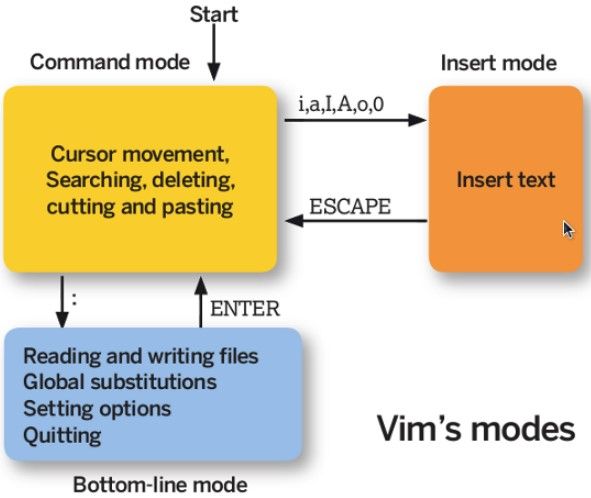
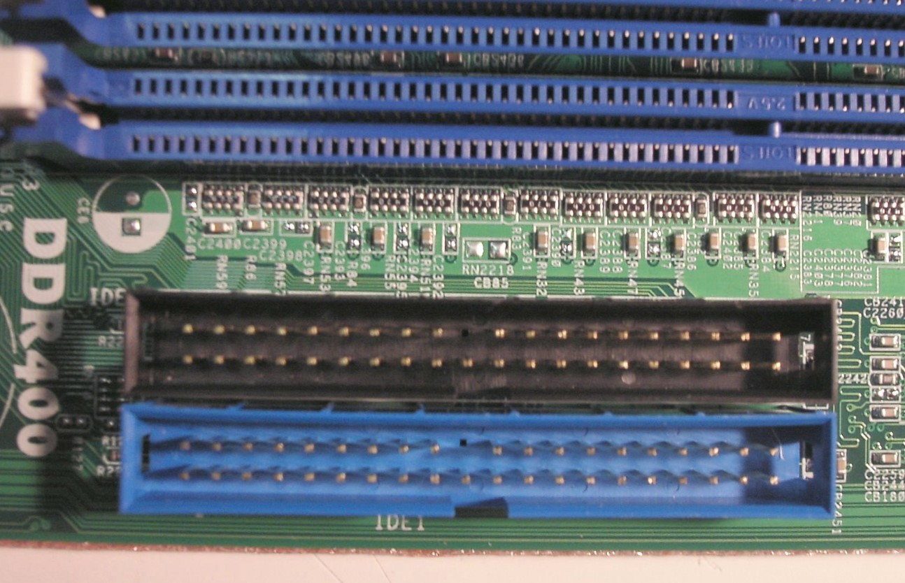
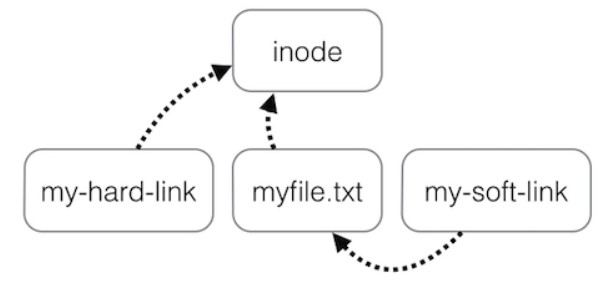
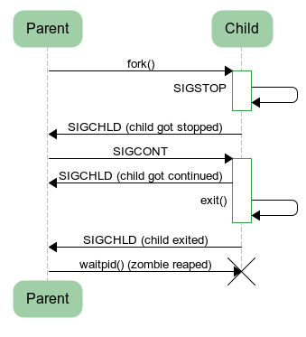

* [點擊閱讀面試進階指南 ](https://github.com/CyC2018/Backend-Interview-Guide)
<!-- GFM-TOC -->
* [一、常用操作以及概念](#一常用操作以及概念)
    * [快捷鍵](#快捷鍵)
    * [求助](#求助)
    * [關機](#關機)
    * [PATH](#path)
    * [sudo](#sudo)
    * [包管理工具](#包管理工具)
    * [發行版](#發行版)
    * [VIM 三個模式](#vim-三個模式)
    * [GNU](#gnu)
    * [開源協議](#開源協議)
* [二、磁盤](#二磁盤)
    * [磁盤接口](#磁盤接口)
    * [磁盤的文件名](#磁盤的文件名)
* [三、分區](#三分區)
    * [分區表](#分區表)
    * [開機檢測程序](#開機檢測程序)
* [四、文件系統](#四文件系統)
    * [分區與文件系統](#分區與文件系統)
    * [組成](#組成)
    * [文件讀取](#文件讀取)
    * [磁盤碎片](#磁盤碎片)
    * [block](#block)
    * [inode](#inode)
    * [目錄](#目錄)
    * [日志](#日志)
    * [掛載](#掛載)
    * [目錄配置](#目錄配置)
* [五、文件](#五文件)
    * [文件屬性](#文件屬性)
    * [文件與目錄的基本操作](#文件與目錄的基本操作)
    * [修改權限](#修改權限)
    * [文件默認權限](#文件默認權限)
    * [目錄的權限](#目錄的權限)
    * [鏈接](#鏈接)
    * [獲取文件內容](#獲取文件內容)
    * [指令與文件搜索](#指令與文件搜索)
* [六、壓縮與打包](#六壓縮與打包)
    * [壓縮文件名](#壓縮文件名)
    * [壓縮指令](#壓縮指令)
    * [打包](#打包)
* [七、Bash](#七bash)
    * [特性](#特性)
    * [變量操作](#變量操作)
    * [指令搜索順序](#指令搜索順序)
    * [數據流重定向](#數據流重定向)
* [八、管道指令](#八管道指令)
    * [提取指令](#提取指令)
    * [排序指令](#排序指令)
    * [雙向輸出重定向](#雙向輸出重定向)
    * [字符轉換指令](#字符轉換指令)
    * [分區指令](#分區指令)
* [九、正則表達式](#九正則表達式)
    * [grep](#grep)
    * [printf](#printf)
    * [awk](#awk)
* [十、進程管理](#十進程管理)
    * [查看進程](#查看進程)
    * [進程狀態](#進程狀態)
    * [SIGCHLD](#sigchld)
    * [wait()](#wait)
    * [waitpid()](#waitpid)
    * [孤兒進程](#孤兒進程)
    * [僵屍進程](#僵屍進程)
* [參考資料](#參考資料)
<!-- GFM-TOC -->


# 一、常用操作以及概念

## 快捷鍵

- Tab：命令和文件名補全；
- Ctrl+C：中斷正在運行的程序；
- Ctrl+D：結束鍵盤輸入（End Of File，EOF）

## 求助

### 1. --help

指令的基本用法與選項介紹。

### 2. man

man 是 manual 的縮寫，將指令的具體信息顯示出來。

當執行`man date`時，有 DATE(1) 出現，其中的數字代表指令的類型，常用的數字及其類型如下：

| 代號 | 類型 |
| :--: | -- |
| 1 | 用戶在 shell 環境中可以操作的指令或者可執行文件 |
| 5 | 配置文件 |
| 8 | 系統管理員可以使用的管理指令 |

### 3. info

info 與 man 類似，但是 info 將文檔分成一個個頁面，每個頁面可以進行跳轉。

### 4. doc

/usr/share/doc 存放著軟件的一整套說明文件。

## 關機

### 1. who

在關機前需要先使用 who 命令查看有沒有其它用戶在線。

### 2. sync

為了加快對磁盤文件的讀寫速度，位於內存中的文件數據不會立即同步到磁盤上，因此關機之前需要先進行 sync 同步操作。

### 3. shutdown

```html
# shutdown [-krhc] 時間 [信息]
-k ： 不會關機，只是發送警告信息，通知所有在線的用戶
-r ： 將系統的服務停掉後就重新啟動
-h ： 將系統的服務停掉後就立即關機
-c ： 取消已經在進行的 shutdown 指令內容
```

## PATH

可以在環境變量 PATH 中聲明可執行文件的路徑，路徑之間用 : 分隔。

```html
/usr/local/bin:/usr/bin:/usr/local/sbin:/usr/sbin:/home/dmtsai/.local/bin:/home/dmtsai/bin
```

## sudo

sudo 允許一般用戶使用 root 可執行的命令，不過只有在 /etc/sudoers 配置文件中添加的用戶才能使用該指令。

## 包管理工具

RPM 和 DPKG 為最常見的兩類軟件包管理工具：

- RPM 全稱為 Redhat Package Manager，最早由 Red Hat 公司制定實施，隨後被 GNU 開源操作系統接受並成為很多 Linux 系統 (RHEL) 的既定軟件標准。
- 與 RPM 進行競爭的是基於 Debian 操作系統 (Ubuntu) 的 DEB 軟件包管理工具 DPKG，全稱為 Debian Package，功能方面與 RPM 相似。

YUM 基於 RPM，具有依賴管理功能，並具有軟件升級的功能。

## 發行版

Linux 發行版是 Linux 內核及各種應用軟件的集成版本。

| 基於的包管理工具 | 商業發行版 | 社區發行版 |
| :--: | :--: | :--: |
| RPM | Red Hat | Fedora / CentOS |
| DPKG | Ubuntu | Debian |

## VIM 三個模式

- 一般指令模式（Command mode）：VIM 的默認模式，可以用於移動游標查看內容；
- 編輯模式（Insert mode）：按下 "i" 等按鍵之後進入，可以對文本進行編輯；
- 指令列模式（Bottom-line mode）：按下 ":" 按鍵之後進入，用於保存退出等操作。

<div align="center">  </div><br>

在指令列模式下，有以下命令用於離開或者保存文件。

| 命令 | 作用 |
| :--: | :--: |
| :w | 寫入磁盤|
| :w! | 當文件為只讀時，強制寫入磁盤。到底能不能寫入，與用戶對該文件的權限有關 |
| :q | 離開 |
| :q! | 強制離開不保存 |
| :wq | 寫入磁盤後離開 |
| :wq!| 強制寫入磁盤後離開 |

## GNU

GNU 計劃，譯為革奴計劃，它的目標是創建一套完全自由的操作系統，稱為 GNU，其內容軟件完全以 GPL 方式發布。其中 GPL 全稱為 GNU 通用公共許可協議，包含了以下內容：

- 以任何目的運行此程序的自由；
- 再復制的自由；
- 改進此程序，並公開發布改進的自由。

## 開源協議

- [Choose an open source license](https://choosealicense.com/)
- [如何選擇開源許可證？](http://www.ruanyifeng.com/blog/2011/05/how_to_choose_free_software_licenses.html)

# 二、磁盤

## 磁盤接口

### 1. IDE

IDE（ATA）全稱 Advanced Technology Attachment，接口速度最大為 133MB/s，因為並口線的抗干擾性太差，且排線占用空間較大，不利電腦內部散熱，已逐漸被 SATA 所取代。

<div align="center">  </div><br>

### 2. SATA

SATA 全稱 Serial ATA，也就是使用串口的 ATA 接口，抗干擾性強，且對數據線的長度要求比 ATA 低很多，支持熱插拔等功能。SATA-II 的接口速度為 300MiB/s，而新的 SATA-III 標准可達到 600MiB/s 的傳輸速度。SATA 的數據線也比 ATA 的細得多，有利於機箱內的空氣流通，整理線材也比較方便。

<div align="center">  </div><br>

### 3. SCSI

SCSI 全稱是 Small Computer System Interface（小型機系統接口），經歷多代的發展，從早期的 SCSI-II 到目前的 Ultra320 SCSI 以及 Fiber-Channel（光纖通道），接口型式也多種多樣。SCSI 硬盤廣為工作站級個人電腦以及服務器所使用，因此會使用較為先進的技術，如碟片轉速 15000rpm 的高轉速，且傳輸時 CPU 占用率較低，但是單價也比相同容量的 ATA 及 SATA 硬盤更加昂貴。

<div align="center">  </div><br>

### 4. SAS

SAS（Serial Attached SCSI）是新一代的 SCSI 技術，和 SATA 硬盤相同，都是采取序列式技術以獲得更高的傳輸速度，可達到 6Gb/s。此外也透過縮小連接線改善系統內部空間等。

<div align="center">  </div><br>

## 磁盤的文件名

Linux 中每個硬件都被當做一個文件，包括磁盤。磁盤以磁盤接口類型進行命名，常見磁盤的文件名如下：

- IDE 磁盤：/dev/hd[a-d]
- SATA/SCSI/SAS 磁盤：/dev/sd[a-p]

其中文件名後面的序號的確定與系統檢測到磁盤的順序有關，而與磁盤所插入的插槽位置無關。

# 三、分區

## 分區表

磁盤分區表主要有兩種格式，一種是限制較多的 MBR 分區表，一種是較新且限制較少的 GPT 分區表。

### 1. MBR

MBR 中，第一個扇區最重要，裡面有主要開機記錄（Master boot record, MBR）及分區表（partition table），其中主要開機記錄占 446 bytes，分區表占 64 bytes。

分區表只有 64 bytes，最多只能存儲 4 個分區，這 4 個分區為主分區（Primary）和擴展分區（Extended）。其中擴展分區只有一個，它使用其它扇區用記錄額外的分區表，因此通過擴展分區可以分出更多分區，這些分區稱為邏輯分區。

Linux 也把分區當成文件，分區文件的命名方式為：磁盤文件名 + 編號，例如 /dev/sda1。注意，邏輯分區的編號從 5 開始。

### 2. GPT

不同的磁盤有不同的扇區大小，例如 512 bytes 和最新磁盤的 4 k。GPT 為了兼容所有磁盤，在定義扇區上使用邏輯區塊地址（Logical Block Address, LBA），LBA 默認大小為 512 bytes。

GPT 第 1 個區塊記錄了主要開機記錄（MBR），緊接著是 33 個區塊記錄分區信息，並把最後的 33 個區塊用於對分區信息進行備份。這 33 個區塊第一個為 GPT 表頭紀錄，這個部份紀錄了分區表本身的位置與大小和備份分區的位置，同時放置了分區表的校驗碼 (CRC32)，操作系統可以根據這個校驗碼來判斷 GPT 是否正確。若有錯誤，可以使用備份分區進行恢復。

GPT 沒有擴展分區概念，都是主分區，每個 LAB 可以分 4 個分區，因此總共可以分 4 * 32 = 128 個分區。

MBR 不支持 2.2 TB 以上的硬盤，GPT 則最多支持到 2<sup>33</sup> TB = 8 ZB。

<div align="center">  </div><br>

## 開機檢測程序

### 1. BIOS

BIOS（Basic Input/Output System，基本輸入輸出系統），它是一個固件（嵌入在硬件中的軟件），BIOS 程序存放在斷電後內容不會丟失的只讀內存中。

<div align="center">  </div><br>

BIOS 是開機的時候計算機執行的第一個程序，這個程序知道可以開機的磁盤，並讀取磁盤第一個扇區的主要開機記錄（MBR），由主要開機記錄（MBR）執行其中的開機管理程序，這個開機管理程序會加載操作系統的核心文件。

主要開機記錄（MBR）中的開機管理程序提供以下功能：選單、載入核心文件以及轉交其它開機管理程序。轉交這個功能可以用來實現了多重引導，只需要將另一個操作系統的開機管理程序安裝在其它分區的啟動扇區上，在啟動開機管理程序時，就可以通過選單選擇啟動當前的操作系統或者轉交給其它開機管理程序從而啟動另一個操作系統。

下圖中，第一扇區的主要開機記錄（MBR）中的開機管理程序提供了兩個選單：M1、M2，M1 指向了 Windows 操作系統，而 M2 指向其它分區的啟動扇區，裡面包含了另外一個開機管理程序，提供了一個指向 Linux 的選單。

<div align="center">  </div><br>

安裝多重引導，最好先安裝 Windows 再安裝 Linux。因為安裝 Windows 時會覆蓋掉主要開機記錄（MBR），而 Linux 可以選擇將開機管理程序安裝在主要開機記錄（MBR）或者其它分區的啟動扇區，並且可以設置開機管理程序的選單。

### 2. UEFI

BIOS 不可以讀取 GPT 分區表，而 UEFI 可以。

# 四、文件系統

## 分區與文件系統

對分區進行格式化是為了在分區上建立文件系統。一個分區通常只能格式化為一個文件系統，但是磁盤陣列等技術可以將一個分區格式化為多個文件系統。

## 組成

最主要的幾個組成部分如下：

- inode：一個文件占用一個 inode，記錄文件的屬性，同時記錄此文件的內容所在的 block 編號；
- block：記錄文件的內容，文件太大時，會占用多個 block。

除此之外還包括：

- superblock：記錄文件系統的整體信息，包括 inode 和 block 的總量、使用量、剩余量，以及文件系統的格式與相關信息等；
- block bitmap：記錄 block 是否被使用的位域。

<div align="center">  </div><br>

## 文件讀取

對於 Ext2 文件系統，當要讀取一個文件的內容時，先在 inode 中去查找文件內容所在的所有 block，然後把所有 block 的內容讀出來。

<div align="center">  </div><br>

而對於 FAT 文件系統，它沒有 inode，每個 block 中存儲著下一個 block 的編號。

<div align="center">  </div><br>

## 磁盤碎片

指一個文件內容所在的 block 過於分散。

## block

在 Ext2 文件系統中所支持的 block 大小有 1K，2K 及 4K 三種，不同的大小限制了單個文件和文件系統的最大大小。

| 大小 | 1KB | 2KB | 4KB |
| :---: | :---: | :---: | :---: |
| 最大單一文件 | 16GB | 256GB | 2TB |
| 最大文件系統 | 2TB | 8TB | 16TB |

一個 block 只能被一個文件所使用，未使用的部分直接浪費了。因此如果需要存儲大量的小文件，那麼最好選用比較小的 block。

## inode

inode 具體包含以下信息：

- 權限 (read/write/excute)；
- 擁有者與群組 (owner/group)；
- 容量；
- 建立或狀態改變的時間 (ctime)；
- 最近一次的讀取時間 (atime)；
- 最近修改的時間 (mtime)；
- 定義文件特性的旗標 (flag)，如 SetUID...；
- 該文件真正內容的指向 (pointer)。

inode 具有以下特點：

- 每個 inode 大小均固定為 128 bytes (新的 ext4 與 xfs 可設定到 256 bytes)；
- 每個文件都僅會占用一個 inode。

inode 中記錄了文件內容所在的 block 編號，但是每個 block 非常小，一個大文件隨便都需要幾十萬的 block。而一個 inode 大小有限，無法直接引用這麼多 block 編號。因此引入了間接、雙間接、三間接引用。間接引用是指，讓 inode 記錄的引用 block 塊記錄引用信息。

<div align="center">  </div><br>

## 目錄

建立一個目錄時，會分配一個 inode 與至少一個 block。block 記錄的內容是目錄下所有文件的 inode 編號以及文件名。

可以看出文件的 inode 本身不記錄文件名，文件名記錄在目錄中，因此新增文件、刪除文件、更改文件名這些操作與目錄的 w 權限有關。

## 日志

如果突然斷電，那麼文件系統會發生錯誤，例如斷電前只修改了 block bitmap，而還沒有將數據真正寫入 block 中。

ext3/ext4 文件系統引入了日志功能，可以利用日志來修復文件系統。

## 掛載

掛載利用目錄作為文件系統的進入點，也就是說，進入目錄之後就可以讀取文件系統的數據。

## 目錄配置

為了使不同 Linux 發行版本的目錄結構保持一致性，Filesystem Hierarchy Standard (FHS) 規定了 Linux 的目錄結構。最基礎的三個目錄如下：

- / (root, 根目錄)
- /usr (unix software resource)：所有系統默認軟件都會安裝到這個目錄；
- /var (variable)：存放系統或程序運行過程中的數據文件。

<div align="center">  </div><br>

# 五、文件

## 文件屬性

用戶分為三種：文件擁有者、群組以及其它人，對不同的用戶有不同的文件權限。

使用 ls 查看一個文件時，會顯示一個文件的信息，例如 `drwxr-xr-x. 3 root root 17 May 6 00:14 .config`，對這個信息的解釋如下：

- drwxr-xr-x：文件類型以及權限，第 1 位為文件類型字段，後 9 位為文件權限字段
- 3：鏈接數
- root：文件擁有者
- root：所屬群組
- 17：文件大小
- May 6 00:14：文件最後被修改的時間
- .config：文件名

常見的文件類型及其含義有：

- d：目錄
- -：文件
- l：鏈接文件

9 位的文件權限字段中，每 3 個為一組，共 3 組，每一組分別代表對文件擁有者、所屬群組以及其它人的文件權限。一組權限中的 3 位分別為 r、w、x 權限，表示可讀、可寫、可執行。

文件時間有以下三種：

- modification time (mtime)：文件的內容更新就會更新；
- status time (ctime)：文件的狀態（權限、屬性）更新就會更新；
- access time (atime)：讀取文件時就會更新。

## 文件與目錄的基本操作

### 1. ls

列出文件或者目錄的信息，目錄的信息就是其中包含的文件。

```html
# ls [-aAdfFhilnrRSt] file|dir
-a ：列出全部的文件
-d ：僅列出目錄本身
-l ：以長數據串行列出，包含文件的屬性與權限等等數據
```

### 2. cd

更換當前目錄。

```
cd [相對路徑或絕對路徑]
```

### 3. mkdir

創建目錄。

```
# mkdir [-mp] 目錄名稱
-m ：配置目錄權限
-p ：遞歸創建目錄
```

### 4. rmdir

刪除目錄，目錄必須為空。

```html
rmdir [-p] 目錄名稱
-p ：遞歸刪除目錄
```

### 5. touch

更新文件時間或者建立新文件。

```html
# touch [-acdmt] filename
-a ： 更新 atime
-c ： 更新 ctime，若該文件不存在則不建立新文件
-m ： 更新 mtime
-d ： 後面可以接更新日期而不使用當前日期，也可以使用 --date="日期或時間"
-t ： 後面可以接更新時間而不使用當前時間，格式為[YYYYMMDDhhmm]
```

### 6. cp

復制文件。

如果源文件有兩個以上，則目的文件一定要是目錄才行。

```html
cp [-adfilprsu] source destination
-a ：相當於 -dr --preserve=all 的意思，至於 dr 請參考下列說明
-d ：若來源文件為鏈接文件，則復制鏈接文件屬性而非文件本身
-i ：若目標文件已經存在時，在覆蓋前會先詢問
-p ：連同文件的屬性一起復制過去
-r ：遞歸持續復制
-u ：destination 比 source 舊才更新 destination，或 destination 不存在的情況下才復制
--preserve=all ：除了 -p 的權限相關參數外，還加入 SELinux 的屬性, links, xattr 等也復制了
```

### 7. rm

刪除文件。

```html
# rm [-fir] 文件或目錄
-r ：遞歸刪除
```

### 8. mv

移動文件。

```html
# mv [-fiu] source destination
# mv [options] source1 source2 source3 .... directory
-f ： force 強制的意思，如果目標文件已經存在，不會詢問而直接覆蓋
```

## 修改權限

可以將一組權限用數字來表示，此時一組權限的 3 個位當做二進制數字的位，從左到右每個位的權值為 4、2、1，即每個權限對應的數字權值為 r : 4、w : 2、x : 1。

```html
# chmod [-R] xyz dirname/filename
```

示例：將 .bashrc 文件的權限修改為 -rwxr-xr--。

```html
# chmod 754 .bashrc
```

也可以使用符號來設定權限。

```html
# chmod [ugoa]  [+-=] [rwx] dirname/filename
- u：擁有者
- g：所屬群組
- o：其他人
- a：所有人
- +：添加權限
- -：移除權限
- =：設定權限
```

示例：為 .bashrc 文件的所有用戶添加寫權限。

```html
# chmod a+w .bashrc
```

## 文件默認權限

- 文件默認權限：文件默認沒有可執行權限，因此為 666，也就是 -rw-rw-rw- 。
- 目錄默認權限：目錄必須要能夠進入，也就是必須擁有可執行權限，因此為 777 ，也就是 drwxrwxrwx。

可以通過 umask 設置或者查看文件的默認權限，通常以掩碼的形式來表示，例如 002 表示其它用戶的權限去除了一個 2 的權限，也就是寫權限，因此建立新文件時默認的權限為 -rw-rw-r--。

## 目錄的權限

文件名不是存儲在一個文件的內容中，而是存儲在一個文件所在的目錄中。因此，擁有文件的 w 權限並不能對文件名進行修改。

目錄存儲文件列表，一個目錄的權限也就是對其文件列表的權限。因此，目錄的 r 權限表示可以讀取文件列表；w 權限表示可以修改文件列表，具體來說，就是添加刪除文件，對文件名進行修改；x 權限可以讓該目錄成為工作目錄，x 權限是 r 和 w 權限的基礎，如果不能使一個目錄成為工作目錄，也就沒辦法讀取文件列表以及對文件列表進行修改了。

## 鏈接

```html
# ln [-sf] source_filename dist_filename
-s ：默認是 hard link，加 -s 為 symbolic link
-f ：如果目標文件存在時，先刪除目標文件
```

<div align="center">  </div><br>

### 1. 實體鏈接

在目錄下創建一個條目，記錄著文件名與 inode 編號，這個 inode 就是源文件的 inode。

刪除任意一個條目，文件還是存在，只要引用數量不為 0。

有以下限制：不能跨越文件系統、不能對目錄進行鏈接。

```html
# ln /etc/crontab .
# ll -i /etc/crontab crontab
34474855 -rw-r--r--. 2 root root 451 Jun 10 2014 crontab
34474855 -rw-r--r--. 2 root root 451 Jun 10 2014 /etc/crontab
```

### 2. 符號鏈接

符號鏈接文件保存著源文件所在的絕對路徑，在讀取時會定位到源文件上，可以理解為 Windows 的快捷方式。

當源文件被刪除了，鏈接文件就打不開了。

可以為目錄建立鏈接。

```html
# ll -i /etc/crontab /root/crontab2
34474855 -rw-r--r--. 2 root root 451 Jun 10 2014 /etc/crontab
53745909 lrwxrwxrwx. 1 root root 12 Jun 23 22:31 /root/crontab2 -> /etc/crontab
```

## 獲取文件內容

### 1. cat

取得文件內容。

```html
# cat [-AbEnTv] filename
-n ：打印出行號，連同空白行也會有行號，-b 不會
```

### 2. tac

是 cat 的反向操作，從最後一行開始打印。

### 3. more

和 cat 不同的是它可以一頁一頁查看文件內容，比較適合大文件的查看。

### 4. less

和 more 類似，但是多了一個向前翻頁的功能。

### 5. head

取得文件前幾行。

```html
# head [-n number] filename
-n ：後面接數字，代表顯示幾行的意思
```

### 6. tail

是 head 的反向操作，只是取得是後幾行。

### 7. od

以字符或者十六進制的形式顯示二進制文件。

## 指令與文件搜索

### 1. which

指令搜索。

```html
# which [-a] command
-a ：將所有指令列出，而不是只列第一個
```

### 2. whereis

文件搜索。速度比較快，因為它只搜索幾個特定的目錄。

```html
# whereis [-bmsu] dirname/filename
```

### 3. locate

文件搜索。可以用關鍵字或者正則表達式進行搜索。

locate 使用 /var/lib/mlocate/ 這個數據庫來進行搜索，它存儲在內存中，並且每天更新一次，所以無法用 locate 搜索新建的文件。可以使用 updatedb 來立即更新數據庫。

```html
# locate [-ir] keyword
-r：正則表達式
```

### 4. find

文件搜索。可以使用文件的屬性和權限進行搜索。

```html
# find [basedir] [option]
example: find . -name "shadow*"
```

**① 與時間有關的選項** 

```html
-mtime  n ：列出在 n 天前的那一天修改過內容的文件
-mtime +n ：列出在 n 天之前 (不含 n 天本身) 修改過內容的文件
-mtime -n ：列出在 n 天之內 (含 n 天本身) 修改過內容的文件
-newer file ： 列出比 file 更新的文件
```

+4、4 和 -4 的指示的時間範圍如下：

<div align="center">  </div><br>

**② 與文件擁有者和所屬群組有關的選項** 

```html
-uid n
-gid n
-user name
-group name
-nouser ：搜索擁有者不存在 /etc/passwd 的文件
-nogroup：搜索所屬群組不存在於 /etc/group 的文件
```

**③ 與文件權限和名稱有關的選項** 

```html
-name filename
-size [+-]SIZE：搜尋比 SIZE 還要大 (+) 或小 (-) 的文件。這個 SIZE 的規格有：c: 代表 byte，k: 代表 1024bytes。所以，要找比 50KB 還要大的文件，就是 -size +50k
-type TYPE
-perm mode  ：搜索權限等於 mode 的文件
-perm -mode ：搜索權限包含 mode 的文件
-perm /mode ：搜索權限包含任一 mode 的文件
```

# 六、壓縮與打包

## 壓縮文件名

Linux 底下有很多壓縮文件名，常見的如下：

| 擴展名 | 壓縮程序 |
| -- | -- |
| \*.Z | compress |
|\*.zip |  zip |
|\*.gz  | gzip|
|\*.bz2 |  bzip2 |
|\*.xz  | xz |
|\*.tar |  tar 程序打包的數據，沒有經過壓縮 |
|\*.tar.gz | tar 程序打包的文件，經過 gzip 的壓縮 |
|\*.tar.bz2 | tar 程序打包的文件，經過 bzip2 的壓縮 |
|\*.tar.xz | tar 程序打包的文件，經過 xz 的壓縮 |

## 壓縮指令

### 1. gzip

gzip 是 Linux 使用最廣的壓縮指令，可以解開 compress、zip 與 gzip 所壓縮的文件。

經過 gzip 壓縮過，源文件就不存在了。

有 9 個不同的壓縮等級可以使用。

可以使用 zcat、zmore、zless 來讀取壓縮文件的內容。

```html
$ gzip [-cdtv#] filename
-c ：將壓縮的數據輸出到屏幕上
-d ：解壓縮
-t ：檢驗壓縮文件是否出錯
-v ：顯示壓縮比等信息
-# ： # 為數字的意思，代表壓縮等級，數字越大壓縮比越高，默認為 6
```

### 2. bzip2

提供比 gzip 更高的壓縮比。

查看命令：bzcat、bzmore、bzless、bzgrep。

```html
$ bzip2 [-cdkzv#] filename
-k ：保留源文件
```

### 3. xz

提供比 bzip2 更佳的壓縮比。

可以看到，gzip、bzip2、xz 的壓縮比不斷優化。不過要注意的是，壓縮比越高，壓縮的時間也越長。

查看命令：xzcat、xzmore、xzless、xzgrep。

```html
$ xz [-dtlkc#] filename
```

## 打包

壓縮指令只能對一個文件進行壓縮，而打包能夠將多個文件打包成一個大文件。tar 不僅可以用於打包，也可以使用 gip、bzip2、xz 將打包文件進行壓縮。

```html
$ tar [-z|-j|-J] [cv] [-f 新建的 tar 文件] filename...  ==打包壓縮
$ tar [-z|-j|-J] [tv] [-f 已有的 tar 文件]              ==查看
$ tar [-z|-j|-J] [xv] [-f 已有的 tar 文件] [-C 目錄]    ==解壓縮
-z ：使用 zip；
-j ：使用 bzip2；
-J ：使用 xz；
-c ：新建打包文件；
-t ：查看打包文件裡面有哪些文件；
-x ：解打包或解壓縮的功能；
-v ：在壓縮/解壓縮的過程中，顯示正在處理的文件名；
-f : filename：要處理的文件；
-C 目錄 ： 在特定目錄解壓縮。
```

| 使用方式 | 命令 |
| :---: | --- |
| 打包壓縮 | tar -jcv -f filename.tar.bz2 要被壓縮的文件或目錄名稱 |
| 查 看 | tar -jtv -f filename.tar.bz2 |
| 解壓縮 | tar -jxv -f filename.tar.bz2 -C 要解壓縮的目錄 |

# 七、Bash

可以通過 Shell 請求內核提供服務，Bash 正是 Shell 的一種。

## 特性

- 命令歷史：記錄使用過的命令
- 命令與文件補全：快捷鍵：tab
- 命名別名：例如 lm 是 ls -al 的別名
- shell scripts
- 通配符：例如 ls -l /usr/bin/X\* 列出 /usr/bin 下面所有以 X 開頭的文件

## 變量操作

對一個變量賦值直接使用 =。

對變量取用需要在變量前加上 \$ ，也可以用 \${} 的形式；

輸出變量使用 echo 命令。

```bash
$ x=abc
$ echo $x
$ echo ${x}
```

變量內容如果有空格，必須使用雙引號或者單引號。

- 雙引號內的特殊字符可以保留原本特性，例如 x="lang is \$LANG"，則 x 的值為 lang is zh_TW.UTF-8；
- 單引號內的特殊字符就是特殊字符本身，例如 x='lang is \$LANG'，則 x 的值為 lang is \$LANG。

可以使用 \`指令\` 或者 \$(指令) 的方式將指令的執行結果賦值給變量。例如 version=\$(uname -r)，則 version 的值為 4.15.0-22-generic。

可以使用 export 命令將自定義變量轉成環境變量，環境變量可以在子程序中使用，所謂子程序就是由當前 Bash 而產生的子 Bash。

Bash 的變量可以聲明為數組和整數數字。注意數字類型沒有浮點數。如果不進行聲明，默認是字符串類型。變量的聲明使用 declare 命令：

```html
$ declare [-aixr] variable
-a ： 定義為數組類型
-i ： 定義為整數類型
-x ： 定義為環境變量
-r ： 定義為 readonly 類型
```

使用 [ ] 來對數組進行索引操作：

```bash
$ array[1]=a
$ array[2]=b
$ echo ${array[1]}
```

## 指令搜索順序

- 以絕對或相對路徑來執行指令，例如 /bin/ls 或者 ./ls ；
- 由別名找到該指令來執行；
- 由 Bash 內置的指令來執行；
- 按 \$PATH 變量指定的搜索路徑的順序找到第一個指令來執行。

## 數據流重定向

重定向指的是使用文件代替標准輸入、標准輸出和標准錯誤輸出。

| 1 | 代碼 | 運算符 |
| :---: | :---: | :---:|
| 標准輸入 (stdin)  | 0 | < 或 << |
| 標准輸出 (stdout) | 1 | &gt; 或 >> |
| 標准錯誤輸出 (stderr) | 2 | 2> 或 2>> |

其中，有一個箭頭的表示以覆蓋的方式重定向，而有兩個箭頭的表示以追加的方式重定向。

可以將不需要的標准輸出以及標准錯誤輸出重定向到 /dev/null，相當於扔進垃圾箱。

如果需要將標准輸出以及標准錯誤輸出同時重定向到一個文件，需要將某個輸出轉換為另一個輸出，例如 2>&1 表示將標准錯誤輸出轉換為標准輸出。

```bash
$ find /home -name .bashrc > list 2>&1
```

# 八、管道指令

管道是將一個命令的標准輸出作為另一個命令的標准輸入，在數據需要經過多個步驟的處理之後才能得到我們想要的內容時就可以使用管道。

在命令之間使用 | 分隔各個管道命令。

```bash
$ ls -al /etc | less
```

## 提取指令

cut 對數據進行切分，取出想要的部分。

切分過程一行一行地進行。

```html
$ cut
-d ：分隔符
-f ：經過 -d 分隔後，使用 -f n 取出第 n 個區間
-c ：以字符為單位取出區間
```

示例 1：last 顯示登入者的信息，取出用戶名。

```html
$ last
root pts/1 192.168.201.101 Sat Feb 7 12:35 still logged in
root pts/1 192.168.201.101 Fri Feb 6 12:13 - 18:46 (06:33)
root pts/1 192.168.201.254 Thu Feb 5 22:37 - 23:53 (01:16)

$ last | cut -d ' ' -f 1
```

示例 2：將 export 輸出的信息，取出第 12 字符以後的所有字符串。

```html
$ export
declare -x HISTCONTROL="ignoredups"
declare -x HISTSIZE="1000"
declare -x HOME="/home/dmtsai"
declare -x HOSTNAME="study.centos.vbird"
.....(其他省略).....

$ export | cut -c 12-
```

## 排序指令

**sort**  用於排序。

```html
$ sort [-fbMnrtuk] [file or stdin]
-f ：忽略大小寫
-b ：忽略最前面的空格
-M ：以月份的名字來排序，例如 JAN，DEC
-n ：使用數字
-r ：反向排序
-u ：相當於 unique，重復的內容只出現一次
-t ：分隔符，默認為 tab
-k ：指定排序的區間
```

示例：/etc/passwd 文件內容以 : 來分隔，要求以第三列進行排序。

```html
$ cat /etc/passwd | sort -t ':' -k 3
root:x:0:0:root:/root:/bin/bash
dmtsai:x:1000:1000:dmtsai:/home/dmtsai:/bin/bash
alex:x:1001:1002::/home/alex:/bin/bash
arod:x:1002:1003::/home/arod:/bin/bash
```

**uniq**  可以將重復的數據只取一個。

```html
$ uniq [-ic]
-i ：忽略大小寫
-c ：進行計數
```

示例：取得每個人的登錄總次數

```html
$ last | cut -d ' ' -f 1 | sort | uniq -c
1
6 (unknown
47 dmtsai
4 reboot
7 root
1 wtmp
```

## 雙向輸出重定向

輸出重定向會將輸出內容重定向到文件中，而  **tee**  不僅能夠完成這個功能，還能保留屏幕上的輸出。也就是說，使用 tee 指令，一個輸出會同時傳送到文件和屏幕上。

```html
$ tee [-a] file
```

## 字符轉換指令

**tr**  用來刪除一行中的字符，或者對字符進行替換。

```html
$ tr [-ds] SET1 ...
-d ： 刪除行中 SET1 這個字符串
```

示例，將 last 輸出的信息所有小寫轉換為大寫。

```html
$ last | tr '[a-z]' '[A-Z]'
```

  **col**  將 tab 字符轉為空格字符。

```html
$ col [-xb]
-x ： 將 tab 鍵轉換成對等的空格鍵
```

**expand**  將 tab 轉換一定數量的空格，默認是 8 個。

```html
$ expand [-t] file
-t ：tab 轉為空格的數量
```

**join**  將有相同數據的那一行合並在一起。

```html
$ join [-ti12] file1 file2
-t ：分隔符，默認為空格
-i ：忽略大小寫的差異
-1 ：第一個文件所用的比較字段
-2 ：第二個文件所用的比較字段
```

**paste**  直接將兩行粘貼在一起。

```html
$ paste [-d] file1 file2
-d ：分隔符，默認為 tab
```

## 分區指令

**split**  將一個文件劃分成多個文件。

```html
$ split [-bl] file PREFIX
-b ：以大小來進行分區，可加單位，例如 b, k, m 等
-l ：以行數來進行分區。
- PREFIX ：分區文件的前導名稱
```

# 九、正則表達式

## grep

g/re/p（globally search a regular expression and print)，使用正則表示式進行全局查找並打印。

```html
$ grep [-acinv] [--color=auto] 搜尋字符串 filename
-c ： 統計個數
-i ： 忽略大小寫
-n ： 輸出行號
-v ： 反向選擇，也就是顯示出沒有 搜尋字符串 內容的那一行
--color=auto ：找到的關鍵字加顏色顯示
```

示例：把含有 the 字符串的行提取出來（注意默認會有 --color=auto 選項，因此以下內容在 Linux 中有顏色顯示 the 字符串）

```html
$ grep -n 'the' regular_express.txt
8:I can't finish the test.
12:the symbol '*' is represented as start.
15:You are the best is mean you are the no. 1.
16:The world Happy is the same with "glad".
18:google is the best tools for search keyword
```

因為 { 和 } 在 shell 是有特殊意義的，因此必須要使用轉義字符進行轉義。

```html
$ grep -n 'go\{2,5\}g' regular_express.txt
```

## printf

用於格式化輸出。它不屬於管道命令，在給 printf 傳數據時需要使用 $( ) 形式。

```html
$ printf '%10s %5i %5i %5i %8.2f \n' $(cat printf.txt)
    DmTsai    80    60    92    77.33
     VBird    75    55    80    70.00
       Ken    60    90    70    73.33
```

## awk

是由 Alfred Aho，Peter Weinberger, 和 Brian Kernighan 創造，awk 這個名字就是這三個創始人名字的首字母。

awk 每次處理一行，處理的最小單位是字段，每個字段的命名方式為：\$n，n 為字段號，從 1 開始，\$0 表示一整行。

示例：取出最近五個登錄用戶的用戶名和 IP

```html
$ last -n 5
dmtsai pts/0 192.168.1.100 Tue Jul 14 17:32 still logged in
dmtsai pts/0 192.168.1.100 Thu Jul 9 23:36 - 02:58 (03:22)
dmtsai pts/0 192.168.1.100 Thu Jul 9 17:23 - 23:36 (06:12)
dmtsai pts/0 192.168.1.100 Thu Jul 9 08:02 - 08:17 (00:14)
dmtsai tty1 Fri May 29 11:55 - 12:11 (00:15)
```

```html
$ last -n 5 | awk '{print $1 "\t" $3}'
```

可以根據字段的某些條件進行匹配，例如匹配字段小於某個值的那一行數據。

```html
$ awk '條件類型 1 {動作 1} 條件類型 2 {動作 2} ...' filename
```

示例：/etc/passwd 文件第三個字段為 UID，對 UID 小於 10 的數據進行處理。

```text
$ cat /etc/passwd | awk 'BEGIN {FS=":"} $3 < 10 {print $1 "\t " $3}'
root 0
bin 1
daemon 2
```

awk 變量：

| 變量名稱 | 代表意義 |
| :--: | -- |
| NF | 每一行擁有的字段總數 |
| NR | 目前所處理的是第幾行數據 |
| FS | 目前的分隔字符，默認是空格鍵 |

示例：顯示正在處理的行號以及每一行有多少字段

```html
$ last -n 5 | awk '{print $1 "\t lines: " NR "\t columns: " NF}'
dmtsai lines: 1 columns: 10
dmtsai lines: 2 columns: 10
dmtsai lines: 3 columns: 10
dmtsai lines: 4 columns: 10
dmtsai lines: 5 columns: 9
```

# 十、進程管理

## 查看進程

### 1. ps

查看某個時間點的進程信息

示例一：查看自己的進程

```sh
# ps -l
```

示例二：查看系統所有進程

```sh
# ps aux
```

示例三：查看特定的進程

```sh
# ps aux | grep threadx
```

### 2. pstree

查看進程樹

示例：查看所有進程樹

```sh
# pstree -A
```

### 3. top

實時顯示進程信息

示例：兩秒鐘刷新一次

```sh
# top -d 2
```

### 4. netstat

查看占用端口的進程

示例：查看特定端口的進程

```sh
# netstat -anp | grep port
```

## 進程狀態

| 狀態 | 說明 |
| :---: | --- |
| R | running or runnable (on run queue) |
| D | uninterruptible sleep (usually I/O) |
| S | interruptible sleep (waiting for an event to complete) |
| Z | zombie (terminated but not reaped by its parent) |
| T | stopped (either by a job control signal or because it is being traced) |
<br>
<div align="center">  </div><br>

## SIGCHLD

當一個子進程改變了它的狀態時（停止運行，繼續運行或者退出），有兩件事會發生在父進程中：

- 得到 SIGCHLD 信號；
- waitpid() 或者 wait() 調用會返回。

其中子進程發送的 SIGCHLD 信號包含了子進程的信息，比如進程 ID、進程狀態、進程使用 CPU 的時間等。

在子進程退出時，它的進程描述符不會立即釋放，這是為了讓父進程得到子進程信息，父進程通過 wait() 和 waitpid() 來獲得一個已經退出的子進程的信息。

<div align="center">  </div><br>

## wait()

```c
pid_t wait(int *status)
```

父進程調用 wait() 會一直阻塞，直到收到一個子進程退出的 SIGCHLD 信號，之後 wait() 函數會銷毀子進程並返回。

如果成功，返回被收集的子進程的進程 ID；如果調用進程沒有子進程，調用就會失敗，此時返回 -1，同時 errno 被置為 ECHILD。

參數 status 用來保存被收集的子進程退出時的一些狀態，如果對這個子進程是如何死掉的毫不在意，只想把這個子進程消滅掉，可以設置這個參數為 NULL。

## waitpid()

```c
pid_t waitpid(pid_t pid, int *status, int options)
```

作用和 wait() 完全相同，但是多了兩個可由用戶控制的參數 pid 和 options。

pid 參數指示一個子進程的 ID，表示只關心這個子進程退出的 SIGCHLD 信號。如果 pid=-1 時，那麼和 wait() 作用相同，都是關心所有子進程退出的 SIGCHLD 信號。

options 參數主要有 WNOHANG 和 WUNTRACED 兩個選項，WNOHANG 可以使 waitpid() 調用變成非阻塞的，也就是說它會立即返回，父進程可以繼續執行其它任務。

## 孤兒進程

一個父進程退出，而它的一個或多個子進程還在運行，那麼這些子進程將成為孤兒進程。

孤兒進程將被 init 進程（進程號為 1）所收養，並由 init 進程對它們完成狀態收集工作。

由於孤兒進程會被 init 進程收養，所以孤兒進程不會對系統造成危害。

## 僵屍進程

一個子進程的進程描述符在子進程退出時不會釋放，只有當父進程通過 wait() 或 waitpid() 獲取了子進程信息後才會釋放。如果子進程退出，而父進程並沒有調用 wait() 或 waitpid()，那麼子進程的進程描述符仍然保存在系統中，這種進程稱之為僵屍進程。

僵屍進程通過 ps 命令顯示出來的狀態為 Z（zombie）。

系統所能使用的進程號是有限的，如果產生大量僵屍進程，將因為沒有可用的進程號而導致系統不能產生新的進程。

要消滅系統中大量的僵屍進程，只需要將其父進程殺死，此時僵屍進程就會變成孤兒進程，從而被 init 所收養，這樣 init 就會釋放所有的僵屍進程所占有的資源，從而結束僵屍進程。

# 參考資料

- 鳥哥. 鳥 哥 的 Linux 私 房 菜 基 礎 篇 第 三 版[J]. 2009.
- [Linux 平台上的軟件包管理](https://www.ibm.com/developerworks/cn/linux/l-cn-rpmdpkg/index.html)
- [Linux 之守護進程、僵死進程與孤兒進程](http://liubigbin.github.io/2016/03/11/Linux-%E4%B9%8B%E5%AE%88%E6%8A%A4%E8%BF%9B%E7%A8%8B%E3%80%81%E5%83%B5%E6%AD%BB%E8%BF%9B%E7%A8%8B%E4%B8%8E%E5%AD%A4%E5%84%BF%E8%BF%9B%E7%A8%8B/)
- [What is the difference between a symbolic link and a hard link?](https://stackoverflow.com/questions/185899/what-is-the-difference-between-a-symbolic-link-and-a-hard-link)
- [Linux process states](https://idea.popcount.org/2012-12-11-linux-process-states/)
- [GUID Partition Table](https://en.wikipedia.org/wiki/GUID_Partition_Table)
- [詳解 wait 和 waitpid 函數](https://blog.csdn.net/kevinhg/article/details/7001719)
- [IDE、SATA、SCSI、SAS、FC、SSD 硬盤類型介紹](https://blog.csdn.net/tianlesoftware/article/details/6009110)
- [Akai IB-301S SCSI Interface for S2800,S3000](http://www.mpchunter.com/s3000/akai-ib-301s-scsi-interface-for-s2800s3000/)
- [Parallel ATA](https://en.wikipedia.org/wiki/Parallel_ATA)
- [ADATA XPG SX900 256GB SATA 3 SSD Review – Expanded Capacity and SandForce Driven Speed](http://www.thessdreview.com/our-reviews/adata-xpg-sx900-256gb-sata-3-ssd-review-expanded-capacity-and-sandforce-driven-speed/4/)
- [Decoding UCS Invicta – Part 1](https://blogs.cisco.com/datacenter/decoding-ucs-invicta-part-1)
- [硬盤](https://zh.wikipedia.org/wiki/%E7%A1%AC%E7%9B%98)
- [Difference between SAS and SATA](http://www.differencebetween.info/difference-between-sas-and-sata)
- [BIOS](https://zh.wikipedia.org/wiki/BIOS)
- [File system design case studies](https://www.cs.rutgers.edu/\~pxk/416/notes/13-fs-studies.html)
- [Programming Project #4](https://classes.soe.ucsc.edu/cmps111/Fall08/proj4.shtml)
- [FILE SYSTEM DESIGN](http://web.cs.ucla.edu/classes/fall14/cs111/scribe/11a/index.html)
