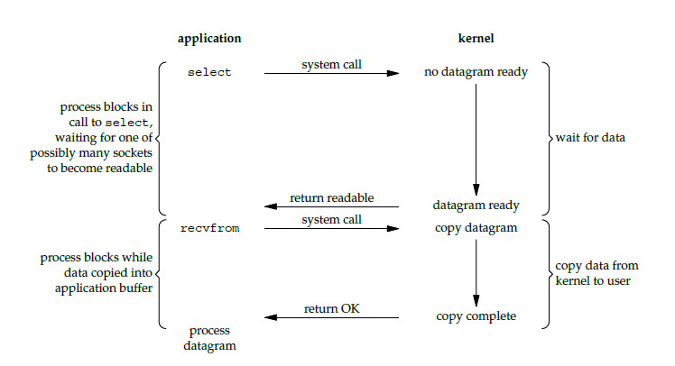

<<<<<<< HEAD
[🍉 點擊訂閱面試進階專欄 ](https://xiaozhuanlan.com/CyC2018)
=======
* [点击阅读面试进阶指南 ](https://github.com/CyC2018/Backend-Interview-Guide)
>>>>>>> 9f1571a1b578332969a00a0bda4029dfad9995a3
<!-- GFM-TOC -->
* [一、I/O 模型](#一io-模型)
    * [阻塞式 I/O](#阻塞式-io)
    * [非阻塞式 I/O](#非阻塞式-io)
<<<<<<< HEAD
    * [I/O 覆用](#io-覆用)
    * [信號驅動 I/O](#信號驅動-io)
    * [異步 I/O](#異步-io)
    * [五大 I/O 模型比較](#五大-io-模型比較)
* [二、I/O 覆用](#二io-覆用)
    * [select](#select)
    * [poll](#poll)
    * [比較](#比較)
    * [epoll](#epoll)
    * [工作模式](#工作模式)
    * [應用場景](#應用場景)
* [參考資料](#參考資料)
=======
    * [I/O 复用](#io-复用)
    * [信号驱动 I/O](#信号驱动-io)
    * [异步 I/O](#异步-io)
    * [五大 I/O 模型比较](#五大-io-模型比较)
* [二、I/O 复用](#二io-复用)
    * [select](#select)
    * [poll](#poll)
    * [比较](#比较)
    * [epoll](#epoll)
    * [工作模式](#工作模式)
    * [应用场景](#应用场景)
* [参考资料](#参考资料)
>>>>>>> 9f1571a1b578332969a00a0bda4029dfad9995a3
<!-- GFM-TOC -->


# 一、I/O 模型

<<<<<<< HEAD
一個輸入操作通常包括兩個階段：

- 等待數據準備好
- 從內核向進程覆制數據

對於一個套接字上的輸入操作，第一步通常涉及等待數據從網絡中到達。當所等待數據到達時，它被覆制到內核中的某個緩沖區。第二步就是把數據從內核緩沖區覆制到應用進程緩沖區。

Unix 有五種 I/O 模型：

- 阻塞式 I/O
- 非阻塞式 I/O
- I/O 覆用（select 和 poll）
- 信號驅動式 I/O（SIGIO）
- 異步 I/O（AIO）

## 阻塞式 I/O

應用進程被阻塞，直到數據覆制到應用進程緩沖區中才返回。

應該註意到，在阻塞的過程中，其它程序還可以執行，因此阻塞不意味著整個操作系統都被阻塞。因為其他程序還可以執行，所以不消耗 CPU 時間，這種模型的 CPU 利用率效率會比較高。

下圖中，recvfrom 用於接收 Socket 傳來的數據，並覆制到應用進程的緩沖區 buf 中。這裏把 recvfrom() 當成系統調用。
=======
一个输入操作通常包括两个阶段：

- 等待数据准备好
- 从内核向进程复制数据

对于一个套接字上的输入操作，第一步通常涉及等待数据从网络中到达。当所等待数据到达时，它被复制到内核中的某个缓冲区。第二步就是把数据从内核缓冲区复制到应用进程缓冲区。

Unix 有五种 I/O 模型：

- 阻塞式 I/O
- 非阻塞式 I/O
- I/O 复用（select 和 poll）
- 信号驱动式 I/O（SIGIO）
- 异步 I/O（AIO）

## 阻塞式 I/O

应用进程被阻塞，直到数据从内核缓冲区复制到应用进程缓冲区中才返回。

应该注意到，在阻塞的过程中，其它应用进程还可以执行，因此阻塞不意味着整个操作系统都被阻塞。因为其它应用进程还可以执行，所以不消耗 CPU 时间，这种模型的 CPU 利用率效率会比较高。

下图中，recvfrom() 用于接收 Socket 传来的数据，并复制到应用进程的缓冲区 buf 中。这里把 recvfrom() 当成系统调用。
>>>>>>> 9f1571a1b578332969a00a0bda4029dfad9995a3

```c
ssize_t recvfrom(int sockfd, void *buf, size_t len, int flags, struct sockaddr *src_addr, socklen_t *addrlen);
```

<div align="center">  </div><br>

## 非阻塞式 I/O

<<<<<<< HEAD
應用進程執行系統調用之後，內核返回一個錯誤碼。應用進程可以繼續執行，但是需要不斷的執行系統調用來獲知 I/O 是否完成，這種方式稱為輪詢（polling）。

由於 CPU 要處理更多的系統調用，因此這種模型的 CPU 利用率是比較低的。

<div align="center">  </div><br>

## I/O 覆用

使用 select 或者 poll 等待數據，並且可以等待多個套接字中的任何一個變為可讀。這一過程會被阻塞，當某一個套接字可讀時返回，之後再使用 recvfrom 把數據從內核覆制到進程中。

它可以讓單個進程具有處理多個 I/O 事件的能力。又被稱為 Event Driven I/O，即事件驅動 I/O。

如果一個 Web 服務器沒有 I/O 覆用，那麽每一個 Socket 連接都需要創建一個線程去處理。如果同時有幾萬個連接，那麽就需要創建相同數量的線程。相比於多進程和多線程技術，I/O 覆用不需要進程線程創建和切換的開銷，系統開銷更小。

<div align="center">  </div><br>

## 信號驅動 I/O

應用進程使用 sigaction 系統調用，內核立即返回，應用進程可以繼續執行，也就是說等待數據階段應用進程是非阻塞的。內核在數據到達時向應用進程發送 SIGIO 信號，應用進程收到之後在信號處理程序中調用 recvfrom 將數據從內核覆制到應用進程中。

相比於非阻塞式 I/O 的輪詢方式，信號驅動 I/O 的 CPU 利用率更高。

<div align="center">  </div><br>

## 異步 I/O

應用進程執行 aio_read 系統調用會立即返回，應用進程可以繼續執行，不會被阻塞，內核會在所有操作完成之後向應用進程發送信號。

異步 I/O 與信號驅動 I/O 的區別在於，異步 I/O 的信號是通知應用進程 I/O 完成，而信號驅動 I/O 的信號是通知應用進程可以開始 I/O。

<div align="center">  </div><br>

## 五大 I/O 模型比較

- 同步 I/O：將數據從內核緩沖區覆制到應用進程緩沖區的階段，應用進程會阻塞。
- 異步 I/O：不會阻塞。

阻塞式 I/O、非阻塞式 I/O、I/O 覆用和信號驅動 I/O 都是同步 I/O，它們的主要區別在第一個階段。

非阻塞式 I/O 、信號驅動 I/O 和異步 I/O 在第一階段不會阻塞。

<div align="center">  </div><br>

# 二、I/O 覆用

select/poll/epoll 都是 I/O 多路覆用的具體實現，select 出現的最早，之後是 poll，再是 epoll。
=======
应用进程执行系统调用之后，内核返回一个错误码。应用进程可以继续执行，但是需要不断的执行系统调用来获知 I/O 是否完成，这种方式称为轮询（polling）。

由于 CPU 要处理更多的系统调用，因此这种模型的 CPU 利用率比较低。

<div align="center">  </div><br>

## I/O 复用

使用 select 或者 poll 等待数据，并且可以等待多个套接字中的任何一个变为可读。这一过程会被阻塞，当某一个套接字可读时返回，之后再使用 recvfrom 把数据从内核复制到进程中。

它可以让单个进程具有处理多个 I/O 事件的能力。又被称为 Event Driven I/O，即事件驱动 I/O。

如果一个 Web 服务器没有 I/O 复用，那么每一个 Socket 连接都需要创建一个线程去处理。如果同时有几万个连接，那么就需要创建相同数量的线程。相比于多进程和多线程技术，I/O 复用不需要进程线程创建和切换的开销，系统开销更小。

<div align="center">  </div><br>

## 信号驱动 I/O

应用进程使用 sigaction 系统调用，内核立即返回，应用进程可以继续执行，也就是说等待数据阶段应用进程是非阻塞的。内核在数据到达时向应用进程发送 SIGIO 信号，应用进程收到之后在信号处理程序中调用 recvfrom 将数据从内核复制到应用进程中。

相比于非阻塞式 I/O 的轮询方式，信号驱动 I/O 的 CPU 利用率更高。

<div align="center">  </div><br>

## 异步 I/O

应用进程执行 aio_read 系统调用会立即返回，应用进程可以继续执行，不会被阻塞，内核会在所有操作完成之后向应用进程发送信号。

异步 I/O 与信号驱动 I/O 的区别在于，异步 I/O 的信号是通知应用进程 I/O 完成，而信号驱动 I/O 的信号是通知应用进程可以开始 I/O。

<div align="center">  </div><br>

## 五大 I/O 模型比较

- 同步 I/O：将数据从内核缓冲区复制到应用进程缓冲区的阶段，应用进程会阻塞。
- 异步 I/O：不会阻塞。

阻塞式 I/O、非阻塞式 I/O、I/O 复用和信号驱动 I/O 都是同步 I/O，它们的主要区别在第一个阶段。

非阻塞式 I/O 、信号驱动 I/O 和异步 I/O 在第一阶段不会阻塞。

<div align="center">  </div><br>

# 二、I/O 复用

select/poll/epoll 都是 I/O 多路复用的具体实现，select 出现的最早，之后是 poll，再是 epoll。
>>>>>>> 9f1571a1b578332969a00a0bda4029dfad9995a3

## select

```c
int select(int n, fd_set *readfds, fd_set *writefds, fd_set *exceptfds, struct timeval *timeout);
```

<<<<<<< HEAD
有三種類型的描述符類型：readset、writeset、exceptset，分別對應讀、寫、異常條件的描述符集合。fd_set 使用數組實現，數組大小使用 FD_SETSIZE 定義。

timeout 為超時參數，調用 select 會一直阻塞直到有描述符的事件到達或者等待的時間超過 timeout。

成功調用返回結果大於 0，出錯返回結果為 -1，超時返回結果為 0。
=======
有三种类型的描述符类型：readset、writeset、exceptset，分别对应读、写、异常条件的描述符集合。fd_set 使用数组实现，数组大小使用 FD_SETSIZE 定义。

timeout 为超时参数，调用 select 会一直阻塞直到有描述符的事件到达或者等待的时间超过 timeout。

成功调用返回结果大于 0，出错返回结果为 -1，超时返回结果为 0。
>>>>>>> 9f1571a1b578332969a00a0bda4029dfad9995a3

```c
fd_set fd_in, fd_out;
struct timeval tv;

// Reset the sets
FD_ZERO( &fd_in );
FD_ZERO( &fd_out );

// Monitor sock1 for input events
FD_SET( sock1, &fd_in );

// Monitor sock2 for output events
FD_SET( sock2, &fd_out );

// Find out which socket has the largest numeric value as select requires it
int largest_sock = sock1 > sock2 ? sock1 : sock2;

// Wait up to 10 seconds
tv.tv_sec = 10;
tv.tv_usec = 0;

// Call the select
int ret = select( largest_sock + 1, &fd_in, &fd_out, NULL, &tv );

// Check if select actually succeed
if ( ret == -1 )
    // report error and abort
else if ( ret == 0 )
    // timeout; no event detected
else
{
    if ( FD_ISSET( sock1, &fd_in ) )
        // input event on sock1

    if ( FD_ISSET( sock2, &fd_out ) )
        // output event on sock2
}
```

## poll

```c
int poll(struct pollfd *fds, unsigned int nfds, int timeout);
```

<<<<<<< HEAD
pollfd 使用鏈表實現。
=======
pollfd 使用链表实现。
>>>>>>> 9f1571a1b578332969a00a0bda4029dfad9995a3

```c
// The structure for two events
struct pollfd fds[2];

// Monitor sock1 for input
fds[0].fd = sock1;
fds[0].events = POLLIN;

// Monitor sock2 for output
fds[1].fd = sock2;
fds[1].events = POLLOUT;

// Wait 10 seconds
int ret = poll( &fds, 2, 10000 );
// Check if poll actually succeed
if ( ret == -1 )
    // report error and abort
else if ( ret == 0 )
    // timeout; no event detected
else
{
    // If we detect the event, zero it out so we can reuse the structure
    if ( fds[0].revents & POLLIN )
        fds[0].revents = 0;
        // input event on sock1

    if ( fds[1].revents & POLLOUT )
        fds[1].revents = 0;
        // output event on sock2
}
```

<<<<<<< HEAD
## 比較

### 1. 功能

select 和 poll 的功能基本相同，不過在一些實現細節上有所不同。

- select 會修改描述符，而 poll 不會；
- select 的描述符類型使用數組實現，FD_SETSIZE 大小默認為 1024，因此默認只能監聽 1024 個描述符。如果要監聽更多描述符的話，需要修改 FD_SETSIZE 之後重新編譯；而 poll 的描述符類型使用鏈表實現，沒有描述符數量的限制；
- poll 提供了更多的事件類型，並且對描述符的重覆利用上比 select 高。
- 如果一個線程對某個描述符調用了 select 或者 poll，另一個線程關閉了該描述符，會導致調用結果不確定。

### 2. 速度

select 和 poll 速度都比較慢。

- select 和 poll 每次調用都需要將全部描述符從應用進程緩沖區覆制到內核緩沖區。
- select 和 poll 的返回結果中沒有聲明哪些描述符已經準備好，所以如果返回值大於 0 時，應用進程都需要使用輪詢的方式來找到 I/O 完成的描述符。

### 3. 可移植性

幾乎所有的系統都支持 select，但是只有比較新的系統支持 poll。
=======
## 比较

### 1. 功能

select 和 poll 的功能基本相同，不过在一些实现细节上有所不同。

- select 会修改描述符，而 poll 不会；
- select 的描述符类型使用数组实现，FD_SETSIZE 大小默认为 1024，因此默认只能监听 1024 个描述符。如果要监听更多描述符的话，需要修改 FD_SETSIZE 之后重新编译；而 poll 的描述符类型使用链表实现，没有描述符数量的限制；
- poll 提供了更多的事件类型，并且对描述符的重复利用上比 select 高。
- 如果一个线程对某个描述符调用了 select 或者 poll，另一个线程关闭了该描述符，会导致调用结果不确定。

### 2. 速度

select 和 poll 速度都比较慢。

- select 和 poll 每次调用都需要将全部描述符从应用进程缓冲区复制到内核缓冲区。
- select 和 poll 的返回结果中没有声明哪些描述符已经准备好，所以如果返回值大于 0 时，应用进程都需要使用轮询的方式来找到 I/O 完成的描述符。

### 3. 可移植性

几乎所有的系统都支持 select，但是只有比较新的系统支持 poll。
>>>>>>> 9f1571a1b578332969a00a0bda4029dfad9995a3

## epoll

```c
int epoll_create(int size);
int epoll_ctl(int epfd, int op, int fd, struct epoll_event *event)；
int epoll_wait(int epfd, struct epoll_event * events, int maxevents, int timeout);
```

<<<<<<< HEAD
epoll_ctl() 用於向內核註冊新的描述符或者是改變某個文件描述符的狀態。已註冊的描述符在內核中會被維護在一棵紅黑樹上，通過回調函數內核會將 I/O 準備好的描述符加入到一個鏈表中管理，進程調用 epoll_wait() 便可以得到事件完成的描述符。

從上面的描述可以看出，epoll 只需要將描述符從進程緩沖區向內核緩沖區拷貝一次，並且進程不需要通過輪詢來獲得事件完成的描述符。

epoll 僅適用於 Linux OS。

epoll 比 select 和 poll 更加靈活而且沒有描述符數量限制。

epoll 對多線程編程更有友好，一個線程調用了 epoll_wait() 另一個線程關閉了同一個描述符也不會產生像 select 和 poll 的不確定情況。
=======
epoll_ctl() 用于向内核注册新的描述符或者是改变某个文件描述符的状态。已注册的描述符在内核中会被维护在一棵红黑树上，通过回调函数内核会将 I/O 准备好的描述符加入到一个链表中管理，进程调用 epoll_wait() 便可以得到事件完成的描述符。

从上面的描述可以看出，epoll 只需要将描述符从进程缓冲区向内核缓冲区拷贝一次，并且进程不需要通过轮询来获得事件完成的描述符。

epoll 仅适用于 Linux OS。

epoll 比 select 和 poll 更加灵活而且没有描述符数量限制。

epoll 对多线程编程更有友好，一个线程调用了 epoll_wait() 另一个线程关闭了同一个描述符也不会产生像 select 和 poll 的不确定情况。
>>>>>>> 9f1571a1b578332969a00a0bda4029dfad9995a3

```c
// Create the epoll descriptor. Only one is needed per app, and is used to monitor all sockets.
// The function argument is ignored (it was not before, but now it is), so put your favorite number here
int pollingfd = epoll_create( 0xCAFE );

if ( pollingfd < 0 )
 // report error

// Initialize the epoll structure in case more members are added in future
struct epoll_event ev = { 0 };

// Associate the connection class instance with the event. You can associate anything
// you want, epoll does not use this information. We store a connection class pointer, pConnection1
ev.data.ptr = pConnection1;

// Monitor for input, and do not automatically rearm the descriptor after the event
ev.events = EPOLLIN | EPOLLONESHOT;
// Add the descriptor into the monitoring list. We can do it even if another thread is
// waiting in epoll_wait - the descriptor will be properly added
if ( epoll_ctl( epollfd, EPOLL_CTL_ADD, pConnection1->getSocket(), &ev ) != 0 )
    // report error

// Wait for up to 20 events (assuming we have added maybe 200 sockets before that it may happen)
struct epoll_event pevents[ 20 ];

// Wait for 10 seconds, and retrieve less than 20 epoll_event and store them into epoll_event array
int ready = epoll_wait( pollingfd, pevents, 20, 10000 );
// Check if epoll actually succeed
if ( ret == -1 )
    // report error and abort
else if ( ret == 0 )
    // timeout; no event detected
else
{
    // Check if any events detected
    for ( int i = 0; i < ret; i++ )
    {
        if ( pevents[i].events & EPOLLIN )
        {
            // Get back our connection pointer
            Connection * c = (Connection*) pevents[i].data.ptr;
            c->handleReadEvent();
         }
    }
}
```


## 工作模式

<<<<<<< HEAD
epoll 的描述符事件有兩種觸發模式：LT（level trigger）和 ET（edge trigger）。

### 1. LT 模式

當 epoll_wait() 檢測到描述符事件到達時，將此事件通知進程，進程可以不立即處理該事件，下次調用 epoll_wait() 會再次通知進程。是默認的一種模式，並且同時支持 Blocking 和 No-Blocking。

### 2. ET 模式

和 LT 模式不同的是，通知之後進程必須立即處理事件，下次再調用 epoll_wait() 時不會再得到事件到達的通知。

很大程度上減少了 epoll 事件被重覆觸發的次數，因此效率要比 LT 模式高。只支持 No-Blocking，以避免由於一個文件句柄的阻塞讀/阻塞寫操作把處理多個文件描述符的任務餓死。

## 應用場景

很容易產生一種錯覺認為只要用 epoll 就可以了，select 和 poll 都已經過時了，其實它們都有各自的使用場景。

### 1. select 應用場景

select 的 timeout 參數精度為 1ns，而 poll 和 epoll 為 1ms，因此 select 更加適用於實時性要求比較高的場景，比如核反應堆的控制。

select 可移植性更好，幾乎被所有主流平台所支持。

### 2. poll 應用場景

poll 沒有最大描述符數量的限制，如果平台支持並且對實時性要求不高，應該使用 poll 而不是 select。

### 3. epoll 應用場景

只需要運行在 Linux 平台上，有大量的描述符需要同時輪詢，並且這些連接最好是長連接。

需要同時監控小於 1000 個描述符，就沒有必要使用 epoll，因為這個應用場景下並不能體現 epoll 的優勢。

需要監控的描述符狀態變化多，而且都是非常短暫的，也沒有必要使用 epoll。因為 epoll 中的所有描述符都存儲在內核中，造成每次需要對描述符的狀態改變都需要通過 epoll_ctl() 進行系統調用，頻繁系統調用降低效率。並且 epoll 的描述符存儲在內核，不容易調試。

# 參考資料
=======
epoll 的描述符事件有两种触发模式：LT（level trigger）和 ET（edge trigger）。

### 1. LT 模式

当 epoll_wait() 检测到描述符事件到达时，将此事件通知进程，进程可以不立即处理该事件，下次调用 epoll_wait() 会再次通知进程。是默认的一种模式，并且同时支持 Blocking 和 No-Blocking。

### 2. ET 模式

和 LT 模式不同的是，通知之后进程必须立即处理事件，下次再调用 epoll_wait() 时不会再得到事件到达的通知。

很大程度上减少了 epoll 事件被重复触发的次数，因此效率要比 LT 模式高。只支持 No-Blocking，以避免由于一个文件句柄的阻塞读/阻塞写操作把处理多个文件描述符的任务饿死。

## 应用场景

很容易产生一种错觉认为只要用 epoll 就可以了，select 和 poll 都已经过时了，其实它们都有各自的使用场景。

### 1. select 应用场景

select 的 timeout 参数精度为 1ns，而 poll 和 epoll 为 1ms，因此 select 更加适用于实时性要求比较高的场景，比如核反应堆的控制。

select 可移植性更好，几乎被所有主流平台所支持。

### 2. poll 应用场景

poll 没有最大描述符数量的限制，如果平台支持并且对实时性要求不高，应该使用 poll 而不是 select。

### 3. epoll 应用场景

只需要运行在 Linux 平台上，有大量的描述符需要同时轮询，并且这些连接最好是长连接。

需要同时监控小于 1000 个描述符，就没有必要使用 epoll，因为这个应用场景下并不能体现 epoll 的优势。

需要监控的描述符状态变化多，而且都是非常短暂的，也没有必要使用 epoll。因为 epoll 中的所有描述符都存储在内核中，造成每次需要对描述符的状态改变都需要通过 epoll_ctl() 进行系统调用，频繁系统调用降低效率。并且 epoll 的描述符存储在内核，不容易调试。

# 参考资料
>>>>>>> 9f1571a1b578332969a00a0bda4029dfad9995a3

- Stevens W R, Fenner B, Rudoff A M. UNIX network programming[M]. Addison-Wesley Professional, 2004.
- [Boost application performance using asynchronous I/O](https://www.ibm.com/developerworks/linux/library/l-async/)
- [Synchronous and Asynchronous I/O](https://msdn.microsoft.com/en-us/library/windows/desktop/aa365683(v=vs.85).aspx)
<<<<<<< HEAD
- [Linux IO 模式及 select、poll、epoll 詳解](https://segmentfault.com/a/1190000003063859)
=======
- [Linux IO 模式及 select、poll、epoll 详解](https://segmentfault.com/a/1190000003063859)
>>>>>>> 9f1571a1b578332969a00a0bda4029dfad9995a3
- [poll vs select vs event-based](https://daniel.haxx.se/docs/poll-vs-select.html)
- [select / poll / epoll: practical difference for system architects](http://www.ulduzsoft.com/2014/01/select-poll-epoll-practical-difference-for-system-architects/)
- [Browse the source code of userspace/glibc/sysdeps/unix/sysv/linux/ online](https://code.woboq.org/userspace/glibc/sysdeps/unix/sysv/linux/)
