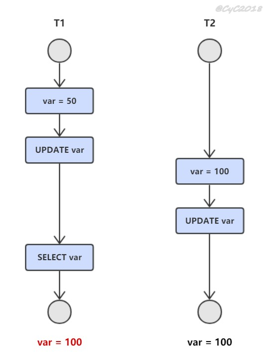
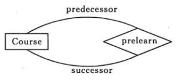

* [點擊閱讀面試進階指南 ](https://github.com/CyC2018/Backend-Interview-Guide)
<!-- GFM-TOC -->
* [一、事務](#一事務)
    * [概念](#概念)
    * [ACID](#acid)
    * [AUTOCOMMIT](#autocommit)
* [二、並發一致性問題](#二並發一致性問題)
    * [丟失修改](#丟失修改)
    * [讀髒數據](#讀髒數據)
    * [不可重復讀](#不可重復讀)
    * [幻影讀](#幻影讀)
* [三、封鎖](#三封鎖)
    * [封鎖粒度](#封鎖粒度)
    * [封鎖類型](#封鎖類型)
    * [封鎖協議](#封鎖協議)
    * [MySQL 隱式與顯示鎖定](#mysql-隱式與顯示鎖定)
* [四、隔離級別](#四隔離級別)
    * [未提交讀（READ UNCOMMITTED）](#未提交讀read-uncommitted)
    * [提交讀（READ COMMITTED）](#提交讀read-committed)
    * [可重復讀（REPEATABLE READ）](#可重復讀repeatable-read)
    * [可串行化（SERIALIZABLE）](#可串行化serializable)
* [五、多版本並發控制](#五多版本並發控制)
    * [版本號](#版本號)
    * [隱藏的列](#隱藏的列)
    * [Undo 日志](#undo-日志)
    * [實現過程](#實現過程)
    * [快照讀與當前讀](#快照讀與當前讀)
* [六、Next-Key Locks](#六next-key-locks)
    * [Record Locks](#record-locks)
    * [Gap Locks](#gap-locks)
    * [Next-Key Locks](#next-key-locks)
* [七、關系資料庫設計理論](#七關系資料庫設計理論)
    * [函數依賴](#函數依賴)
    * [異常](#異常)
    * [範式](#範式)
* [八、ER 圖](#八er-圖)
    * [實體的三種聯系](#實體的三種聯系)
    * [表示出現多次的關系](#表示出現多次的關系)
    * [聯系的多向性](#聯系的多向性)
    * [表示子類](#表示子類)
* [參考資料](#參考資料)
<!-- GFM-TOC -->


# 一、事務

## 概念

事務指的是滿足 ACID 特性的一組操作，可以通過 Commit 提交一個事務，也可以使用 Rollback 進行回滾。

<div align="center">  </div><br>

## ACID

### 1. 原子性（Atomicity）

事務被視為不可分割的最小單元，事務的所有操作要麼全部提交成功，要麼全部失敗回滾。

回滾可以用回滾日志來實現，回滾日志記錄著事務所執行的修改操作，在回滾時反向執行這些修改操作即可。

### 2. 一致性（Consistency）

資料庫在事務執行前後都保持一致性狀態。在一致性狀態下，所有事務對一個數據的讀取結果都是相同的。

### 3. 隔離性（Isolation）

一個事務所做的修改在最終提交以前，對其它事務是不可見的。

### 4. 持久性（Durability）

一旦事務提交，則其所做的修改將會永遠保存到資料庫中。即使系統發生崩潰，事務執行的結果也不能丟失。

使用重做日志來保證持久性。

----

事務的 ACID 特性概念簡單，但不是很好理解，主要是因為這幾個特性不是一種平級關系：

- 只有滿足一致性，事務的執行結果才是正確的。
- 在無並發的情況下，事務串行執行，隔離性一定能夠滿足。此時只要能滿足原子性，就一定能滿足一致性。
- 在並發的情況下，多個事務並行執行，事務不僅要滿足原子性，還需要滿足隔離性，才能滿足一致性。
- 事務滿足持久化是為了能應對資料庫崩潰的情況。

<div align="center">  </div><br>

## AUTOCOMMIT

MySQL 默認采用自動提交模式。也就是說，如果不顯式使用`START TRANSACTION`語句來開始一個事務，那麼每個查詢都會被當做一個事務自動提交。

# 二、並發一致性問題

在並發環境下，事務的隔離性很難保證，因此會出現很多並發一致性問題。

## 丟失修改

T<sub>1</sub> 和 T<sub>2</sub> 兩個事務都對一個數據進行修改，T<sub>1</sub> 先修改，T<sub>2</sub> 隨後修改，T<sub>2</sub> 的修改覆蓋了 T<sub>1</sub> 的修改。

<div align="center">  </div><br>

## 讀髒數據

T<sub>1</sub> 修改一個數據，T<sub>2</sub> 隨後讀取這個數據。如果 T<sub>1</sub> 撤銷了這次修改，那麼 T<sub>2</sub> 讀取的數據是髒數據。

<div align="center">  </div><br>

## 不可重復讀

T<sub>2</sub> 讀取一個數據，T<sub>1</sub> 對該數據做了修改。如果 T<sub>2</sub> 再次讀取這個數據，此時讀取的結果和第一次讀取的結果不同。

<div align="center">  </div><br>


## 幻影讀

T<sub>1</sub> 讀取某個範圍的數據，T<sub>2</sub> 在這個範圍內插入新的數據，T<sub>1</sub> 再次讀取這個範圍的數據，此時讀取的結果和和第一次讀取的結果不同。

<div align="center">  </div><br>


----

產生並發不一致性問題主要原因是破壞了事務的隔離性，解決方法是通過並發控制來保證隔離性。並發控制可以通過封鎖來實現，但是封鎖操作需要用戶自己控制，相當復雜。資料庫管理系統提供了事務的隔離級別，讓用戶以一種更輕松的方式處理並發一致性問題。

# 三、封鎖

## 封鎖粒度

MySQL 中提供了兩種封鎖粒度：行級鎖以及表級鎖。

應該盡量只鎖定需要修改的那部分數據，而不是所有的資源。鎖定的數據量越少，發生鎖爭用的可能就越小，系統的並發程度就越高。

但是加鎖需要消耗資源，鎖的各種操作（包括獲取鎖、釋放鎖、以及檢查鎖狀態）都會增加系統開銷。因此封鎖粒度越小，系統開銷就越大。

在選擇封鎖粒度時，需要在鎖開銷和並發程度之間做一個權衡。

<div align="center">  </div><br>

## 封鎖類型

### 1. 讀寫鎖

- 排它鎖（Exclusive），簡寫為 X 鎖，又稱寫鎖。
- 共享鎖（Shared），簡寫為 S 鎖，又稱讀鎖。

有以下兩個規定：

- 一個事務對數據對像 A 加了 X 鎖，就可以對 A 進行讀取和更新。加鎖期間其它事務不能對 A 加任何鎖。
- 一個事務對數據對像 A 加了 S 鎖，可以對 A 進行讀取操作，但是不能進行更新操作。加鎖期間其它事務能對 A 加 S 鎖，但是不能加 X 鎖。

鎖的兼容關系如下：

| - | X | S |
| :--: | :--: | :--: |
|X|×|×|
|S|×|√|

### 2. 意向鎖

使用意向鎖（Intention Locks）可以更容易地支持多粒度封鎖。

在存在行級鎖和表級鎖的情況下，事務 T 想要對表 A 加 X 鎖，就需要先檢測是否有其它事務對表 A 或者表 A 中的任意一行加了鎖，那麼就需要對表 A 的每一行都檢測一次，這是非常耗時的。

意向鎖在原來的 X/S 鎖之上引入了 IX/IS，IX/IS 都是表鎖，用來表示一個事務想要在表中的某個數據行上加 X 鎖或 S 鎖。有以下兩個規定：

- 一個事務在獲得某個數據行對像的 S 鎖之前，必須先獲得表的 IS 鎖或者更強的鎖；
- 一個事務在獲得某個數據行對像的 X 鎖之前，必須先獲得表的 IX 鎖。

通過引入意向鎖，事務 T 想要對表 A 加 X 鎖，只需要先檢測是否有其它事務對表 A 加了 X/IX/S/IS 鎖，如果加了就表示有其它事務正在使用這個表或者表中某一行的鎖，因此事務 T 加 X 鎖失敗。

各種鎖的兼容關系如下：

| - | X | IX | S | IS |
| :--: | :--: | :--: | :--: | :--: |
|X     |×    |×    |×   | ×|
|IX    |×    |√   |×   | √|
|S     |×    |×    |√  | √|
|IS    |×    |√  |√  | √|

解釋如下：

- 任意 IS/IX 鎖之間都是兼容的，因為它們只是表示想要對表加鎖，而不是真正加鎖；
- S 鎖只與 S 鎖和 IS 鎖兼容，也就是說事務 T 想要對數據行加 S 鎖，其它事務可以已經獲得對表或者表中的行的 S 鎖。

## 封鎖協議

### 1. 三級封鎖協議

**一級封鎖協議** 

事務 T 要修改數據 A 時必須加 X 鎖，直到 T 結束才釋放鎖。

可以解決丟失修改問題，因為不能同時有兩個事務對同一個數據進行修改，那麼事務的修改就不會被覆蓋。

| T<sub>1</sub> | T<sub>2</sub> |
| :--: | :--: |
| lock-x(A) | |
| read A=20 | |
| | lock-x(A) |
|  | wait |
| write A=19 |. |
| commit |. |
| unlock-x(A) |. |
| | obtain |
| | read A=19 |
| | write A=21 |
| | commit |
| | unlock-x(A)|

**二級封鎖協議** 

在一級的基礎上，要求讀取數據 A 時必須加 S 鎖，讀取完馬上釋放 S 鎖。

可以解決讀髒數據問題，因為如果一個事務在對數據 A 進行修改，根據 1 級封鎖協議，會加 X 鎖，那麼就不能再加 S 鎖了，也就是不會讀入數據。

| T<sub>1</sub> | T<sub>2</sub> |
| :--: | :--: |
| lock-x(A) | |
| read A=20 | |
| write A=19 | |
| | lock-s(A) |
|  | wait |
| rollback | .|
| A=20 |. |
| unlock-x(A) |. |
| | obtain |
| | read A=20 |
| | unlock-s(A)|
| | commit |

**三級封鎖協議** 

在二級的基礎上，要求讀取數據 A 時必須加 S 鎖，直到事務結束了才能釋放 S 鎖。

可以解決不可重復讀的問題，因為讀 A 時，其它事務不能對 A 加 X 鎖，從而避免了在讀的期間數據發生改變。

| T<sub>1</sub> | T<sub>2</sub> |
| :--: | :--: |
| lock-s(A) | |
| read A=20 | |
|  |lock-x(A) |
| | wait |
|  read A=20| . |
| commit | .|
| unlock-s(A) |. |
| | obtain |
| | read A=20 |
| | write A=19|
| | commit |
| | unlock-X(A)|

### 2. 兩段鎖協議

加鎖和解鎖分為兩個階段進行。

可串行化調度是指，通過並發控制，使得並發執行的事務結果與某個串行執行的事務結果相同。

事務遵循兩段鎖協議是保證可串行化調度的充分條件。例如以下操作滿足兩段鎖協議，它是可串行化調度。

```html
lock-x(A)...lock-s(B)...lock-s(C)...unlock(A)...unlock(C)...unlock(B)
```

但不是必要條件，例如以下操作不滿足兩段鎖協議，但是它還是可串行化調度。

```html
lock-x(A)...unlock(A)...lock-s(B)...unlock(B)...lock-s(C)...unlock(C)
```

## MySQL 隱式與顯示鎖定

MySQL 的 InnoDB 存儲引擎采用兩段鎖協議，會根據隔離級別在需要的時候自動加鎖，並且所有的鎖都是在同一時刻被釋放，這被稱為隱式鎖定。

InnoDB 也可以使用特定的語句進行顯示鎖定：

```sql
SELECT ... LOCK In SHARE MODE;
SELECT ... FOR UPDATE;
```

# 四、隔離級別

## 未提交讀（READ UNCOMMITTED）

事務中的修改，即使沒有提交，對其它事務也是可見的。

## 提交讀（READ COMMITTED）

一個事務只能讀取已經提交的事務所做的修改。換句話說，一個事務所做的修改在提交之前對其它事務是不可見的。

## 可重復讀（REPEATABLE READ）

保證在同一個事務中多次讀取同樣數據的結果是一樣的。

## 可串行化（SERIALIZABLE）

強制事務串行執行。

----

| 隔離級別 | 髒讀 | 不可重復讀 | 幻影讀 | 加鎖讀 |
| :---: | :---: | :---:| :---: | :---: |
| 未提交讀 | √ | √ | √ | × |
| 提交讀 | × | √ | √ | × |
| 可重復讀 | × | × | √ | × |
| 可串行化 | × | × | × | √ |

# 五、多版本並發控制

多版本並發控制（Multi-Version Concurrency Control, MVCC）是 MySQL 的 InnoDB 存儲引擎實現隔離級別的一種具體方式，用於實現提交讀和可重復讀這兩種隔離級別。而未提交讀隔離級別總是讀取最新的數據行，無需使用 MVCC。可串行化隔離級別需要對所有讀取的行都加鎖，單純使用 MVCC 無法實現。

## 版本號

- 系統版本號：是一個遞增的數字，每開始一個新的事務，系統版本號就會自動遞增。
- 事務版本號：事務開始時的系統版本號。

## 隱藏的列

MVCC 在每行記錄後面都保存著兩個隱藏的列，用來存儲兩個版本號：

- 創建版本號：指示創建一個數據行的快照時的系統版本號；
- 刪除版本號：如果該快照的刪除版本號大於當前事務版本號表示該快照有效，否則表示該快照已經被刪除了。

## Undo 日志

MVCC 使用到的快照存儲在 Undo 日志中，該日志通過回滾指針把一個數據行（Record）的所有快照連接起來。

<div align="center">  </div><br>

## 實現過程

以下實現過程針對可重復讀隔離級別。

當開始新一個事務時，該事務的版本號肯定會大於當前所有數據行快照的創建版本號，理解這一點很關鍵。

### 1. SELECT

多個事務必須讀取到同一個數據行的快照，並且這個快照是距離現在最近的一個有效快照。但是也有例外，如果有一個事務正在修改該數據行，那麼它可以讀取事務本身所做的修改，而不用和其它事務的讀取結果一致。

把沒有對一個數據行做修改的事務稱為 T，T 所要讀取的數據行快照的創建版本號必須小於 T 的版本號，因為如果大於或者等於 T 的版本號，那麼表示該數據行快照是其它事務的最新修改，因此不能去讀取它。除此之外，T 所要讀取的數據行快照的刪除版本號必須大於 T 的版本號，因為如果小於等於 T 的版本號，那麼表示該數據行快照是已經被刪除的，不應該去讀取它。

### 2. INSERT

將當前系統版本號作為數據行快照的創建版本號。

### 3. DELETE

將當前系統版本號作為數據行快照的刪除版本號。

### 4. UPDATE

將當前系統版本號作為更新前的數據行快照的刪除版本號，並將當前系統版本號作為更新後的數據行快照的創建版本號。可以理解為先執行 DELETE 後執行 INSERT。

## 快照讀與當前讀

### 1. 快照讀

使用 MVCC 讀取的是快照中的數據，這樣可以減少加鎖所帶來的開銷。

```sql
select * from table ...;
```

### 2. 當前讀

讀取的是最新的數據，需要加鎖。以下第一個語句需要加 S 鎖，其它都需要加 X 鎖。

```sql
select * from table where ? lock in share mode;
select * from table where ? for update;
insert;
update;
delete;
```

# 六、Next-Key Locks

Next-Key Locks 是 MySQL 的 InnoDB 存儲引擎的一種鎖實現。

MVCC 不能解決幻讀的問題，Next-Key Locks 就是為了解決這個問題而存在的。在可重復讀（REPEATABLE READ）隔離級別下，使用 MVCC + Next-Key Locks 可以解決幻讀問題。

## Record Locks

鎖定一個記錄上的索引，而不是記錄本身。

如果表沒有設置索引，InnoDB 會自動在主鍵上創建隱藏的聚簇索引，因此 Record Locks 依然可以使用。

## Gap Locks

鎖定索引之間的間隙，但是不包含索引本身。例如當一個事務執行以下語句，其它事務就不能在 t.c 中插入 15。

```sql
SELECT c FROM t WHERE c BETWEEN 10 and 20 FOR UPDATE;
```

## Next-Key Locks

它是 Record Locks 和 Gap Locks 的結合，不僅鎖定一個記錄上的索引，也鎖定索引之間的間隙。例如一個索引包含以下值：10, 11, 13, and 20，那麼就需要鎖定以下區間：

```sql
(negative infinity, 10]
(10, 11]
(11, 13]
(13, 20]
(20, positive infinity)
```

# 七、關系資料庫設計理論

## 函數依賴

記 A->B 表示 A 函數決定 B，也可以說 B 函數依賴於 A。

如果 {A1，A2，... ，An} 是關系的一個或多個屬性的集合，該集合函數決定了關系的其它所有屬性並且是最小的，那麼該集合就稱為鍵碼。

對於 A->B，如果能找到 A 的真子集 A'，使得 A'-> B，那麼 A->B 就是部分函數依賴，否則就是完全函數依賴。

對於 A->B，B->C，則 A->C 是一個傳遞函數依賴。

## 異常

以下的學生課程關系的函數依賴為 Sno, Cname -> Sname, Sdept, Mname, Grade，鍵碼為 {Sno, Cname}。也就是說，確定學生和課程之後，就能確定其它信息。

| Sno | Sname | Sdept | Mname | Cname | Grade |
| :---: | :---: | :---: | :---: | :---: |:---:|
| 1 | 學生-1 | 學院-1 | 院長-1 | 課程-1 | 90 |
| 2 | 學生-2 | 學院-2 | 院長-2 | 課程-2 | 80 |
| 2 | 學生-2 | 學院-2 | 院長-2 | 課程-1 | 100 |
| 3 | 學生-3 | 學院-2 | 院長-2 | 課程-2 | 95 |

不符合範式的關系，會產生很多異常，主要有以下四種異常：

- 冗余數據：例如 `學生-2` 出現了兩次。
- 修改異常：修改了一個記錄中的信息，但是另一個記錄中相同的信息卻沒有被修改。
- 刪除異常：刪除一個信息，那麼也會丟失其它信息。例如刪除了 `課程-1` 需要刪除第一行和第三行，那麼 `學生-1` 的信息就會丟失。
- 插入異常：例如想要插入一個學生的信息，如果這個學生還沒選課，那麼就無法插入。

## 範式

範式理論是為了解決以上提到四種異常。

高級別範式的依賴於低級別的範式，1NF 是最低級別的範式。

<div align="center">  </div><br>

### 1. 第一範式 (1NF)

屬性不可分。

### 2. 第二範式 (2NF)

每個非主屬性完全函數依賴於鍵碼。

可以通過分解來滿足。

<font size=4> **分解前** </font><br>

| Sno | Sname | Sdept | Mname | Cname | Grade |
| :---: | :---: | :---: | :---: | :---: |:---:|
| 1 | 學生-1 | 學院-1 | 院長-1 | 課程-1 | 90 |
| 2 | 學生-2 | 學院-2 | 院長-2 | 課程-2 | 80 |
| 2 | 學生-2 | 學院-2 | 院長-2 | 課程-1 | 100 |
| 3 | 學生-3 | 學院-2 | 院長-2 | 課程-2 | 95 |

以上學生課程關系中，{Sno, Cname} 為鍵碼，有如下函數依賴：

- Sno -> Sname, Sdept
- Sdept -> Mname
- Sno, Cname-> Grade

Grade 完全函數依賴於鍵碼，它沒有任何冗余數據，每個學生的每門課都有特定的成績。

Sname, Sdept 和 Mname 都部分依賴於鍵碼，當一個學生選修了多門課時，這些數據就會出現多次，造成大量冗余數據。

<font size=4> **分解後** </font><br>

關系-1

| Sno | Sname | Sdept | Mname |
| :---: | :---: | :---: | :---: |
| 1 | 學生-1 | 學院-1 | 院長-1 |
| 2 | 學生-2 | 學院-2 | 院長-2 |
| 3 | 學生-3 | 學院-2 | 院長-2 |

有以下函數依賴：

- Sno -> Sname, Sdept
- Sdept -> Mname

關系-2

| Sno | Cname | Grade |
| :---: | :---: |:---:|
| 1 | 課程-1 | 90 |
| 2 | 課程-2 | 80 |
| 2 | 課程-1 | 100 |
| 3 | 課程-2 | 95 |

有以下函數依賴：

- Sno, Cname ->  Grade

### 3. 第三範式 (3NF)

非主屬性不傳遞函數依賴於鍵碼。

上面的 關系-1 中存在以下傳遞函數依賴：

- Sno -> Sdept -> Mname

可以進行以下分解：

關系-11

| Sno | Sname | Sdept |
| :---: | :---: | :---: |
| 1 | 學生-1 | 學院-1 |
| 2 | 學生-2 | 學院-2 |
| 3 | 學生-3 | 學院-2 |

關系-12

| Sdept | Mname |
| :---: | :---: |
| 學院-1 | 院長-1 |
| 學院-2 | 院長-2 |

# 八、ER 圖

Entity-Relationship，有三個組成部分：實體、屬性、聯系。

用來進行關系型資料庫系統的概念設計。

## 實體的三種聯系

包含一對一，一對多，多對多三種。

- 如果 A 到 B 是一對多關系，那麼畫個帶箭頭的線段指向 B；
- 如果是一對一，畫兩個帶箭頭的線段；
- 如果是多對多，畫兩個不帶箭頭的線段。

下圖的 Course 和 Student 是一對多的關系。

<div align="center">  </div><br>

## 表示出現多次的關系

一個實體在聯系出現幾次，就要用幾條線連接。

下圖表示一個課程的先修關系，先修關系出現兩個 Course 實體，第一個是先修課程，後一個是後修課程，因此需要用兩條線來表示這種關系。

<div align="center">  </div><br>

## 聯系的多向性

雖然老師可以開設多門課，並且可以教授多名學生，但是對於特定的學生和課程，只有一個老師教授，這就構成了一個三元聯系。

<div align="center">  </div><br>

一般只使用二元聯系，可以把多元聯系轉換為二元聯系。

<div align="center">  </div><br>

## 表示子類

用一個三角形和兩條線來連接類和子類，與子類有關的屬性和聯系都連到子類上，而與父類和子類都有關的連到父類上。

<div align="center">  </div><br>

# 參考資料

- AbrahamSilberschatz, HenryF.Korth, S.Sudarshan, 等. 資料庫系統概念 [M]. 機械工業出版社, 2006.
- 施瓦茨. 高性能 MYSQL(第3版)[M]. 電子工業出版社, 2013.
- 史嘉權. 資料庫系統概論[M]. 清華大學出版社有限公司, 2006.
- [The InnoDB Storage Engine](https://dev.mysql.com/doc/refman/5.7/en/innodb-storage-engine.html)
- [Transaction isolation levels](https://www.slideshare.net/ErnestoHernandezRodriguez/transaction-isolation-levels)
- [Concurrency Control](http://scanftree.com/dbms/2-phase-locking-protocol)
- [The Nightmare of Locking, Blocking and Isolation Levels!](https://www.slideshare.net/brshristov/the-nightmare-of-locking-blocking-and-isolation-levels-46391666)
- [Database Normalization and Normal Forms with an Example](https://aksakalli.github.io/2012/03/12/database-normalization-and-normal-forms-with-an-example.html)
- [The basics of the InnoDB undo logging and history system](https://blog.jcole.us/2014/04/16/the-basics-of-the-innodb-undo-logging-and-history-system/)
- [MySQL locking for the busy web developer](https://www.brightbox.com/blog/2013/10/31/on-mysql-locks/)
- [淺入淺出 MySQL 和 InnoDB](https://draveness.me/mysql-innodb)
- [Innodb 中的事務隔離級別和鎖的關系](https://tech.meituan.com/2014/08/20/innodb-lock.html)
