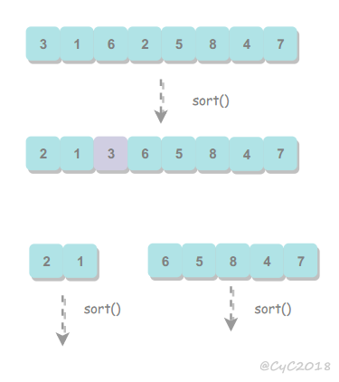
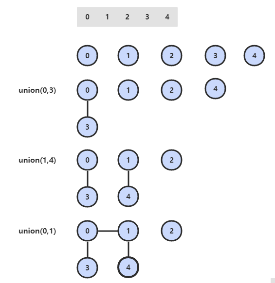

* [點擊閱讀面試進階指南 ](https://github.com/CyC2018/Backend-Interview-Guide)
<!-- GFM-TOC -->
* [一、前言](#一前言)
* [二、算法分析](#二算法分析)
    * [數學模型](#數學模型)
    * [注意事項](#注意事項)
    * [ThreeSum](#threesum)
    * [倍率實驗](#倍率實驗)
* [三、排序](#三排序)
    * [選擇排序](#選擇排序)
    * [冒泡排序](#冒泡排序)
    * [插入排序](#插入排序)
    * [希爾排序](#希爾排序)
    * [歸並排序](#歸並排序)
    * [快速排序](#快速排序)
    * [堆排序](#堆排序)
    * [小結](#小結)
* [四、並查集](#四並查集)
    * [Quick Find](#quick-find)
    * [Quick Union](#quick-union)
    * [加權 Quick Union](#加權-quick-union)
    * [路徑壓縮的加權 Quick Union](#路徑壓縮的加權-quick-union)
    * [比較](#比較)
* [五、棧和隊列](#五棧和隊列)
    * [棧](#棧)
    * [隊列](#隊列)
* [六、符號表](#六符號表)
    * [初級實現](#初級實現)
    * [二叉查找樹](#二叉查找樹)
    * [2-3 查找樹](#2-3-查找樹)
    * [紅黑樹](#紅黑樹)
    * [散列表](#散列表)
    * [小結](#小結)
* [七、其它](#七其它)
    * [漢諾塔](#漢諾塔)
    * [哈夫曼編碼](#哈夫曼編碼)
* [參考資料](#參考資料)
<!-- GFM-TOC -->


# 一、前言

- 實現代碼：[Algorithm](https://github.com/CyC2018/Algorithm)
- 繪圖文件：[ProcessOn](https://www.processon.com/view/link/5a3e4c1ee4b0ce9ffea8c727)

# 二、算法分析

## 數學模型

### 1. 近似

N<sup>3</sup>/6-N<sup>2</sup>/2+N/3 \~ N<sup>3</sup>/6。使用 \~f(N) 來表示所有隨著 N 的增大除以 f(N) 的結果趨近於 1 的函數。

### 2. 增長數量級

N<sup>3</sup>/6-N<sup>2</sup>/2+N/3 的增長數量級為 O(N<sup>3</sup>)。增長數量級將算法與它的實現隔離開來，一個算法的增長數量級為 O(N<sup>3</sup>) 與它是否用 Java 實現，是否運行於特定計算機上無關。

### 3. 內循環

執行最頻繁的指令決定了程序執行的總時間，把這些指令稱為程序的內循環。

### 4. 成本模型

使用成本模型來評估算法，例如數組的訪問次數就是一種成本模型。

## 注意事項

### 1. 大常數

在求近似時，如果低級項的常數系數很大，那麼近似的結果就是錯誤的。

### 2. 緩存

計算機系統會使用緩存技術來組織內存，訪問數組相鄰的元素會比訪問不相鄰的元素快很多。

### 3. 對最壞情況下的性能的保證

在核反應堆、心髒起搏器或者剎車控制器中的軟件，最壞情況下的性能是十分重要的。

### 4. 隨機化算法

通過打亂輸入，去除算法對輸入的依賴。

### 5. 均攤分析

將所有操作的總成本除於操作總數來將成本均攤。例如對一個空棧進行 N 次連續的 push() 調用需要訪問數組的次數為 N+4+8+16+...+2N=5N-4（N 是向數組寫入元素的操作次數，其余的都是調整數組大小時進行復制需要的訪問數組次數），均攤後訪問數組的平均次數為常數。

## ThreeSum

ThreeSum 用於統計一個數組中和為 0 的三元組數量。

```java
public interface ThreeSum {
    int count(int[] nums);
}
```

### 1. ThreeSumSlow

該算法的內循環為 `if (nums[i] + nums[j] + nums[k] == 0)` 語句，總共執行的次數為 N(N-1)(N-2) = N<sup>3</sup>/6-N<sup>2</sup>/2+N/3，因此它的近似執行次數為 \~N<sup>3</sup>/6，增長數量級為 O(N<sup>3</sup>)。

```java
public class ThreeSumSlow implements ThreeSum {
    @Override
    public int count(int[] nums) {
        int N = nums.length;
        int cnt = 0;
        for (int i = 0; i < N; i++) {
            for (int j = i + 1; j < N; j++) {
                for (int k = j + 1; k < N; k++) {
                    if (nums[i] + nums[j] + nums[k] == 0) {
                        cnt++;
                    }
                }
            }
        }
        return cnt;
    }
}
```

### 2. ThreeSumBinarySearch

通過將數組先排序，對兩個元素求和，並用二分查找方法查找是否存在該和的相反數，如果存在，就說明存在三元組的和為 0。

應該注意的是，只有數組不含有相同元素才能使用這種解法，否則二分查找的結果會出錯。

該方法可以將 ThreeSum 算法增長數量級降低為 O(N<sup>2</sup>logN)。

```java
public class ThreeSumBinarySearch implements ThreeSum {

    @Override
    public int count(int[] nums) {
        Arrays.sort(nums);
        int N = nums.length;
        int cnt = 0;
        for (int i = 0; i < N; i++) {
            for (int j = i + 1; j < N; j++) {
                int target = -nums[i] - nums[j];
                int index = BinarySearch.search(nums, target);
                // 應該注意這裡的下標必須大於 j，否則會重復統計。
                if (index > j) {
                    cnt++;
                }
            }
        }
        return cnt;
    }
}
```

```java
public class BinarySearch {

    public static int search(int[] nums, int target) {
        int l = 0, h = nums.length - 1;
        while (l <= h) {
            int m = l + (h - l) / 2;
            if (target == nums[m]) {
                return m;
            } else if (target > nums[m]) {
                l = m + 1;
            } else {
                h = m - 1;
            }
        }
        return -1;
    }
}
```

### 3. ThreeSumTwoPointer

更有效的方法是先將數組排序，然後使用雙指針進行查找，時間復雜度為 O(N<sup>2</sup>)。

```java
public class ThreeSumTwoPointer implements ThreeSum {

    @Override
    public int count(int[] nums) {
        int N = nums.length;
        int cnt = 0;
        Arrays.sort(nums);
        for (int i = 0; i < N - 2; i++) {
            int l = i + 1, h = N - 1, target = -nums[i];
            if (i > 0 && nums[i] == nums[i - 1]) continue;
            while (l < h) {
                int sum = nums[l] + nums[h];
                if (sum == target) {
                    cnt++;
                    while (l < h && nums[l] == nums[l + 1]) l++;
                    while (l < h && nums[h] == nums[h - 1]) h--;
                    l++;
                    h--;
                } else if (sum < target) {
                    l++;
                } else {
                    h--;
                }
            }
        }
        return cnt;
    }
}
```

## 倍率實驗

如果 T(N) \~ aN<sup>b</sup>logN，那麼 T(2N)/T(N) \~ 2<sup>b</sup>。

例如對於暴力的 ThreeSum 算法，近似時間為 \~N<sup>3</sup>/6。進行如下實驗：多次運行該算法，每次取的 N 值為前一次的兩倍，統計每次執行的時間，並統計本次運行時間與前一次運行時間的比值，得到如下結果：

| N | Time(ms) | Ratio |
| :---: | :---: | :---: |
| 500 | 48 | / |
| 1000 | 320 | 6.7 |
| 2000 | 555 | 1.7 |
| 4000 | 4105 | 7.4 |
| 8000 | 33575 | 8.2 |
| 16000 | 268909 | 8.0 |

可以看到，T(2N)/T(N) \~ 2<sup>3</sup>，因此可以確定 T(N) \~ aN<sup>3</sup>logN。

```java
public class RatioTest {

    public static void main(String[] args) {
        int N = 500;
        int loopTimes = 7;
        double preTime = -1;
        while (loopTimes-- > 0) {
            int[] nums = new int[N];
            StopWatch.start();
            ThreeSum threeSum = new ThreeSumSlow();
            int cnt = threeSum.count(nums);
            System.out.println(cnt);
            double elapsedTime = StopWatch.elapsedTime();
            double ratio = preTime == -1 ? 0 : elapsedTime / preTime;
            System.out.println(N + "  " + elapsedTime + "  " + ratio);
            preTime = elapsedTime;
            N *= 2;
        }
    }
}
```

```java
public class StopWatch {

    private static long start;


    public static void start() {
        start = System.currentTimeMillis();
    }


    public static double elapsedTime() {
        long now = System.currentTimeMillis();
        return (now - start) / 1000.0;
    }
}
```

# 三、排序

待排序的元素需要實現 Java 的 Comparable 接口，該接口有 compareTo() 方法，可以用它來判斷兩個元素的大小關系。

研究排序算法的成本模型時，統計的是比較和交換的次數。

使用輔助函數 less() 和 swap() 來進行比較和交換的操作，使得代碼的可讀性和可移植性更好。

```java
public abstract class Sort<T extends Comparable<T>> {

    public abstract void sort(T[] nums);

    protected boolean less(T v, T w) {
        return v.compareTo(w) < 0;
    }

    protected void swap(T[] a, int i, int j) {
        T t = a[i];
        a[i] = a[j];
        a[j] = t;
    }
}
```

## 選擇排序

選擇出數組中的最小元素，將它與數組的第一個元素交換位置。再從剩下的元素中選擇出最小的元素，將它與數組的第二個元素交換位置。不斷進行這樣的操作，直到將整個數組排序。

選擇排序需要 \~N<sup>2</sup>/2 次比較和 \~N 次交換，它的運行時間與輸入無關，這個特點使得它對一個已經排序的數組也需要這麼多的比較和交換操作。

<div align="center">  </div><br>

```java
public class Selection<T extends Comparable<T>> extends Sort<T> {

    @Override
    public void sort(T[] nums) {
        int N = nums.length;
        for (int i = 0; i < N - 1; i++) {
            int min = i;
            for (int j = i + 1; j < N; j++) {
                if (less(nums[j], nums[min])) {
                    min = j;
                }
            }
            swap(nums, i, min);
        }
    }
}
```

## 冒泡排序

從左到右不斷交換相鄰逆序的元素，在一輪的循環之後，可以讓未排序的最大元素上浮到右側。

在一輪循環中，如果沒有發生交換，就說明數組已經是有序的，此時可以直接退出。

<div align="center">  </div><br>

```java
public class Bubble<T extends Comparable<T>> extends Sort<T> {

    @Override
    public void sort(T[] nums) {
        int N = nums.length;
        boolean hasSorted = false;
        for (int i = N - 1; i > 0 && !hasSorted; i--) {
            hasSorted = true;
            for (int j = 0; j < i; j++) {
                if (less(nums[j + 1], nums[j])) {
                    hasSorted = false;
                    swap(nums, j, j + 1);
                }
            }
        }
    }
}
```

## 插入排序

每次都將當前元素插入到左側已經排序的數組中，使得插入之後左側數組依然有序。

對於數組 {3, 5, 2, 4, 1}，它具有以下逆序：(3, 2), (3, 1), (5, 2), (5, 4), (5, 1), (2, 1), (4, 1)，插入排序每次只能交換相鄰元素，令逆序數量減少 1，因此插入排序需要交換的次數為逆序數量。

插入排序的復雜度取決於數組的初始順序，如果數組已經部分有序了，逆序較少，那麼插入排序會很快。

- 平均情況下插入排序需要 \~N<sup>2</sup>/4 比較以及 \~N<sup>2</sup>/4 次交換；
- 最壞的情況下需要 \~N<sup>2</sup>/2 比較以及 \~N<sup>2</sup>/2 次交換，最壞的情況是數組是倒序的；
- 最好的情況下需要 N-1 次比較和 0 次交換，最好的情況就是數組已經有序了。

以下演示了在一輪循環中，將元素 2 插入到左側已經排序的數組中。

<div align="center">  </div><br>

```java
public class Insertion<T extends Comparable<T>> extends Sort<T> {

    @Override
    public void sort(T[] nums) {
        int N = nums.length;
        for (int i = 1; i < N; i++) {
            for (int j = i; j > 0 && less(nums[j], nums[j - 1]); j--) {
                swap(nums, j, j - 1);
            }
        }
    }
}
```

## 希爾排序

對於大規模的數組，插入排序很慢，因為它只能交換相鄰的元素，每次只能將逆序數量減少 1。

希爾排序的出現就是為了解決插入排序的這種局限性，它通過交換不相鄰的元素，每次可以將逆序數量減少大於 1。

希爾排序使用插入排序對間隔 h 的序列進行排序。通過不斷減小 h，最後令 h=1，就可以使得整個數組是有序的。

<div align="center">  </div><br>

```java
public class Shell<T extends Comparable<T>> extends Sort<T> {

    @Override
    public void sort(T[] nums) {

        int N = nums.length;
        int h = 1;

        while (h < N / 3) {
            h = 3 * h + 1; // 1, 4, 13, 40, ...
        }

        while (h >= 1) {
            for (int i = h; i < N; i++) {
                for (int j = i; j >= h && less(nums[j], nums[j - h]); j -= h) {
                    swap(nums, j, j - h);
                }
            }
            h = h / 3;
        }
    }
}

```

希爾排序的運行時間達不到平方級別，使用遞增序列 1, 4, 13, 40, ...  的希爾排序所需要的比較次數不會超過 N 的若干倍乘於遞增序列的長度。後面介紹的高級排序算法只會比希爾排序快兩倍左右。

## 歸並排序

歸並排序的思想是將數組分成兩部分，分別進行排序，然後歸並起來。

<div align="center">  </div><br>

### 1. 歸並方法

歸並方法將數組中兩個已經排序的部分歸並成一個。

```java
public abstract class MergeSort<T extends Comparable<T>> extends Sort<T> {

    protected T[] aux;


    protected void merge(T[] nums, int l, int m, int h) {

        int i = l, j = m + 1;

        for (int k = l; k <= h; k++) {
            aux[k] = nums[k]; // 將數據復制到輔助數組
        }

        for (int k = l; k <= h; k++) {
            if (i > m) {
                nums[k] = aux[j++];

            } else if (j > h) {
                nums[k] = aux[i++];

            } else if (aux[i].compareTo(nums[j]) <= 0) {
                nums[k] = aux[i++]; // 先進行這一步，保證穩定性

            } else {
                nums[k] = aux[j++];
            }
        }
    }
}
```

### 2. 自頂向下歸並排序

將一個大數組分成兩個小數組去求解。

因為每次都將問題對半分成兩個子問題，這種對半分的算法復雜度一般為 O(NlogN)。

```java
public class Up2DownMergeSort<T extends Comparable<T>> extends MergeSort<T> {

    @Override
    public void sort(T[] nums) {
        aux = (T[]) new Comparable[nums.length];
        sort(nums, 0, nums.length - 1);
    }

    private void sort(T[] nums, int l, int h) {
        if (h <= l) {
            return;
        }
        int mid = l + (h - l) / 2;
        sort(nums, l, mid);
        sort(nums, mid + 1, h);
        merge(nums, l, mid, h);
    }
}
```

### 3. 自底向上歸並排序

先歸並那些微型數組，然後成對歸並得到的微型數組。

```java
public class Down2UpMergeSort<T extends Comparable<T>> extends MergeSort<T> {

    @Override
    public void sort(T[] nums) {

        int N = nums.length;
        aux = (T[]) new Comparable[N];

        for (int sz = 1; sz < N; sz += sz) {
            for (int lo = 0; lo < N - sz; lo += sz + sz) {
                merge(nums, lo, lo + sz - 1, Math.min(lo + sz + sz - 1, N - 1));
            }
        }
    }
}

```

## 快速排序

### 1. 基本算法

- 歸並排序將數組分為兩個子數組分別排序，並將有序的子數組歸並使得整個數組排序；
- 快速排序通過一個切分元素將數組分為兩個子數組，左子數組小於等於切分元素，右子數組大於等於切分元素，將這兩個子數組排序也就將整個數組排序了。

<div align="center">  </div><br>

```java
public class QuickSort<T extends Comparable<T>> extends Sort<T> {

    @Override
    public void sort(T[] nums) {
        shuffle(nums);
        sort(nums, 0, nums.length - 1);
    }

    private void sort(T[] nums, int l, int h) {
        if (h <= l)
            return;
        int j = partition(nums, l, h);
        sort(nums, l, j - 1);
        sort(nums, j + 1, h);
    }

    private void shuffle(T[] nums) {
        List<Comparable> list = Arrays.asList(nums);
        Collections.shuffle(list);
        list.toArray(nums);
    }
}
```

### 2. 切分

取 a[l] 作為切分元素，然後從數組的左端向右掃描直到找到第一個大於等於它的元素，再從數組的右端向左掃描找到第一個小於它的元素，交換這兩個元素。不斷進行這個過程，就可以保證左指針 i 的左側元素都不大於切分元素，右指針 j 的右側元素都不小於切分元素。當兩個指針相遇時，將切分元素 a[l] 和 a[j] 交換位置。

<div align="center">  </div><br>

```java
private int partition(T[] nums, int l, int h) {
    int i = l, j = h + 1;
    T v = nums[l];
    while (true) {
        while (less(nums[++i], v) && i != h) ;
        while (less(v, nums[--j]) && j != l) ;
        if (i >= j)
            break;
        swap(nums, i, j);
    }
    swap(nums, l, j);
    return j;
}
```

### 3. 性能分析

快速排序是原地排序，不需要輔助數組，但是遞歸調用需要輔助棧。

快速排序最好的情況下是每次都正好將數組對半分，這樣遞歸調用次數才是最少的。這種情況下比較次數為 C<sub>N</sub>=2C<sub>N/2</sub>+N，復雜度為 O(NlogN)。

最壞的情況下，第一次從最小的元素切分，第二次從第二小的元素切分，如此這般。因此最壞的情況下需要比較 N<sup>2</sup>/2。為了防止數組最開始就是有序的，在進行快速排序時需要隨機打亂數組。

### 4. 算法改進

#### 4.1 切換到插入排序

因為快速排序在小數組中也會遞歸調用自己，對於小數組，插入排序比快速排序的性能更好，因此在小數組中可以切換到插入排序。

#### 4.2 三數取中

最好的情況下是每次都能取數組的中位數作為切分元素，但是計算中位數的代價很高。一種折中方法是取 3 個元素，並將大小居中的元素作為切分元素。

#### 4.3 三向切分

對於有大量重復元素的數組，可以將數組切分為三部分，分別對應小於、等於和大於切分元素。

三向切分快速排序對於有大量重復元素的隨機數組可以在線性時間內完成排序。

```java
public class ThreeWayQuickSort<T extends Comparable<T>> extends QuickSort<T> {

    @Override
    protected void sort(T[] nums, int l, int h) {
        if (h <= l) {
            return;
        }
        int lt = l, i = l + 1, gt = h;
        T v = nums[l];
        while (i <= gt) {
            int cmp = nums[i].compareTo(v);
            if (cmp < 0) {
                swap(nums, lt++, i++);
            } else if (cmp > 0) {
                swap(nums, i, gt--);
            } else {
                i++;
            }
        }
        sort(nums, l, lt - 1);
        sort(nums, gt + 1, h);
    }
}
```

### 5. 基於切分的快速選擇算法

快速排序的 partition() 方法，會返回一個整數 j 使得 a[l..j-1] 小於等於 a[j]，且 a[j+1..h] 大於等於 a[j]，此時 a[j] 就是數組的第 j 大元素。

可以利用這個特性找出數組的第 k 個元素。

該算法是線性級別的，假設每次能將數組二分，那麼比較的總次數為 (N+N/2+N/4+..)，直到找到第 k 個元素，這個和顯然小於 2N。

```java
public T select(T[] nums, int k) {
    int l = 0, h = nums.length - 1;
    while (h > l) {
        int j = partition(nums, l, h);

        if (j == k) {
            return nums[k];

        } else if (j > k) {
            h = j - 1;

        } else {
            l = j + 1;
        }
    }
    return nums[k];
}
```

## 堆排序

### 1. 堆

堆中某個節點的值總是大於等於其子節點的值，並且堆是一顆完全二叉樹。

堆可以用數組來表示，這是因為堆是完全二叉樹，而完全二叉樹很容易就存儲在數組中。位置 k 的節點的父節點位置為 k/2，而它的兩個子節點的位置分別為 2k 和 2k+1。這裡不使用數組索引為 0 的位置，是為了更清晰地描述節點的位置關系。

<div align="center">  </div><br>

```java
public class Heap<T extends Comparable<T>> {

    private T[] heap;
    private int N = 0;

    public Heap(int maxN) {
        this.heap = (T[]) new Comparable[maxN + 1];
    }

    public boolean isEmpty() {
        return N == 0;
    }

    public int size() {
        return N;
    }

    private boolean less(int i, int j) {
        return heap[i].compareTo(heap[j]) < 0;
    }

    private void swap(int i, int j) {
        T t = heap[i];
        heap[i] = heap[j];
        heap[j] = t;
    }
}
```

### 2. 上浮和下沉

在堆中，當一個節點比父節點大，那麼需要交換這個兩個節點。交換後還可能比它新的父節點大，因此需要不斷地進行比較和交換操作，把這種操作稱為上浮。

<div align="center">  </div><br>

```java
private void swim(int k) {
    while (k > 1 && less(k / 2, k)) {
        swap(k / 2, k);
        k = k / 2;
    }
}
```

類似地，當一個節點比子節點來得小，也需要不斷地向下進行比較和交換操作，把這種操作稱為下沉。一個節點如果有兩個子節點，應當與兩個子節點中最大那個節點進行交換。

<div align="center">  </div><br>

```java
private void sink(int k) {
    while (2 * k <= N) {
        int j = 2 * k;
        if (j < N && less(j, j + 1))
            j++;
        if (!less(k, j))
            break;
        swap(k, j);
        k = j;
    }
}
```

### 3. 插入元素

將新元素放到數組末尾，然後上浮到合適的位置。

```java
public void insert(Comparable v) {
    heap[++N] = v;
    swim(N);
}
```

### 4. 刪除最大元素

從數組頂端刪除最大的元素，並將數組的最後一個元素放到頂端，並讓這個元素下沉到合適的位置。

```java
public T delMax() {
    T max = heap[1];
    swap(1, N--);
    heap[N + 1] = null;
    sink(1);
    return max;
}
```

### 5. 堆排序

把最大元素和當前堆中數組的最後一個元素交換位置，並且不刪除它，那麼就可以得到一個從尾到頭的遞減序列，從正向來看就是一個遞增序列，這就是堆排序。

#### 5.1 構建堆

無序數組建立堆最直接的方法是從左到右遍歷數組進行上浮操作。一個更高效的方法是從右至左進行下沉操作，如果一個節點的兩個節點都已經是堆有序，那麼進行下沉操作可以使得這個節點為根節點的堆有序。葉子節點不需要進行下沉操作，可以忽略葉子節點的元素，因此只需要遍歷一半的元素即可。

<div align="center">  </div><br>

#### 5.2 交換堆頂元素與最後一個元素

交換之後需要進行下沉操作維持堆的有序狀態。

<div align="center">  </div><br>

```java
public class HeapSort<T extends Comparable<T>> extends Sort<T> {
    /**
     * 數組第 0 個位置不能有元素
     */
    @Override
    public void sort(T[] nums) {
        int N = nums.length - 1;
        for (int k = N / 2; k >= 1; k--)
            sink(nums, k, N);

        while (N > 1) {
            swap(nums, 1, N--);
            sink(nums, 1, N);
        }
    }

    private void sink(T[] nums, int k, int N) {
        while (2 * k <= N) {
            int j = 2 * k;
            if (j < N && less(nums, j, j + 1))
                j++;
            if (!less(nums, k, j))
                break;
            swap(nums, k, j);
            k = j;
        }
    }

    private boolean less(T[] nums, int i, int j) {
        return nums[i].compareTo(nums[j]) < 0;
    }
}
```

### 6. 分析

一個堆的高度為 logN，因此在堆中插入元素和刪除最大元素的復雜度都為 logN。

對於堆排序，由於要對 N 個節點進行下沉操作，因此復雜度為 NlogN。

堆排序是一種原地排序，沒有利用額外的空間。

現代操作系統很少使用堆排序，因為它無法利用局部性原理進行緩存，也就是數組元素很少和相鄰的元素進行比較和交換。

## 小結

### 1. 排序算法的比較

| 算法 | 穩定性 | 時間復雜度 | 空間復雜度 | 備注 |
| :---: | :---: |:---: | :---: | :---: |
| 選擇排序 | × | N<sup>2</sup> | 1 | |
| 冒泡排序 | √ |  N<sup>2</sup> | 1 | |
| 插入排序 | √ |  N \~ N<sup>2</sup> | 1 | 時間復雜度和初始順序有關 |
| 希爾排序 | ×  |  N 的若干倍乘於遞增序列的長度 | 1 | 改進版插入排序 |
| 快速排序 | ×  | NlogN | logN | |
| 三向切分快速排序 | ×  |  N \~ NlogN | logN | 適用於有大量重復主鍵|
| 歸並排序 | √ |  NlogN | N | |
| 堆排序 | ×  |  NlogN | 1 | 無法利用局部性原理|

快速排序是最快的通用排序算法，它的內循環的指令很少，而且它還能利用緩存，因為它總是順序地訪問數據。它的運行時間近似為 \~cNlogN，這裡的 c 比其它線性對數級別的排序算法都要小。

使用三向切分快速排序，實際應用中可能出現的某些分布的輸入能夠達到線性級別，而其它排序算法仍然需要線性對數時間。

### 2. Java 的排序算法實現

Java 主要排序方法為 java.util.Arrays.sort()，對於原始數據類型使用三向切分的快速排序，對於引用類型使用歸並排序。

# 四、並查集

用於解決動態連通性問題，能動態連接兩個點，並且判斷兩個點是否連通。

<div align="center">  </div><br>

| 方法 | 描述 |
| :---: | :---: |
| UF(int N) | 構造一個大小為 N 的並查集 |
| void union(int p, int q) | 連接 p 和 q 節點 |
| int find(int p) | 查找 p 所在的連通分量編號 |
| boolean connected(int p, int q) | 判斷 p 和 q 節點是否連通 |

```java
public abstract class UF {

    protected int[] id;

    public UF(int N) {
        id = new int[N];
        for (int i = 0; i < N; i++) {
            id[i] = i;
        }
    }

    public boolean connected(int p, int q) {
        return find(p) == find(q);
    }

    public abstract int find(int p);

    public abstract void union(int p, int q);
}
```

## Quick Find

可以快速進行 find 操作，也就是可以快速判斷兩個節點是否連通。

需要保證同一連通分量的所有節點的 id 值相等。

但是 union 操作代價卻很高，需要將其中一個連通分量中的所有節點 id 值都修改為另一個節點的 id 值。

<div align="center">  </div><br>

```java
public class QuickFindUF extends UF {

    public QuickFindUF(int N) {
        super(N);
    }


    @Override
    public int find(int p) {
        return id[p];
    }


    @Override
    public void union(int p, int q) {
        int pID = find(p);
        int qID = find(q);

        if (pID == qID) {
            return;
        }

        for (int i = 0; i < id.length; i++) {
            if (id[i] == pID) {
                id[i] = qID;
            }
        }
    }
}
```

## Quick Union

可以快速進行 union 操作，只需要修改一個節點的 id 值即可。

但是 find 操作開銷很大，因為同一個連通分量的節點 id 值不同，id 值只是用來指向另一個節點。因此需要一直向上查找操作，直到找到最上層的節點。

<div align="center">  </div><br>

```java
public class QuickUnionUF extends UF {

    public QuickUnionUF(int N) {
        super(N);
    }


    @Override
    public int find(int p) {
        while (p != id[p]) {
            p = id[p];
        }
        return p;
    }


    @Override
    public void union(int p, int q) {
        int pRoot = find(p);
        int qRoot = find(q);

        if (pRoot != qRoot) {
            id[pRoot] = qRoot;
        }
    }
}
```

這種方法可以快速進行 union 操作，但是 find 操作和樹高成正比，最壞的情況下樹的高度為節點的數目。

<div align="center">  </div><br>

## 加權 Quick Union

為了解決 quick-union 的樹通常會很高的問題，加權 quick-union 在 union 操作時會讓較小的樹連接較大的樹上面。

理論研究證明，加權 quick-union 算法構造的樹深度最多不超過 logN。

<div align="center">  </div><br>

```java
public class WeightedQuickUnionUF extends UF {

    // 保存節點的數量信息
    private int[] sz;


    public WeightedQuickUnionUF(int N) {
        super(N);
        this.sz = new int[N];
        for (int i = 0; i < N; i++) {
            this.sz[i] = 1;
        }
    }


    @Override
    public int find(int p) {
        while (p != id[p]) {
            p = id[p];
        }
        return p;
    }


    @Override
    public void union(int p, int q) {

        int i = find(p);
        int j = find(q);

        if (i == j) return;

        if (sz[i] < sz[j]) {
            id[i] = j;
            sz[j] += sz[i];
        } else {
            id[j] = i;
            sz[i] += sz[j];
        }
    }
}
```

## 路徑壓縮的加權 Quick Union

在檢查節點的同時將它們直接鏈接到根節點，只需要在 find 中添加一個循環即可。

## 比較

| 算法 | union | find |
| :---: | :---: | :---: |
| Quick Find | N | 1 |
| Quick Union | 樹高 | 樹高 |
| 加權 Quick Union | logN | logN |
| 路徑壓縮的加權 Quick Union | 非常接近 1 | 非常接近 1 |

# 五、棧和隊列

## 棧

```java
public interface MyStack<Item> extends Iterable<Item> {

    MyStack<Item> push(Item item);

    Item pop() throws Exception;

    boolean isEmpty();

    int size();

}
```

### 1. 數組實現

```java
public class ArrayStack<Item> implements MyStack<Item> {

    // 棧元素數組，只能通過轉型來創建泛型數組
    private Item[] a = (Item[]) new Object[1];

    // 元素數量
    private int N = 0;


    @Override
    public MyStack<Item> push(Item item) {
        check();
        a[N++] = item;
        return this;
    }


    @Override
    public Item pop() throws Exception {

        if (isEmpty()) {
            throw new Exception("stack is empty");
        }

        Item item = a[--N];

        check();

        // 避免對像游離
        a[N] = null;

        return item;
    }


    private void check() {

        if (N >= a.length) {
            resize(2 * a.length);

        } else if (N > 0 && N <= a.length / 4) {
            resize(a.length / 2);
        }
    }


    /**
     * 調整數組大小，使得棧具有伸縮性
     */
    private void resize(int size) {

        Item[] tmp = (Item[]) new Object[size];

        for (int i = 0; i < N; i++) {
            tmp[i] = a[i];
        }

        a = tmp;
    }


    @Override
    public boolean isEmpty() {
        return N == 0;
    }


    @Override
    public int size() {
        return N;
    }


    @Override
    public Iterator<Item> iterator() {

        // 返回逆序遍歷的迭代器
        return new Iterator<Item>() {

            private int i = N;

            @Override
            public boolean hasNext() {
                return i > 0;
            }

            @Override
            public Item next() {
                return a[--i];
            }
        };

    }
}
```

### 2. 鏈表實現

需要使用鏈表的頭插法來實現，因為頭插法中最後壓入棧的元素在鏈表的開頭，它的 next 指針指向前一個壓入棧的元素，在彈出元素時就可以通過 next 指針遍歷到前一個壓入棧的元素從而讓這個元素成為新的棧頂元素。

```java
public class ListStack<Item> implements MyStack<Item> {

    private Node top = null;
    private int N = 0;


    private class Node {
        Item item;
        Node next;
    }


    @Override
    public MyStack<Item> push(Item item) {

        Node newTop = new Node();

        newTop.item = item;
        newTop.next = top;

        top = newTop;

        N++;

        return this;
    }


    @Override
    public Item pop() throws Exception {

        if (isEmpty()) {
            throw new Exception("stack is empty");
        }

        Item item = top.item;

        top = top.next;
        N--;

        return item;
    }


    @Override
    public boolean isEmpty() {
        return N == 0;
    }


    @Override
    public int size() {
        return N;
    }


    @Override
    public Iterator<Item> iterator() {

        return new Iterator<Item>() {

            private Node cur = top;


            @Override
            public boolean hasNext() {
                return cur != null;
            }


            @Override
            public Item next() {
                Item item = cur.item;
                cur = cur.next;
                return item;
            }
        };

    }
}
```

## 隊列

下面是隊列的鏈表實現，需要維護 first 和 last 節點指針，分別指向隊首和隊尾。

這裡需要考慮 first 和 last 指針哪個作為鏈表的開頭。因為出隊列操作需要讓隊首元素的下一個元素成為隊首，所以需要容易獲取下一個元素，而鏈表的頭部節點的 next 指針指向下一個元素，因此可以讓 first 指針鏈表的開頭。

```java
public interface MyQueue<Item> extends Iterable<Item> {

    int size();

    boolean isEmpty();

    MyQueue<Item> add(Item item);

    Item remove() throws Exception;
}
```

```java
public class ListQueue<Item> implements MyQueue<Item> {

    private Node first;
    private Node last;
    int N = 0;


    private class Node {
        Item item;
        Node next;
    }


    @Override
    public boolean isEmpty() {
        return N == 0;
    }


    @Override
    public int size() {
        return N;
    }


    @Override
    public MyQueue<Item> add(Item item) {

        Node newNode = new Node();
        newNode.item = item;
        newNode.next = null;

        if (isEmpty()) {
            last = newNode;
            first = newNode;
        } else {
            last.next = newNode;
            last = newNode;
        }

        N++;
        return this;
    }


    @Override
    public Item remove() throws Exception {

        if (isEmpty()) {
            throw new Exception("queue is empty");
        }

        Node node = first;
        first = first.next;
        N--;

        if (isEmpty()) {
            last = null;
        }

        return node.item;
    }


    @Override
    public Iterator<Item> iterator() {

        return new Iterator<Item>() {

            Node cur = first;


            @Override
            public boolean hasNext() {
                return cur != null;
            }


            @Override
            public Item next() {
                Item item = cur.item;
                cur = cur.next;
                return item;
            }
        };
    }
}
```


# 六、符號表

符號表（Symbol Table）是一種存儲鍵值對的數據結構，可以支持快速查找操作。

符號表分為有序和無序兩種，有序符號表主要指支持 min()、max() 等根據鍵的大小關系來實現的操作。

有序符號表的鍵需要實現 Comparable 接口。

```java
public interface UnorderedST<Key, Value> {

    int size();

    Value get(Key key);

    void put(Key key, Value value);

    void delete(Key key);
}
```

```java
public interface OrderedST<Key extends Comparable<Key>, Value> {

    int size();

    void put(Key key, Value value);

    Value get(Key key);

    Key min();

    Key max();

    int rank(Key key);

    List<Key> keys(Key l, Key h);
}
```

## 初級實現

### 1. 鏈表實現無序符號表

```java
public class ListUnorderedST<Key, Value> implements UnorderedST<Key, Value> {

    private Node first;

    private class Node {
        Key key;
        Value value;
        Node next;

        Node(Key key, Value value, Node next) {
            this.key = key;
            this.value = value;
            this.next = next;
        }
    }

    @Override
    public int size() {
        int cnt = 0;
        Node cur = first;
        while (cur != null) {
            cnt++;
            cur = cur.next;
        }
        return cnt;
    }

    @Override
    public void put(Key key, Value value) {
        Node cur = first;
        // 如果在鏈表中找到節點的鍵等於 key 就更新這個節點的值為 value
        while (cur != null) {
            if (cur.key.equals(key)) {
                cur.value = value;
                return;
            }
            cur = cur.next;
        }
        // 否則使用頭插法插入一個新節點
        first = new Node(key, value, first);
    }

    @Override
    public void delete(Key key) {
        if (first == null)
            return;
        if (first.key.equals(key))
            first = first.next;
        Node pre = first, cur = first.next;
        while (cur != null) {
            if (cur.key.equals(key)) {
                pre.next = cur.next;
                return;
            }
            pre = pre.next;
            cur = cur.next;
        }
    }

    @Override
    public Value get(Key key) {
        Node cur = first;
        while (cur != null) {
            if (cur.key.equals(key))
                return cur.value;
            cur = cur.next;
        }
        return null;
    }
}
```

### 2. 二分查找實現有序符號表

使用一對平行數組，一個存儲鍵一個存儲值。

二分查找的 rank() 方法至關重要，當鍵在表中時，它能夠知道該鍵的位置；當鍵不在表中時，它也能知道在何處插入新鍵。

二分查找最多需要 logN+1 次比較，使用二分查找實現的符號表的查找操作所需要的時間最多是對數級別的。但是插入操作需要移動數組元素，是線性級別的。

```java
public class BinarySearchOrderedST<Key extends Comparable<Key>, Value> implements OrderedST<Key, Value> {

    private Key[] keys;
    private Value[] values;
    private int N = 0;

    public BinarySearchOrderedST(int capacity) {
        keys = (Key[]) new Comparable[capacity];
        values = (Value[]) new Object[capacity];
    }

    @Override
    public int size() {
        return N;
    }

    @Override
    public int rank(Key key) {
        int l = 0, h = N - 1;
        while (l <= h) {
            int m = l + (h - l) / 2;
            int cmp = key.compareTo(keys[m]);
            if (cmp == 0)
                return m;
            else if (cmp < 0)
                h = m - 1;
            else
                l = m + 1;
        }
        return l;
    }

    @Override
    public List<Key> keys(Key l, Key h) {
        int index = rank(l);
        List<Key> list = new ArrayList<>();
        while (keys[index].compareTo(h) <= 0) {
            list.add(keys[index]);
            index++;
        }
        return list;
    }

    @Override
    public void put(Key key, Value value) {
        int index = rank(key);
        // 如果找到已經存在的節點鍵為 key，就更新這個節點的值為 value
        if (index < N && keys[index].compareTo(key) == 0) {
            values[index] = value;
            return;
        }
        // 否則在數組中插入新的節點，需要先將插入位置之後的元素都向後移動一個位置
        for (int j = N; j > index; j--) {
            keys[j] = keys[j - 1];
            values[j] = values[j - 1];
        }
        keys[index] = key;
        values[index] = value;
        N++;
    }

    @Override
    public Value get(Key key) {
        int index = rank(key);
        if (index < N && keys[index].compareTo(key) == 0)
            return values[index];
        return null;
    }

    @Override
    public Key min() {
        return keys[0];
    }

    @Override
    public Key max() {
        return keys[N - 1];
    }
}
```

## 二叉查找樹

**二叉樹**  是一個空鏈接，或者是一個有左右兩個鏈接的節點，每個鏈接都指向一顆子二叉樹。

<div align="center">  </div><br>

**二叉查找樹** （BST）是一顆二叉樹，並且每個節點的值都大於等於其左子樹中的所有節點的值而小於等於右子樹的所有節點的值。

<div align="center">  </div><br>

BST 有一個重要性質，就是它的中序遍歷結果遞增排序。

<div align="center">  </div><br>

基本數據結構：

```java
public class BST<Key extends Comparable<Key>, Value> implements OrderedST<Key, Value> {

    protected Node root;

    protected class Node {
        Key key;
        Value val;
        Node left;
        Node right;
        // 以該節點為根的子樹節點總數
        int N;
        // 紅黑樹中使用
        boolean color;

        Node(Key key, Value val, int N) {
            this.key = key;
            this.val = val;
            this.N = N;
        }
    }

    @Override
    public int size() {
        return size(root);
    }

    private int size(Node x) {
        if (x == null)
            return 0;
        return x.N;
    }

    protected void recalculateSize(Node x) {
        x.N = size(x.left) + size(x.right) + 1;
    }
}
```

為了方便繪圖，下文中二叉樹的空鏈接不畫出來。

### 1. get()

- 如果樹是空的，則查找未命中；
- 如果被查找的鍵和根節點的鍵相等，查找命中；
- 否則遞歸地在子樹中查找：如果被查找的鍵較小就在左子樹中查找，較大就在右子樹中查找。

```java
@Override
public Value get(Key key) {
    return get(root, key);
}

private Value get(Node x, Key key) {
    if (x == null)
        return null;
    int cmp = key.compareTo(x.key);
    if (cmp == 0)
        return x.val;
    else if (cmp < 0)
        return get(x.left, key);
    else
        return get(x.right, key);
}
```

### 2. put()

當插入的鍵不存在於樹中，需要創建一個新節點，並且更新上層節點的鏈接指向該節點，使得該節點正確地鏈接到樹中。

<div align="center">  </div><br>

```java
 @Override
public void put(Key key, Value value) {
    root = put(root, key, value);
}

private Node put(Node x, Key key, Value value) {
    if (x == null)
        return new Node(key, value, 1);
    int cmp = key.compareTo(x.key);
    if (cmp == 0)
        x.val = value;
    else if (cmp < 0)
        x.left = put(x.left, key, value);
    else
        x.right = put(x.right, key, value);
    recalculateSize(x);
    return x;
}
```

### 3. 分析

二叉查找樹的算法運行時間取決於樹的形狀，而樹的形狀又取決於鍵被插入的先後順序。

最好的情況下樹是完全平衡的，每條空鏈接和根節點的距離都為 logN。

<div align="center">  </div><br>

在最壞的情況下，樹的高度為 N。

<div align="center">  </div><br>

### 4. floor()

floor(key)：小於等於鍵的最大鍵

- 如果鍵小於根節點的鍵，那麼 floor(key) 一定在左子樹中；
- 如果鍵大於根節點的鍵，需要先判斷右子樹中是否存在 floor(key)，如果存在就返回，否則根節點就是 floor(key)。

```java
public Key floor(Key key) {
    Node x = floor(root, key);
    if (x == null)
        return null;
    return x.key;
}

private Node floor(Node x, Key key) {
    if (x == null)
        return null;
    int cmp = key.compareTo(x.key);
    if (cmp == 0)
        return x;
    if (cmp < 0)
        return floor(x.left, key);
    Node t = floor(x.right, key);
    return t != null ? t : x;
}
```

### 5. rank()

rank(key) 返回 key 的排名。

- 如果鍵和根節點的鍵相等，返回左子樹的節點數；
- 如果小於，遞歸計算在左子樹中的排名；
- 如果大於，遞歸計算在右子樹中的排名，加上左子樹的節點數，再加上 1（根節點）。

```java
@Override
public int rank(Key key) {
    return rank(key, root);
}

private int rank(Key key, Node x) {
    if (x == null)
        return 0;
    int cmp = key.compareTo(x.key);
    if (cmp == 0)
        return size(x.left);
    else if (cmp < 0)
        return rank(key, x.left);
    else
        return 1 + size(x.left) + rank(key, x.right);
}
```

### 6. min()

```java
@Override
public Key min() {
    return min(root).key;
}

private Node min(Node x) {
    if (x == null)
        return null;
    if (x.left == null)
        return x;
    return min(x.left);
}
```

### 7. deleteMin()

令指向最小節點的鏈接指向最小節點的右子樹。

<div align="center">  </div><br>

```java
public void deleteMin() {
    root = deleteMin(root);
}

public Node deleteMin(Node x) {
    if (x.left == null)
        return x.right;
    x.left = deleteMin(x.left);
    recalculateSize(x);
    return x;
}
```

### 8. delete()

- 如果待刪除的節點只有一個子樹，  那麼只需要讓指向待刪除節點的鏈接指向唯一的子樹即可；
- 否則，讓右子樹的最小節點替換該節點。

<div align="center">  </div><br>

```java
public void delete(Key key) {
    root = delete(root, key);
}
private Node delete(Node x, Key key) {
    if (x == null)
        return null;
    int cmp = key.compareTo(x.key);
    if (cmp < 0)
        x.left = delete(x.left, key);
    else if (cmp > 0)
        x.right = delete(x.right, key);
    else {
        if (x.right == null)
            return x.left;
        if (x.left == null)
            return x.right;
        Node t = x;
        x = min(t.right);
        x.right = deleteMin(t.right);
        x.left = t.left;
    }
    recalculateSize(x);
    return x;
}
```

### 9. keys()

利用二叉查找樹中序遍歷的結果為遞增的特點。

```java
@Override
public List<Key> keys(Key l, Key h) {
    return keys(root, l, h);
}

private List<Key> keys(Node x, Key l, Key h) {
    List<Key> list = new ArrayList<>();
    if (x == null)
        return list;
    int cmpL = l.compareTo(x.key);
    int cmpH = h.compareTo(x.key);
    if (cmpL < 0)
        list.addAll(keys(x.left, l, h));
    if (cmpL <= 0 && cmpH >= 0)
        list.add(x.key);
    if (cmpH > 0)
        list.addAll(keys(x.right, l, h));
    return list;
}
```

### 10. 分析

二叉查找樹所有操作在最壞的情況下所需要的時間都和樹的高度成正比。

## 2-3 查找樹

2-3 查找樹引入了 2- 節點和 3- 節點，目的是為了讓樹平衡。一顆完美平衡的 2-3 查找樹的所有空鏈接到根節點的距離應該是相同的。

<div align="center">  </div><br>

### 1. 插入操作

插入操作和 BST 的插入操作有很大區別，BST 的插入操作是先進行一次未命中的查找，然後再將節點插入到對應的空鏈接上。但是 2-3 查找樹如果也這麼做的話，那麼就會破壞了平衡性。它是將新節點插入到葉子節點上。

根據葉子節點的類型不同，有不同的處理方式：

- 如果插入到 2- 節點上，那麼直接將新節點和原來的節點組成 3- 節點即可。

<div align="center">  </div><br>

- 如果是插入到 3- 節點上，就會產生一個臨時 4- 節點時，需要將 4- 節點分裂成 3 個 2- 節點，並將中間的 2- 節點移到上層節點中。如果上移操作繼續產生臨時 4- 節點則一直進行分裂上移，直到不存在臨時 4- 節點。

<div align="center">  </div><br>

### 2. 性質

2-3 查找樹插入操作的變換都是局部的，除了相關的節點和鏈接之外不必修改或者檢查樹的其它部分，而這些局部變換不會影響樹的全局有序性和平衡性。

2-3 查找樹的查找和插入操作復雜度和插入順序無關，在最壞的情況下查找和插入操作訪問的節點必然不超過 logN 個，含有 10 億個節點的 2-3 查找樹最多只需要訪問 30 個節點就能進行任意的查找和插入操作。

## 紅黑樹

紅黑樹是 2-3 查找樹，但它不需要分別定義 2- 節點和 3- 節點，而是在普通的二叉查找樹之上，為節點添加顏色。指向一個節點的鏈接顏色如果為紅色，那麼這個節點和上層節點表示的是一個 3- 節點，而黑色則是普通鏈接。

<div align="center">  </div><br>

紅黑樹具有以下性質：

- 紅鏈接都為左鏈接；
- 完美黑色平衡，即任意空鏈接到根節點的路徑上的黑鏈接數量相同。

畫紅黑樹時可以將紅鏈接畫平。

<div align="center">  </div><br>

```java
public class RedBlackBST<Key extends Comparable<Key>, Value> extends BST<Key, Value> {

    private static final boolean RED = true;
    private static final boolean BLACK = false;

    private boolean isRed(Node x) {
        if (x == null)
            return false;
        return x.color == RED;
    }
}
```

### 1. 左旋轉

因為合法的紅鏈接都為左鏈接，如果出現右鏈接為紅鏈接，那麼就需要進行左旋轉操作。

<div align="center">  </div><br>

```java
public Node rotateLeft(Node h) {
    Node x = h.right;
    h.right = x.left;
    x.left = h;
    x.color = h.color;
    h.color = RED;
    x.N = h.N;
    recalculateSize(h);
    return x;
}
```

### 2. 右旋轉

進行右旋轉是為了轉換兩個連續的左紅鏈接，這會在之後的插入過程中探討。

<div align="center">  </div><br>

```java
public Node rotateRight(Node h) {
    Node x = h.left;
    h.left = x.right;
    x.color = h.color;
    h.color = RED;
    x.N = h.N;
    recalculateSize(h);
    return x;
}
```

### 3. 顏色轉換

一個 4- 節點在紅黑樹中表現為一個節點的左右子節點都是紅色的。分裂 4- 節點除了需要將子節點的顏色由紅變黑之外，同時需要將父節點的顏色由黑變紅，從 2-3 樹的角度看就是將中間節點移到上層節點。

<div align="center">  </div><br>

```java
void flipColors(Node h) {
    h.color = RED;
    h.left.color = BLACK;
    h.right.color = BLACK;
}
```

### 4. 插入

先將一個節點按二叉查找樹的方法插入到正確位置，然後再進行如下顏色操作：

- 如果右子節點是紅色的而左子節點是黑色的，進行左旋轉；
- 如果左子節點是紅色的，而且左子節點的左子節點也是紅色的，進行右旋轉；
- 如果左右子節點均為紅色的，進行顏色轉換。

<div align="center">  </div><br>

```java
@Override
public void put(Key key, Value value) {
    root = put(root, key, value);
    root.color = BLACK;
}

private Node put(Node x, Key key, Value value) {
    if (x == null) {
        Node node = new Node(key, value, 1);
        node.color = RED;
        return node;
    }
    int cmp = key.compareTo(x.key);
    if (cmp == 0)
        x.val = value;
    else if (cmp < 0)
        x.left = put(x.left, key, value);
    else
        x.right = put(x.right, key, value);

    if (isRed(x.right) && !isRed(x.left))
        x = rotateLeft(x);
    if (isRed(x.left) && isRed(x.left.left))
        x = rotateRight(x);
    if (isRed(x.left) && isRed(x.right))
        flipColors(x);

    recalculateSize(x);
    return x;
}
```

可以看到該插入操作和二叉查找樹的插入操作類似，只是在最後加入了旋轉和顏色變換操作即可。

根節點一定為黑色，因為根節點沒有上層節點，也就沒有上層節點的左鏈接指向根節點。flipColors() 有可能會使得根節點的顏色變為紅色，每當根節點由紅色變成黑色時樹的黑鏈接高度加 1.

### 5. 分析

一顆大小為 N 的紅黑樹的高度不會超過 2logN。最壞的情況下是它所對應的 2-3 樹，構成最左邊的路徑節點全部都是 3- 節點而其余都是 2- 節點。

紅黑樹大多數的操作所需要的時間都是對數級別的。

## 散列表

散列表類似於數組，可以把散列表的散列值看成數組的索引值。訪問散列表和訪問數組元素一樣快速，它可以在常數時間內實現查找和插入操作。

由於無法通過散列值知道鍵的大小關系，因此散列表無法實現有序性操作。

### 1. 散列函數

對於一個大小為 M 的散列表，散列函數能夠把任意鍵轉換為 [0, M-1] 內的正整數，該正整數即為 hash 值。

散列表存在衝突，也就是兩個不同的鍵可能有相同的 hash 值。

散列函數應該滿足以下三個條件：

- 一致性：相等的鍵應當有相等的 hash 值，兩個鍵相等表示調用 equals() 返回的值相等。
- 高效性：計算應當簡便，有必要的話可以把 hash 值緩存起來，在調用 hash 函數時直接返回。
- 均勻性：所有鍵的 hash 值應當均勻地分布到 [0, M-1] 之間，如果不能滿足這個條件，有可能產生很多衝突，從而導致散列表的性能下降。

除留余數法可以將整數散列到 [0, M-1] 之間，例如一個正整數 k，計算 k%M 既可得到一個 [0, M-1] 之間的 hash 值。注意 M 必須是一個素數，否則無法利用鍵包含的所有信息。例如 M 為 10<sup>k</sup>，那麼只能利用鍵的後 k 位。

對於其它數，可以將其轉換成整數的形式，然後利用除留余數法。例如對於浮點數，可以將其的二進制形式轉換成整數。

對於多部分組合的類型，每個部分都需要計算 hash 值，這些 hash 值都具有同等重要的地位。為了達到這個目的，可以將該類型看成 R 進制的整數，每個部分都具有不同的權值。

例如，字符串的散列函數實現如下：

```java
int hash = 0;
for (int i = 0; i < s.length(); i++)
    hash = (R * hash + s.charAt(i)) % M;
```

再比如，擁有多個成員的自定義類的哈希函數如下：

```java
int hash = (((day * R + month) % M) * R + year) % M;
```

R 通常取 31。

Java 中的 hashCode() 實現了哈希函數，但是默認使用對像的內存地址值。在使用 hashCode() 時，應當結合除留余數法來使用。因為內存地址是 32 位整數，我們只需要 31 位的非負整數，因此應當屏蔽符號位之後再使用除留余數法。

```java
int hash = (x.hashCode() & 0x7fffffff) % M;
```

使用 Java 的 HashMap 等自帶的哈希表實現時，只需要去實現 Key 類型的 hashCode() 函數即可。Java 規定 hashCode() 能夠將鍵均勻分布於所有的 32 位整數，Java 中的 String、Integer 等對像的 hashCode() 都能實現這一點。以下展示了自定義類型如何實現 hashCode()：

```java
public class Transaction {

    private final String who;
    private final Date when;
    private final double amount;

    public Transaction(String who, Date when, double amount) {
        this.who = who;
        this.when = when;
        this.amount = amount;
    }

    public int hashCode() {
        int hash = 17;
        int R = 31;
        hash = R * hash + who.hashCode();
        hash = R * hash + when.hashCode();
        hash = R * hash + ((Double) amount).hashCode();
        return hash;
    }
}
```

### 2. 拉鏈法

拉鏈法使用鏈表來存儲 hash 值相同的鍵，從而解決衝突。

查找需要分兩步，首先查找 Key 所在的鏈表，然後在鏈表中順序查找。

對於 N 個鍵，M 條鏈表 (N>M)，如果哈希函數能夠滿足均勻性的條件，每條鏈表的大小趨向於 N/M，因此未命中的查找和插入操作所需要的比較次數為 \~N/M。

<div align="center">  </div><br>

### 3. 線性探測法

線性探測法使用空位來解決衝突，當衝突發生時，向前探測一個空位來存儲衝突的鍵。

使用線性探測法，數組的大小 M 應當大於鍵的個數 N（M>N)。

<div align="center">  </div><br>

```java
public class LinearProbingHashST<Key, Value> implements UnorderedST<Key, Value> {

    private int N = 0;
    private int M = 16;
    private Key[] keys;
    private Value[] values;

    public LinearProbingHashST() {
        init();
    }

    public LinearProbingHashST(int M) {
        this.M = M;
        init();
    }

    private void init() {
        keys = (Key[]) new Object[M];
        values = (Value[]) new Object[M];
    }

    private int hash(Key key) {
        return (key.hashCode() & 0x7fffffff) % M;
    }
}
```

#### 3.1 查找

```java
public Value get(Key key) {
    for (int i = hash(key); keys[i] != null; i = (i + 1) % M)
        if (keys[i].equals(key))
            return values[i];

    return null;
}
```

#### 3.2 插入

```java
public void put(Key key, Value value) {
    resize();
    putInternal(key, value);
}

private void putInternal(Key key, Value value) {
    int i;
    for (i = hash(key); keys[i] != null; i = (i + 1) % M)
        if (keys[i].equals(key)) {
            values[i] = value;
            return;
        }

    keys[i] = key;
    values[i] = value;
    N++;
}
```

#### 3.3 刪除

刪除操作應當將右側所有相鄰的鍵值對重新插入散列表中。

```java
public void delete(Key key) {
    int i = hash(key);
    while (keys[i] != null && !key.equals(keys[i]))
        i = (i + 1) % M;

    // 不存在，直接返回
    if (keys[i] == null)
        return;

    keys[i] = null;
    values[i] = null;

    // 將之後相連的鍵值對重新插入
    i = (i + 1) % M;
    while (keys[i] != null) {
        Key keyToRedo = keys[i];
        Value valToRedo = values[i];
        keys[i] = null;
        values[i] = null;
        N--;
        putInternal(keyToRedo, valToRedo);
        i = (i + 1) % M;
    }
    N--;
    resize();
}
```

#### 3.5 調整數組大小

線性探測法的成本取決於連續條目的長度，連續條目也叫聚簇。當聚簇很長時，在查找和插入時也需要進行很多次探測。例如下圖中 2\~5 位置就是一個聚簇。

<div align="center">  </div><br>

α = N/M，把 α 稱為使用率。理論證明，當 α 小於 1/2 時探測的預計次數只在 1.5 到 2.5 之間。為了保證散列表的性能，應當調整數組的大小，使得 α 在 [1/4, 1/2] 之間。

```java
private void resize() {
    if (N >= M / 2)
        resize(2 * M);
    else if (N <= M / 8)
        resize(M / 2);
}

private void resize(int cap) {
    LinearProbingHashST<Key, Value> t = new LinearProbingHashST<Key, Value>(cap);
    for (int i = 0; i < M; i++)
        if (keys[i] != null)
            t.putInternal(keys[i], values[i]);

    keys = t.keys;
    values = t.values;
    M = t.M;
}
```

## 小結

### 1. 符號表算法比較

| 算法 | 插入 | 查找 | 是否有序 |
| :---: | :---: | :---: | :---: |
| 鏈表實現的無序符號表 | N | N | yes |
| 二分查找實現的有序符號表 | N | logN | yes |
| 二叉查找樹 | logN | logN | yes |
| 2-3 查找樹 | logN | logN | yes |
| 拉鏈法實現的散列表 | N/M | N/M | no |
| 線性探測法實現的散列表 | 1 | 1 | no |

應當優先考慮散列表，當需要有序性操作時使用紅黑樹。

### 2. Java 的符號表實現

- java.util.TreeMap：紅黑樹
- java.util.HashMap：拉鏈法的散列表

### 3. 稀疏向量乘法

當向量為稀疏向量時，可以使用符號表來存儲向量中的非 0 索引和值，使得乘法運算只需要對那些非 0 元素進行即可。

```java
public class SparseVector {
    private HashMap<Integer, Double> hashMap;

    public SparseVector(double[] vector) {
        hashMap = new HashMap<>();
        for (int i = 0; i < vector.length; i++)
            if (vector[i] != 0)
                hashMap.put(i, vector[i]);
    }

    public double get(int i) {
        return hashMap.getOrDefault(i, 0.0);
    }

    public double dot(SparseVector other) {
        double sum = 0;
        for (int i : hashMap.keySet())
            sum += this.get(i) * other.get(i);
        return sum;
    }
}
```

# 七、其它

## 漢諾塔

<div align="center">  </div><br>

有三個柱子，分別為 from、buffer、to。需要將 from 上的圓盤全部移動到 to 上，並且要保證小圓盤始終在大圓盤上。

這是一個經典的遞歸問題，分為三步求解：

① 將 n-1 個圓盤從 from -> buffer

<div align="center">  </div><br>

② 將 1 個圓盤從 from -> to

<div align="center">  </div><br>

③ 將 n-1 個圓盤從 buffer -> to

<div align="center">  </div><br>

如果只有一個圓盤，那麼只需要進行一次移動操作。

從上面的討論可以知道，a<sub>n</sub> = 2 * a<sub>n-1</sub> + 1，顯然 a<sub>n</sub> = 2<sup>n</sup> - 1，n 個圓盤需要移動 2<sup>n</sup> - 1 次。

```java
public class Hanoi {
    public static void move(int n, String from, String buffer, String to) {
        if (n == 1) {
            System.out.println("from " + from + " to " + to);
            return;
        }
        move(n - 1, from, to, buffer);
        move(1, from, buffer, to);
        move(n - 1, buffer, from, to);
    }

    public static void main(String[] args) {
        Hanoi.move(3, "H1", "H2", "H3");
    }
}
```

```html
from H1 to H3
from H1 to H2
from H3 to H2
from H1 to H3
from H2 to H1
from H2 to H3
from H1 to H3
```

## 哈夫曼編碼

根據數據出現的頻率對數據進行編碼，從而壓縮原始數據。

例如對於一個文本文件，其中各種字符出現的次數如下：

- a : 10
- b : 20
- c : 40
- d : 80

可以將每種字符轉換成二進制編碼，例如將 a 轉換為 00，b 轉換為 01，c 轉換為 10，d 轉換為 11。這是最簡單的一種編碼方式，沒有考慮各個字符的權值（出現頻率）。而哈夫曼編碼采用了貪心策略，使出現頻率最高的字符的編碼最短，從而保證整體的編碼長度最短。

首先生成一顆哈夫曼樹，每次生成過程中選取頻率最少的兩個節點，生成一個新節點作為它們的父節點，並且新節點的頻率為兩個節點的和。選取頻率最少的原因是，生成過程使得先選取的節點位於樹的更低層，那麼需要的編碼長度更長，頻率更少可以使得總編碼長度更少。

生成編碼時，從根節點出發，向左遍歷則添加二進制位 0，向右則添加二進制位 1，直到遍歷到葉子節點，葉子節點代表的字符的編碼就是這個路徑編碼。

<div align="center">  </div><br>

```java
public class Huffman {

    private class Node implements Comparable<Node> {
        char ch;
        int freq;
        boolean isLeaf;
        Node left, right;

        public Node(char ch, int freq) {
            this.ch = ch;
            this.freq = freq;
            isLeaf = true;
        }

        public Node(Node left, Node right, int freq) {
            this.left = left;
            this.right = right;
            this.freq = freq;
            isLeaf = false;
        }

        @Override
        public int compareTo(Node o) {
            return this.freq - o.freq;
        }
    }

    public Map<Character, String> encode(Map<Character, Integer> frequencyForChar) {
        PriorityQueue<Node> priorityQueue = new PriorityQueue<>();
        for (Character c : frequencyForChar.keySet()) {
            priorityQueue.add(new Node(c, frequencyForChar.get(c)));
        }
        while (priorityQueue.size() != 1) {
            Node node1 = priorityQueue.poll();
            Node node2 = priorityQueue.poll();
            priorityQueue.add(new Node(node1, node2, node1.freq + node2.freq));
        }
        return encode(priorityQueue.poll());
    }

    private Map<Character, String> encode(Node root) {
        Map<Character, String> encodingForChar = new HashMap<>();
        encode(root, "", encodingForChar);
        return encodingForChar;
    }

    private void encode(Node node, String encoding, Map<Character, String> encodingForChar) {
        if (node.isLeaf) {
            encodingForChar.put(node.ch, encoding);
            return;
        }
        encode(node.left, encoding + '0', encodingForChar);
        encode(node.right, encoding + '1', encodingForChar);
    }
}
```

# 參考資料

- Sedgewick, Robert, and Kevin Wayne. _Algorithms_. Addison-Wesley Professional, 2011.

