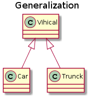
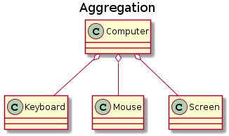

* [點擊閱讀面試進階指南 ](https://github.com/CyC2018/Backend-Interview-Guide)
<!-- GFM-TOC -->
* [一、三大特性](#一三大特性)
    * [封裝](#封裝)
    * [繼承](#繼承)
    * [多型](#多型)
* [二、類圖](#二類圖)
    * [泛化關係 (Generalization)](#泛化關係-generalization)
    * [實現關係 (Realization)](#實現關係-realization)
    * [聚合關係 (Aggregation)](#聚合關係-aggregation)
    * [組合關係 (Composition)](#組合關係-composition)
    * [關聯關係 (Association)](#關聯關係-association)
    * [依賴關係 (Dependency)](#依賴關係-dependency)
* [三、設計原則](#三設計原則)
    * [S.O.L.I.D](#solid)
    * [其他常見原則](#其他常見原則)
* [參考資料](#參考資料)
<!-- GFM-TOC -->


# 一、三大特性

## 封裝

利用抽像數據類型將數據和基於數據的操作封裝在一起，使其構成一個不可分割的獨立實體。數據被保護在抽像數據類型的內部，盡可能地隱藏內部的細節，只保留一些對外接口使之與外部發生聯系。用戶無需知道對像內部的細節，但可以通過對像對外提供的接口來訪問該對像。

優點：

- 減少耦合：可以獨立地開發、測試、優化、使用、理解和修改
- 減輕維護的負擔：可以更容易被程序員理解，並且在調試的時候可以不影響其他模塊
- 有效地調節性能：可以通過剖析確定哪些模塊影響了系統的性能
- 提高軟件的可重用性
- 降低了構建大型系統的風險：即使整個系統不可用，但是這些獨立的模塊卻有可能是可用的

以下 Person 類封裝 name、gender、age 等屬性，外界只能通過 get() 方法獲取一個 Person 對像的 name 屬性和 gender 屬性，而無法獲取 age 屬性，但是 age 屬性可以供 work() 方法使用。

注意到 gender 屬性使用 int 數據類型進行存儲，封裝使得用戶注意不到這種實現細節。並且在需要修改 gender 屬性使用的數據類型時，也可以在不影響客戶端代碼的情況下進行。

```java
public class Person {

    private String name;
    private int gender;
    private int age;

    public String getName() {
        return name;
    }

    public String getGender() {
        return gender == 0 ? "man" : "woman";
    }

    public void work() {
        if (18 <= age && age <= 50) {
            System.out.println(name + " is working very hard!");
        } else {
            System.out.println(name + " can't work any more!");
        }
    }
}
```

## 繼承

繼承實現了  **IS-A**  關係，例如 Cat 和 Animal 就是一種 IS-A 關係，因此 Cat 可以繼承自 Animal，從而獲得 Animal 非 private 的屬性和方法。

繼承應該遵循裡氏替換原則，子類對像必須能夠替換掉所有父類對像。

Cat 可以當做 Animal 來使用，也就是說可以使用 Animal 引用 Cat 對像。父類引用指向子類對像稱為  **向上轉型** 。

```java
Animal animal = new Cat();
```

## 多型

多型分為編譯時多型和運行時多型：

- 編譯時多型主要指方法的重載
- 運行時多型指程序中定義的對像引用所指向的具體類型在運行期間才確定

運行時多型有三個條件：

- 繼承
- 覆蓋（重寫）
- 向上轉型

下面的代碼中，樂器類（Instrument）有兩個子類：Wind 和 Percussion，它們都覆蓋了父類的 play() 方法，並且在 main() 方法中使用父類 Instrument 來引用 Wind 和 Percussion 對像。在 Instrument 引用調用 play() 方法時，會執行實際引用對像所在類的 play() 方法，而不是 Instrument 類的方法。

```java
public class Instrument {

    public void play() {
        System.out.println("Instument is playing...");
    }
}

public class Wind extends Instrument {

    public void play() {
        System.out.println("Wind is playing...");
    }
}

public class Percussion extends Instrument {

    public void play() {
        System.out.println("Percussion is playing...");
    }
}

public class Music {

    public static void main(String[] args) {
        List<Instrument> instruments = new ArrayList<>();
        instruments.add(new Wind());
        instruments.add(new Percussion());
        for(Instrument instrument : instruments) {
            instrument.play();
        }
    }
}
```

# 二、類圖

以下類圖使用 [PlantUML](https://www.planttext.com/) 繪制，更多語法及使用請參考：http://plantuml.com/ 。

## 泛化關係 (Generalization)

用來描述繼承關係，在 Java 中使用 extends 關鍵字。

<div align="center">  </div><br>

```text
@startuml

title Generalization

class Vihical
class Car
class Trunck

Vihical <|-- Car
Vihical <|-- Trunck

@enduml
```

## 實現關係 (Realization)

用來實現一個接口，在 Java 中使用 implements 關鍵字。

<div align="center">  </div><br>

```text
@startuml

title Realization

interface MoveBehavior
class Fly
class Run

MoveBehavior <|.. Fly
MoveBehavior <|.. Run

@enduml
```

## 聚合關係 (Aggregation)

表示整體由部分組成，但是整體和部分不是強依賴的，整體不存在了部分還是會存在。

<div align="center">  </div><br>

```text
@startuml

title Aggregation

class Computer
class Keyboard
class Mouse
class Screen

Computer o-- Keyboard
Computer o-- Mouse
Computer o-- Screen

@enduml
```

## 組合關係 (Composition)

和聚合不同，組合中整體和部分是強依賴的，整體不存在了部分也不存在了。比如公司和部門，公司沒了部門就不存在了。但是公司和員工就屬於聚合關係了，因為公司沒了員工還在。

<div align="center">  </div><br>

```text
@startuml

title Composition

class Company
class DepartmentA
class DepartmentB

Company *-- DepartmentA
Company *-- DepartmentB

@enduml
```

## 關聯關係 (Association)

表示不同類對像之間有關聯，這是一種靜態關係，與運行過程的狀態無關，在最開始就可以確定。因此也可以用 1 對 1、多對 1、多對多這種關聯關係來表示。比如學生和學校就是一種關聯關係，一個學校可以有很多學生，但是一個學生只屬於一個學校，因此這是一種多對一的關係，在運行開始之前就可以確定。

<div align="center">  </div><br>

```text
@startuml

title Association

class School
class Student

School "1" - "n" Student

@enduml
```

## 依賴關係 (Dependency)

和關聯關係不同的是，依賴關係是在運行過程中起作用的。A 類和 B 類是依賴關係主要有三種形式：

- A 類是 B 類方法的局部變量；
- A 類是 B 類方法當中的一個參數；
- A 類向 B 類發送消息，從而影響 B 類發生變化。

<div align="center">  </div><br>

```text
@startuml

title Dependency

class Vihicle {
    move(MoveBehavior)
}

interface MoveBehavior {
    move()
}

note "MoveBehavior.move()" as N

Vihicle ..> MoveBehavior

Vihicle .. N

@enduml
```

# 三、設計原則

## S.O.L.I.D

| 簡寫 | 全拼 | 中文翻譯 |
| :--: | :--: | :--: |
| SRP | The Single Responsibility Principle    | 單一責任原則 |
| OCP | The Open Closed Principle              | 開放封閉原則 |
| LSP | The Liskov Substitution Principle      | 裡氏替換原則 |
| ISP | The Interface Segregation Principle    | 接口分離原則 |
| DIP | The Dependency Inversion Principle     | 依賴倒置原則 |

### 1. 單一責任原則

> 修改一個類的原因應該只有一個。

換句話說就是讓一個類只負責一件事，當這個類需要做過多事情的時候，就需要分解這個類。

如果一個類承擔的職責過多，就等於把這些職責耦合在了一起，一個職責的變化可能會削弱這個類完成其它職責的能力。

### 2. 開放封閉原則

> 類應該對擴展開放，對修改關閉。

擴展就是添加新功能的意思，因此該原則要求在添加新功能時不需要修改代碼。

符合開閉原則最典型的設計模式是裝飾者模式，它可以動態地將責任附加到對像上，而不用去修改類的代碼。

### 3. 裡氏替換原則

> 子類對像必須能夠替換掉所有父類對像。

繼承是一種 IS-A 關係，子類需要能夠當成父類來使用，並且需要比父類更特殊。

如果不滿足這個原則，那麼各個子類的行為上就會有很大差異，增加繼承體系的復雜度。

### 4. 接口分離原則

> 不應該強迫客戶依賴於它們不用的方法。

因此使用多個專門的接口比使用單一的總接口要好。

### 5. 依賴倒置原則

> 高層模塊不應該依賴於低層模塊，二者都應該依賴於抽像；</br>抽像不應該依賴於細節，細節應該依賴於抽像。

高層模塊包含一個應用程序中重要的策略選擇和業務模塊，如果高層模塊依賴於低層模塊，那麼低層模塊的改動就會直接影響到高層模塊，從而迫使高層模塊也需要改動。

依賴於抽像意味著：

- 任何變量都不應該持有一個指向具體類的指針或者引用；
- 任何類都不應該從具體類派生；
- 任何方法都不應該覆寫它的任何基類中的已經實現的方法。

## 其他常見原則

除了上述的經典原則，在實際開發中還有下面這些常見的設計原則。

| 簡寫    | 全拼    | 中文翻譯 |
| :--: | :--: | :--: |
|LOD|    The Law of Demeter                   | 迪米特法則   |
|CRP|    The Composite Reuse Principle        | 合成復用原則 |
|CCP|    The Common Closure Principle         | 共同封閉原則 |
|SAP|    The Stable Abstractions Principle    | 穩定抽像原則 |
|SDP|    The Stable Dependencies Principle    | 穩定依賴原則 |

### 1. 迪米特法則

迪米特法則又叫作最少知識原則（Least Knowledge Principle，簡寫 LKP），就是說一個對像應當對其他對像有盡可能少的了解，不和陌生人說話。

### 2. 合成復用原則

盡量使用對像組合，而不是通過繼承來達到復用的目的。

### 3. 共同封閉原則

一起修改的類，應該組合在一起（同一個包裡）。如果必須修改應用程序裡的代碼，我們希望所有的修改都發生在一個包裡（修改關閉），而不是遍布在很多包裡。

### 4. 穩定抽像原則

最穩定的包應該是最抽像的包，不穩定的包應該是具體的包，即包的抽像程度跟它的穩定性成正比。

### 5. 穩定依賴原則

包之間的依賴關係都應該是穩定方向依賴的，包要依賴的包要比自己更具有穩定性。

# 參考資料

- Java 編程思想
- 敏捷軟件開發：原則、模式與實踐
- [物件導向設計的 SOLID 原則](http://www.cnblogs.com/shanyou/archive/2009/09/21/1570716.html)
- [看懂 UML 類圖和時序圖](http://design-patterns.readthedocs.io/zh_CN/latest/read_uml.html#generalization)
- [UML 系列——時序圖（順序圖）sequence diagram](http://www.cnblogs.com/wolf-sun/p/UML-Sequence-diagram.html)
- [物件導向編程三大特性 ------ 封裝、繼承、多型](http://blog.csdn.net/jianyuerensheng/article/details/51602015)
