<<<<<<< HEAD
[🍉 點擊訂閱面試進階專欄 ](https://xiaozhuanlan.com/CyC2018)
<!-- GFM-TOC -->
* [一、概述](#一概述)
    * [網絡的網絡](#網絡的網絡)
    * [ISP](#isp)
    * [主機之間的通信方式](#主機之間的通信方式)
    * [電路交換與分組交換](#電路交換與分組交換)
    * [時延](#時延)
    * [計算機網絡體系結構](#計算機網絡體系結構)
* [二、物理層](#二物理層)
    * [通信方式](#通信方式)
    * [帶通調制](#帶通調制)
* [三、數據鏈路層](#三數據鏈路層)
    * [基本問題](#基本問題)
    * [信道分類](#信道分類)
    * [信道覆用技術](#信道覆用技術)
    * [CSMA/CD 協議](#csmacd-協議)
    * [PPP 協議](#ppp-協議)
    * [MAC 地址](#mac-地址)
    * [局域網](#局域網)
    * [以太網](#以太網)
    * [交換機](#交換機)
    * [虛擬局域網](#虛擬局域網)
* [四、網絡層](#四網絡層)
    * [概述](#概述)
    * [IP 數據報格式](#ip-數據報格式)
    * [IP 地址編址方式](#ip-地址編址方式)
    * [地址解析協議 ARP](#地址解析協議-arp)
    * [網際控制報文協議 ICMP](#網際控制報文協議-icmp)
    * [虛擬專用網 VPN](#虛擬專用網-vpn)
    * [網絡地址轉換 NAT](#網絡地址轉換-nat)
    * [路由器的結構](#路由器的結構)
    * [路由器分組轉發流程](#路由器分組轉發流程)
    * [路由選擇協議](#路由選擇協議)
* [五、傳輸層](#五傳輸層)
    * [UDP 和 TCP 的特點](#udp-和-tcp-的特點)
    * [UDP 首部格式](#udp-首部格式)
    * [TCP 首部格式](#tcp-首部格式)
    * [TCP 的三次握手](#tcp-的三次握手)
    * [TCP 的四次揮手](#tcp-的四次揮手)
    * [TCP 可靠傳輸](#tcp-可靠傳輸)
    * [TCP 滑動窗口](#tcp-滑動窗口)
    * [TCP 流量控制](#tcp-流量控制)
    * [TCP 擁塞控制](#tcp-擁塞控制)
* [六、應用層](#六應用層)
    * [域名系統](#域名系統)
    * [文件傳送協議](#文件傳送協議)
    * [動態主機配置協議](#動態主機配置協議)
    * [遠程登錄協議](#遠程登錄協議)
    * [電子郵件協議](#電子郵件協議)
    * [常用端口](#常用端口)
    * [Web 頁面請求過程](#web-頁面請求過程)
* [參考資料](#參考資料)
=======
* [点击阅读面试进阶指南 ](https://github.com/CyC2018/Backend-Interview-Guide)
<!-- GFM-TOC -->
* [一、概述](#一概述)
    * [网络的网络](#网络的网络)
    * [ISP](#isp)
    * [主机之间的通信方式](#主机之间的通信方式)
    * [电路交换与分组交换](#电路交换与分组交换)
    * [时延](#时延)
    * [计算机网络体系结构](#计算机网络体系结构)
* [二、物理层](#二物理层)
    * [通信方式](#通信方式)
    * [带通调制](#带通调制)
* [三、数据链路层](#三数据链路层)
    * [基本问题](#基本问题)
    * [信道分类](#信道分类)
    * [信道复用技术](#信道复用技术)
    * [CSMA/CD 协议](#csmacd-协议)
    * [PPP 协议](#ppp-协议)
    * [MAC 地址](#mac-地址)
    * [局域网](#局域网)
    * [以太网](#以太网)
    * [交换机](#交换机)
    * [虚拟局域网](#虚拟局域网)
* [四、网络层](#四网络层)
    * [概述](#概述)
    * [IP 数据报格式](#ip-数据报格式)
    * [IP 地址编址方式](#ip-地址编址方式)
    * [地址解析协议 ARP](#地址解析协议-arp)
    * [网际控制报文协议 ICMP](#网际控制报文协议-icmp)
    * [虚拟专用网 VPN](#虚拟专用网-vpn)
    * [网络地址转换 NAT](#网络地址转换-nat)
    * [路由器的结构](#路由器的结构)
    * [路由器分组转发流程](#路由器分组转发流程)
    * [路由选择协议](#路由选择协议)
* [五、传输层](#五传输层)
    * [UDP 和 TCP 的特点](#udp-和-tcp-的特点)
    * [UDP 首部格式](#udp-首部格式)
    * [TCP 首部格式](#tcp-首部格式)
    * [TCP 的三次握手](#tcp-的三次握手)
    * [TCP 的四次挥手](#tcp-的四次挥手)
    * [TCP 可靠传输](#tcp-可靠传输)
    * [TCP 滑动窗口](#tcp-滑动窗口)
    * [TCP 流量控制](#tcp-流量控制)
    * [TCP 拥塞控制](#tcp-拥塞控制)
* [六、应用层](#六应用层)
    * [域名系统](#域名系统)
    * [文件传送协议](#文件传送协议)
    * [动态主机配置协议](#动态主机配置协议)
    * [远程登录协议](#远程登录协议)
    * [电子邮件协议](#电子邮件协议)
    * [常用端口](#常用端口)
    * [Web 页面请求过程](#web-页面请求过程)
* [参考资料](#参考资料)
>>>>>>> 9f1571a1b578332969a00a0bda4029dfad9995a3
<!-- GFM-TOC -->

# 一、概述

<<<<<<< HEAD
## 網絡的網絡

網絡把主機連接起來，而互聯網是把多種不同的網絡連接起來，因此互聯網是網絡的網絡。
=======
## 网络的网络

网络把主机连接起来，而互联网是把多种不同的网络连接起来，因此互联网是网络的网络。
>>>>>>> 9f1571a1b578332969a00a0bda4029dfad9995a3

  
 

## ISP

<<<<<<< HEAD
互聯網服務提供商 ISP 可以從互聯網管理機構獲得許多 IP 地址，同時擁有通信線路以及路由器等聯網設備，個人或機構向 ISP 繳納一定的費用就可以接入互聯網。

 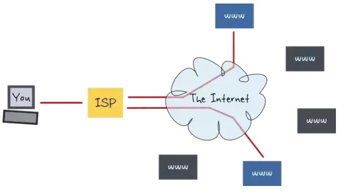 
 

目前的互聯網是一種多層次 ISP 結構，ISP 根據覆蓋面積的大小分為第一層 ISP、區域 ISP 和接入 ISP。互聯網交換點 IXP 允許兩個 ISP 直接相連而不用經過第三個 ISP。

 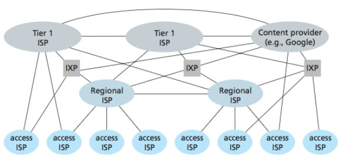 
 

## 主機之間的通信方式

- 客戶-服務器（C/S）：客戶是服務的請求方，服務器是服務的提供方。

- 對等（P2P）：不區分客戶和服務器。

  
 

## 電路交換與分組交換

### 1. 電路交換

電路交換用於電話通信系統，兩個用戶要通信之前需要建立一條專用的物理鏈路，並且在整個通信過程中始終占用該鏈路。由於通信的過程中不可能一直在使用傳輸線路，因此電路交換對線路的利用率很低，往往不到 10%。

### 2. 分組交換

每個分組都有首部和尾部，包含了源地址和目的地址等控制信息，在同一個傳輸線路上同時傳輸多個分組互相不會影響，因此在同一條傳輸線路上允許同時傳輸多個分組，也就是說分組交換不需要占用傳輸線路。

在一個郵局通信系統中，郵局收到一份郵件之後，先存儲下來，然後把相同目的地的郵件一起轉發到下一個目的地，這個過程就是存儲轉發過程，分組交換也使用了存儲轉發過程。

## 時延

總時延 = 排隊時延 + 處理時延 + 傳輸時延 + 傳播時延

 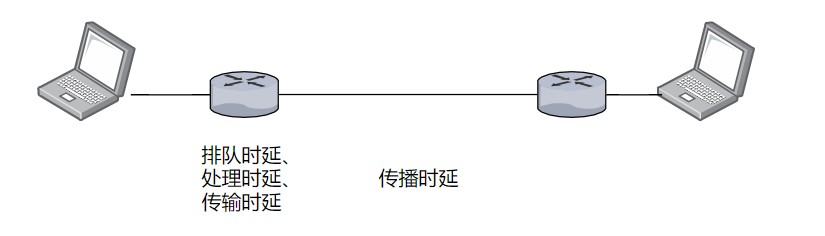 
 

### 1. 排隊時延

分組在路由器的輸入隊列和輸出隊列中排隊等待的時間，取決於網絡當前的通信量。

### 2. 處理時延

主機或路由器收到分組時進行處理所需要的時間，例如分析首部、從分組中提取數據、進行差錯檢驗或查找適當的路由等。

### 3. 傳輸時延

主機或路由器傳輸數據幀所需要的時間。

  

其中 l 表示數據幀的長度，v 表示傳輸速率。

### 4. 傳播時延

電磁波在信道中傳播所需要花費的時間，電磁波傳播的速度接近光速。

  

其中 l 表示信道長度，v 表示電磁波在信道上的傳播速度。

## 計算機網絡體系結構

 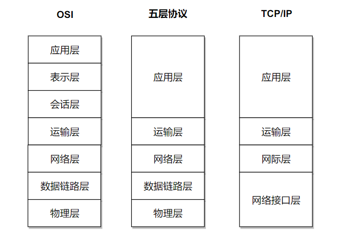 
 

### 1. 五層協議

-  **應用層** ：為特定應用程序提供數據傳輸服務，例如 HTTP、DNS 等。數據單位為報文。

-  **傳輸層** ：為進程提供通用數據傳輸服務。由於應用層協議很多，定義通用的傳輸層協議就可以支持不斷增多的應用層協議。運輸層包括兩種協議：傳輸控制協議 TCP，提供面向連接、可靠的數據傳輸服務，數據單位為報文段；用戶數據報協議 UDP，提供無連接、盡最大努力的數據傳輸服務，數據單位為用戶數據報。TCP 主要提供完整性服務，UDP 主要提供及時性服務。

-  **網絡層** ：為主機提供數據傳輸服務。而傳輸層協議是為主機中的進程提供數據傳輸服務。網絡層把傳輸層傳遞下來的報文段或者用戶數據報封裝成分組。

-  **數據鏈路層** ：網絡層針對的還是主機之間的數據傳輸服務，而主機之間可以有很多鏈路，鏈路層協議就是為同一鏈路的主機提供數據傳輸服務。數據鏈路層把網絡層傳下來的分組封裝成幀。

-  **物理層** ：考慮的是怎樣在傳輸媒體上傳輸數據比特流，而不是指具體的傳輸媒體。物理層的作用是盡可能屏蔽傳輸媒體和通信手段的差異，使數據鏈路層感覺不到這些差異。

### 2. OSI

其中表示層和會話層用途如下：

-  **表示層** ：數據壓縮、加密以及數據描述，這使得應用程序不必關心在各台主機中數據內部格式不同的問題。

-  **會話層** ：建立及管理會話。

五層協議沒有表示層和會話層，而是將這些功能留給應用程序開發者處理。

### 3. TCP/IP

它只有四層，相當於五層協議中數據鏈路層和物理層合並為網絡接口層。

TCP/IP 體系結構不嚴格遵循 OSI 分層概念，應用層可能會直接使用 IP 層或者網絡接口層。

 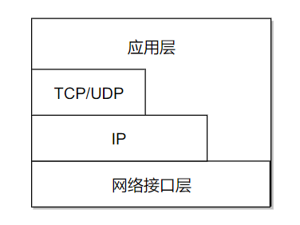 
 

### 4. 數據在各層之間的傳遞過程

在向下的過程中，需要添加下層協議所需要的首部或者尾部，而在向上的過程中不斷拆開首部和尾部。

路由器只有下面三層協議，因為路由器位於網絡核心中，不需要為進程或者應用程序提供服務，因此也就不需要傳輸層和應用層。

# 二、物理層

## 通信方式

根據信息在傳輸線上的傳送方向，分為以下三種通信方式：

- 單工通信：單向傳輸
- 半雙工通信：雙向交替傳輸
- 全雙工通信：雙向同時傳輸

## 帶通調制

模擬信號是連續的信號，數字信號是離散的信號。帶通調制把數字信號轉換為模擬信號。

  
 

# 三、數據鏈路層

## 基本問題

### 1. 封裝成幀

將網絡層傳下來的分組添加首部和尾部，用於標記幀的開始和結束。

  
 

### 2. 透明傳輸

透明表示一個實際存在的事物看起來好像不存在一樣。

幀使用首部和尾部進行定界，如果幀的數據部分含有和首部尾部相同的內容，那麽幀的開始和結束位置就會被錯誤的判定。需要在數據部分出現首部尾部相同的內容前面插入轉義字符。如果數據部分出現轉義字符，那麽就在轉義字符前面再加個轉義字符。在接收端進行處理之後可以還原出原始數據。這個過程透明傳輸的內容是轉義字符，用戶察覺不到轉義字符的存在。

  
 

### 3. 差錯檢測

目前數據鏈路層廣泛使用了循環冗余檢驗（CRC）來檢查比特差錯。

## 信道分類

### 1. 廣播信道

一對多通信，一個節點發送的數據能夠被廣播信道上所有的節點接收到。

所有的節點都在同一個廣播信道上發送數據，因此需要有專門的控制方法進行協調，避免發生沖突（沖突也叫碰撞）。

主要有兩種控制方法進行協調，一個是使用信道覆用技術，一是使用 CSMA/CD 協議。

### 2. 點對點信道

一對一通信。

因為不會發生碰撞，因此也比較簡單，使用 PPP 協議進行控制。

## 信道覆用技術

### 1. 頻分覆用

頻分覆用的所有主機在相同的時間占用不同的頻率帶寬資源。

 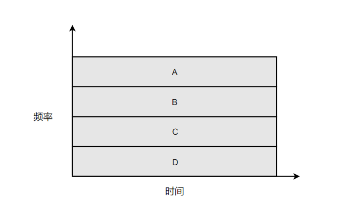 
 

### 2. 時分覆用

時分覆用的所有主機在不同的時間占用相同的頻率帶寬資源。

 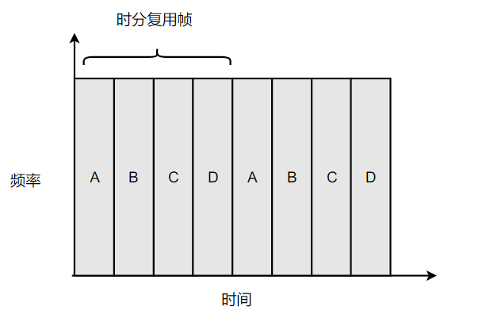 
 

使用頻分覆用和時分覆用進行通信，在通信的過程中主機會一直占用一部分信道資源。但是由於計算機數據的突發性質，通信過程沒必要一直占用信道資源而不讓出給其它用戶使用，因此這兩種方式對信道的利用率都不高。

### 3. 統計時分覆用

是對時分覆用的一種改進，不固定每個用戶在時分覆用幀中的位置，只要有數據就集中起來組成統計時分覆用幀然後發送。

 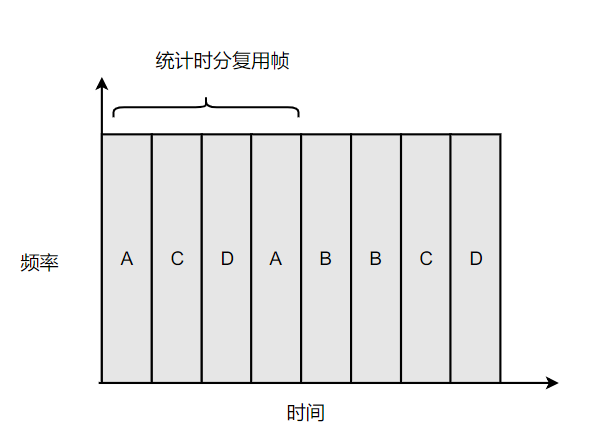 
 

### 4. 波分覆用

光的頻分覆用。由於光的頻率很高，因此習慣上用波長而不是頻率來表示所使用的光載波。

### 5. 碼分覆用

為每個用戶分配 m bit 的碼片，並且所有的碼片正交，對於任意兩個碼片  和  有

  

為了討論方便，取 m=8，設碼片  為 00011011。在擁有該碼片的用戶發送比特 1 時就發送該碼片，發送比特 0 時就發送該碼片的反碼 11100100。

在計算時將 00011011 記作 (-1 -1 -1 +1 +1 -1 +1 +1)，可以得到
=======
互联网服务提供商 ISP 可以从互联网管理机构获得许多 IP 地址，同时拥有通信线路以及路由器等联网设备，个人或机构向 ISP 缴纳一定的费用就可以接入互联网。

  
 

目前的互联网是一种多层次 ISP 结构，ISP 根据覆盖面积的大小分为第一层 ISP、区域 ISP 和接入 ISP。互联网交换点 IXP 允许两个 ISP 直接相连而不用经过第三个 ISP。

 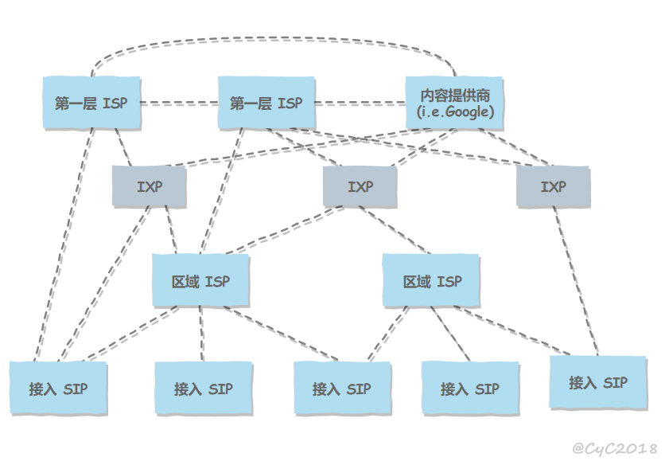 
 

## 主机之间的通信方式

- 客户-服务器（C/S）：客户是服务的请求方，服务器是服务的提供方。

 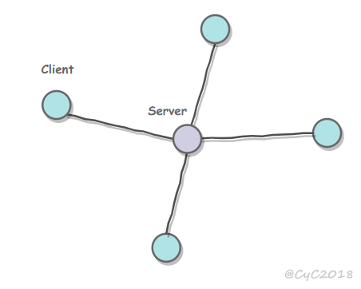 
 

- 对等（P2P）：不区分客户和服务器。

 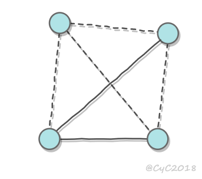 
 

## 电路交换与分组交换

### 1. 电路交换

电路交换用于电话通信系统，两个用户要通信之前需要建立一条专用的物理链路，并且在整个通信过程中始终占用该链路。由于通信的过程中不可能一直在使用传输线路，因此电路交换对线路的利用率很低，往往不到 10%。

### 2. 分组交换

每个分组都有首部和尾部，包含了源地址和目的地址等控制信息，在同一个传输线路上同时传输多个分组互相不会影响，因此在同一条传输线路上允许同时传输多个分组，也就是说分组交换不需要占用传输线路。

在一个邮局通信系统中，邮局收到一份邮件之后，先存储下来，然后把相同目的地的邮件一起转发到下一个目的地，这个过程就是存储转发过程，分组交换也使用了存储转发过程。

## 时延

总时延 = 排队时延 + 处理时延 + 传输时延 + 传播时延

 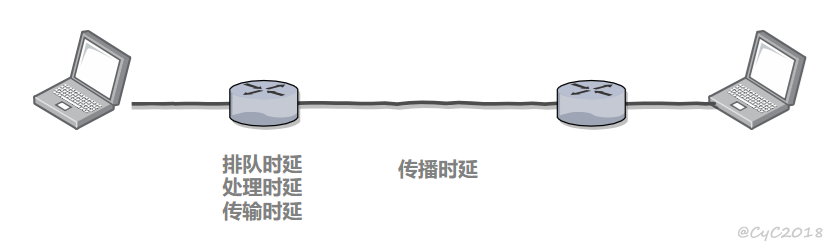 
 

### 1. 排队时延

分组在路由器的输入队列和输出队列中排队等待的时间，取决于网络当前的通信量。

### 2. 处理时延

主机或路由器收到分组时进行处理所需要的时间，例如分析首部、从分组中提取数据、进行差错检验或查找适当的路由等。

### 3. 传输时延

主机或路由器传输数据帧所需要的时间。

  

其中 l 表示数据帧的长度，v 表示传输速率。

### 4. 传播时延

电磁波在信道中传播所需要花费的时间，电磁波传播的速度接近光速。

  

其中 l 表示信道长度，v 表示电磁波在信道上的传播速度。

## 计算机网络体系结构

  
 

### 1. 五层协议

-  **应用层** ：为特定应用程序提供数据传输服务，例如 HTTP、DNS 等协议。数据单位为报文。

-  **传输层** ：为进程提供通用数据传输服务。由于应用层协议很多，定义通用的传输层协议就可以支持不断增多的应用层协议。运输层包括两种协议：传输控制协议 TCP，提供面向连接、可靠的数据传输服务，数据单位为报文段；用户数据报协议 UDP，提供无连接、尽最大努力的数据传输服务，数据单位为用户数据报。TCP 主要提供完整性服务，UDP 主要提供及时性服务。

-  **网络层** ：为主机提供数据传输服务。而传输层协议是为主机中的进程提供数据传输服务。网络层把传输层传递下来的报文段或者用户数据报封装成分组。

-  **数据链路层** ：网络层针对的还是主机之间的数据传输服务，而主机之间可以有很多链路，链路层协议就是为同一链路的主机提供数据传输服务。数据链路层把网络层传下来的分组封装成帧。

-  **物理层** ：考虑的是怎样在传输媒体上传输数据比特流，而不是指具体的传输媒体。物理层的作用是尽可能屏蔽传输媒体和通信手段的差异，使数据链路层感觉不到这些差异。

### 2. OSI

其中表示层和会话层用途如下：

-  **表示层** ：数据压缩、加密以及数据描述，这使得应用程序不必关心在各台主机中数据内部格式不同的问题。

-  **会话层** ：建立及管理会话。

五层协议没有表示层和会话层，而是将这些功能留给应用程序开发者处理。

### 3. TCP/IP

它只有四层，相当于五层协议中数据链路层和物理层合并为网络接口层。

TCP/IP 体系结构不严格遵循 OSI 分层概念，应用层可能会直接使用 IP 层或者网络接口层。

 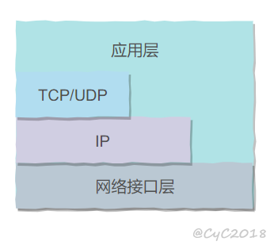 
 

### 4. 数据在各层之间的传递过程

在向下的过程中，需要添加下层协议所需要的首部或者尾部，而在向上的过程中不断拆开首部和尾部。

路由器只有下面三层协议，因为路由器位于网络核心中，不需要为进程或者应用程序提供服务，因此也就不需要传输层和应用层。

# 二、物理层

## 通信方式

根据信息在传输线上的传送方向，分为以下三种通信方式：

- 单工通信：单向传输
- 半双工通信：双向交替传输
- 全双工通信：双向同时传输

## 带通调制

模拟信号是连续的信号，数字信号是离散的信号。带通调制把数字信号转换为模拟信号。

  
 

# 三、数据链路层

## 基本问题

### 1. 封装成帧

将网络层传下来的分组添加首部和尾部，用于标记帧的开始和结束。

  
 

### 2. 透明传输

透明表示一个实际存在的事物看起来好像不存在一样。

帧使用首部和尾部进行定界，如果帧的数据部分含有和首部尾部相同的内容，那么帧的开始和结束位置就会被错误的判定。需要在数据部分出现首部尾部相同的内容前面插入转义字符。如果数据部分出现转义字符，那么就在转义字符前面再加个转义字符。在接收端进行处理之后可以还原出原始数据。这个过程透明传输的内容是转义字符，用户察觉不到转义字符的存在。

  
 

### 3. 差错检测

目前数据链路层广泛使用了循环冗余检验（CRC）来检查比特差错。

## 信道分类

### 1. 广播信道

一对多通信，一个节点发送的数据能够被广播信道上所有的节点接收到。

所有的节点都在同一个广播信道上发送数据，因此需要有专门的控制方法进行协调，避免发生冲突（冲突也叫碰撞）。

主要有两种控制方法进行协调，一个是使用信道复用技术，一是使用 CSMA/CD 协议。

### 2. 点对点信道

一对一通信。

因为不会发生碰撞，因此也比较简单，使用 PPP 协议进行控制。

## 信道复用技术

### 1. 频分复用

频分复用的所有主机在相同的时间占用不同的频率带宽资源。

  
 

### 2. 时分复用

时分复用的所有主机在不同的时间占用相同的频率带宽资源。

  
 

使用频分复用和时分复用进行通信，在通信的过程中主机会一直占用一部分信道资源。但是由于计算机数据的突发性质，通信过程没必要一直占用信道资源而不让出给其它用户使用，因此这两种方式对信道的利用率都不高。

### 3. 统计时分复用

是对时分复用的一种改进，不固定每个用户在时分复用帧中的位置，只要有数据就集中起来组成统计时分复用帧然后发送。

  
 

### 4. 波分复用

光的频分复用。由于光的频率很高，因此习惯上用波长而不是频率来表示所使用的光载波。

### 5. 码分复用

为每个用户分配 m bit 的码片，并且所有的码片正交，对于任意两个码片  和  有

  

为了讨论方便，取 m=8，设码片  为 00011011。在拥有该码片的用户发送比特 1 时就发送该码片，发送比特 0 时就发送该码片的反码 11100100。

在计算时将 00011011 记作 (-1 -1 -1 +1 +1 -1 +1 +1)，可以得到
>>>>>>> 9f1571a1b578332969a00a0bda4029dfad9995a3

  

  

<<<<<<< HEAD
其中  為  的反碼。

利用上面的式子我們知道，當接收端使用碼片  對接收到的數據進行內積運算時，結果為 0 的是其它用戶發送的數據，結果為 1 的是用戶發送的比特 1，結果為 -1 的是用戶發送的比特 0。

碼分覆用需要發送的數據量為原先的 m 倍。

 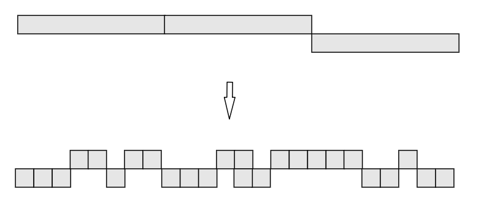 
 

## CSMA/CD 協議

CSMA/CD 表示載波監聽多點接入 / 碰撞檢測。

-  **多點接入** ：說明這是總線型網絡，許多主機以多點的方式連接到總線上。
-  **載波監聽** ：每個主機都必須不停地監聽信道。在發送前，如果監聽到信道正在使用，就必須等待。
-  **碰撞檢測** ：在發送中，如果監聽到信道已有其它主機正在發送數據，就表示發生了碰撞。雖然每個主機在發送數據之前都已經監聽到信道為空閑，但是由於電磁波的傳播時延的存在，還是有可能會發生碰撞。

記端到端的傳播時延為 τ，最先發送的站點最多經過 2τ 就可以知道是否發生了碰撞，稱 2τ 為  **爭用期** 。只有經過爭用期之後還沒有檢測到碰撞，才能肯定這次發送不會發生碰撞。

當發生碰撞時，站點要停止發送，等待一段時間再發送。這個時間采用  **截斷二進制指數退避算法**  來確定。從離散的整數集合 {0, 1, .., (2k-1)} 中隨機取出一個數，記作 r，然後取 r 倍的爭用期作為重傳等待時間。

 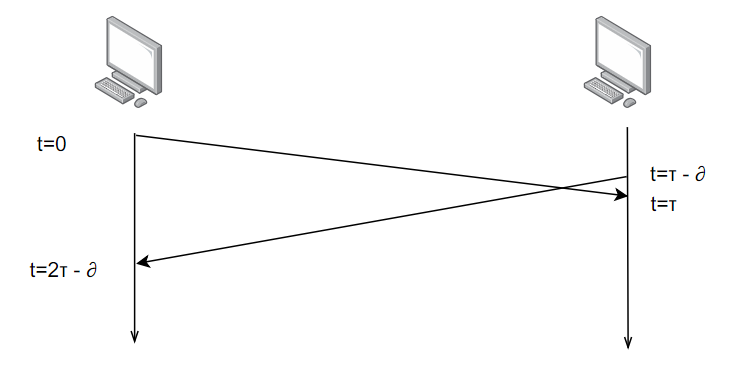 
 

## PPP 協議

互聯網用戶通常需要連接到某個 ISP 之後才能接入到互聯網，PPP 協議是用戶計算機和 ISP 進行通信時所使用的數據鏈路層協議。

 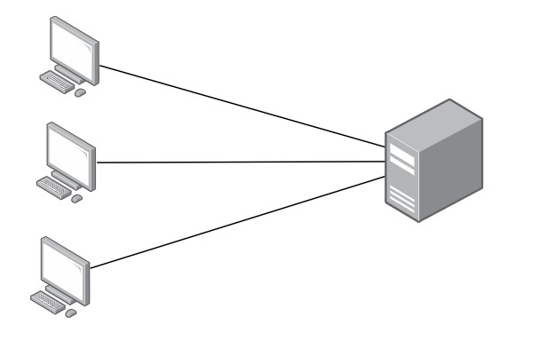 
 

PPP 的幀格式：

- F 字段為幀的定界符
- A 和 C 字段暫時沒有意義
- FCS 字段是使用 CRC 的檢驗序列
- 信息部分的長度不超過 1500
=======
其中  为  的反码。

利用上面的式子我们知道，当接收端使用码片  对接收到的数据进行内积运算时，结果为 0 的是其它用户发送的数据，结果为 1 的是用户发送的比特 1，结果为 -1 的是用户发送的比特 0。

码分复用需要发送的数据量为原先的 m 倍。

  
 

## CSMA/CD 协议

CSMA/CD 表示载波监听多点接入 / 碰撞检测。

-  **多点接入** ：说明这是总线型网络，许多主机以多点的方式连接到总线上。
-  **载波监听** ：每个主机都必须不停地监听信道。在发送前，如果监听到信道正在使用，就必须等待。
-  **碰撞检测** ：在发送中，如果监听到信道已有其它主机正在发送数据，就表示发生了碰撞。虽然每个主机在发送数据之前都已经监听到信道为空闲，但是由于电磁波的传播时延的存在，还是有可能会发生碰撞。

记端到端的传播时延为 τ，最先发送的站点最多经过 2τ 就可以知道是否发生了碰撞，称 2τ 为  **争用期** 。只有经过争用期之后还没有检测到碰撞，才能肯定这次发送不会发生碰撞。

当发生碰撞时，站点要停止发送，等待一段时间再发送。这个时间采用  **截断二进制指数退避算法**  来确定。从离散的整数集合 {0, 1, .., (2k-1)} 中随机取出一个数，记作 r，然后取 r 倍的争用期作为重传等待时间。

  
 

## PPP 协议

互联网用户通常需要连接到某个 ISP 之后才能接入到互联网，PPP 协议是用户计算机和 ISP 进行通信时所使用的数据链路层协议。

  
 

PPP 的帧格式：

- F 字段为帧的定界符
- A 和 C 字段暂时没有意义
- FCS 字段是使用 CRC 的检验序列
- 信息部分的长度不超过 1500
>>>>>>> 9f1571a1b578332969a00a0bda4029dfad9995a3

 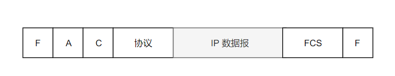 
 

## MAC 地址

<<<<<<< HEAD
MAC 地址是鏈路層地址，長度為 6 字節（48 位），用於唯一標識網絡適配器（網卡）。

一台主機擁有多少個網絡適配器就有多少個 MAC 地址。例如筆記本電腦普遍存在無線網絡適配器和有線網絡適配器，因此就有兩個 MAC 地址。

## 局域網

局域網是一種典型的廣播信道，主要特點是網絡為一個單位所擁有，且地理範圍和站點數目均有限。

主要有以太網、令牌環網、FDDI 和 ATM 等局域網技術，目前以太網占領著有線局域網市場。

可以按照網絡拓撲結構對局域網進行分類：

  
 

## 以太網

以太網是一種星型拓撲結構局域網。

早期使用集線器進行連接，集線器是一種物理層設備， 作用於比特而不是幀，當一個比特到達接口時，集線器重新生成這個比特，並將其能量強度放大，從而擴大網絡的傳輸距離，之後再將這個比特發送到其它所有接口。如果集線器同時收到兩個不同接口的幀，那麽就發生了碰撞。

目前以太網使用交換機替代了集線器，交換機是一種鏈路層設備，它不會發生碰撞，能根據 MAC 地址進行存儲轉發。

以太網幀格式：

-  **類型** ：標記上層使用的協議；
-  **數據** ：長度在 46-1500 之間，如果太小則需要填充；
-  **FCS** ：幀檢驗序列，使用的是 CRC 檢驗方法；

 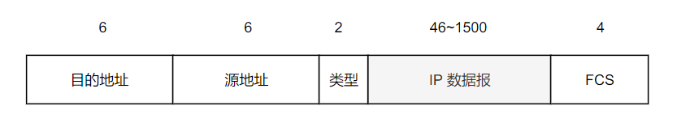 
 

## 交換機

交換機具有自學習能力，學習的是交換表的內容，交換表中存儲著 MAC 地址到接口的映射。

正是由於這種自學習能力，因此交換機是一種即插即用設備，不需要網絡管理員手動配置交換表內容。

下圖中，交換機有 4 個接口，主機 A 向主機 B 發送數據幀時，交換機把主機 A 到接口 1 的映射寫入交換表中。為了發送數據幀到 B，先查交換表，此時沒有主機 B 的表項，那麽主機 A 就發送廣播幀，主機 C 和主機 D 會丟棄該幀。主機 B 向主機 A 發送數據包時，交換機查找交換表得到主機 A 映射的接口為 1，就發送數據幀到接口 1，同時交換機添加主機 B 到接口 3 的映射。

 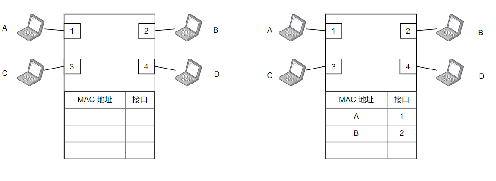 
 

## 虛擬局域網

虛擬局域網可以建立與物理位置無關的邏輯組，只有在同一個虛擬局域網中的成員才會收到鏈路層廣播信息。

例如下圖中 (A1, A2, A3, A4) 屬於一個虛擬局域網，A1 發送的廣播會被 A2、A3、A4 收到，而其它站點收不到。

使用 VLAN 幹線連接來建立虛擬局域網，每台交換機上的一個特殊接口被設置為幹線接口，以互連 VLAN 交換機。IEEE 定義了一種擴展的以太網幀格式 802.1Q，它在標準以太網幀上加進了 4 字節首部 VLAN 標簽，用於表示該幀屬於哪一個虛擬局域網。

 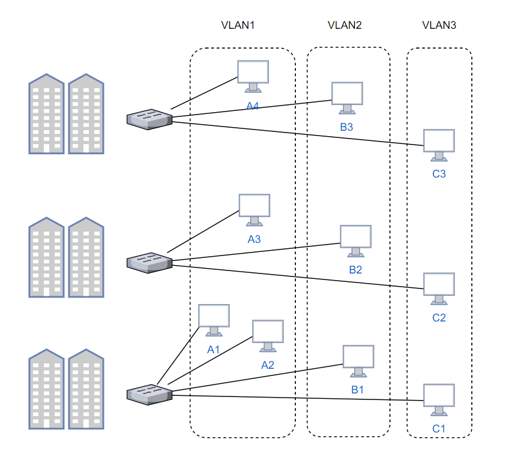 
 

# 四、網絡層

## 概述

因為網絡層是整個互聯網的核心，因此應當讓網絡層盡可能簡單。網絡層向上只提供簡單靈活的、無連接的、盡最大努力交互的數據報服務。

使用 IP 協議，可以把異構的物理網絡連接起來，使得在網絡層看起來好像是一個統一的網絡。

 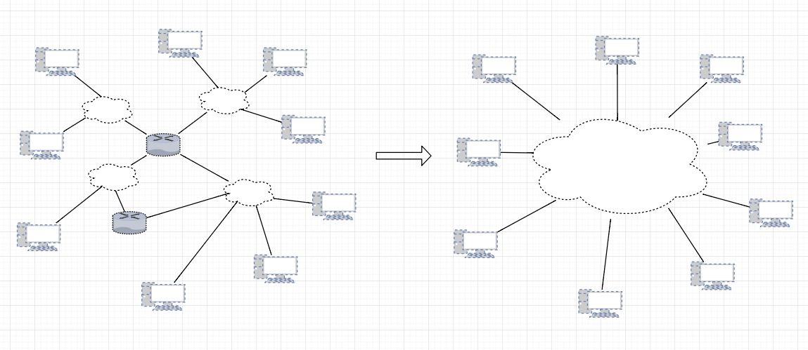 
 

與 IP 協議配套使用的還有三個協議：

- 地址解析協議 ARP（Address Resolution Protocol）
- 網際控制報文協議 ICMP（Internet Control Message Protocol）
- 網際組管理協議 IGMP（Internet Group Management Protocol）

## IP 數據報格式

  
 

-  **版本**  : 有 4（IPv4）和 6（IPv6）兩個值；

-  **首部長度**  : 占 4 位，因此最大值為 15。值為 1 表示的是 1 個 32 位字的長度，也就是 4 字節。因為首部固定長度為 20 字節，因此該值最小為 5。如果可選字段的長度不是 4 字節的整數倍，就用尾部的填充部分來填充。

-  **區分服務**  : 用來獲得更好的服務，一般情況下不使用。

-  **總長度**  : 包括首部長度和數據部分長度。

-  **生存時間**  ：TTL，它的存在是為了防止無法交付的數據報在互聯網中不斷兜圈子。以路由器跳數為單位，當 TTL 為 0 時就丟棄數據報。

-  **協議** ：指出攜帶的數據應該上交給哪個協議進行處理，例如 ICMP、TCP、UDP 等。

-  **首部檢驗和** ：因為數據報每經過一個路由器，都要重新計算檢驗和，因此檢驗和不包含數據部分可以減少計算的工作量。

-  **標識**  : 在數據報長度過長從而發生分片的情況下，相同數據報的不同分片具有相同的標識符。

-  **片偏移**  : 和標識符一起，用於發生分片的情況。片偏移的單位為 8 字節。

  
 

## IP 地址編址方式

IP 地址的編址方式經歷了三個歷史階段：

- 分類
- 子網劃分
- 無分類

### 1. 分類

由兩部分組成，網絡號和主機號，其中不同分類具有不同的網絡號長度，並且是固定的。

IP 地址 ::= {< 網絡號 >, < 主機號 >}

 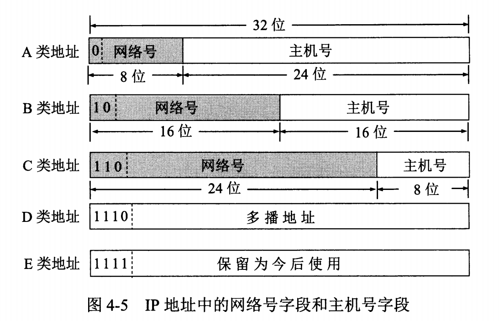 
 

### 2. 子網劃分

通過在主機號字段中拿一部分作為子網號，把兩級 IP 地址劃分為三級 IP 地址。

IP 地址 ::= {< 網絡號 >, < 子網號 >, < 主機號 >}

要使用子網，必須配置子網掩碼。一個 B 類地址的默認子網掩碼為 255.255.0.0，如果 B 類地址的子網占兩個比特，那麽子網掩碼為 11111111 11111111 11000000 00000000，也就是 255.255.192.0。

註意，外部網絡看不到子網的存在。

### 3. 無分類

無分類編址 CIDR 消除了傳統 A 類、B 類和 C 類地址以及劃分子網的概念，使用網絡前綴和主機號來對 IP 地址進行編碼，網絡前綴的長度可以根據需要變化。

IP 地址 ::= {< 網絡前綴號 >, < 主機號 >}

CIDR 的記法上采用在 IP 地址後面加上網絡前綴長度的方法，例如 128.14.35.7/20 表示前 20 位為網絡前綴。

CIDR 的地址掩碼可以繼續稱為子網掩碼，子網掩碼首 1 長度為網絡前綴的長度。

一個 CIDR 地址塊中有很多地址，一個 CIDR 表示的網絡就可以表示原來的很多個網絡，並且在路由表中只需要一個路由就可以代替原來的多個路由，減少了路由表項的數量。把這種通過使用網絡前綴來減少路由表項的方式稱為路由聚合，也稱為  **構成超網** 。

在路由表中的項目由“網絡前綴”和“下一跳地址”組成，在查找時可能會得到不止一個匹配結果，應當采用最長前綴匹配來確定應該匹配哪一個。

## 地址解析協議 ARP

網絡層實現主機之間的通信，而鏈路層實現具體每段鏈路之間的通信。因此在通信過程中，IP 數據報的源地址和目的地址始終不變，而 MAC 地址隨著鏈路的改變而改變。

 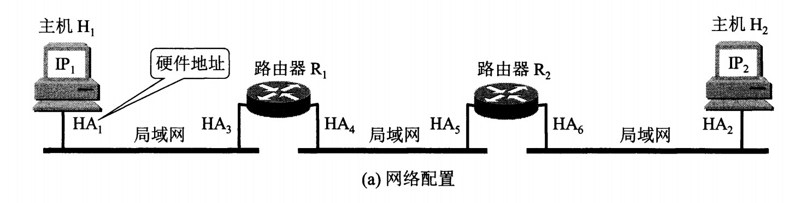 
 

ARP 實現由 IP 地址得到 MAC 地址。

  
 

每個主機都有一個 ARP 高速緩存，裏面有本局域網上的各主機和路由器的 IP 地址到 MAC 地址的映射表。

如果主機 A 知道主機 B 的 IP 地址，但是 ARP 高速緩存中沒有該 IP 地址到 MAC 地址的映射，此時主機 A 通過廣播的方式發送 ARP 請求分組，主機 B 收到該請求後會發送 ARP 響應分組給主機 A 告知其 MAC 地址，隨後主機 A 向其高速緩存中寫入主機 B 的 IP 地址到 MAC 地址的映射。

  
 

## 網際控制報文協議 ICMP

ICMP 是為了更有效地轉發 IP 數據報和提高交付成功的機會。它封裝在 IP 數據報中，但是不屬於高層協議。

  
 

ICMP 報文分為差錯報告報文和詢問報文。
=======
MAC 地址是链路层地址，长度为 6 字节（48 位），用于唯一标识网络适配器（网卡）。

一台主机拥有多少个网络适配器就有多少个 MAC 地址。例如笔记本电脑普遍存在无线网络适配器和有线网络适配器，因此就有两个 MAC 地址。

## 局域网

局域网是一种典型的广播信道，主要特点是网络为一个单位所拥有，且地理范围和站点数目均有限。

主要有以太网、令牌环网、FDDI 和 ATM 等局域网技术，目前以太网占领着有线局域网市场。

可以按照网络拓扑结构对局域网进行分类：

  
 

## 以太网

以太网是一种星型拓扑结构局域网。

早期使用集线器进行连接，集线器是一种物理层设备， 作用于比特而不是帧，当一个比特到达接口时，集线器重新生成这个比特，并将其能量强度放大，从而扩大网络的传输距离，之后再将这个比特发送到其它所有接口。如果集线器同时收到两个不同接口的帧，那么就发生了碰撞。

目前以太网使用交换机替代了集线器，交换机是一种链路层设备，它不会发生碰撞，能根据 MAC 地址进行存储转发。

以太网帧格式：

-  **类型** ：标记上层使用的协议；
-  **数据** ：长度在 46-1500 之间，如果太小则需要填充；
-  **FCS** ：帧检验序列，使用的是 CRC 检验方法；

  
 

## 交换机

交换机具有自学习能力，学习的是交换表的内容，交换表中存储着 MAC 地址到接口的映射。

正是由于这种自学习能力，因此交换机是一种即插即用设备，不需要网络管理员手动配置交换表内容。

下图中，交换机有 4 个接口，主机 A 向主机 B 发送数据帧时，交换机把主机 A 到接口 1 的映射写入交换表中。为了发送数据帧到 B，先查交换表，此时没有主机 B 的表项，那么主机 A 就发送广播帧，主机 C 和主机 D 会丢弃该帧，主机 B 回应该帧向主机 A 发送数据包时，交换机查找交换表得到主机 A 映射的接口为 1，就发送数据帧到接口 1，同时交换机添加主机 B 到接口 2 的映射。

  
 

## 虚拟局域网

虚拟局域网可以建立与物理位置无关的逻辑组，只有在同一个虚拟局域网中的成员才会收到链路层广播信息。

例如下图中 (A1, A2, A3, A4) 属于一个虚拟局域网，A1 发送的广播会被 A2、A3、A4 收到，而其它站点收不到。

使用 VLAN 干线连接来建立虚拟局域网，每台交换机上的一个特殊接口被设置为干线接口，以互连 VLAN 交换机。IEEE 定义了一种扩展的以太网帧格式 802.1Q，它在标准以太网帧上加进了 4 字节首部 VLAN 标签，用于表示该帧属于哪一个虚拟局域网。

  
 

# 四、网络层

## 概述

因为网络层是整个互联网的核心，因此应当让网络层尽可能简单。网络层向上只提供简单灵活的、无连接的、尽最大努力交互的数据报服务。

使用 IP 协议，可以把异构的物理网络连接起来，使得在网络层看起来好像是一个统一的网络。

  
 

与 IP 协议配套使用的还有三个协议：

- 地址解析协议 ARP（Address Resolution Protocol）
- 网际控制报文协议 ICMP（Internet Control Message Protocol）
- 网际组管理协议 IGMP（Internet Group Management Protocol）

## IP 数据报格式

  
 

-  **版本**  : 有 4（IPv4）和 6（IPv6）两个值；

-  **首部长度**  : 占 4 位，因此最大值为 15。值为 1 表示的是 1 个 32 位字的长度，也就是 4 字节。因为首部固定长度为 20 字节，因此该值最小为 5。如果可选字段的长度不是 4 字节的整数倍，就用尾部的填充部分来填充。

-  **区分服务**  : 用来获得更好的服务，一般情况下不使用。

-  **总长度**  : 包括首部长度和数据部分长度。

-  **生存时间**  ：TTL，它的存在是为了防止无法交付的数据报在互联网中不断兜圈子。以路由器跳数为单位，当 TTL 为 0 时就丢弃数据报。

-  **协议** ：指出携带的数据应该上交给哪个协议进行处理，例如 ICMP、TCP、UDP 等。

-  **首部检验和** ：因为数据报每经过一个路由器，都要重新计算检验和，因此检验和不包含数据部分可以减少计算的工作量。

-  **标识**  : 在数据报长度过长从而发生分片的情况下，相同数据报的不同分片具有相同的标识符。

-  **片偏移**  : 和标识符一起，用于发生分片的情况。片偏移的单位为 8 字节。

  
 

## IP 地址编址方式

IP 地址的编址方式经历了三个历史阶段：

- 分类
- 子网划分
- 无分类

### 1. 分类

由两部分组成，网络号和主机号，其中不同分类具有不同的网络号长度，并且是固定的。

IP 地址 ::= {< 网络号 >, < 主机号 >}

  
 

### 2. 子网划分

通过在主机号字段中拿一部分作为子网号，把两级 IP 地址划分为三级 IP 地址。

IP 地址 ::= {< 网络号 >, < 子网号 >, < 主机号 >}

要使用子网，必须配置子网掩码。一个 B 类地址的默认子网掩码为 255.255.0.0，如果 B 类地址的子网占两个比特，那么子网掩码为 11111111 11111111 11000000 00000000，也就是 255.255.192.0。

注意，外部网络看不到子网的存在。

### 3. 无分类

无分类编址 CIDR 消除了传统 A 类、B 类和 C 类地址以及划分子网的概念，使用网络前缀和主机号来对 IP 地址进行编码，网络前缀的长度可以根据需要变化。

IP 地址 ::= {< 网络前缀号 >, < 主机号 >}

CIDR 的记法上采用在 IP 地址后面加上网络前缀长度的方法，例如 128.14.35.7/20 表示前 20 位为网络前缀。

CIDR 的地址掩码可以继续称为子网掩码，子网掩码首 1 长度为网络前缀的长度。

一个 CIDR 地址块中有很多地址，一个 CIDR 表示的网络就可以表示原来的很多个网络，并且在路由表中只需要一个路由就可以代替原来的多个路由，减少了路由表项的数量。把这种通过使用网络前缀来减少路由表项的方式称为路由聚合，也称为  **构成超网** 。

在路由表中的项目由“网络前缀”和“下一跳地址”组成，在查找时可能会得到不止一个匹配结果，应当采用最长前缀匹配来确定应该匹配哪一个。

## 地址解析协议 ARP

网络层实现主机之间的通信，而链路层实现具体每段链路之间的通信。因此在通信过程中，IP 数据报的源地址和目的地址始终不变，而 MAC 地址随着链路的改变而改变。

  
 

ARP 实现由 IP 地址得到 MAC 地址。

  
 

每个主机都有一个 ARP 高速缓存，里面有本局域网上的各主机和路由器的 IP 地址到 MAC 地址的映射表。

如果主机 A 知道主机 B 的 IP 地址，但是 ARP 高速缓存中没有该 IP 地址到 MAC 地址的映射，此时主机 A 通过广播的方式发送 ARP 请求分组，主机 B 收到该请求后会发送 ARP 响应分组给主机 A 告知其 MAC 地址，随后主机 A 向其高速缓存中写入主机 B 的 IP 地址到 MAC 地址的映射。

  
 

## 网际控制报文协议 ICMP

ICMP 是为了更有效地转发 IP 数据报和提高交付成功的机会。它封装在 IP 数据报中，但是不属于高层协议。

  
 

ICMP 报文分为差错报告报文和询问报文。
>>>>>>> 9f1571a1b578332969a00a0bda4029dfad9995a3

  
 

### 1. Ping

<<<<<<< HEAD
Ping 是 ICMP 的一個重要應用，主要用來測試兩台主機之間的連通性。

Ping 的原理是通過向目的主機發送 ICMP Echo 請求報文，目的主機收到之後會發送 Echo 回答報文。Ping 會根據時間和成功響應的次數估算出數據包往返時間以及丟包率。

### 2. Traceroute

Traceroute 是 ICMP 的另一個應用，用來跟蹤一個分組從源點到終點的路徑。

Traceroute 發送的 IP 數據報封裝的是無法交付的 UDP 用戶數據報，並由目的主機發送終點不可達差錯報告報文。

- 源主機向目的主機發送一連串的 IP 數據報。第一個數據報 P1 的生存時間 TTL 設置為 1，當 P1 到達路徑上的第一個路由器 R1 時，R1 收下它並把 TTL 減 1，此時 TTL 等於 0，R1 就把 P1 丟棄，並向源主機發送一個 ICMP 時間超過差錯報告報文；
- 源主機接著發送第二個數據報 P2，並把 TTL 設置為 2。P2 先到達 R1，R1 收下後把 TTL 減 1 再轉發給 R2，R2 收下後也把 TTL 減 1，由於此時 TTL 等於 0，R2 就丟棄 P2，並向源主機發送一個 ICMP 時間超過差錯報文。
- 不斷執行這樣的步驟，直到最後一個數據報剛剛到達目的主機，主機不轉發數據報，也不把 TTL 值減 1。但是因為數據報封裝的是無法交付的 UDP，因此目的主機要向源主機發送 ICMP 終點不可達差錯報告報文。
- 之後源主機知道了到達目的主機所經過的路由器 IP 地址以及到達每個路由器的往返時間。

## 虛擬專用網 VPN

由於 IP 地址的緊缺，一個機構能申請到的 IP 地址數往往遠小於本機構所擁有的主機數。並且一個機構並不需要把所有的主機接入到外部的互聯網中，機構內的計算機可以使用僅在本機構有效的 IP 地址（專用地址）。

有三個專用地址塊：
=======
Ping 是 ICMP 的一个重要应用，主要用来测试两台主机之间的连通性。

Ping 的原理是通过向目的主机发送 ICMP Echo 请求报文，目的主机收到之后会发送 Echo 回答报文。Ping 会根据时间和成功响应的次数估算出数据包往返时间以及丢包率。

### 2. Traceroute

Traceroute 是 ICMP 的另一个应用，用来跟踪一个分组从源点到终点的路径。

Traceroute 发送的 IP 数据报封装的是无法交付的 UDP 用户数据报，并由目的主机发送终点不可达差错报告报文。

- 源主机向目的主机发送一连串的 IP 数据报。第一个数据报 P1 的生存时间 TTL 设置为 1，当 P1 到达路径上的第一个路由器 R1 时，R1 收下它并把 TTL 减 1，此时 TTL 等于 0，R1 就把 P1 丢弃，并向源主机发送一个 ICMP 时间超过差错报告报文；
- 源主机接着发送第二个数据报 P2，并把 TTL 设置为 2。P2 先到达 R1，R1 收下后把 TTL 减 1 再转发给 R2，R2 收下后也把 TTL 减 1，由于此时 TTL 等于 0，R2 就丢弃 P2，并向源主机发送一个 ICMP 时间超过差错报文。
- 不断执行这样的步骤，直到最后一个数据报刚刚到达目的主机，主机不转发数据报，也不把 TTL 值减 1。但是因为数据报封装的是无法交付的 UDP，因此目的主机要向源主机发送 ICMP 终点不可达差错报告报文。
- 之后源主机知道了到达目的主机所经过的路由器 IP 地址以及到达每个路由器的往返时间。

## 虚拟专用网 VPN

由于 IP 地址的紧缺，一个机构能申请到的 IP 地址数往往远小于本机构所拥有的主机数。并且一个机构并不需要把所有的主机接入到外部的互联网中，机构内的计算机可以使用仅在本机构有效的 IP 地址（专用地址）。

有三个专用地址块：
>>>>>>> 9f1571a1b578332969a00a0bda4029dfad9995a3

- 10.0.0.0 \~ 10.255.255.255
- 172.16.0.0 \~ 172.31.255.255
- 192.168.0.0 \~ 192.168.255.255

<<<<<<< HEAD
VPN 使用公用的互聯網作為本機構各專用網之間的通信載體。專用指機構內的主機只與本機構內的其它主機通信；虛擬指好像是，而實際上並不是，它有經過公用的互聯網。

下圖中，場所 A 和 B 的通信經過互聯網，如果場所 A 的主機 X 要和另一個場所 B 的主機 Y 通信，IP 數據報的源地址是 10.1.0.1，目的地址是 10.2.0.3。數據報先發送到與互聯網相連的路由器 R1，R1 對內部數據進行加密，然後重新加上數據報的首部，源地址是路由器 R1 的全球地址 125.1.2.3，目的地址是路由器 R2 的全球地址 194.4.5.6。路由器 R2 收到數據報後將數據部分進行解密，恢覆原來的數據報，此時目的地址為 10.2.0.3，就交付給 Y。

  
 

## 網絡地址轉換 NAT

專用網內部的主機使用本地 IP 地址又想和互聯網上的主機通信時，可以使用 NAT 來將本地 IP 轉換為全球 IP。

在以前，NAT 將本地 IP 和全球 IP 一一對應，這種方式下擁有 n 個全球 IP 地址的專用網內最多只可以同時有 n 台主機接入互聯網。為了更有效地利用全球 IP 地址，現在常用的 NAT 轉換表把傳輸層的端口號也用上了，使得多個專用網內部的主機共用一個全球 IP 地址。使用端口號的 NAT 也叫做網絡地址與端口轉換 NAPT。

  
 

## 路由器的結構

路由器從功能上可以劃分為：路由選擇和分組轉發。

分組轉發結構由三個部分組成：交換結構、一組輸入端口和一組輸出端口。

  
 

## 路由器分組轉發流程

- 從數據報的首部提取目的主機的 IP 地址 D，得到目的網絡地址 N。
- 若 N 就是與此路由器直接相連的某個網絡地址，則進行直接交付；
- 若路由表中有目的地址為 D 的特定主機路由，則把數據報傳送給表中所指明的下一跳路由器；
- 若路由表中有到達網絡 N 的路由，則把數據報傳送給路由表中所指明的下一跳路由器；
- 若路由表中有一個默認路由，則把數據報傳送給路由表中所指明的默認路由器；
- 報告轉發分組出錯。

 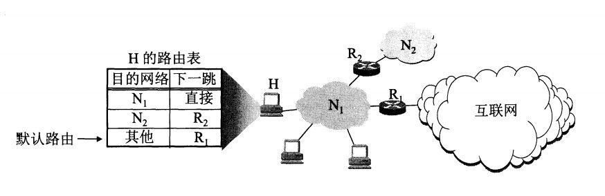 
 

## 路由選擇協議

路由選擇協議都是自適應的，能隨著網絡通信量和拓撲結構的變化而自適應地進行調整。

互聯網可以劃分為許多較小的自治系統 AS，一個 AS 可以使用一種和別的 AS 不同的路由選擇協議。

可以把路由選擇協議劃分為兩大類：

- 自治系統內部的路由選擇：RIP 和 OSPF
- 自治系統間的路由選擇：BGP

### 1. 內部網關協議 RIP

RIP 是一種基於距離向量的路由選擇協議。距離是指跳數，直接相連的路由器跳數為 1。跳數最多為 15，超過 15 表示不可達。

RIP 按固定的時間間隔僅和相鄰路由器交換自己的路由表，經過若幹次交換之後，所有路由器最終會知道到達本自治系統中任何一個網絡的最短距離和下一跳路由器地址。

距離向量算法：

- 對地址為 X 的相鄰路由器發來的 RIP 報文，先修改報文中的所有項目，把下一跳字段中的地址改為 X，並把所有的距離字段加 1；
- 對修改後的 RIP 報文中的每一個項目，進行以下步驟：
 - 若原來的路由表中沒有目的網絡 N，則把該項目添加到路由表中；
 - 否則：若下一跳路由器地址是 X，則把收到的項目替換原來路由表中的項目；否則：若收到的項目中的距離 d 小於路由表中的距離，則進行更新（例如原始路由表項為 Net2, 5, P，新表項為 Net2, 4, X，則更新）；否則什麽也不做。
- 若 3 分鐘還沒有收到相鄰路由器的更新路由表，則把該相鄰路由器標為不可達，即把距離置為 16。

RIP 協議實現簡單，開銷小。但是 RIP 能使用的最大距離為 15，限制了網絡的規模。並且當網絡出現故障時，要經過比較長的時間才能將此消息傳送到所有路由器。

### 2. 內部網關協議 OSPF

開放最短路徑優先 OSPF，是為了克服 RIP 的缺點而開發出來的。

開放表示 OSPF 不受某一家廠商控制，而是公開發表的；最短路徑優先表示使用了 Dijkstra 提出的最短路徑算法 SPF。

OSPF 具有以下特點：

- 向本自治系統中的所有路由器發送信息，這種方法是洪泛法。
- 發送的信息就是與相鄰路由器的鏈路狀態，鏈路狀態包括與哪些路由器相連以及鏈路的度量，度量用費用、距離、時延、帶寬等來表示。
- 只有當鏈路狀態發生變化時，路由器才會發送信息。

所有路由器都具有全網的拓撲結構圖，並且是一致的。相比於 RIP，OSPF 的更新過程收斂的很快。

### 3. 外部網關協議 BGP

BGP（Border Gateway Protocol，邊界網關協議）

AS 之間的路由選擇很困難，主要是由於：

- 互聯網規模很大；
- 各個 AS 內部使用不同的路由選擇協議，無法準確定義路徑的度量；
- AS 之間的路由選擇必須考慮有關的策略，比如有些 AS 不願意讓其它 AS 經過。

BGP 只能尋找一條比較好的路由，而不是最佳路由。

每個 AS 都必須配置 BGP 發言人，通過在兩個相鄰 BGP 發言人之間建立 TCP 連接來交換路由信息。

  
 

# 五、傳輸層

網絡層只把分組發送到目的主機，但是真正通信的並不是主機而是主機中的進程。傳輸層提供了進程間的邏輯通信，傳輸層向高層用戶屏蔽了下面網絡層的核心細節，使應用程序看起來像是在兩個傳輸層實體之間有一條端到端的邏輯通信信道。

## UDP 和 TCP 的特點

- 用戶數據報協議 UDP（User Datagram Protocol）是無連接的，盡最大可能交付，沒有擁塞控制，面向報文（對於應用程序傳下來的報文不合並也不拆分，只是添加 UDP 首部），支持一對一、一對多、多對一和多對多的交互通信。

- 傳輸控制協議 TCP（Transmission Control Protocol）是面向連接的，提供可靠交付，有流量控制，擁塞控制，提供全雙工通信，面向字節流（把應用層傳下來的報文看成字節流，把字節流組織成大小不等的數據塊），每一條 TCP 連接只能是點對點的（一對一）。
=======
VPN 使用公用的互联网作为本机构各专用网之间的通信载体。专用指机构内的主机只与本机构内的其它主机通信；虚拟指好像是，而实际上并不是，它有经过公用的互联网。

下图中，场所 A 和 B 的通信经过互联网，如果场所 A 的主机 X 要和另一个场所 B 的主机 Y 通信，IP 数据报的源地址是 10.1.0.1，目的地址是 10.2.0.3。数据报先发送到与互联网相连的路由器 R1，R1 对内部数据进行加密，然后重新加上数据报的首部，源地址是路由器 R1 的全球地址 125.1.2.3，目的地址是路由器 R2 的全球地址 194.4.5.6。路由器 R2 收到数据报后将数据部分进行解密，恢复原来的数据报，此时目的地址为 10.2.0.3，就交付给 Y。

  
 

## 网络地址转换 NAT

专用网内部的主机使用本地 IP 地址又想和互联网上的主机通信时，可以使用 NAT 来将本地 IP 转换为全球 IP。

在以前，NAT 将本地 IP 和全球 IP 一一对应，这种方式下拥有 n 个全球 IP 地址的专用网内最多只可以同时有 n 台主机接入互联网。为了更有效地利用全球 IP 地址，现在常用的 NAT 转换表把传输层的端口号也用上了，使得多个专用网内部的主机共用一个全球 IP 地址。使用端口号的 NAT 也叫做网络地址与端口转换 NAPT。

  
 

## 路由器的结构

路由器从功能上可以划分为：路由选择和分组转发。

分组转发结构由三个部分组成：交换结构、一组输入端口和一组输出端口。

  
 

## 路由器分组转发流程

- 从数据报的首部提取目的主机的 IP 地址 D，得到目的网络地址 N。
- 若 N 就是与此路由器直接相连的某个网络地址，则进行直接交付；
- 若路由表中有目的地址为 D 的特定主机路由，则把数据报传送给表中所指明的下一跳路由器；
- 若路由表中有到达网络 N 的路由，则把数据报传送给路由表中所指明的下一跳路由器；
- 若路由表中有一个默认路由，则把数据报传送给路由表中所指明的默认路由器；
- 报告转发分组出错。

  
 

## 路由选择协议

路由选择协议都是自适应的，能随着网络通信量和拓扑结构的变化而自适应地进行调整。

互联网可以划分为许多较小的自治系统 AS，一个 AS 可以使用一种和别的 AS 不同的路由选择协议。

可以把路由选择协议划分为两大类：

- 自治系统内部的路由选择：RIP 和 OSPF
- 自治系统间的路由选择：BGP

### 1. 内部网关协议 RIP

RIP 是一种基于距离向量的路由选择协议。距离是指跳数，直接相连的路由器跳数为 1。跳数最多为 15，超过 15 表示不可达。

RIP 按固定的时间间隔仅和相邻路由器交换自己的路由表，经过若干次交换之后，所有路由器最终会知道到达本自治系统中任何一个网络的最短距离和下一跳路由器地址。

距离向量算法：

- 对地址为 X 的相邻路由器发来的 RIP 报文，先修改报文中的所有项目，把下一跳字段中的地址改为 X，并把所有的距离字段加 1；
- 对修改后的 RIP 报文中的每一个项目，进行以下步骤：
 - 若原来的路由表中没有目的网络 N，则把该项目添加到路由表中；
 - 否则：若下一跳路由器地址是 X，则把收到的项目替换原来路由表中的项目；否则：若收到的项目中的距离 d 小于路由表中的距离，则进行更新（例如原始路由表项为 Net2, 5, P，新表项为 Net2, 4, X，则更新）；否则什么也不做。
- 若 3 分钟还没有收到相邻路由器的更新路由表，则把该相邻路由器标为不可达，即把距离置为 16。

RIP 协议实现简单，开销小。但是 RIP 能使用的最大距离为 15，限制了网络的规模。并且当网络出现故障时，要经过比较长的时间才能将此消息传送到所有路由器。

### 2. 内部网关协议 OSPF

开放最短路径优先 OSPF，是为了克服 RIP 的缺点而开发出来的。

开放表示 OSPF 不受某一家厂商控制，而是公开发表的；最短路径优先表示使用了 Dijkstra 提出的最短路径算法 SPF。

OSPF 具有以下特点：

- 向本自治系统中的所有路由器发送信息，这种方法是洪泛法。
- 发送的信息就是与相邻路由器的链路状态，链路状态包括与哪些路由器相连以及链路的度量，度量用费用、距离、时延、带宽等来表示。
- 只有当链路状态发生变化时，路由器才会发送信息。

所有路由器都具有全网的拓扑结构图，并且是一致的。相比于 RIP，OSPF 的更新过程收敛的很快。

### 3. 外部网关协议 BGP

BGP（Border Gateway Protocol，边界网关协议）

AS 之间的路由选择很困难，主要是由于：

- 互联网规模很大；
- 各个 AS 内部使用不同的路由选择协议，无法准确定义路径的度量；
- AS 之间的路由选择必须考虑有关的策略，比如有些 AS 不愿意让其它 AS 经过。

BGP 只能寻找一条比较好的路由，而不是最佳路由。

每个 AS 都必须配置 BGP 发言人，通过在两个相邻 BGP 发言人之间建立 TCP 连接来交换路由信息。

  
 

# 五、传输层

网络层只把分组发送到目的主机，但是真正通信的并不是主机而是主机中的进程。传输层提供了进程间的逻辑通信，传输层向高层用户屏蔽了下面网络层的核心细节，使应用程序看起来像是在两个传输层实体之间有一条端到端的逻辑通信信道。

## UDP 和 TCP 的特点

- 用户数据报协议 UDP（User Datagram Protocol）是无连接的，尽最大可能交付，没有拥塞控制，面向报文（对于应用程序传下来的报文不合并也不拆分，只是添加 UDP 首部），支持一对一、一对多、多对一和多对多的交互通信。

- 传输控制协议 TCP（Transmission Control Protocol）是面向连接的，提供可靠交付，有流量控制，拥塞控制，提供全双工通信，面向字节流（把应用层传下来的报文看成字节流，把字节流组织成大小不等的数据块），每一条 TCP 连接只能是点对点的（一对一）。
>>>>>>> 9f1571a1b578332969a00a0bda4029dfad9995a3

## UDP 首部格式

  
 

<<<<<<< HEAD
首部字段只有 8 個字節，包括源端口、目的端口、長度、檢驗和。12 字節的偽首部是為了計算檢驗和臨時添加的。
=======
首部字段只有 8 个字节，包括源端口、目的端口、长度、检验和。12 字节的伪首部是为了计算检验和临时添加的。
>>>>>>> 9f1571a1b578332969a00a0bda4029dfad9995a3

## TCP 首部格式

  
 

<<<<<<< HEAD
-  **序號**  ：用於對字節流進行編號，例如序號為 301，表示第一個字節的編號為 301，如果攜帶的數據長度為 100 字節，那麽下一個報文段的序號應為 401。

-  **確認號**  ：期望收到的下一個報文段的序號。例如 B 正確收到 A 發送來的一個報文段，序號為 501，攜帶的數據長度為 200 字節，因此 B 期望下一個報文段的序號為 701，B 發送給 A 的確認報文段中確認號就為 701。

-  **數據偏移**  ：指的是數據部分距離報文段起始處的偏移量，實際上指的是首部的長度。

-  **確認 ACK**  ：當 ACK=1 時確認號字段有效，否則無效。TCP 規定，在連接建立後所有傳送的報文段都必須把 ACK 置 1。

-  **同步 SYN**  ：在連接建立時用來同步序號。當 SYN=1，ACK=0 時表示這是一個連接請求報文段。若對方同意建立連接，則響應報文中 SYN=1，ACK=1。

-  **終止 FIN**  ：用來釋放一個連接，當 FIN=1 時，表示此報文段的發送方的數據已發送完畢，並要求釋放連接。

-  **窗口**  ：窗口值作為接收方讓發送方設置其發送窗口的依據。之所以要有這個限制，是因為接收方的數據緩存空間是有限的。
=======
-  **序号**  ：用于对字节流进行编号，例如序号为 301，表示第一个字节的编号为 301，如果携带的数据长度为 100 字节，那么下一个报文段的序号应为 401。

-  **确认号**  ：期望收到的下一个报文段的序号。例如 B 正确收到 A 发送来的一个报文段，序号为 501，携带的数据长度为 200 字节，因此 B 期望下一个报文段的序号为 701，B 发送给 A 的确认报文段中确认号就为 701。

-  **数据偏移**  ：指的是数据部分距离报文段起始处的偏移量，实际上指的是首部的长度。

-  **确认 ACK**  ：当 ACK=1 时确认号字段有效，否则无效。TCP 规定，在连接建立后所有传送的报文段都必须把 ACK 置 1。

-  **同步 SYN**  ：在连接建立时用来同步序号。当 SYN=1，ACK=0 时表示这是一个连接请求报文段。若对方同意建立连接，则响应报文中 SYN=1，ACK=1。

-  **终止 FIN**  ：用来释放一个连接，当 FIN=1 时，表示此报文段的发送方的数据已发送完毕，并要求释放连接。

-  **窗口**  ：窗口值作为接收方让发送方设置其发送窗口的依据。之所以要有这个限制，是因为接收方的数据缓存空间是有限的。
>>>>>>> 9f1571a1b578332969a00a0bda4029dfad9995a3

## TCP 的三次握手

  
 

<<<<<<< HEAD
假設 A 為客戶端，B 為服務器端。

- 首先 B 處於 LISTEN（監聽）狀態，等待客戶的連接請求。

- A 向 B 發送連接請求報文，SYN=1，ACK=0，選擇一個初始的序號 x。

- B 收到連接請求報文，如果同意建立連接，則向 A 發送連接確認報文，SYN=1，ACK=1，確認號為 x+1，同時也選擇一個初始的序號 y。

- A 收到 B 的連接確認報文後，還要向 B 發出確認，確認號為 y+1，序號為 x+1。

- B 收到 A 的確認後，連接建立。

**三次握手的原因** 

第三次握手是為了防止失效的連接請求到達服務器，讓服務器錯誤打開連接。

客戶端發送的連接請求如果在網絡中滯留，那麽就會隔很長一段時間才能收到服務器端發回的連接確認。客戶端等待一個超時重傳時間之後，就會重新請求連接。但是這個滯留的連接請求最後還是會到達服務器，如果不進行三次握手，那麽服務器就會打開兩個連接。如果有第三次握手，客戶端會忽略服務器之後發送的對滯留連接請求的連接確認，不進行第三次握手，因此就不會再次打開連接。

## TCP 的四次揮手

  
 

以下描述不討論序號和確認號，因為序號和確認號的規則比較簡單。並且不討論 ACK，因為 ACK 在連接建立之後都為 1。

- A 發送連接釋放報文，FIN=1。

- B 收到之後發出確認，此時 TCP 屬於半關閉狀態，B 能向 A 發送數據但是 A 不能向 B 發送數據。

- 當 B 不再需要連接時，發送連接釋放報文，FIN=1。

- A 收到後發出確認，進入 TIME-WAIT 狀態，等待 2 MSL（最大報文存活時間）後釋放連接。

- B 收到 A 的確認後釋放連接。

**四次揮手的原因** 

客戶端發送了 FIN 連接釋放報文之後，服務器收到了這個報文，就進入了 CLOSE-WAIT 狀態。這個狀態是為了讓服務器端發送還未傳送完畢的數據，傳送完畢之後，服務器會發送 FIN 連接釋放報文。

**TIME_WAIT** 

客戶端接收到服務器端的 FIN 報文後進入此狀態，此時並不是直接進入 CLOSED 狀態，還需要等待一個時間計時器設置的時間 2MSL。這麽做有兩個理由：

- 確保最後一個確認報文能夠到達。如果 B 沒收到 A 發送來的確認報文，那麽就會重新發送連接釋放請求報文，A 等待一段時間就是為了處理這種情況的發生。

- 等待一段時間是為了讓本連接持續時間內所產生的所有報文都從網絡中消失，使得下一個新的連接不會出現舊的連接請求報文。

## TCP 可靠傳輸

TCP 使用超時重傳來實現可靠傳輸：如果一個已經發送的報文段在超時時間內沒有收到確認，那麽就重傳這個報文段。

一個報文段從發送再到接收到確認所經過的時間稱為往返時間 RTT，加權平均往返時間 RTTs 計算如下：

  

超時時間 RTO 應該略大於 RTTs，TCP 使用的超時時間計算如下：

  

其中 RTTd 為偏差。

## TCP 滑動窗口

窗口是緩存的一部分，用來暫時存放字節流。發送方和接收方各有一個窗口，接收方通過 TCP 報文段中的窗口字段告訴發送方自己的窗口大小，發送方根據這個值和其它信息設置自己的窗口大小。

發送窗口內的字節都允許被發送，接收窗口內的字節都允許被接收。如果發送窗口左部的字節已經發送並且收到了確認，那麽就將發送窗口向右滑動一定距離，直到左部第一個字節不是已發送並且已確認的狀態；接收窗口的滑動類似，接收窗口左部字節已經發送確認並交付主機，就向右滑動接收窗口。

接收窗口只會對窗口內最後一個按序到達的字節進行確認，例如接收窗口已經收到的字節為 {31, 34, 35}，其中 {31} 按序到達，而 {34, 35} 就不是，因此只對字節 31 進行確認。發送方得到一個字節的確認之後，就知道這個字節之前的所有字節都已經被接收。
=======
假设 A 为客户端，B 为服务器端。

- 首先 B 处于 LISTEN（监听）状态，等待客户的连接请求。

- A 向 B 发送连接请求报文，SYN=1，ACK=0，选择一个初始的序号 x。

- B 收到连接请求报文，如果同意建立连接，则向 A 发送连接确认报文，SYN=1，ACK=1，确认号为 x+1，同时也选择一个初始的序号 y。

- A 收到 B 的连接确认报文后，还要向 B 发出确认，确认号为 y+1，序号为 x+1。

- B 收到 A 的确认后，连接建立。

**三次握手的原因** 

第三次握手是为了防止失效的连接请求到达服务器，让服务器错误打开连接。

客户端发送的连接请求如果在网络中滞留，那么就会隔很长一段时间才能收到服务器端发回的连接确认。客户端等待一个超时重传时间之后，就会重新请求连接。但是这个滞留的连接请求最后还是会到达服务器，如果不进行三次握手，那么服务器就会打开两个连接。如果有第三次握手，客户端会忽略服务器之后发送的对滞留连接请求的连接确认，不进行第三次握手，因此就不会再次打开连接。

## TCP 的四次挥手

  
 

以下描述不讨论序号和确认号，因为序号和确认号的规则比较简单。并且不讨论 ACK，因为 ACK 在连接建立之后都为 1。

- A 发送连接释放报文，FIN=1。

- B 收到之后发出确认，此时 TCP 属于半关闭状态，B 能向 A 发送数据但是 A 不能向 B 发送数据。

- 当 B 不再需要连接时，发送连接释放报文，FIN=1。

- A 收到后发出确认，进入 TIME-WAIT 状态，等待 2 MSL（最大报文存活时间）后释放连接。

- B 收到 A 的确认后释放连接。

**四次挥手的原因** 

客户端发送了 FIN 连接释放报文之后，服务器收到了这个报文，就进入了 CLOSE-WAIT 状态。这个状态是为了让服务器端发送还未传送完毕的数据，传送完毕之后，服务器会发送 FIN 连接释放报文。

**TIME_WAIT** 

客户端接收到服务器端的 FIN 报文后进入此状态，此时并不是直接进入 CLOSED 状态，还需要等待一个时间计时器设置的时间 2MSL。这么做有两个理由：

- 确保最后一个确认报文能够到达。如果 B 没收到 A 发送来的确认报文，那么就会重新发送连接释放请求报文，A 等待一段时间就是为了处理这种情况的发生。

- 等待一段时间是为了让本连接持续时间内所产生的所有报文都从网络中消失，使得下一个新的连接不会出现旧的连接请求报文。

## TCP 可靠传输

TCP 使用超时重传来实现可靠传输：如果一个已经发送的报文段在超时时间内没有收到确认，那么就重传这个报文段。

一个报文段从发送再到接收到确认所经过的时间称为往返时间 RTT，加权平均往返时间 RTTs 计算如下：

  

其中，0 ≤ a ＜ 1，RTTs 随着 a 的增加更容易受到 RTT 的影响。

超时时间 RTO 应该略大于 RTTs，TCP 使用的超时时间计算如下：

  

其中 RTTd 为偏差的加权平均值。

## TCP 滑动窗口

窗口是缓存的一部分，用来暂时存放字节流。发送方和接收方各有一个窗口，接收方通过 TCP 报文段中的窗口字段告诉发送方自己的窗口大小，发送方根据这个值和其它信息设置自己的窗口大小。

发送窗口内的字节都允许被发送，接收窗口内的字节都允许被接收。如果发送窗口左部的字节已经发送并且收到了确认，那么就将发送窗口向右滑动一定距离，直到左部第一个字节不是已发送并且已确认的状态；接收窗口的滑动类似，接收窗口左部字节已经发送确认并交付主机，就向右滑动接收窗口。

接收窗口只会对窗口内最后一个按序到达的字节进行确认，例如接收窗口已经收到的字节为 {31, 34, 35}，其中 {31} 按序到达，而 {34, 35} 就不是，因此只对字节 31 进行确认。发送方得到一个字节的确认之后，就知道这个字节之前的所有字节都已经被接收。
>>>>>>> 9f1571a1b578332969a00a0bda4029dfad9995a3

  
 

## TCP 流量控制

<<<<<<< HEAD
流量控制是為了控制發送方發送速率，保證接收方來得及接收。

接收方發送的確認報文中的窗口字段可以用來控制發送方窗口大小，從而影響發送方的發送速率。將窗口字段設置為 0，則發送方不能發送數據。

## TCP 擁塞控制

如果網絡出現擁塞，分組將會丟失，此時發送方會繼續重傳，從而導致網絡擁塞程度更高。因此當出現擁塞時，應當控制發送方的速率。這一點和流量控制很像，但是出發點不同。流量控制是為了讓接收方能來得及接收，而擁塞控制是為了降低整個網絡的擁塞程度。

  
 

TCP 主要通過四個算法來進行擁塞控制：慢開始、擁塞避免、快重傳、快恢覆。

發送方需要維護一個叫做擁塞窗口（cwnd）的狀態變量，註意擁塞窗口與發送方窗口的區別：擁塞窗口只是一個狀態變量，實際決定發送方能發送多少數據的是發送方窗口。

為了便於討論，做如下假設：

- 接收方有足夠大的接收緩存，因此不會發生流量控制；
- 雖然 TCP 的窗口基於字節，但是這裏設窗口的大小單位為報文段。

  
 

### 1. 慢開始與擁塞避免

發送的最初執行慢開始，令 cwnd = 1，發送方只能發送 1 個報文段；當收到確認後，將 cwnd 加倍，因此之後發送方能夠發送的報文段數量為：2、4、8 ...

註意到慢開始每個輪次都將 cwnd 加倍，這樣會讓 cwnd 增長速度非常快，從而使得發送方發送的速度增長速度過快，網絡擁塞的可能性也就更高。設置一個慢開始門限 ssthresh，當 cwnd >= ssthresh 時，進入擁塞避免，每個輪次只將 cwnd 加 1。

如果出現了超時，則令 ssthresh = cwnd / 2，然後重新執行慢開始。

### 2. 快重傳與快恢覆

在接收方，要求每次接收到報文段都應該對最後一個已收到的有序報文段進行確認。例如已經接收到 M1 和 M2，此時收到 M4，應當發送對 M2 的確認。

在發送方，如果收到三個重覆確認，那麽可以知道下一個報文段丟失，此時執行快重傳，立即重傳下一個報文段。例如收到三個 M2，則 M3 丟失，立即重傳 M3。

在這種情況下，只是丟失個別報文段，而不是網絡擁塞。因此執行快恢覆，令 ssthresh = cwnd / 2 ，cwnd = ssthresh，註意到此時直接進入擁塞避免。

慢開始和快恢覆的快慢指的是 cwnd 的設定值，而不是 cwnd 的增長速率。慢開始 cwnd 設定為 1，而快恢覆 cwnd 設定為 ssthresh。

  
 

# 六、應用層

## 域名系統

DNS 是一個分布式數據庫，提供了主機名和 IP 地址之間相互轉換的服務。這裏的分布式數據庫是指，每個站點只保留它自己的那部分數據。

域名具有層次結構，從上到下依次為：根域名、頂級域名、二級域名。

  
 

DNS 可以使用 UDP 或者 TCP 進行傳輸，使用的端口號都為 53。大多數情況下 DNS 使用 UDP 進行傳輸，這就要求域名解析器和域名服務器都必須自己處理超時和重傳來保證可靠性。在兩種情況下會使用 TCP 進行傳輸：

- 如果返回的響應超過的 512 字節（UDP 最大只支持 512 字節的數據）。
- 區域傳送（區域傳送是主域名服務器向輔助域名服務器傳送變化的那部分數據）。

## 文件傳送協議

FTP 使用 TCP 進行連接，它需要兩個連接來傳送一個文件：

- 控制連接：服務器打開端口號 21 等待客戶端的連接，客戶端主動建立連接後，使用這個連接將客戶端的命令傳送給服務器，並傳回服務器的應答。
- 數據連接：用來傳送一個文件數據。

根據數據連接是否是服務器端主動建立，FTP 有主動和被動兩種模式：

- 主動模式：服務器端主動建立數據連接，其中服務器端的端口號為 20，客戶端的端口號隨機，但是必須大於 1024，因為 0\~1023 是熟知端口號。

  
 

- 被動模式：客戶端主動建立數據連接，其中客戶端的端口號由客戶端自己指定，服務器端的端口號隨機。

  
 

主動模式要求客戶端開放端口號給服務器端，需要去配置客戶端的防火墻。被動模式只需要服務器端開放端口號即可，無需客戶端配置防火墻。但是被動模式會導致服務器端的安全性減弱，因為開放了過多的端口號。

## 動態主機配置協議

DHCP (Dynamic Host Configuration Protocol) 提供了即插即用的連網方式，用戶不再需要去手動配置 IP 地址等信息。

DHCP 配置的內容不僅是 IP 地址，還包括子網掩碼、網關 IP 地址。

DHCP 工作過程如下：

1. 客戶端發送 Discover 報文，該報文的目的地址為 255.255.255.255:67，源地址為 0.0.0.0:68，被放入 UDP 中，該報文被廣播到同一個子網的所有主機上。如果客戶端和 DHCP 服務器不在同一個子網，就需要使用中繼代理。
2. DHCP 服務器收到 Discover 報文之後，發送 Offer 報文給客戶端，該報文包含了客戶端所需要的信息。因為客戶端可能收到多個 DHCP 服務器提供的信息，因此客戶端需要進行選擇。
3. 如果客戶端選擇了某個 DHCP 服務器提供的信息，那麽就發送 Request 報文給該 DHCP 服務器。
4. DHCP 服務器發送 Ack 報文，表示客戶端此時可以使用提供給它的信息。

 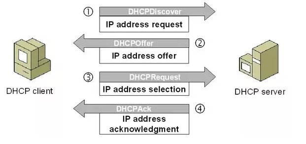 
 

## 遠程登錄協議

TELNET 用於登錄到遠程主機上，並且遠程主機上的輸出也會返回。

TELNET 可以適應許多計算機和操作系統的差異，例如不同操作系統系統的換行符定義。

## 電子郵件協議

一個電子郵件系統由三部分組成：用戶代理、郵件服務器以及郵件協議。

郵件協議包含發送協議和讀取協議，發送協議常用 SMTP，讀取協議常用 POP3 和 IMAP。
=======
流量控制是为了控制发送方发送速率，保证接收方来得及接收。

接收方发送的确认报文中的窗口字段可以用来控制发送方窗口大小，从而影响发送方的发送速率。将窗口字段设置为 0，则发送方不能发送数据。

## TCP 拥塞控制

如果网络出现拥塞，分组将会丢失，此时发送方会继续重传，从而导致网络拥塞程度更高。因此当出现拥塞时，应当控制发送方的速率。这一点和流量控制很像，但是出发点不同。流量控制是为了让接收方能来得及接收，而拥塞控制是为了降低整个网络的拥塞程度。

  
 

TCP 主要通过四个算法来进行拥塞控制：慢开始、拥塞避免、快重传、快恢复。

发送方需要维护一个叫做拥塞窗口（cwnd）的状态变量，注意拥塞窗口与发送方窗口的区别：拥塞窗口只是一个状态变量，实际决定发送方能发送多少数据的是发送方窗口。

为了便于讨论，做如下假设：

- 接收方有足够大的接收缓存，因此不会发生流量控制；
- 虽然 TCP 的窗口基于字节，但是这里设窗口的大小单位为报文段。

  
 

### 1. 慢开始与拥塞避免

发送的最初执行慢开始，令 cwnd = 1，发送方只能发送 1 个报文段；当收到确认后，将 cwnd 加倍，因此之后发送方能够发送的报文段数量为：2、4、8 ...

注意到慢开始每个轮次都将 cwnd 加倍，这样会让 cwnd 增长速度非常快，从而使得发送方发送的速度增长速度过快，网络拥塞的可能性也就更高。设置一个慢开始门限 ssthresh，当 cwnd >= ssthresh 时，进入拥塞避免，每个轮次只将 cwnd 加 1。

如果出现了超时，则令 ssthresh = cwnd / 2，然后重新执行慢开始。

### 2. 快重传与快恢复

在接收方，要求每次接收到报文段都应该对最后一个已收到的有序报文段进行确认。例如已经接收到 M1 和 M2，此时收到 M4，应当发送对 M2 的确认。

在发送方，如果收到三个重复确认，那么可以知道下一个报文段丢失，此时执行快重传，立即重传下一个报文段。例如收到三个 M2，则 M3 丢失，立即重传 M3。

在这种情况下，只是丢失个别报文段，而不是网络拥塞。因此执行快恢复，令 ssthresh = cwnd / 2 ，cwnd = ssthresh，注意到此时直接进入拥塞避免。

慢开始和快恢复的快慢指的是 cwnd 的设定值，而不是 cwnd 的增长速率。慢开始 cwnd 设定为 1，而快恢复 cwnd 设定为 ssthresh。

  
 

# 六、应用层

## 域名系统

DNS 是一个分布式数据库，提供了主机名和 IP 地址之间相互转换的服务。这里的分布式数据库是指，每个站点只保留它自己的那部分数据。

域名具有层次结构，从上到下依次为：根域名、顶级域名、二级域名。

  
 

DNS 可以使用 UDP 或者 TCP 进行传输，使用的端口号都为 53。大多数情况下 DNS 使用 UDP 进行传输，这就要求域名解析器和域名服务器都必须自己处理超时和重传来保证可靠性。在两种情况下会使用 TCP 进行传输：

- 如果返回的响应超过的 512 字节（UDP 最大只支持 512 字节的数据）。
- 区域传送（区域传送是主域名服务器向辅助域名服务器传送变化的那部分数据）。

## 文件传送协议

FTP 使用 TCP 进行连接，它需要两个连接来传送一个文件：

- 控制连接：服务器打开端口号 21 等待客户端的连接，客户端主动建立连接后，使用这个连接将客户端的命令传送给服务器，并传回服务器的应答。
- 数据连接：用来传送一个文件数据。

根据数据连接是否是服务器端主动建立，FTP 有主动和被动两种模式：

- 主动模式：服务器端主动建立数据连接，其中服务器端的端口号为 20，客户端的端口号随机，但是必须大于 1024，因为 0\~1023 是熟知端口号。

  
 

- 被动模式：客户端主动建立数据连接，其中客户端的端口号由客户端自己指定，服务器端的端口号随机。

  
 

主动模式要求客户端开放端口号给服务器端，需要去配置客户端的防火墙。被动模式只需要服务器端开放端口号即可，无需客户端配置防火墙。但是被动模式会导致服务器端的安全性减弱，因为开放了过多的端口号。

## 动态主机配置协议

DHCP (Dynamic Host Configuration Protocol) 提供了即插即用的连网方式，用户不再需要去手动配置 IP 地址等信息。

DHCP 配置的内容不仅是 IP 地址，还包括子网掩码、网关 IP 地址。

DHCP 工作过程如下：

1. 客户端发送 Discover 报文，该报文的目的地址为 255.255.255.255:67，源地址为 0.0.0.0:68，被放入 UDP 中，该报文被广播到同一个子网的所有主机上。如果客户端和 DHCP 服务器不在同一个子网，就需要使用中继代理。
2. DHCP 服务器收到 Discover 报文之后，发送 Offer 报文给客户端，该报文包含了客户端所需要的信息。因为客户端可能收到多个 DHCP 服务器提供的信息，因此客户端需要进行选择。
3. 如果客户端选择了某个 DHCP 服务器提供的信息，那么就发送 Request 报文给该 DHCP 服务器。
4. DHCP 服务器发送 Ack 报文，表示客户端此时可以使用提供给它的信息。

  
 

## 远程登录协议

TELNET 用于登录到远程主机上，并且远程主机上的输出也会返回。

TELNET 可以适应许多计算机和操作系统的差异，例如不同操作系统系统的换行符定义。

## 电子邮件协议

一个电子邮件系统由三部分组成：用户代理、邮件服务器以及邮件协议。

邮件协议包含发送协议和读取协议，发送协议常用 SMTP，读取协议常用 POP3 和 IMAP。
>>>>>>> 9f1571a1b578332969a00a0bda4029dfad9995a3

 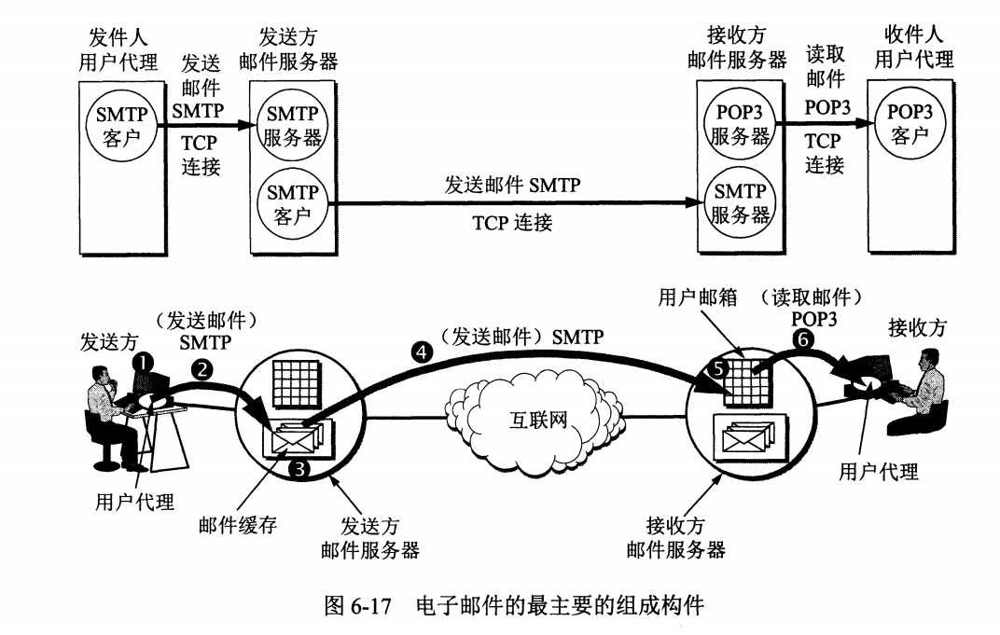 
 

### 1. SMTP

<<<<<<< HEAD
SMTP 只能發送 ASCII 碼，而互聯網郵件擴充 MIME 可以發送二進制文件。MIME 並沒有改動或者取代 SMTP，而是增加郵件主體的結構，定義了非 ASCII 碼的編碼規則。
=======
SMTP 只能发送 ASCII 码，而互联网邮件扩充 MIME 可以发送二进制文件。MIME 并没有改动或者取代 SMTP，而是增加邮件主体的结构，定义了非 ASCII 码的编码规则。
>>>>>>> 9f1571a1b578332969a00a0bda4029dfad9995a3

  
 

### 2. POP3

<<<<<<< HEAD
POP3 的特點是只要用戶從服務器上讀取了郵件，就把該郵件刪除。

### 3. IMAP

IMAP 協議中客戶端和服務器上的郵件保持同步，如果不手動刪除郵件，那麽服務器上的郵件也不會被刪除。IMAP 這種做法可以讓用戶隨時隨地去訪問服務器上的郵件。

## 常用端口

|應用| 應用層協議 | 端口號 | 傳輸層協議 | 備註 |
| :---: | :--: | :--: | :--: | :--: |
| 域名解析 | DNS | 53 | UDP/TCP | 長度超過 512 字節時使用 TCP |
| 動態主機配置協議 | DHCP | 67/68 | UDP | |
| 簡單網絡管理協議 | SNMP | 161/162 | UDP | |
| 文件傳送協議 | FTP | 20/21 | TCP | 控制連接 21，數據連接 20 |
| 遠程終端協議 | TELNET | 23 | TCP | |
| 超文本傳送協議 | HTTP | 80 | TCP | |
| 簡單郵件傳送協議 | SMTP | 25 | TCP | |
| 郵件讀取協議 | POP3 | 110 | TCP | |
| 網際報文存取協議 | IMAP | 143 | TCP | |

## Web 頁面請求過程

### 1. DHCP 配置主機信息

- 假設主機最開始沒有 IP 地址以及其它信息，那麽就需要先使用 DHCP 來獲取。

- 主機生成一個 DHCP 請求報文，並將這個報文放入具有目的端口 67 和源端口 68 的 UDP 報文段中。

- 該報文段則被放入在一個具有廣播 IP 目的地址(255.255.255.255) 和源 IP 地址（0.0.0.0）的 IP 數據報中。

- 該數據報則被放置在 MAC 幀中，該幀具有目的地址 FF:FF:FF:FF:FF:FF，將廣播到與交換機連接的所有設備。

- 連接在交換機的 DHCP 服務器收到廣播幀之後，不斷地向上分解得到 IP 數據報、UDP 報文段、DHCP 請求報文，之後生成 DHCP ACK 報文，該報文包含以下信息：IP 地址、DNS 服務器的 IP 地址、默認網關路由器的 IP 地址和子網掩碼。該報文被放入 UDP 報文段中，UDP 報文段有被放入 IP 數據報中，最後放入 MAC 幀中。

- 該幀的目的地址是請求主機的 MAC 地址，因為交換機具有自學習能力，之前主機發送了廣播幀之後就記錄了 MAC 地址到其轉發接口的交換表項，因此現在交換機就可以直接知道應該向哪個接口發送該幀。

- 主機收到該幀後，不斷分解得到 DHCP 報文。之後就配置它的 IP 地址、子網掩碼和 DNS 服務器的 IP 地址，並在其 IP 轉發表中安裝默認網關。

### 2. ARP 解析 MAC 地址

- 主機通過瀏覽器生成一個 TCP 套接字，套接字向 HTTP 服務器發送 HTTP 請求。為了生成該套接字，主機需要知道網站的域名對應的 IP 地址。

- 主機生成一個 DNS 查詢報文，該報文具有 53 號端口，因為 DNS 服務器的端口號是 53。

- 該 DNS 查詢報文被放入目的地址為 DNS 服務器 IP 地址的 IP 數據報中。

- 該 IP 數據報被放入一個以太網幀中，該幀將發送到網關路由器。

- DHCP 過程只知道網關路由器的 IP 地址，為了獲取網關路由器的 MAC 地址，需要使用 ARP 協議。

- 主機生成一個包含目的地址為網關路由器 IP 地址的 ARP 查詢報文，將該 ARP 查詢報文放入一個具有廣播目的地址（FF:FF:FF:FF:FF:FF）的以太網幀中，並向交換機發送該以太網幀，交換機將該幀轉發給所有的連接設備，包括網關路由器。

- 網關路由器接收到該幀後，不斷向上分解得到 ARP 報文，發現其中的 IP 地址與其接口的 IP 地址匹配，因此就發送一個 ARP 回答報文，包含了它的 MAC 地址，發回給主機。

### 3. DNS 解析域名

- 知道了網關路由器的 MAC 地址之後，就可以繼續 DNS 的解析過程了。

- 網關路由器接收到包含 DNS 查詢報文的以太網幀後，抽取出 IP 數據報，並根據轉發表決定該 IP 數據報應該轉發的路由器。

- 因為路由器具有內部網關協議（RIP、OSPF）和外部網關協議（BGP）這兩種路由選擇協議，因此路由表中已經配置了網關路由器到達 DNS 服務器的路由表項。

- 到達 DNS 服務器之後，DNS 服務器抽取出 DNS 查詢報文，並在 DNS 數據庫中查找待解析的域名。

- 找到 DNS 記錄之後，發送 DNS 回答報文，將該回答報文放入 UDP 報文段中，然後放入 IP 數據報中，通過路由器反向轉發回網關路由器，並經過以太網交換機到達主機。

### 4. HTTP 請求頁面

- 有了 HTTP 服務器的 IP 地址之後，主機就能夠生成 TCP 套接字，該套接字將用於向 Web 服務器發送 HTTP GET 報文。

- 在生成 TCP 套接字之前，必須先與 HTTP 服務器進行三次握手來建立連接。生成一個具有目的端口 80 的 TCP SYN 報文段，並向 HTTP 服務器發送該報文段。

- HTTP 服務器收到該報文段之後，生成 TCP SYN ACK 報文段，發回給主機。

- 連接建立之後，瀏覽器生成 HTTP GET 報文，並交付給 HTTP 服務器。

- HTTP 服務器從 TCP 套接字讀取 HTTP GET 報文，生成一個 HTTP 響應報文，將 Web 頁面內容放入報文主體中，發回給主機。

- 瀏覽器收到 HTTP 響應報文後，抽取出 Web 頁面內容，之後進行渲染，顯示 Web 頁面。

# 參考資料

- 計算機網絡, 謝希仁
- JamesF.Kurose, KeithW.Ross, 庫羅斯, 等. 計算機網絡: 自頂向下方法 [M]. 機械工業出版社, 2014.
- W.RichardStevens. TCP/IP 詳解. 卷 1, 協議 [M]. 機械工業出版社, 2006.
=======
POP3 的特点是只要用户从服务器上读取了邮件，就把该邮件删除。

### 3. IMAP

IMAP 协议中客户端和服务器上的邮件保持同步，如果不手动删除邮件，那么服务器上的邮件也不会被删除。IMAP 这种做法可以让用户随时随地去访问服务器上的邮件。

## 常用端口

|应用| 应用层协议 | 端口号 | 传输层协议 | 备注 |
| :---: | :--: | :--: | :--: | :--: |
| 域名解析 | DNS | 53 | UDP/TCP | 长度超过 512 字节时使用 TCP |
| 动态主机配置协议 | DHCP | 67/68 | UDP | |
| 简单网络管理协议 | SNMP | 161/162 | UDP | |
| 文件传送协议 | FTP | 20/21 | TCP | 控制连接 21，数据连接 20 |
| 远程终端协议 | TELNET | 23 | TCP | |
| 超文本传送协议 | HTTP | 80 | TCP | |
| 简单邮件传送协议 | SMTP | 25 | TCP | |
| 邮件读取协议 | POP3 | 110 | TCP | |
| 网际报文存取协议 | IMAP | 143 | TCP | |

## Web 页面请求过程

### 1. DHCP 配置主机信息

- 假设主机最开始没有 IP 地址以及其它信息，那么就需要先使用 DHCP 来获取。

- 主机生成一个 DHCP 请求报文，并将这个报文放入具有目的端口 67 和源端口 68 的 UDP 报文段中。

- 该报文段则被放入在一个具有广播 IP 目的地址(255.255.255.255) 和源 IP 地址（0.0.0.0）的 IP 数据报中。

- 该数据报则被放置在 MAC 帧中，该帧具有目的地址 FF:FF:FF:FF:FF:FF，将广播到与交换机连接的所有设备。

- 连接在交换机的 DHCP 服务器收到广播帧之后，不断地向上分解得到 IP 数据报、UDP 报文段、DHCP 请求报文，之后生成 DHCP ACK 报文，该报文包含以下信息：IP 地址、DNS 服务器的 IP 地址、默认网关路由器的 IP 地址和子网掩码。该报文被放入 UDP 报文段中，UDP 报文段有被放入 IP 数据报中，最后放入 MAC 帧中。

- 该帧的目的地址是请求主机的 MAC 地址，因为交换机具有自学习能力，之前主机发送了广播帧之后就记录了 MAC 地址到其转发接口的交换表项，因此现在交换机就可以直接知道应该向哪个接口发送该帧。

- 主机收到该帧后，不断分解得到 DHCP 报文。之后就配置它的 IP 地址、子网掩码和 DNS 服务器的 IP 地址，并在其 IP 转发表中安装默认网关。

### 2. ARP 解析 MAC 地址

- 主机通过浏览器生成一个 TCP 套接字，套接字向 HTTP 服务器发送 HTTP 请求。为了生成该套接字，主机需要知道网站的域名对应的 IP 地址。

- 主机生成一个 DNS 查询报文，该报文具有 53 号端口，因为 DNS 服务器的端口号是 53。

- 该 DNS 查询报文被放入目的地址为 DNS 服务器 IP 地址的 IP 数据报中。

- 该 IP 数据报被放入一个以太网帧中，该帧将发送到网关路由器。

- DHCP 过程只知道网关路由器的 IP 地址，为了获取网关路由器的 MAC 地址，需要使用 ARP 协议。

- 主机生成一个包含目的地址为网关路由器 IP 地址的 ARP 查询报文，将该 ARP 查询报文放入一个具有广播目的地址（FF:FF:FF:FF:FF:FF）的以太网帧中，并向交换机发送该以太网帧，交换机将该帧转发给所有的连接设备，包括网关路由器。

- 网关路由器接收到该帧后，不断向上分解得到 ARP 报文，发现其中的 IP 地址与其接口的 IP 地址匹配，因此就发送一个 ARP 回答报文，包含了它的 MAC 地址，发回给主机。

### 3. DNS 解析域名

- 知道了网关路由器的 MAC 地址之后，就可以继续 DNS 的解析过程了。

- 网关路由器接收到包含 DNS 查询报文的以太网帧后，抽取出 IP 数据报，并根据转发表决定该 IP 数据报应该转发的路由器。

- 因为路由器具有内部网关协议（RIP、OSPF）和外部网关协议（BGP）这两种路由选择协议，因此路由表中已经配置了网关路由器到达 DNS 服务器的路由表项。

- 到达 DNS 服务器之后，DNS 服务器抽取出 DNS 查询报文，并在 DNS 数据库中查找待解析的域名。

- 找到 DNS 记录之后，发送 DNS 回答报文，将该回答报文放入 UDP 报文段中，然后放入 IP 数据报中，通过路由器反向转发回网关路由器，并经过以太网交换机到达主机。

### 4. HTTP 请求页面

- 有了 HTTP 服务器的 IP 地址之后，主机就能够生成 TCP 套接字，该套接字将用于向 Web 服务器发送 HTTP GET 报文。

- 在生成 TCP 套接字之前，必须先与 HTTP 服务器进行三次握手来建立连接。生成一个具有目的端口 80 的 TCP SYN 报文段，并向 HTTP 服务器发送该报文段。

- HTTP 服务器收到该报文段之后，生成 TCP SYN ACK 报文段，发回给主机。

- 连接建立之后，浏览器生成 HTTP GET 报文，并交付给 HTTP 服务器。

- HTTP 服务器从 TCP 套接字读取 HTTP GET 报文，生成一个 HTTP 响应报文，将 Web 页面内容放入报文主体中，发回给主机。

- 浏览器收到 HTTP 响应报文后，抽取出 Web 页面内容，之后进行渲染，显示 Web 页面。

# 参考资料

- 计算机网络, 谢希仁
- JamesF.Kurose, KeithW.Ross, 库罗斯, 等. 计算机网络: 自顶向下方法 [M]. 机械工业出版社, 2014.
- W.RichardStevens. TCP/IP 详解. 卷 1, 协议 [M]. 机械工业出版社, 2006.
>>>>>>> 9f1571a1b578332969a00a0bda4029dfad9995a3
- [Active vs Passive FTP Mode: Which One is More Secure?](https://securitywing.com/active-vs-passive-ftp-mode/)
- [Active and Passive FTP Transfers Defined - KB Article #1138](http://www.serv-u.com/kb/1138/active-and-passive-ftp-transfers-defined)
- [Traceroute](https://zh.wikipedia.org/wiki/Traceroute)
- [ping](https://zh.wikipedia.org/wiki/Ping)
- [How DHCP works and DHCP Interview Questions and Answers](http://webcache.googleusercontent.com/search?q=cache:http://anandgiria.blogspot.com/2013/09/windows-dhcp-interview-questions-and.html)
- [What is process of DORA in DHCP?](https://www.quora.com/What-is-process-of-DORA-in-DHCP)
- [What is DHCP Server ?](https://tecadmin.net/what-is-dhcp-server/)
- [Tackling emissions targets in Tokyo](http://www.climatechangenews.com/2011/html/university-tokyo.html)
- [What does my ISP know when I use Tor?](http://www.climatechangenews.com/2011/html/university-tokyo.html)
- [Technology-Computer Networking[1]-Computer Networks and the Internet](http://www.linyibin.cn/2017/02/12/technology-ComputerNetworking-Internet/)
<<<<<<< HEAD
- [P2P 網絡概述.](http://slidesplayer.com/slide/11616167/)
=======
- [P2P 网络概述.](http://slidesplayer.com/slide/11616167/)
>>>>>>> 9f1571a1b578332969a00a0bda4029dfad9995a3
- [Circuit Switching (a) Circuit switching. (b) Packet switching.](http://slideplayer.com/slide/5115386/)
